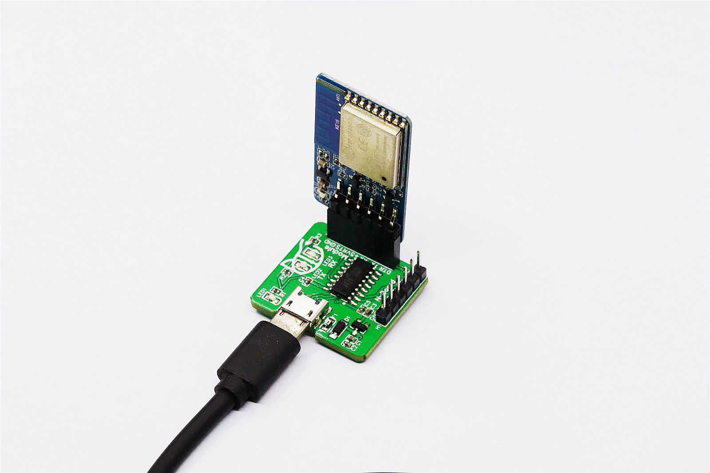
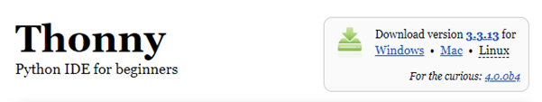
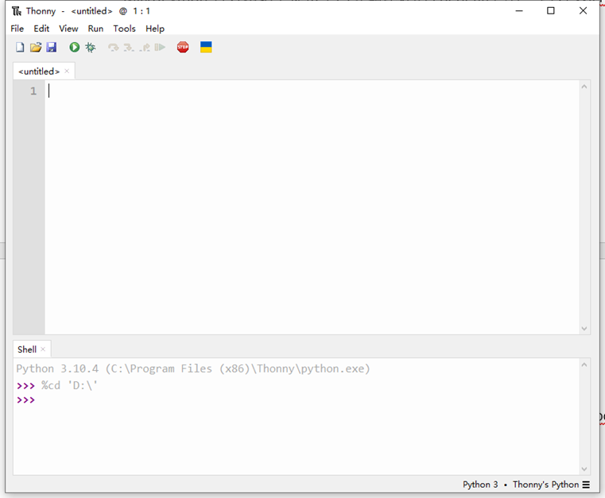
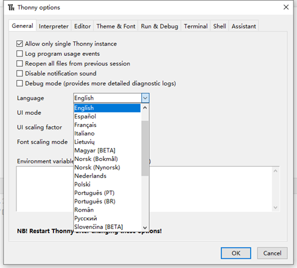
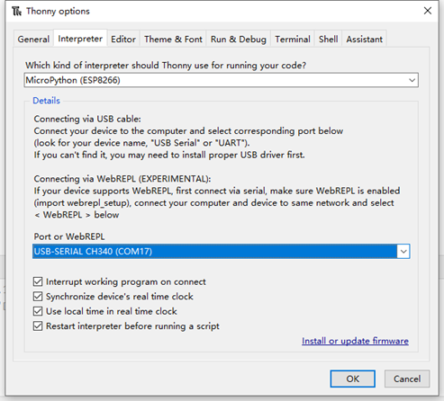
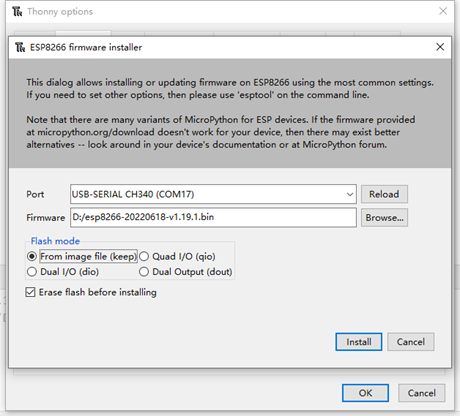
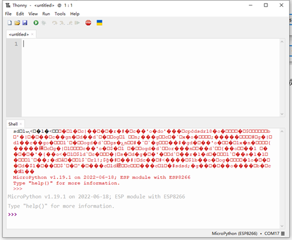

# 🐛 8266 MicroPython controller

### Part 1: Hardware Setup

#### 1.1 hardware list

* USB Uploader (CH340C)
* WiFi ESP8266

#### 1.2 Connection

Insert the ESP8266 module into the module configuration interface of the USB uploader, and find the corresponding COM port in the Windows device manager.

<figure><figcaption></figcaption></figure>

 

<figure><figcaption></figcaption></figure>

### Part 2: Software Setup

#### 2.1 Download Thonny

Download the latest version of Thonny, an out-of-the-box Python editor that natively supports MicroPython.

Download address: [https://thonny.org/](https://thonny.org/)

<figure><figcaption></figcaption></figure>

#### 2.2 Download the MicroPython firmware

The compiled ESP8266 firmware is provided on the MicroPython official website, because our WiFi module is 4MB, please select the latest firmware with the name of ESP8266 with 2MiB+ flash, and download the bin file.

Firmware download address: [https://micropython.org/download/esp8266/](https://micropython.org/download/esp8266/)

#### 2.3 Upload the MicroPython firmware to the ESP8266 module

There are two ways to upload the MicroPython firmware to the ESP8266 module:

* Using the ESPtool download tool, you can more precisely control the partition and use of Flash.
* Using Thonny's built-in tool.

For convenience, we use Thonny's built-in tool. The specific steps are as follows:

1.  &#x20;Open the Thonny, the main interface is as shown below. Thonny uses the Python interpreter in the installation directory by default.&#x20;

    <figure><figcaption></figcaption></figure>
2.  &#x20;Open **Tools** -> **Options** to enter the options page. In the first tab **General**, we can choose the language we need (needs to be restarted).\

    <figure><figcaption></figcaption></figure>
3.  &#x20;Open the second tab **Interpreter**, we replace the default Python3 interpreter with **MicroPython (ESP8266)** and select the corresponding port.\

    <figure><figcaption></figcaption></figure>
4. &#x20;At this time, the ESP8266 module has not yet uploaded the MicroPython firmware. Click "**Install or update firmware**" in the lower right corner of the above picture to update the firmware using the built-in tool.
5.  &#x20;Select the port (**COMx**) where the ESP8266 module is located, and select the location where the downloaded MicroPython firmware (.bin file) is located. Check the flash mode: **from image file (keep)** (the speed will be slower, but it only needs to be burned once and it is not easy to make mistakes), and check the option **Erase flash before installing**. Press the **Install** button.\

    <figure><figcaption></figcaption></figure>
6.  &#x20;The progress will be displayed in the lower-left corner of the interface, erase the Flash first, and then write the firmware. When the word **Done** appears, it means that the programming has been completed.\

    <figure><figcaption></figcaption></figure>
7.  &#x20;The software preparation work is over, and the following display will appear after closing the download interface. The red text is garbled because ESP8266 will print a string of codes with a baud rate other than 115200 when it starts up. This code cannot be recognized by MicroPython Shell. When Python’s iconic symbol **>>>** appears, it means that the firmware is uploaded successfully.\

    <figure><figcaption></figcaption></figure>

