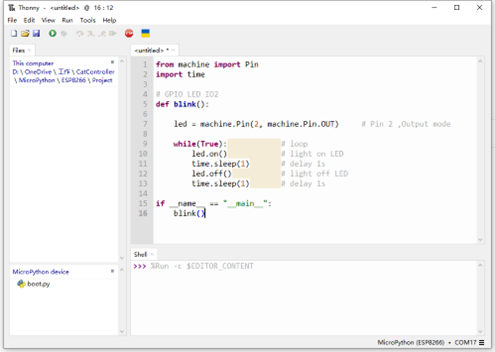
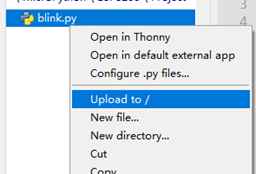
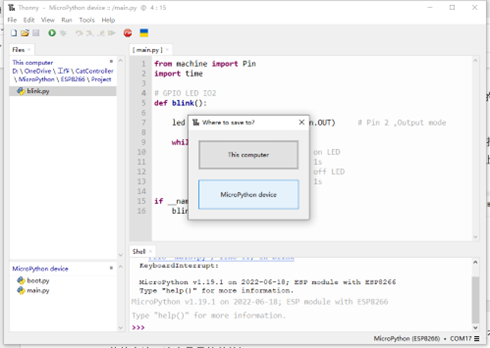
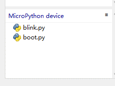
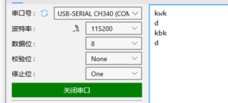

# Run MicroPython on ESP8266

After uploading the MicroPython firmware on ESP8266, we can use it run MicroPython scripts.

### 1. Run the script directly

We can execute the python scripts directly in the interpreter.

```python
# Simple script：
print("Hello MicroPython")
```

### 2. Use the .py file to run the script

The NyBoard WiFi module ESP8266 uses the IO2  pin to connect with a red LED to indicate the connection status. This LED is programmable. Write a simple python blink script:

```python
from machine import Pin
import time

# GPIO LED IO2
def blink():
    
    led = machine.Pin(2, machine.Pin.OUT)     # Pin 2 ,Output mode
    
    while(True):			# loop
        led.on()			# light on LED
        time.sleep(1)		# delay 1s
        led.off()			# light off LED
        time.sleep(1)		# delay 1s

if __name__ == "__main__":
    blink()
```

<figure><figcaption></figcaption></figure>

Press the green start button on the toolbar, and the script will be sent to the WiFi module through the serial port, and then run after being interpreted by the built-in MicroPython interpreter of ESP8266. Because the Blink script is an endless loop when it needs to stop, press the red stop button to end the program interruption and reset.

### 3. Upload the .py file to the ESP8266&#x20;

We can click **View -> File** to open the file toolbar, and the file is displayed on the left side of Thonny. The upper part is the directory of the local machine, and the lower part is the files stored in the MicroPython device. By default, there is only one boot.py file, please do not delete this file, it is the startup file of the MicroPython device.

We save the script as blink.py and save it on the machine, right-click on the file and select **`Upload to /`** :

<figure><figcaption></figcaption></figure>

Select the **`MicroPython device`** in the pop-up window:

<figure><figcaption></figcaption></figure>

There is a **`blink.py`** file on the device. So the file is saved on the device.

<figure><figcaption></figcaption></figure>

### 4. Write a script to let robot perform actions sequentially

ESP8266 can send commands to NyBoard through the serial port. We only need to write a simple serial port sending script to send a series of serial port commands to NyBoard, and then the robot can execute sequence actions.

```python
from machine import UART
import time

uart = UART(0, baudrate=115200,timeout=5)

# walk
def walk(time_ms):
    print("walk")
    uart.write("kwkF")      # walk cmd
    time.sleep_ms(time_ms)  # keep time
    uart.write("d")         # stop
    time.sleep_ms(1500)
    
# backward
def back(time_ms):
    print("back")
    uart.write("kbk")
    time.sleep_ms(time_ms)
    uart.write("d")
    time.sleep_ms(1500)

# stop
def stop():
    uart.write("d")
    
def initConnection():
    connected = False
    while True:
        uart.write("d")
        for t in range(30):
            uos.dupterm(None, 1)        # disable REPL on UART(0), detach the REPL from UART0
            time.sleep_ms(5)            #delay is a must
            result = uart.read(1)
            uos.dupterm(uart, 1)        # enable REPL on UART(0), reattach REPL

            if result != None:
#                 uart.write(result)    # for debug
                if result == b"d":

                    connected = True
                    break
            time.sleep_ms(10)

        if connected:
            break

    uart.write("b22 4 24 4 26 4")
 

def actSeq():
    initConnection()
    time.sleep_ms(2000)
    walk(3000)
    back(3000)
    uart.write("m0 90")
    time.sleep_ms(3000)
    uart.write("i8 -20 9 -60")
    time.sleep_ms(2000)
    uart.write("b26 4 24 4 20 4")
    time.sleep_ms(1000)
    uart.write("d")
    uos.dupterm(None, 1)        # disable REPL on UART(0), detach the REPL from UART0

    
if __name__ == "__main__":
    actSeq()
    
```

When the **actSeq()** function is  executed, It can output a series of commands through the serial port. Using the serial monitor we can debug. Use the serial port monitor to monitor the output as follows (for the convenience of reading, please use the automatic frame break of the serial port debugger, in fact, there is no automatic line break).

<figure><figcaption></figcaption></figure>

### 5. Power on and run automatically

After we debug the sequence action, unplug the  ESP8266 and plug it into the NyBoard, the robot dog does not respond because the **`actSeq()`** function is not running. We want to run the scripts automatically after power on. There are two methods:

* Please change the file name to "**`main.py`**" and save to the device (Recommend)
* Modify the Boot.py

