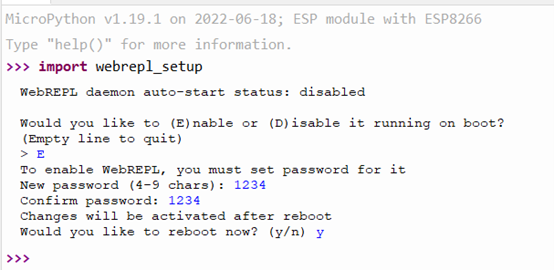
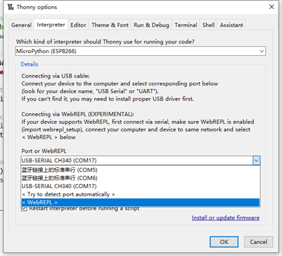
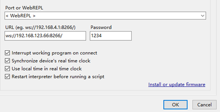
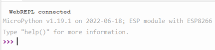
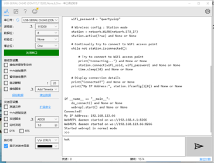
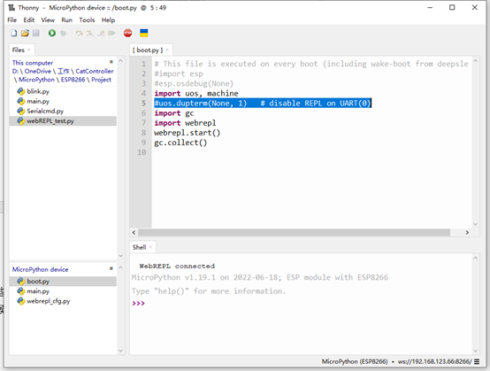

# Setup WebREPL

The previous tutorial realized the function of the robot to perform sequence actions by editing Python code offline. But this is very inconvenient. Whenever we need to modify the code, we need to unplug the WiFi module for modification, and we cannot flexibly pause and modify parameters during execution. The reason is that ESP8266 only has one serial port, and we need to use it to communicate with NyBoard. Fortunately, MicroPython uses the WiFi function provided by ESP to realize remote wireless Python debugging - WebREPL.

[The official document](https://docs.micropython.org/en/latest/esp8266/tutorial/repl.html#webrepl-a-prompt-over-wifi)

On the basis of official documents, combined with the characteristics of ESP8266, we wrote the following tutorials:

### 1. Enable webREPL

After connecting the device, enter `import webrepl_setup` in the shell interface, and input according to the prompt information:

1. &#x20;Enable it running on boot: **E**
2. &#x20;Set password for it: your own password(e.g. **1234**)
3. &#x20;Repeat the password to confirm
4. &#x20;Reboot the ESP8266: **y**

<figure><figcaption></figcaption></figure>

**2. The script to setup webREPL**

We use the demo script below, to replace the SSID and password with the network information your own around you.

```python
import network
import time
import webrepl

def do_connect():
    
    # WiFi SSID and Password
    wifi_ssid = "YOUR SSID"             # YOUR WiFi SSID
    wifi_password = "YOUR PASSWORD"     # YOUR WiFi PASSWORD

    # Wireless config : Station mode
    station = network.WLAN(network.STA_IF)
    station.active(True)

    # Continually try to connect to WiFi access point
    while not station.isconnected():
    
        # Try to connect to WiFi access point
        print("Connecting...")
        station.connect(wifi_ssid, wifi_password)
        time.sleep(10)

    # Display connection details
    print("Connected!")
    print("My IP Address:", station.ifconfig()[0])
    

if __name__ == "__main__":
    do_connect()
    webrepl.start()
```

After running the script, it will keep trying to connect to the WiFi network. Once connected, it will automatically start the WebREPL service of the device.

```
Connected!
My IP Address: 192.168.xxx.xxx
WebREPL daemon started on ws://192.168.xxx.xxx:8266
Started webrepl in normal mode
```

Remember this IP address (automatically assigned by router DHCP), useful when configuring WebREPL.

### 3. Configure the WebREPL service

We are now debugging the Python script through WebREPL, and the previous serial port is used to communicate with NyBoard. So in the options, change the previous USB-COMx interface to WebREPL.

<figure><figcaption></figcaption></figure>

Then we fill in the IP address, port and password of WebREPL, and click **OK**.

<figure><figcaption></figcaption></figure>

When `WebREPL Connected` is displayed, the connection is successful.

<figure><figcaption></figcaption></figure>

We can try some simple scripts, such as `blink.py`.

WebREPL saves serial ports and supports wireless debugging. The disadvantage is that the speed is slow (because of network delay), and the waiting time for software reset is relatively long.

### 4. Separate the serial port from the debugger

Now we can use webREPL to debug the script, but when we open the serial port monitor, we will find that whenever we run the script, the serial port will send out a series of debugging content: These massive strings will cause the NyBoard to be too late to process and crash. As shown below：

<figure><figcaption></figcaption></figure>

We hope that when debugging the program, the serial port only outputs the commands we want to output, not the Debug information. Open the `boot.py` on the device, uncomment the line of code `uos.dupterm(None, 1)` and save it , and unbind the serial port and REPL debug. Restart the module, and the serial port debugging assistant will no longer print the debug information.

<figure><figcaption></figcaption></figure>

As a supplement, we can output debug information through the `print()` statement, which will be displayed in the Shell through WiFi.

So far, you can easily use the ESP8266 to debug robot through webREPL to edit action sequences based on MicroPython.
