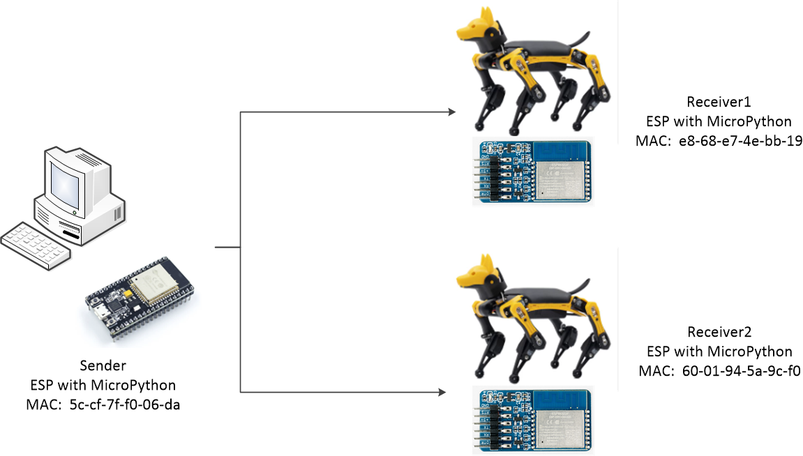
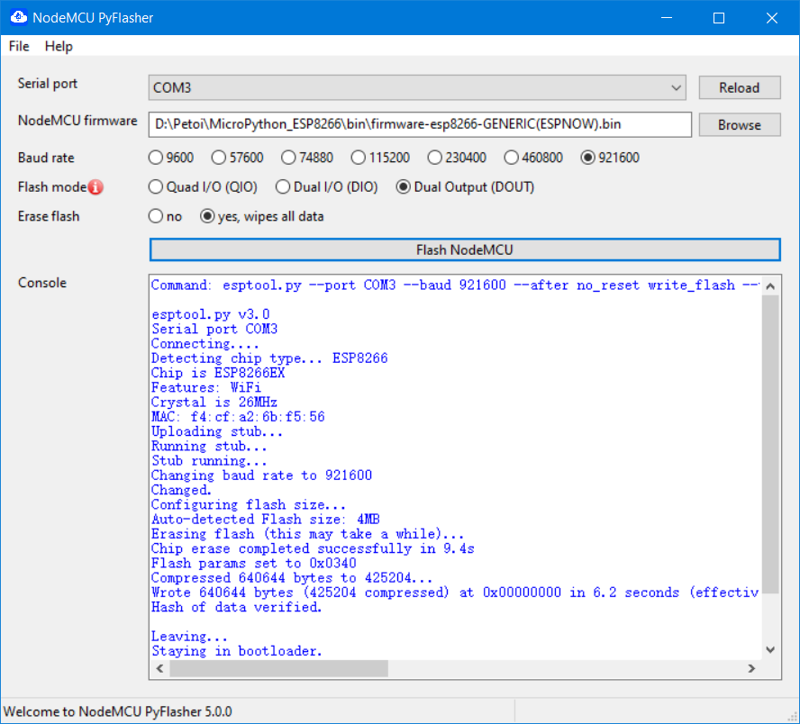

# Using the ESP-NOW protocol

## 1. Function introduction

ESP-NOW is another wireless communication protocol developed by Espressif that enables multiple devices to communicate without or using Wi-Fi. This protocol is similar to the low-power 2.4GHz wireless connection commonly found in wireless mice—the devices are paired before they can communicate. After pairing, the connection between the devices is continuous, peer-to-peer, and does not require a handshake protocol. It is a fast communication technology with short data transmission and no connection, which allows low-power controllers to directly control all smart devices without connecting to a router. It is suitable for scenarios such as smart lights, remote control, and sensor data return.

After using ESP-NOW communication, if a certain device suddenly loses power, as long as it restarts, it will automatically connect to the corresponding node to resume communication.

The communication modes supported by ESP-NOW are as follows:

* one-to-one communication
* one-to-many communication
* many-to-one communication
* many-to-many communication

ESP-NOW supports the following features:

* Unicast packet encryption or unicast packet unencrypted communication;
* Mixed use of encrypted paired devices and non-encrypted paired devices;
* Can carry payload data up to 250 bytes;
* Support setting sending callback function to notify the application layer of frame sending failure or success.

At the same time, ESP-NOW also has some limitations:

* Broadcast packets are not supported temporarily;
* There are restrictions on encrypted paired devices
  * In Station mode，a maximum of 10 encrypted paired devices are supported;
  * In SoftAP or SoftAP + Station mixed mode, a maximum of 6 encrypted paired devices are supported;
  * The number of non-encrypted paired devices is supported, and the total number of encrypted devices does not exceed 20;
* Valid payloads are limited to 250 bytes.

Petoi group control can use the ESP-NOW communication function of the ESP8266.

## 2. Setup for ESP-NOW

### 2.1 Hardware setup

In this case, two Bittles (equipped with ESP8266) and one computer connected with ESP8266 are prepared.

<figure><figcaption></figcaption></figure>

See below for program uploading and MAC address acquisition of the module in the figure.

### 2.2 Software setup

Install Thonny on the computer to facilitate the debugging of MicroPython of the ESP8266 module. When using the ESP-NOW protocol, special MicroPython firmware is required (see [Github](https://github.com/glenn20/micropython-espnow-images)). Because the normal version of the 8266-MicroPython firmware will prompt that the library cannot be found.

Open Thonny and use the USB uploader to connect the ESP8266 module, enter in the shelll interface:

```python
import espnow
```

If there is an error prompt such as "cannot find espnow module", it means that there is a problem with the firmware uploading; if there is no prompt, it means that the firmware uploading is successful.


If after burning the ESP-NOW firmware, the symbolic `>>>` symbol of Python does not appear in the shell interface, it means that the firmware burning failed. You can try to use the Flash burning tool NodeMCU-PyFlasher.exe, and the burning configuration is shown in the figure below :&#x20;




## 3. Code introduction

The group control code is divided into 3 parts:

* Query the MAC address of the module
* Transmitter program
* receiver program

### 3.1 Query the MAC address of the module

The MAC address is an address used to confirm the location of a network device, and is responsible for the second layer (data link layer) of the OSI network model. The MAC address is also called the physical address and the hardware address. It is burned into the non-volatile memory (such as EEPROM) of the network card when it is produced by the network equipment manufacturer.&#x20;

The length of the MAC address is 48 bits (6 bytes), usually expressed as 12 hexadecimal numbers. The first 3 bytes represent the serial number of the network hardware manufacturer, which is assigned by IEEE (Institute of Electrical and Electronics Engineers), and the last 3 bytes represent the serial number of a certain network product (such as a network card) manufactured by the manufacturer. As long as you don't change your MAC address, the MAC address is unique in the world. Visually speaking, the MAC address is like the ID number on the ID card, which is unique.&#x20;

The easiest way to use ESPNOW is to send it by MAC address. We use a small program to query the MAC address of the module.

```python
import ubinascii
import network

wlan_sta = network.WLAN(network.STA_IF)
wlan_sta.active(True)
wlan_mac = wlan_sta.config('mac')
print(ubinascii.hexlify(wlan_mac).decode())Pythonp
```

After running in Thonny, print out the MAC address in the terminal. At this time, you can use a self-adhesive sticker to write the MAC address of the module and paste it on the module.

### 3.2 Transmitter program

The transmitter program consists of the following parts:

* Enable the WiFi function of the module
* Configure the ESP-NOW protocol and enable it
* Add a node (peer) that needs to communicate
* Send a message

The specific code is as follows:

```python
import network
import espnow
import time

sta = network.WLAN(network.STA_IF)    # Enable station mode for ESP
sta.active(True)
sta.disconnect()        # Disconnect from last connected WiFi SSID

e = espnow.ESPNow()     # Enable ESP-NOW
e.active(True)

peer1 = b'\xe8\x68\xe7\x4e\xbb\x19'   # MAC address of peer1's wifi interface
e.add_peer(peer1)                     # add peer1 (receiver1)

peer2 = b'\x60\x01\x94\x5a\x9c\xf0'   # MAC address of peer2's wifi interface
e.add_peer(peer2)                     # add peer2 (receiver2)

print("Starting...")            # Send to all peers

e.send(peer1, "walk", True)     # send commands to pear 1
e.send(peer2, "walk", True)     # send commands to pear 2
time.sleep_ms(2000)
e.send(peer1, "walk", True)
e.send(peer2, "back", True)
time.sleep_ms(2000)
```

### 3.3 Receiver program

The receiver program is mainly composed of the following parts:

* Enable the WiFi function of the module
* Configure the ESP-NOW protocol and enable it
* Add a node (peer) that needs to communicate
* Receive and decode the message, and send commands to NyBoard through the serial port

The specific code is as follows:

```python
import network
import espnow
from machine import UART

def espnow_rx():
    #config UART
    uart = UART(0, baudrate=115200)

    # A WLAN interface must be active to send()/recv()
    sta = network.WLAN(network.STA_IF)
    sta.active(True)
    sta.disconnect()                # Disconnect from last connected WiFi SSID

    e = espnow.ESPNow()                  # Enable ESP-NOW
    e.active(True)

    peer = b'\x5c\xcf\x7f\xf0\x06\xda'   # MAC address of peer's wifi interface
    e.add_peer(peer)                     # Sender's MAC registration

    while True:
        host, msg = e.recv()
        if msg:                          # wait for message
            if msg == b'walk':           # decode message and translate
                uart.write("kwkF")       # to the NyBoard's command
            elif msg == b'back':
                uart.write('kbk')
            elif msg == b'stop':
                uart.write('d')

if __name__ == "__main__":
    espnow_rx()
    
```

This code is encapsulated in a function named `espnow_rx()` for the convenience of automatically starting the program after power-on.

There are two ways to realize automatic startup after power-on:

* Rename the code file to `main.py`;
* Modify the `boot.py` ;

For beginners, we recommend the first method.

### 3.4 Communication-Command Converter

Writing the serial command conversion at the receiving end will make the program too complicated and difficult to maintain. We can create a new function in which to perform instruction conversion and output commands.
