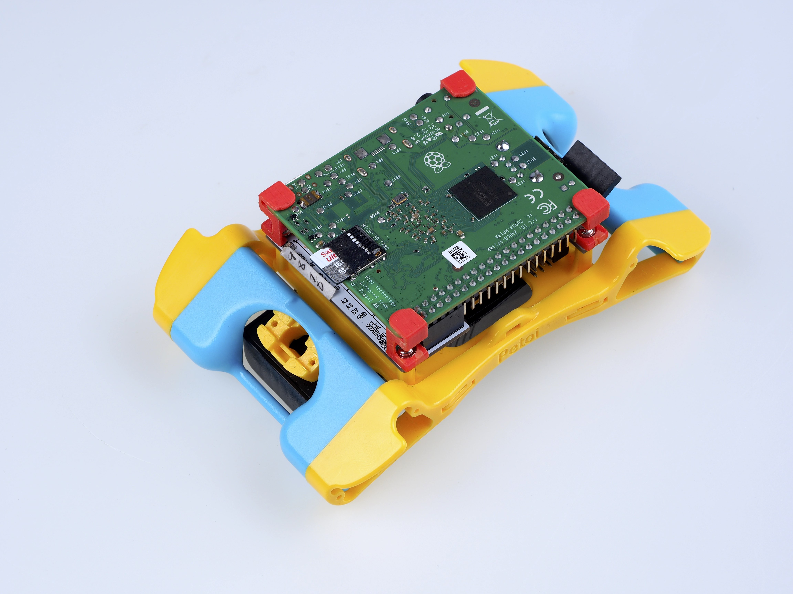

# 🍓 Raspberry Pi serial port as an interface


Robot doesn't need a Pi to move.&#x20;

You need to unplug the 6-pin USB adpter for the NyBoard before mounting the Pi to the board.&#x20;


You can solder a 2x5 socket on NyBoard to plug in a Raspberry Pi. Pi 3A+ is the best fit for NyBoard's dimension.&#x20;



### Nybble


### Bittle


After you solder on the socket, you won't be able to install the back cover of Bittle.&#x20;




The red [Pi standoff](https://github.com/PetoiCamp/NonCodeFiles/blob/master/stl/Bittle\_standoffPi.stl) can be 3D printed.&#x20;

.jpg>)

As shown in the [serial protocol](https://docs.petoi.com/arduino-ide/serial-commands), the arguments of tokens supported by Arduino IDE's serial monitor are all encoded as Ascii char strings for human readability. While a master computer (e.g. RasPi) supports extra commands, mostly encoded as binary strings for efficient encoding. For example, when encoding angle 65 degrees:

* Ascii: takes 2 bytes to store Ascii characters '6' and '5'
* Binary: takes 1 byte to store value 65, corresponding to Ascii character 'A'


What about value -113? It takes four bytes as an Ascii string but still takes only one byte in binary encoding, though the content will no longer be printable as a character.&#x20;


Obviously, binary encoding is much more efficient than the Ascii string. However, the message transferred will not be directly human-readable. In the OpenCat repository, I have put a simple Python script [ardSerial.py](https://github.com/PetoiCamp/OpenCat/blob/main/serialMaster/ardSerial.py) that can handle the serial communication between NyBoard and Pi.

### 1. Config Raspberry Pi serial port

In Pi's terminal, type `sudo raspi-config`

Under the **Interface** option, find **Serial**. Disabled the serial login shell and enable the serial interface to use the primary UART:

1. Run **raspi-config** with **sudo** privilege: `sudo raspi-config`.
2. Find Interface Options -> Serial Port.
3. At the option `Would you like a login shell to be accessible over serial?` select 'No'.
4. At the option `Would you like the serial port hardware to be enabled?` select 'Yes'.
5. Exit raspi-config and reboot for changes to take effect.


You also need to DISABLE the [1-wire interface of Pi](https://www.raspberrypi-spy.co.uk/2018/02/enable-1-wire-interface-raspberry-pi/) to avoid repeating reset signals sent by Pi's GPIO 4.&#x20;



[A good tutorial on the Pi Serial](https://www.raspberrypi.org/documentation/configuration/uart.md)


If you plug Pi into NyBoard's 2x5 socket, their serial ports should be automatically connected at 3.3V. Otherwise, pay attention to the Rx and Tx pins on your own AI chip and its voltage rating. The Rx on your chip should connect to the Tx of NyBoard, and Tx should connect to Rx.


Note: If you installed **Ubuntu** **OS** on Raspberry Pi, please config it as follows:

* add `enable_uart=1` to `/boot/config.txt`
* remove `console=serial0,115200` from `/boot/firmware/cmdline.txt` on Ubuntu and similar to`/boot/cmdline.txt` on Raspberry Pi OS
* disable the serial console: `sudo systemctl stop serial-getty@ttyS0.service && sudo systemctl disable serial-getty@ttyS0.service`
* make sure you have `pyserial` installed if you're using the python serial library, not python-serial from apt.
* create the following udev file (I created `/etc/udev/rules.d/50-tty.rules`):

```
KERNEL=="ttyS0", SYMLINK+="serial0" GROUP="tty" MODE="0660"
KERNEL=="ttyAMA0", SYMLINK+="serial1" GROUP="tty" MODE="0660"
```

* reload your udev rules: `sudo udevadm control --reload-rules && sudo udevadm trigger`
* change the group of the new serial devices:

```
sudo chgrp -h tty /dev/serial0
sudo chgrp -h tty /dev/serial1
```

* The devices are now under the tty group. Need to add the user to the tty group and dialout group:

```
sudo adduser $USER tty
sudo adduser $USER dialout
```

* update the permissions for group read on the devices:

```
sudo chmod g+r /dev/ttyS0
sudo chmod g+r /dev/ttyAMA0
```

* reboot

Or just create a script that will do this automatically.



If you are using generic Linux system, once the uploader is connected to your computer, you will see a “ttyUSB#**”** in the serial port list. But you may still get a serial port error when uploading. You will need to give the serial port permission. Please go to this link and follow the instructions: [https://playground.arduino.cc/Linux/All/#Permission](https://playground.arduino.cc/Linux/All/#Permission)


### 2. Change the permission of [ardSerial.py](https://github.com/PetoiCamp/OpenCat/blob/main/serialMaster/ardSerial.py)

If you want to run it as a bash command, you need to make it executable:

`chmod +x ardSerial.py`

You may need to change the proper path of your Python binary on the first line:

`#!/user/bin/python`

### 3. Use **ardSerial.py** as the commander of robot


NyBoard has only one serial port. You need to UNPLUG the USB adapter if you want to control Bittle with Pi's serial port.


Typing `./ardSerial.py <args>` is almost equivalent to typing \<args> in Arduino's serial monitor. For example, `./ardSerial.py kcrF` means "perform s**k**ill **cr**awl **F**orward".

Both **ardSerial.py** and the parsing section in **OpenCat.ino** need more implementations to support all the serial commands in the protocol.


For Nybble:


Reduced motion capability may happen when connected to Pi! A stronger battery is needed.


With the additional current drawn by Pi, Nybble will be less capable for intense movements, such as trot (the token is`ktr`). The system is currently powered by two 14500 batteries in series. You may come up with better powering solutions, such as using high drain 7.4 Lipo batteries, or 2S-18650. There are a bunch of considerations to collaborate software and hardware for balanced performance. With Nybble's tiny body, it's better to serve as a platform for initiating the communication framework and behavior tree rather than a racing beast.

