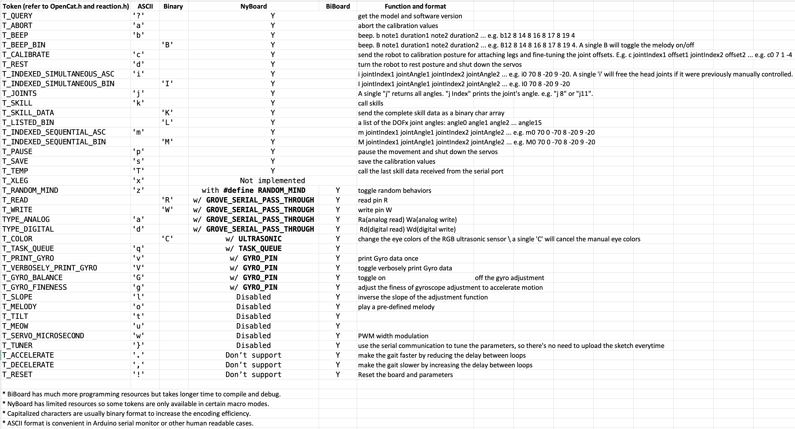
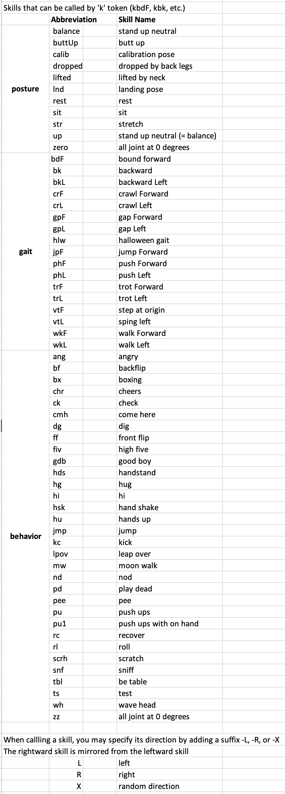

# 🖇️ Serial Protocol

We have defined a set of serial communication protocols for robots:&#x20;

<figure><figcaption></figcaption></figure>

All the token starts with a single ASCII-encoded character to specify their parsing format. They are case-sensitive and usually in lowercase.&#x20;


Some commands, like the **c** and **m** commands, can be combined.&#x20;

For example:

Successive "m8 40", "m8 -35", "m 0 50" can be written as "m8 40 8 -35 0 50".&#x20;

You can change the limit in the code, but there might be a systematic constraint for the serial buffer.


Try the following serial commands in [the serial monitor](https://docs.petoi.com/arduino-ide/serial-monitor):

* “**k**sit”
* “**m**0 30”
* “**m**0 -30”
* “**k**balance”
* “**k**wkF”
* “**k**trL”
* “**d**”


The quotation mark indicates that they are character strings. Don’t type quotation marks in the serial monitor.


You can refer to the macro definitions in OpenCat.h to utilize the most updated sets of tokens.&#x20;




<figure><figcaption></figcaption></figure>

Some more available commands for skills:

<figure><figcaption></figcaption></figure>

The complete set of skills in effect is defined in [InstinctBittle.h](https://github.com/PetoiCamp/OpenCat/blob/main/src/InstinctBittle.h) or [InstinctNybble.h](https://github.com/PetoiCamp/OpenCat/blob/main/src/InstinctNybble.h):\
For example:


```cpp
const char* skillNameWithType[]={"bdFI","bkI","bkLI","crFI","crLI","hlwI","mhFI","mhLI","pcFI","phFI","phLI","trFI","trLI","vtFI","vtLI","wkFI","wkLI","balanceI","buttUpI","calibI","droppedI","liftedI","restI","sitI","strI","zeroN","bfI","ckI","climbCeilI","fdI","ffI","hiI","jyI","pdI","peeI","puI","pu1I","rcI","rlLI","rtI","stpI","tsI",};
```


All the skill names in the list can be called by adding a 'k' to the front and deleting the suffix. For example, there's "sitI" in the list. You can send "ksit" to call the sitting posture. If a skill has "F" or "L" as the second last character, it's a gait. It means walking forward or left. Walking right is a mirror of walking left. So you can send "kwkF", "kwkL", "kwkR" to make the robot walk. Similarly, there are other gaits like trot ("tr"), crawl ("cr"), and stepping ("vt").\
