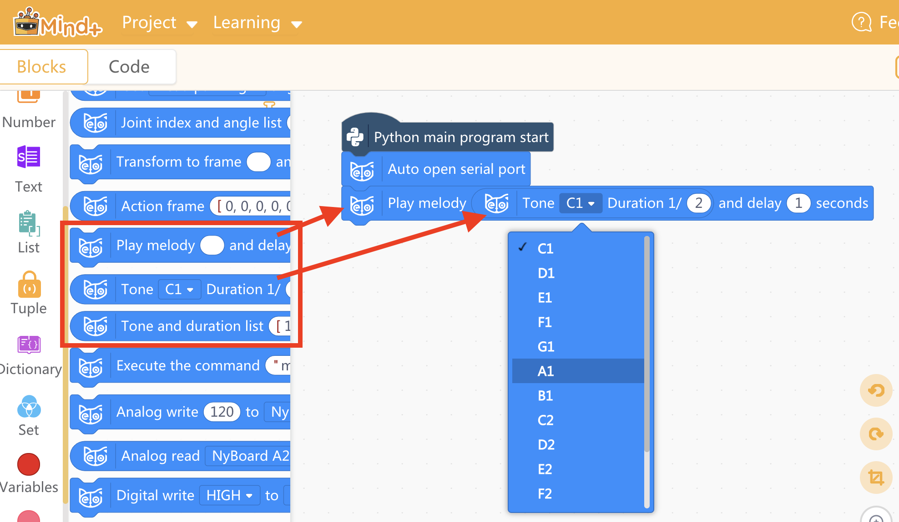
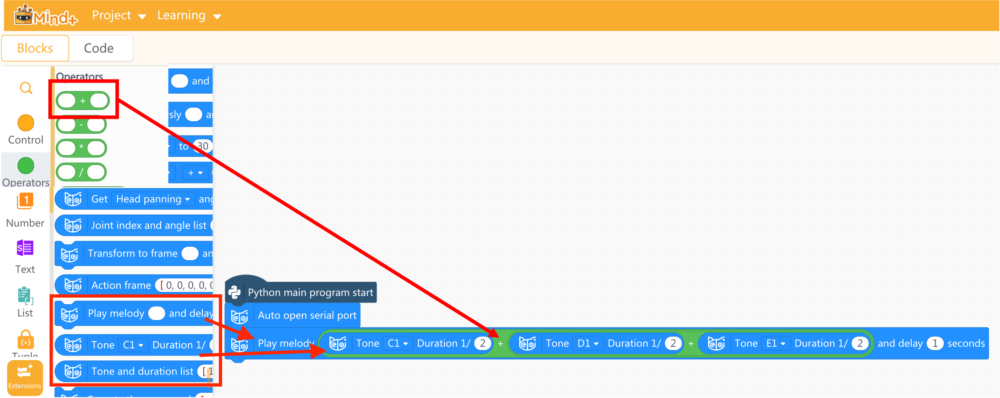
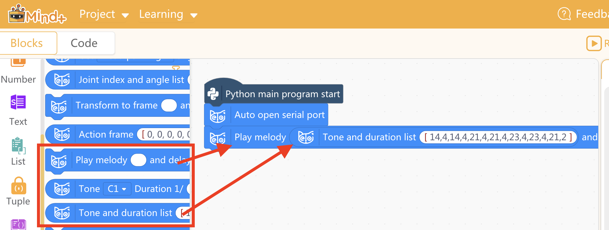
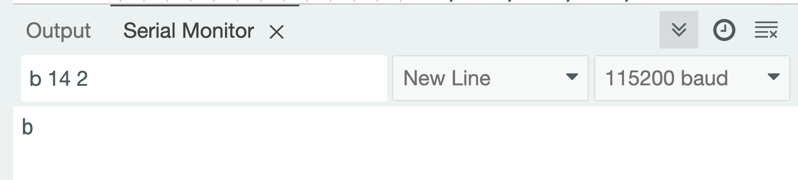
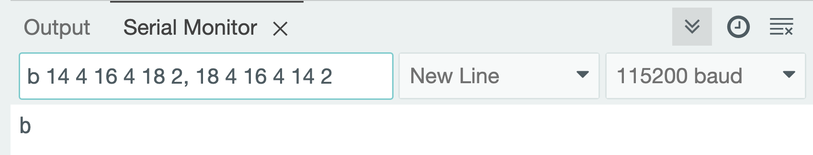
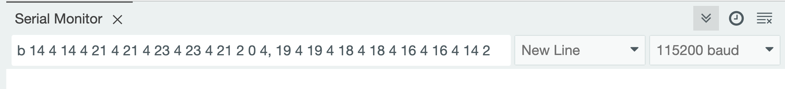
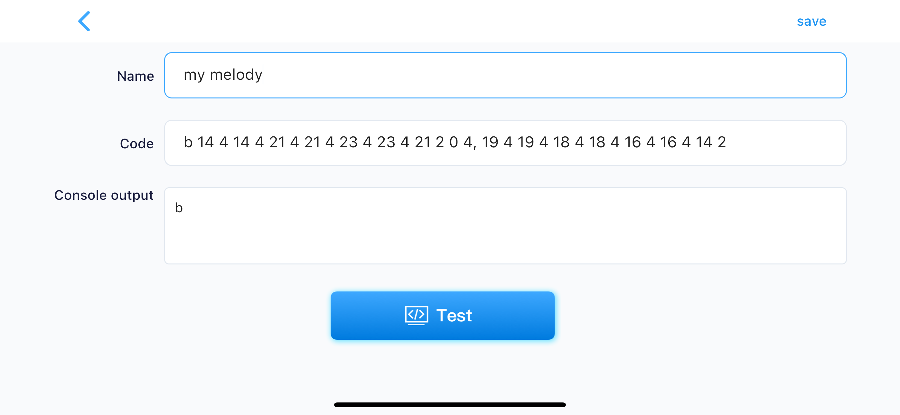
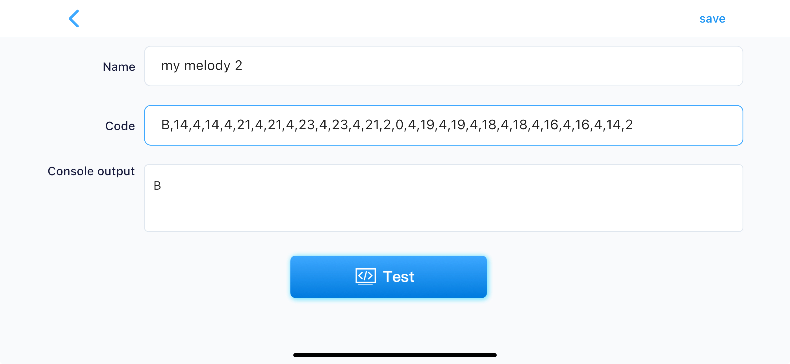
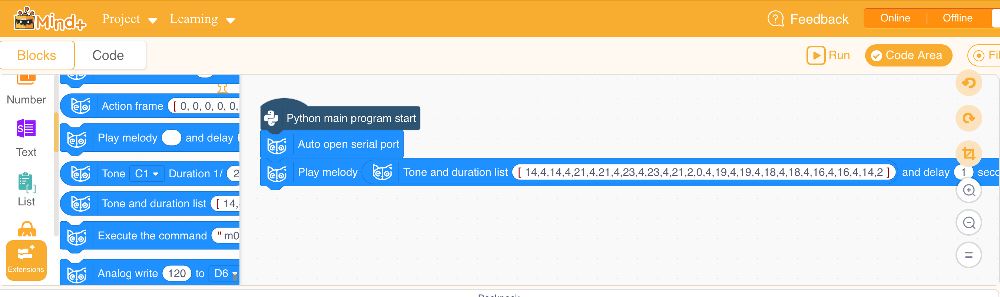

# Melody Creation

There are two ways to play a melody with the robot:

1. Using the [Petoi Coding Blocks](https://docs.petoi.com/block-based-programming/petoi-coding-blocks#play-a-melody) in Mind+.
2. Using the [Serial Protocol](../apis/serial-protocol/) in Mind+, Arduino IDE, Python, and the Petoi mobile app.&#x20;



## 1. Coding blocks for music in Mind+

You can use this coding block to make one tone.&#x20;

<div align="left"><figure><figcaption></figcaption></figure></div>

<figure><figcaption></figcaption></figure>

There are several ways to join multiple tones together to make a melody:

### 1.1 A list comprises multiple "Tone + Duration" blocks connected by the "+" block.&#x20;

<figure><figcaption></figcaption></figure>

### 1.2 A list in the format of  pairs of Tone + Duration: \[tone, duration, tone, duration...]

<figure><figcaption></figcaption></figure>

To better understand the format, you can continue reading the next section.&#x20;

## 2. The [Serial Protocol ](../apis/serial-protocol/)for generating melody

### 2.1 **Start Token**

The melody starts with the letter 'b', indicating a buzzer command. (No quotation marks are needed in the final command).&#x20;

### **2.2 Music Notes**

Notes are represented by numbers, with 0 or -1 for silence. Use **1-35** for the best effect on a buzzer.&#x20;

### **2.3 Duration**&#x20;

Durations are also numbers, indicating how many parts a whole second is divided into (e.g., 2 = 1/2 second). This plays a single middle C (C3 = 14) for 1/2 second with no delay:

```
b 14 2
```

<figure><figcaption><p>Enter the command in the Serial Monitor and listen</p></figcaption></figure>

The space between the starting 'b' and the first number can be omitted:

```
b14 2
```

A note longer than 1 second can be represented by two notes:&#x20;

```
b14 1 14 1
```

### **2.4 Half-scale vs. Whole-scale**

A difference of 1 in note number represents a half-scale tone (semitone), while a difference of 2 represents a whole-scale tone. You can define any note as the base (e.g., middle C3 = **14**). This sets the reference point for your melody. So D3 will be **16**, E3 will be **18**, F3 will be **19**, G will be **21**, A will be **23**, B will be **25**, and C4 will be **26**. C4 - C3 = 12. That's the so-called [12-Tone Equal Temperament](https://en.wikipedia.org/wiki/12_equal_temperament). You may write a map in the code for quick conversion.&#x20;

### **2.5 Command Structure**

#### **2.5.1 In the serial monitor or the mobile app's customized button console:**

You can define **multiple note-duration pairs** separated by spaces or commas. It's easier to read if you use spaces to separate the notes within a sentence and use commas to separate sentences.&#x20;

For example:

```
b 14 4 16 4 18 2, 18 4 16 4 14 2
```

<figure><figcaption><p>Enter the command in the Serial Monitor and listen</p></figcaption></figure>


The Serial Monitor uses ASCII encoding and only allows a short melody of around 200 bytes. **b 14 4** takes six bytes to store.&#x20;


#### **2.5.2 In the Python code:**

* Use brackets `[]`to define a list. The numbers should all be separated by ','. The above example becomes:

```
['b', [14, 4, 16, 4, 18, 2, 18, 4, 16, 4, 14, 2]]
```

or

```
['B', [14, 4, 16, 4, 18, 2, 18, 4, 16, 4, 14, 2]]
```


The Python version with the **'B'** token uses a more efficient **Binary** encoding to allow a longer melody. On NyBoard, it allows around 450 bytes, i.e., 250 notes. On BiBoard, it allows around 2500 bytes, i.e. 1250 notes.


* After playing the melody, you can add a number at the end to define an optional delay (in seconds).

```
['b', [14, 4, 16, 4, 18, 2, 18, 4, 16, 4, 14, 2], 2]
```

Refer to the [example](https://docs.petoi.com/apis/python-api#method-2-run-the-custom-scheduler-example.py) to send it to the robot using Python.&#x20;

#### 2.5.3 In the Mind+ coding blocks

Copy and paste the number part of the command, and separate each number with ',' as the example in section 1.

<figure><figcaption></figcaption></figure>

## **3. Example:** Creating Twinkle, Twinkle, Little Star

### **3.1 Choose Your Base Tone:**&#x20;

In this example, we'll use C3 (base tone 14). But you can choose any note within the 5-30 range.

### **3.2 Plan Your Notes:**&#x20;

Write down the sequence of notes you want to play, considering half- and whole-tone jumps. Use numbers based on your chosen base tone (14). Include silent notes (0) for pauses.

### **3.3 Define Durations:**&#x20;

Decide how long each note should play. Use numbers to represent fractions of a second (e.g., 4 = 1/4 second).

### **3.4 Translate to Commands:**

**Command with the 'b' token**

```
b 14 4 14 4 21 4 21 4 23 4 23 4 21 2 0 4, 19 4 19 4 18 4 18 4 16 4 16 4 14 2
```

#### **It can be used in Arduino IDE's serial monitor or the Petoi mobile app:**

<figure><figcaption><p>Serial monitor</p></figcaption></figure>

<figure><figcaption><p>Mobile app</p></figcaption></figure>

#### **The mobile app also supports the binary format with the 'B' token:**

#### `B,14,4,14,4,21,4,21,4,23,4,23,4,21,2,0,4,19,4,19,4,18,4,18,4,16,4,16,4,14,2`

<figure><figcaption></figcaption></figure>

### **3.5 The mind+ version**

<figure><figcaption></figcaption></figure>

### **3.6 The Python version:**

```
['b',[14,4,14,4,21,4,21,4,23,4,23,4,21,2,0,4,19,4,19,4,18,4,18,4,16,4,16,4,14,2],2]
```

or

```
['B',[14,4,14,4,21,4,21,4,23,4,23,4,21,2,0,4,19,4,19,4,18,4,18,4,16,4,16,4,14,2],2]
```

## **4. Experimenting**

You can also test the following examples:

### **Complete Twinkle, Twinkle, Little Star**

```
b14 8 14 8 21 8 21 8 23 8 23 8 21 4,
19 8 19 8 18 8 18 8 16 8 16 8 14 4,
21 8 21 8 19 8 19 8 18 8 18 8 16 4,
21 8 21 8 19 8 19 8 18 8 18 8 16 4,
14 8 14 8 21 8 21 8 23 8 23 8 21 4,
19 8 19 8 18 8 18 8 16 8 16 8 14 4
```

### My Love by Westlife

```
b15 2 14 2 12 2 12 4 10 2 10 4 8 2 10 2 10 2,
15 2 14 2 12 2 12 4 10 2 10 4 20 2 19 2 19 2, 
19 2 22 2 20 2 19 4 17 1 0 8,
19 2 17 4 15 2 19 4 17 2 17 1 17 1 0 4,15 2 15 1
```

### A very long melody for testing on the BiBoard

```
b20, 4, 22, 4, 24, 4, 15, 4, 20, 4, 22, 8, 24, 1, 22, 4, 20, 4, 22, 4, 27, 4, 27,
4, 27, 4, 27, 2, 20, 4, 19, 4, 20, 4, 20, 4, 20, 4, 20, 4, 20, 2, 19, 4, 20, 4, 19, 4,
20, 4, 19, 4, 17, 4, 15, 2, 15, 4, 15, 4, 17, 4, 17, 4, 17, 4, 17, 4, 17, 2, 15, 4, 12,
4, 15, 4, 12, 4, 15, 4, 22, 4, 20, 2, -1, 4, 15, 4, 24, 4, 24, 4, 24, 4, 25, 4, 27, 4,
20, 4, 20, 4, 24, 4, 22, 1, 22, 1, -1, 2, 15, 4, 15, 4, 15, 2, 15, 4, 15, 4, 17, 4, 15,
4, 12, 4, 15, 4, -1, 4, 7, 4, 8, 4, 8, 4, 12, 2, 12, 4, 13, 4, 12, 4, 8, 4, 8, 4, 10,
4, 12, 1, -1, 4, 12, 4, 10, 4, 8, 4, 8, 4, 8, 2, 7, 4, -1, 4, 8, 4, 8, 4, 8, 4, 8, 4,
3, 4, 3, 4, 12, 2, 8, 4, 8, 4, 3, 4, 13, 2, 13, 4, 13, 4, 13, 4, 5, 4, 8, 4, 8, 4, 10,
1, 10, 1, 20, 4, 22, 4, 24, 4, 15, 4, 20, 4, 22, 8, 24, 1, 22, 4, 20, 4, 22, 4,
27, 4, 27, 4, 27, 4, 27, 2, 20, 4, 19, 4, 20, 4, 20, 4, 20, 4, 20, 4, 20, 2, 19, 4, 20,
4, 19, 4, 20, 4, 19, 4, 17, 4, 15, 2, 15, 4, 15, 4, 17, 4, 17, 4, 17, 4, 17, 4, 17, 2,
15, 4, 12, 4, 15, 4, 12, 4, 15, 4, 22, 4, 20, 2, -1, 4, 15, 4, 24, 4, 24, 4, 24, 4, 25,
4, 27, 4, 20, 4, 20, 4, 24, 4, 22, 1, 22, 1, -1, 2, 15, 4, 15, 4, 15, 2, 15, 4, 15, 4,
17, 4, 15, 4, 12, 4, 15, 4, -1, 4, 7, 4, 8, 4, 8, 4, 12, 2, 12, 4, 13, 4, 12, 4, 8, 4,
8, 4, 10, 4, 12, 1, -1, 4, 12, 4, 10, 4, 8, 4, 8, 4, 8, 2, 7, 4, -1, 4, 8, 4, 8, 4, 8,
4, 8, 4, 3, 4, 3, 4, 12, 2, 8, 4, 8, 4, 3, 4, 13, 2, 13, 4, 13, 4, 13, 4, 5, 4, 8, 4,
8, 4, 10, 1, 10, 1
```

### Using other tools

Play around with tones and duration sequences to create your own melodies. For more complex pieces, there are online resources and software that can translate musical notation to this format. You may even write prompts to let AI generate a melody for you!

For example, using Gemini to give you a raw melody sequence to start with:



<div align="center"><figure><figcaption><p>Screenshot of the AI generated response</p></figcaption></figure></div>

You may share your prompt, which works directly with our community, at [www.petoi.camp](https://www.petoi.camp).&#x20;

Remember, this is just the beginning—have fun composing!
