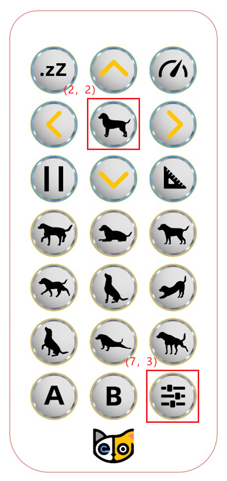
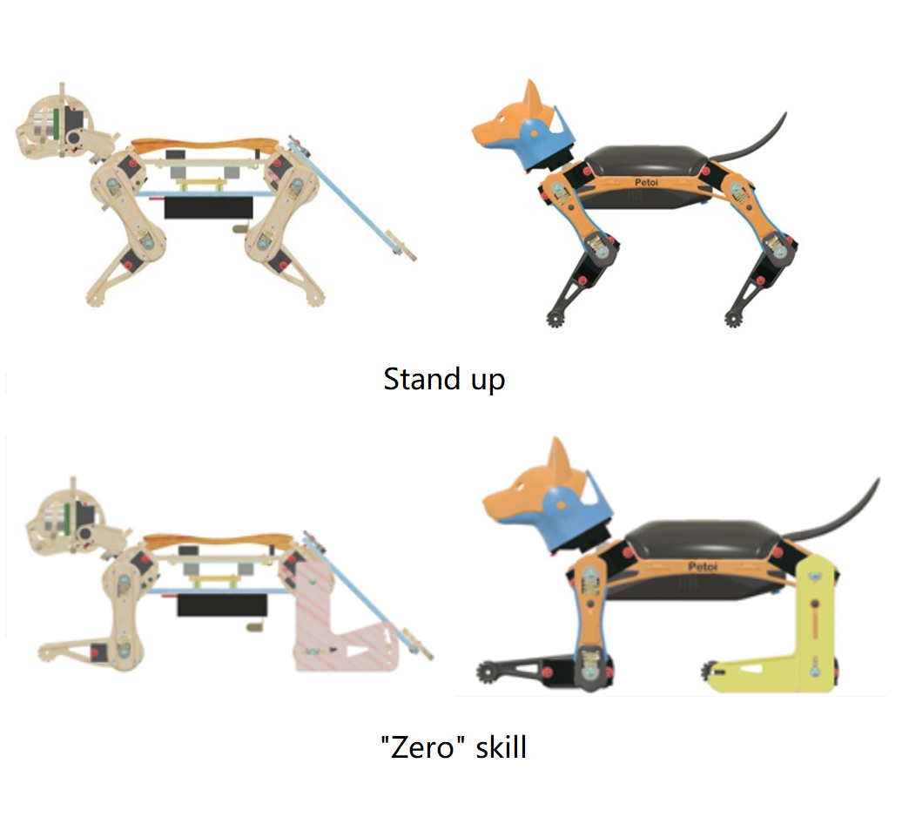
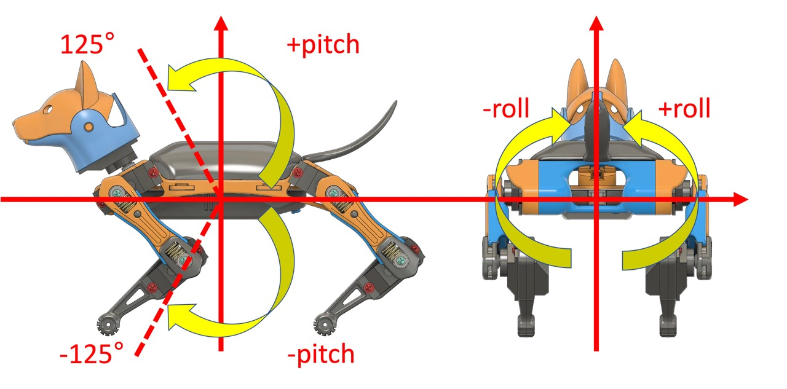
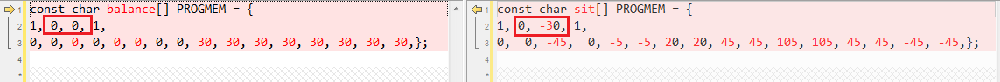
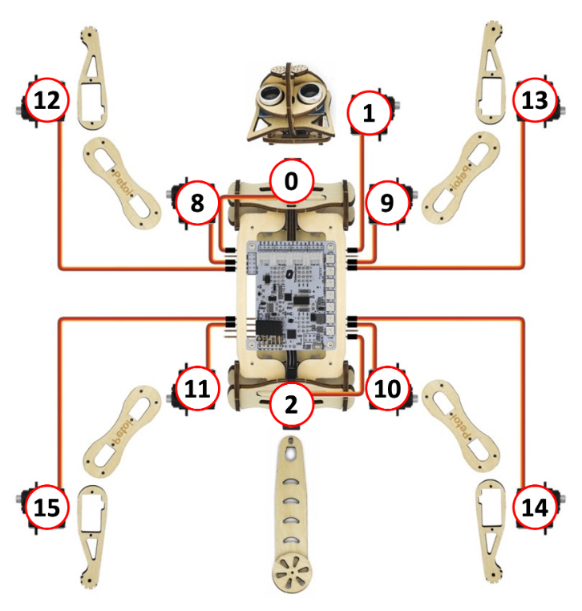
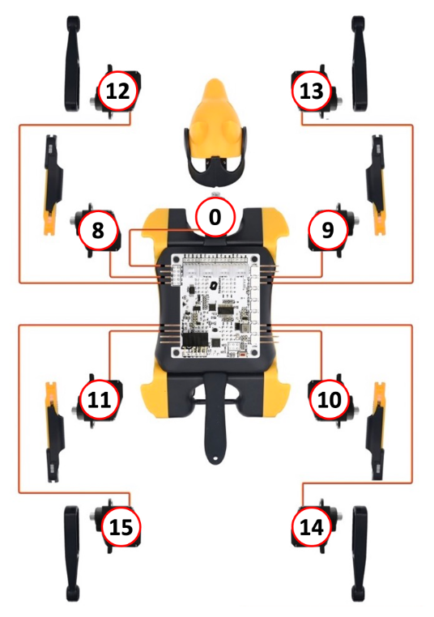
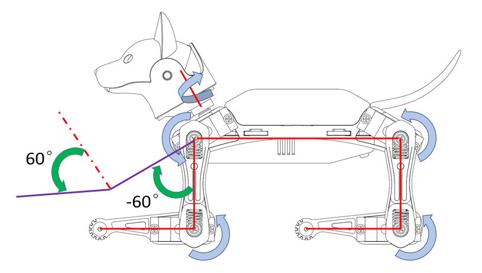

# Skill Creation


The simplest way to generate a skill array is to use the [Skill Composer](https://docs.petoi.com/desktop-app/skill-composer). It can stay after the power is off and rebooted. However, the skill exported by the Skill Composer is stored in temporary memory and will be overwritten by a new export, and you can not easily manage two new skills in that routine.

This chapter focuses on the code and data structure so that you can integrate any number of new skills into the source code.


## Preparation

Get familiar with uploading the firmware (Chapter 3 of the [Nybble](https://nybble.petoi.com/chapter3)/[Bittle](https://bittle.petoi.com/3-NyBoard-Configuration) User Manual),  the assembly process (Chapter 4 of the [Nybble](https://nybble.petoi.com/chapter4)/[Bittle](https://bittle.petoi.com/4-Assemble-The-Frame) User Manual), and calibrating the servo (Chapter 6 of the [Nybble](https://nybble.petoi.com/chapter6)/[Bittle](https://bittle.petoi.com/6-calibration)[ ](https://bittle.petoi.com/6-calibration)User Manual). Use an IR remote to verify that the following functions work as expected.

* Press the button on [the IR remote](https://docs.petoi.com/infrared-remote/remote-controller)'s 2nd row,  2nd column (as shown in the picture below). Later it will be expressed by (2, 2). You can also connect a USB adapter and enter the serial command "**kbalance**" in [the serial monitor](https://docs.petoi.com/arduino-ide/serial-monitor). The robot will stand up.
* Press the (7, 3) button on [the IR remote](https://docs.petoi.com/infrared-remote/remote-controller). You can also connect a USB adapter and enter the serial command "**kzero**" in [the serial monitor](https://docs.petoi.com/arduino-ide/serial-monitor). All the robot's servos are turned to the 0-degree position, the "Zero" skill (as shown in the figure below).

<div>

<figure><figcaption></figcaption></figure>

 

<figure><figcaption></figcaption></figure>

</div>

## Understand the code

All skill arrays of the robot are defined in the `Instinct***.h` file.

* **Nybble**: `InstinctNybble.h`
* **Bittle**: `InstinctBittle.h`

Here is an abbreviated example of an `Instinct***.h` file:

```cpp
//a short version of Instinct***.h as example
const char rest[] PROGMEM = { 
1, 0, 0, 1,
  -30, -80, -45,   0,  -3,  -3,   3,   3,  75,  75,  75,  75, -55, -55, -55, -55,};
const char zero[] PROGMEM = { 
1, 0, 0, 1,
    0,   0,   0,   0,   0,   0,   0,   0,   0,   0,   0,   0,   0,   0,   0,   0,};

const char crF[] PROGMEM = { 
36, 0, -3, 1,
  61,  68,  54,  61, -26, -39, -13, -26,
  66,  61,  58,  55, -26, -39, -13, -26,
  ...
  51,  81,  45,  72, -25, -37, -12, -25,
  55,  76,  49,  68, -26, -38, -13, -26,
  60,  70,  53,  62, -26, -39, -13, -26,
};

const char pu[] PROGMEM = { 
-8, 0, -15, 1,
 6, 7, 3, 
    0,   0,   0,   0,   0,   0,   0,   0,  30,  30,  30,  30,  30,  30,  30,  30,	 5, 0,
   15,   0,   0,   0,   0,   0,   0,   0,  30,  35,  40,  29,  50,  15,  15,  15,	 5, 0,
   30,   0,   0,   0,   0,   0,   0,   0,  27,  35,  40,  60,  50,  15,  20,  45,	 5, 0,
   15,   0,   0,   0,   0,   0,   0,   0,  45,  35,  40,  60,  25,  20,  20,  60,	 5, 0,
    0,   0,   0,   0,   0,   0,   0,   0,  50,  35,  75,  60,  20,  30,  20,  60,	 6, 0,
  -15,   0,   0,   0,   0,   0,   0,   0,  60,  60,  70,  70,  15,  15,  60,  60,	 6, 0,
    0,   0,   0,   0,   0,   0,   0,   0,  30,  30,  95,  95,  60,  60,  60,  60,	 6, 1,
   30,   0,   0,   0,   0,   0,   0,   0,  75,  70,  80,  80, -50, -50,  60,  60,	 8, 0,
};

const char* skillNameWithType[] = {"crFI", "puI", "restI", "zeroN",};
#if !defined(MAIN_SKETCH) || !defined(I2C_EEPROM)
const char* progmemPointer[] = {crF, pu, rest, zero, };
#else
const char* progmemPointer[] = {zero};
#endif
```

### Data structure

The meaning of the data structure of the skill array is shown in the figure below:

<figure><figcaption><p>Data structure</p></figcaption></figure>

#### Total **# of Frames**

The 1st element in the skill array indicates the total number of all action frames contained in the skill. If there is a minus sign (**-**) before the value, it means that the skill is a [behavior](skill-creation.md#behavior-array).

In the above data structure figure, the **rest** is a [posture](skill-creation.md#posture-array). It has only 1 action frame (1 row of data).

The **crF** (Crawl forward) is a [gait](skill-creation.md#gait-array). It contains 36 action frames (36 rows of data).

#### Expected Body Orientation

The 2nd and 3rd elements in the skill array represent the expected value of the body direction, that is, the inclination angle of the robot's body when performing skill actions, corresponding to the body's roll angle (**Roll**) and pitch angle (**Pitch),** respectively. When the robot performs a skill action, if the body tilt deviates from the expected value, the balance algorithm will adjust the angle value of the relevant leg servos to keep the body tilt as close as possible to the expected value.

<figure><figcaption></figcaption></figure>

The robot's pitch angle (Pitch) and roll angle (Roll) shown in the figure above are both at 0 degrees. In the picture on the left, the robot body rotates counterclockwise from the 0-degree position around the center point, and the pitch angle is positive; when it rotates clockwise, the pitch angle is negative. In the picture on the right, the robot body rotates counterclockwise from the 0-degree position around the center point, and the roll angle is positive; when it rotates clockwise, the roll angle is negative.

Take a look at the following sample code, standing:

```cpp
const char balance[] PROGMEM = { 
1, 0, 0, 1,
    0,   0,   0,   0,   0,   0,   0,   0,  30,  30,  30,  30,  30,  30,  30,  30,};C
```

Sitting:

```cpp
const char sit[] PROGMEM = { 
1, 0, -30, 1,
    0,   0, -45,   0,  -5,  -5,  20,  20,  45,  45, 105, 105,  45,  45, -45, -45,};
```

<figure><figcaption></figcaption></figure>

The 2nd and 3rd elements in the array represent the expected value of the body direction (corresponding to the roll angle and pitch angle of the body), and the unit is degree.

When the gyroscope is activated, Bittle's body is slightly rotated, and when the body tilts away from the expected value of the body direction, the balance algorithm will keep the body in this posture as much as possible.

#### Indexed Joint Angles

The index numbers of the servo are shown in the figure below:

<div>

<figure><figcaption></figcaption></figure>

 

<figure><figcaption></figcaption></figure>

</div>

<figure><figcaption></figcaption></figure>

Please control the rotation angle range of the joint servo between \[-125\~125]. For the leg servo, when viewed from the left side of the robot, the leg rotates counterclockwise from the 0-degree position around the joint center point (the screw fixing position), the angle is a positive value; clockwise rotation, the angle is a negative value; viewed from the right side of the robot, the leg rotation angle is mirror-symmetrical to the left side (rotating clockwise from the 0-degree position around the joint center point, the angle is a positive value; Rotate counterclockwise, the angle is negative). For the robot's neck servo, looking down from the top of the robot's head, the neck rotates counterclockwise from the position of 0 degrees around the joint center point (the position where the screw is fixed), and the angle is a positive value; when it rotates clockwise, the angle is a negative value.


For the Nybble head servo (No. 1 servo) observed on the right side of the robot, the head rotates counterclockwise from the 0-degree position around the joint center point (screw fixed position), and the angle is positive; when it rotates clockwise, the angle is negative.&#x20;

For the Nybble tail servo (No. 2 servo) facing the tail and looking down, the tail rotates counterclockwise from the 0-degree position around the center point (screw fixing position), and the angle is positive; when it rotates clockwise, the angle is negative.


Each action frame in the skill array contains the rotation angle values of multiple servos.

In the above data structure figure, the **rest** action frame contains 16 joint servo angle values, and the corresponding servo index numbers are arranged from small to large starting from 0.

Each action frame in the **crF** (crawling forward) contains 8 joint servo angle values, and the corresponding servo index numbers are arranged from small to large, starting from 8.

#### **Angle ratio**

The 4th element in the skill array represents the angle ratio. The angle ratio value can be increased when it is necessary to store angle values outside the range of -128 to 127. For example, if the angle ratio is set to 2, the angle value of all joint servos in the skill array multiplied by 2 is the actual rotation angle of the servo.

Take a look at the following example skill array **rc** (return to standing after being on all fours):

```cpp
const char rc[] PROGMEM = { 
-3, 0, 0, 2,
 0, 0, 0, 
    0,   0,   0,   0,   0,   0,   0,   0, -88, -43,  67,  87,  42, -35,  42,  42,	15, 0, 0, 0,
    0,   0,   0,   0,   0,   0,   0,   0, -83, -88,  87,  42,  42,  42,  42, -40,	15, 0, 0, 0,
   -8, -20, -11,   0,  -1,  -1,   0,   0,  18,  18,  18,  18, -14, -14, -14, -14,	10, 0, 0, 0,
};
```

The 4th element (2) in the array represents the angle ratio. This means that the actual angle value of all joint rotations is equal to the angle value of each joint in the array (starting from the 8th element) multiplied by this angle ratio.

### Posture array

The posture array contains only one action frame. Taking _**Bittle**_ as an example, find the **zero** posture array in `InstinctBittle.h`:

```cpp
const char zero[] PROGMEM = { 
1, 0, 0, 1,
    0,   0,   0,   0,   0,   0,   0,   0,   0,   0,   0,   0,   0,   0,   0,   0,};
```

Modify some of the joint servo angle values:

```cpp
const char zero[] PROGMEM = { 
1, 0, 0, 1,
70, 0, 0, 0, 0, 0, 0, 0, -60, 0, 0, 0, 60, 0, 0, 0,};
```

<figure><figcaption></figcaption></figure>

Save the modification and upload the main function program OpenCat.ino to the Bittle mainboard. After the upload is complete, click the button (7, 3) on the IR remote to see the modified zero skill, and the new posture is shown in the figure below:

The first element (1) in the array represents the total number of frames of the skill, and 1 means it is a posture skill.

The 4th element (1) in the array represents the angle ratio. This means all index joint angles below are actual angles (because each is multiplied by 1).

The 5th to 20th elements in the array represent the respective angle values of the 16 joints in the current frame.

For Bittle, the 5th element in the array (70, corresponding to the No.0 servo) means that the servo on Bittle's neck rotates 70 degrees counterclockwise. Bittle's head turned to the left side of the body.

The 13th element in the array (-60, corresponding to No.8 servo) indicates that Bittle's left front thigh rotates 60 degrees clockwise around the joint center point.

The 17th element in the array (60, corresponding to No.12 servo) indicates that Bittle's left front calf rotates 60 degrees counterclockwise around the center of the joint.

The other joint angles remain unchanged at 0 degrees.

### **Gait** array

The gait array contains multiple coherent action frames executed repeatedly in a sequential cycle. Unless the robot receives a new skill command, it will continue executing. For example, the **bk** (walk backward) gait array is defined as follows:

```cpp
const char bk[] PROGMEM = {
  35, 0, 0, 1,
  46,  54,  46,  54,  -5, -23,  -5, -23,
  43,  58,  43,  58,  -5, -24,  -5, -24,
  ......
  52,  43,  52,  43,  -5, -21,  -5, -21,
  50,  48,  50,  48,  -5, -22,  -5, -22,
  47,  53,  47,  53,  -5, -23,  -5, -23,
};
```

The 1st element in the array (35) means the skill has 35 action frames. Starting from the second line of data, each line is an action frame, which contains the angle values of 8 joint servos, and the corresponding servo index numbers are arranged from small to large, starting from 8 (a total of 35 lines).


For gait skills, each action frame in the future may contain 12 joint servo angle values, and the corresponding servo index numbers will be arranged from small to large, starting from 4, depending on the number of leg servos participating in the movement.


### Behavior array

The behavior array also contains multiple coherent action frames, and all the action frames are only executed for one round in order, but some of the continuous action frames can be executed multiple times in a loop. For example, the **pu**(push-up) behavior array is defined as follows:

```cpp
const char pu[] PROGMEM = { 
-8, 0, -15, 1,
 6, 7, 3, 
    0,   0,   0,   0,   0,   0,   0,   0,  30,  30,  30,  30,  30,  30,  30,  30,	 5, 0, 0, 0,
   15,   0,   0,   0,   0,   0,   0,   0,  30,  35,  40,  29,  50,  15,  15,  15,	 5, 0, 0, 0,
   30,   0,   0,   0,   0,   0,   0,   0,  27,  35,  40,  60,  50,  15,  20,  45,	 5, 0, 0, 0,
   15,   0,   0,   0,   0,   0,   0,   0,  45,  35,  40,  60,  25,  20,  20,  60,	 5, 0, 0, 0,
    0,   0,   0,   0,   0,   0,   0,   0,  50,  35,  75,  60,  20,  30,  20,  60,	 6, 0, 0, 0,
  -15,   0,   0,   0,   0,   0,   0,   0,  60,  60,  70,  70,  15,  15,  60,  60,	 6, 0, 0, 0,
    0,   0,   0,   0,   0,   0,   0,   0,  30,  30,  95,  95,  60,  60,  60,  60,	 6, 1, 0, 0,
   30,   0,   0,   0,   0,   0,   0,   0,  75,  70,  80,  80, -50, -50,  60,  60,	 8, 0, 0, 0,
};
```

This data structure contains more information than pose and gait:

The meanings of the 4 elements in line 1 are as mentioned above, and the first element (total number of frames) is a negative number, indicating that this skill is a behavior.

The 3 elements in line 2 indicate the loop structure contained in this behavior: start frame, end frame, and loop times:

**6**, **7**, **3** in the example means that this behavior is executed 3 times from the 7th frame to the 8th frame (the frame index number starts from 0). The motion sequence of the entire behavior is performed in one round rather than in a continuous loop-like gait.

Each action frame contains 20 elements. The first 16 elements represent the angles of the joint servos as mentioned above, and the corresponding servo index numbers are arranged from small to large, starting from 0. The last 4 elements have the following meanings:

1. The 1st represents the speed factor. The default speed factor is 4, which can be changed to an integer from 1 (slow) to 127 (fast). Units are **degrees per step**. If set to 0, the servo will rotate to the target angle at maximum speed (about 0.07 seconds/60 degrees). Values greater than 10 are not recommended unless you understand the risks.
2. The 2nd represents the delay time. The default delay is 0. The range that can be set is 0 to 127, and the unit is 50 milliseconds (if it is set to 2, the actual delay is 100 milliseconds).
3. The 3rd represents the trigger axis. It sets the body rotation direction when the robot triggers the next action frame. There are the following 5 setting options:
   * 0 means there is no trigger axis, and the trigger angle condition setting
   * 1 means positive pitch, the robot body is bent forward and rotated in the downward direction
   * \-1 means negative pitch, the robot body rotates backward
   * 2 indicates positive roll, the robot rolls to its left side
   * \-2 means negative roll, the robot rolls to its right side
4. The 4th represents the trigger angle. Angle values have the same positive and negative meanings as [body orientation expectations](skill-creation.md#expected-body-orientation). Trigger angle setting range: an integer value between -125 and 125.


Note:&#x20;

* The trigger axis and trigger angle need to be used together: only when the robot completes the frame of motion and rotates by the set body rotation direction to exceed the trigger angle, the next frame of motion will be triggered. The trigger angle is meaningless if the trigger axis is set to 0. Therefore, when the trigger axis is set to 0, the trigger angle is generally also set to 0.
* If a delay time is also set in the action frame, then when the robot runs this action frame, it must not only meet the trigger conditions set by the trigger axis and trigger angle but also reach the delay setting time before triggering the next frame of action.


### Skill storage type

The erasing and writing times of EEPROM are limited (1,000,000 times). To minimize write operations, two skills are defined: **Instinct** and **Newbility**. Their addresses are stored in the built-in EEPROM (1KB) of the chip (ATmega328P) as a lookup table, but the data of the main body exists in different storage units:

* I2C EEPROM (8KB) memory Instincts.\
  Instincts are fixed skills (or occasional fine-tuning), which can be compared to "muscle memory".
* Flash (shares 32KB storage space with Arduino program code) Storage Newbilities.\
  Newbilities refer to user-defined skills (possibly modified, added, or deleted). They will not be written into the static EERPOM but uploaded to the flash memory (Flash) together with the Arduino program code. Their addresses are assigned in real-time when the code is executed, and this value rarely changes as long as the total number of skills (including all instincts and newbilities) remains the same.

The specific sample code is as follows:

<pre class="language-cpp"><code class="lang-cpp">const char* skillNameWithType[] = {"crFI", "puI", "restI", "zeroN",};
#if !defined(MAIN_SKETCH) || !defined(I2C_EEPROM)
<strong>const char* progmemPointer[] = {crF, pu, rest, zero, };
</strong>#else
const char* progmemPointer[] = {zero};
#endif
</code></pre>

Add a suffix to each skill array name in the character pointer array **skillNameWithType**, "**N**" means **Newbility**, and "**I**" means **Instinct**.

`const char* progmemPointer[] = {crF, pu, rest, zero, };` This part of the code is active when uploading the configuration mode sketch. It contains data and pointers for all abilities.

`const char* progmemPointer[] = {zero};` This part of the code is active when uploading the major functionalities sketch. Since the instincts are already saved in the external I2C EEPROM, their data is omitted here to save space. If you only need to adjust the actions of existing new skills (such as **`zero`**), you don't need to re-upload the configuration mode sketch.

## Create new skills

### Debug the skills

The following two methods can be used when authoring or debugging skill actions:

* Control the robot to make actions by Python scripts. For details, please refer to the [serialMaster User Guide](https://docs.petoi.com/api/serialmaster-user-guide).
* Use [the Skill Composer](https://docs.petoi.com/desktop-app/skill-composer) in the Desktop App to control the robot to do actions, and then use the "[Export the skill](https://docs.petoi.com/desktop-app/skill-composer#export-the-skill)" function to copy and paste the contents of the debugged skill array to the `Instinct***.h` file for use. Please refer to the [data structure](skill-creation.md#data-structure) for the specific format.


This [GitHub repo](https://github.com/ger01d/kinematic-model-opencat) is a good starting point if you want to develop a customized gait. If you are going to do some inverse kinematics calculations, you may use the following key dimensions to build your model:





The "SkillLibrary" folder in [GitHub repo](https://github.com/PetoiCamp/OpenCat/tree/main/SkillLibrary) is a collection of new skills that OpenCat robots can perform, which can be used for your reference.&#x20;

You are also welcome to share your new skills by sending merge requests to this folder.



Another direction is to set up a simulation for Bittle and then test the model in reality. You may use this [Unified Robot Description Format (URDF) file](https://github.com/AIWintermuteAI/Bittle\_URDF) for Bittle to set up an NVIDIA Omniverse simulation.




### Add skill array

#### Add **Instinct**

To add a new skill(**testI**) array ending with **I**, you need to add the skill array variable name (**test**) to the first branch of the sample code macro judgment. The specific code modification is as follows:

```cpp
const char* skillNameWithType[] = {"crFI", "puI", "restI", "zeroN", "testI"};
#if !defined(MAIN_SKETCH) || !defined(I2C_EEPROM)
const char* progmemPointer[] = {crF, pu, rest, zero, test};
#else
const char* progmemPointer[] = {zero};
#endif
```

#### Add **Newbility**

To add a new skill(**testN**) array ending with **N**, you need to add the skill array variable name (test) to both branches of the sample code macro judgment. The specific code modification is as follows:

```cpp
const char* skillNameWithType[] = {"crFI", "puI", "restI", "zeroN", "testN"};
#if !defined(MAIN_SKETCH) || !defined(I2C_EEPROM)
const char* progmemPointer[] = {crF, pu, rest, zero, test};
#else
const char* progmemPointer[] = {zero, test};
#endif
```

## Enable the new skills

After the code modification, please upload the sketch to the mainboard. For more details, please refer to:&#x20;

* Nyboard: [https://docs.petoi.com/arduino-ide/upload-sketch-for-nyboard](https://docs.petoi.com/arduino-ide/upload-sketch-for-nyboard)
* BiBoard: [https://docs.petoi.com/arduino-ide/upload-sketch-for-biboard](https://docs.petoi.com/arduino-ide/upload-sketch-for-biboard)

Open Arduino IDE serial monitor and you can see the following prompt:

```
Reset joint offsets? (Y/n):
```

After inputting '**Y**' or '**n**', all instinct arrays will be stored in the I2C EEPROM at one time, and the index addresses of all skills will also be generated and stored in the built-in EERPOM of the chip, and then upload the major functionalities sketch. Please refer to the relevant chapters in uploading the sketch to the mainboard for the detailed operation processes.

When verifying the skill action, you can open [the serial monitor](https://docs.petoi.com/arduino-ide/serial-monitor) and call through the serial port command with '**k**' token. For example, Bittle can transform into a sitting posture by "ksit".

## Feedback servo

In recent batches of Petoi servos, we have added the position feedback feature. The servo can reply to a specific PWM pulse (3500µs) with its current position also in the form of wave length. The signal can be decoded by the main controller to allow more interactions.



First, send the robot a serial command "xl" to start the learning process. In the demo, it's triggered by our customized voice command. The robot's servo driver will switch to reading mode. Joint jigs can occur during this transition. Organize the robot's legs and then hold it still. The learning starts when no significant movements are detected.

Pull the legs, and the movement will be recorded. Stopping in the middle is okay because identical postures will be skipped. The recording will stop if the maximal frame is reached or the robot's joints are not moved for 2 seconds.

The recorded command can be called by "xp" to replay. The skill data is also printed to the screen so you can save it and import it into the Skill Composer or other OpenCat interfaces.

The control logic is defined in **OpenCatEsp32/src/reaction.h** and **motion.h**.

## Intelligent

By adding some [extensible modules](https://docs.petoi.com/extensible-modules/introduction) (such as a gesture sensor), it can help the robot to better perceive the environment and even make decisions. By accumulating these automatic behaviors and designing a decision tree, the robot's fully automatic intelligent operation is finally realized!
