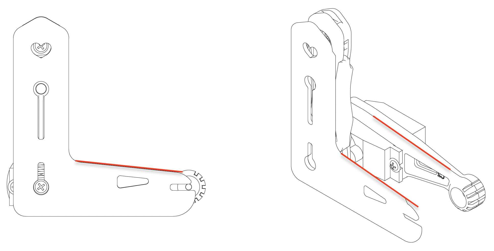

# Calibrate the joints with Arduino IDE

### Prepare to Enter to the Calibration State

Entering calibration state requires the following preparations: ‌

### Prepare to Enter the Calibration State

Entering the calibration state requires the following preparations: ‌

1\. All servo circuits are connected to the motherboard&#x20;

2\. The battery is fully charged&#x20;

3\. Connect the [USB adapter](https://docs.petoi.com/communication-modules/usb-downloader-ch340c#connect-nyboard) and communicate normally&#x20;

If you are building the robot with an unassembled kit, do not install the head and leg components until calibrated.&#x20;

You need to install the battery and long-press the button on the battery to power the robot.

.jpeg>)

The calibration has 3 steps:

&#x20; 1\. Power on the robot with battery, let servos rotate freely to zero angle/calibration state

&#x20; 2\. Attach body parts to the servos

&#x20; 3\. Fine-tune the offsets in serial monitor

## 1. Enter the calibration state

You must plug the servos and external batteries into the NyBoard and check the position and direction of all servos.&#x20;

&#x20;Type ‘c’ in the serial monitor to enter the calibration state.  Depending on their initial shaft direction, some may travel larger angles until stopping at the middle point.  There will be noise coming from the gear system of the servos. You will see a calibration table like the following:

The first row is the joint indexes; the second row is their calibration offsets:&#x20;

| **Index**  | 0  | 1  | 2  | 3  | 4  | 5  | 6  | 7  | 8  | 9  | 10 | 11 | 12 | 13 | 14 | 15 |
| ---------- | -- | -- | -- | -- | -- | -- | -- | -- | -- | -- | -- | -- | -- | -- | -- | -- |
| **Offset** | -1 | -1 | -1 | -1 | -1 | -1 | -1 | -1 | -1 | -1 | -1 | -1 | -1 | -1 | -1 | -1 |

Initial values are “-1” or “0”, and should be changed by later calibration.&#x20;


The servos use a potentiometer in the feedback loop for position control. When holding at a static position, they tend to vibrate around the target angle. A Parkinson’s-like vibration will develop after a short period of use. It won’t affect much during continuous motion. Better servos without these troubles could cost 10 times more, so replacing a failed unit is a more cost-effective solution. &#x20;


## 2. The rationale for calibration

### 2.1 Understand the zero state and the coordinate system

After typing ‘c’ in the serial monitor, with all servos rotated to their zero angles, now attach the head, tail, and legs prepared in the previous section to the body. They are generally perpendicular to their linked body frames. The calibration pose is shown below:

.png>)

.png>)


If you are building the robot from a kit, install the servo-related components according to the picture above, and try to ensure that they are perpendicular to each other (the upper leg is perpendicular to the torso, and the lower leg is perpendicular to the upper leg). Please refer to the related chapter in the user manual for the details:

* Nybble
* [Bittle](https://app.gitbook.com/s/-MPQ2vWEZUH7ol6XE55o-887967055/4-connect-the-wires#5.2-prepare-for-calibration)



Note: Insert the servo-related components directly into the servo output shaft, do not turn the output shaft during this process.


&#x20;Rotating the limbs counter-clockwise from their zero states will be positive (same as in polar coordinates). Viewed from the left side of the robot's body, the counter-clockwise rotation of the joint is defined as the positive direction.


The only exception is the tilt angle for the head of Nybble. It’s more natural to say head up, while it’s the result of rotating clockwise.&#x20;



But from the right side of the robot's body, the positive and negative of the rotation direction are just opposite.


### 2.2 Discrete angular intervals

If we take a closer look at the servo shaft, we can see it has a certain number of teeth. That’s for attaching the servo arms, and to avoid sliding in the rotational direction. In our servo sample, the gears divide 360 degrees into 25 sectors, each taking **14.4** degrees(offset of -7.2\~7.2 degrees). That means we cannot always get a perfect perpendicular installation.&#x20;

.png>)

### 2.3 Attach body parts to the servos

#### Install the head

In the calibration state, place the head as close to the central axis as possible and insert its servo shaft into the servo arm of the neck.

<figure><figcaption></figcaption></figure>

Press down on the head so it is firmly attached to the neck.

<figure><figcaption></figcaption></figure>

#### Install the legs&#x20;

Install upper leg and lower leg components to the output teeth of the servos after the Bittle is powered on and in the calibrated neutral position. Please keep the torso, upper leg, and lower leg installed vertically as much as possible, and do not install the lower leg backward, as shown in the picture.&#x20;

<figure><figcaption></figcaption></figure>

## 3. Fine-tune the calibration using the serial monitor

### 3.1 Joint Control Commands

The command for fine-tuning calibration (refer to the [serial protocol](https://app.gitbook.com/o/-M-\_eWZUjFA4usjshHcZ/s/-MQ6a951Q6Jn1Zzt5Ajr-887967055/\~/changes/DHad2hALnPq88oSLEuF1/serial-protocol)) is formatted as `cIndex Offset`. Notice that there’s a space between cIndex and Offset. The index number of the robot's joints is shown in the pictures below:

.png>)

For example :

* `c8 6` means giving the 8th servo an offset of 6 degrees.&#x20;
* `c0 -4` means giving the 0th servo(the head) an offset of -4 degrees.&#x20;


The resolution of the correction amount is 1 degree, do not use decimals.



If you find the absolute value of offset is larger than 9, that means you are not attaching the limb closest to its zero states. That will result in a decreased reachable range of the servo on either side. Take off the limb and rotate it by one tooth. It will result in an opposite but smaller offset.&#x20;



For example, if you have to use -9 as the calibration value, take the limb off, rotate by one tooth then attach it back. The new calibration value should be around 5, i.e.,  The sum of their absolute values is 14. Avoid rotating the servo shaft during this adjustment.&#x20;


Find the best offset that can bring the limb to the zero states.  It's a process of trial and error.

After calibration, **remember to type ‘s’ to save the offsets**. Otherwise, they will be forgotten when exiting the calibration state. You can even save every time after you’re done with one servo.&#x20;

### 3.2 Use ‘L’ shaped joint tuner

When watching something, the observation will change from different perspectives. That’s why we always want to read directly above a referencing ruler when measuring length.&#x20;

It’s especially important that you keep a parallel perspective when calibrating Bittle. Use the 'L'-shaped joint tuner as a parallel reference to avoid reading errors. Align the tips on the tuner with the center of the screws in the shoulder and knee joints, and the little hole on the tip of the foot. Look along the co-axis of the centers. For each leg, calibrate the shoulder servos (index 8\~11) first, then the knee servos(index 12\~15). When calibrating the knee, use the matching triangle windows on both the tuner and shank to ensure parallel alignment.&#x20;

#### Nybble

.jpg>)

#### Bittle

###

### 3.3 Testing and validation

After calibration, type ‘d’ or ‘kup’ to validate the calibration. It will result in Bittle / Nybble symmetrically moving its limbs between rest and stand state. &#x20;

You may need to do a few rounds of calibrations to achieve optimal states.

Take Bittle for example, as follows:

.png>)

### 3.4 Install the screws

After completing the joint calibration, install the center screws to fix the leg parts and servo gears.

### 3.5 Center of mass

Try to understand how the robot keeps balance even during walking. If you are adding new components to the robot, try your best to distribute its weight symmetrically about the spine. You may also need to slide the battery holder back and forth to find the best spot for balancing. Because the battery is heavier in the front, you can also insert it in a reversed direction to shift the center of mass more toward the back.&#x20;


You may need to recalibrate if there's a change to the center of mass.&#x20;


Please do not force the robot to add heavy objects, which may cause the servos to sweep or get stuck.
