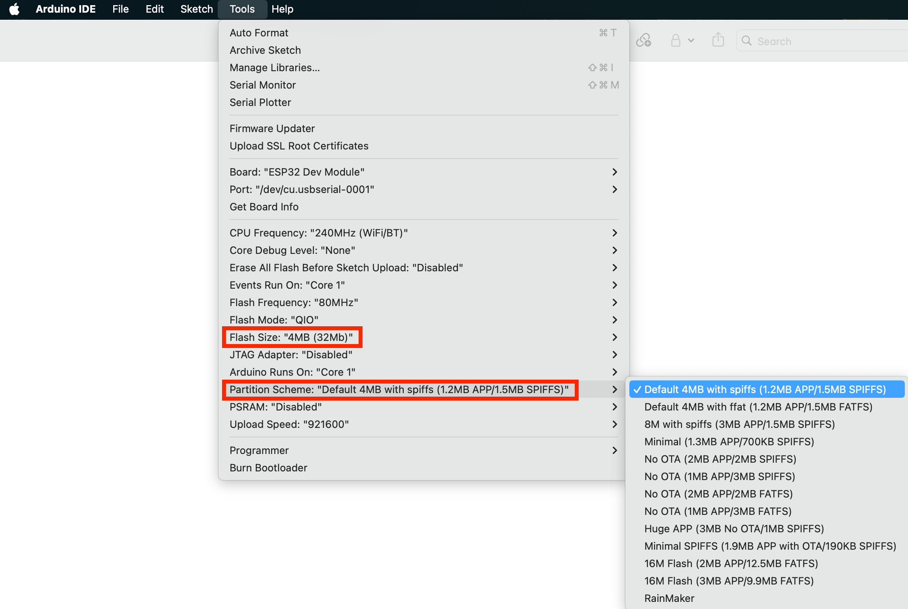
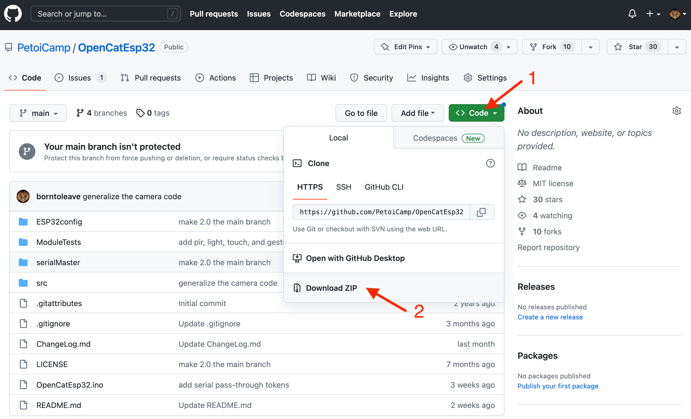

# Upload Sketch for BiBoard

## 1. Read the Quick Start Guide

For the specific parameters of each functional module of BiBoard, please refer to [Chapter 2](../biboard/biboard-v0.md#2.-modules-and-functions) of the BiBoard Quick Start Guide.

Test update.

## 2. Set up BiBoard&#x20;

### 2.1 Prepare the ESP32 development environment

Please refer to [Chapter 3.2.1](https://docs.petoi.com/biboard/biboard-v0#id-3.2.1-set-up-esp32-development-environment) of the BiBoard Quick Start Guide.

### 2.2 Modify the code file in the package

* #### sdkconfig.h


* For Windows:\
  C:\Users\\{username}\AppData\Local\Arduino15\packages\esp32\hardware\esp32\2.0.\*\tools\sdk\esp32\qio\_qspi\include\sdkconfig.h
* For Mac:\
  /Users/{username}/Library/Arduino15/packages/esp32/hardware/esp32/2.0.\*/tools/sdk/esp32/qio\_qspi/include/sdkconfig.h
* For Ubuntu:\
  Arduino root directory/.arduino15 (hidden file)/packages/esp32/hardware/esp32/2.0.12/tools/sdk/esp32/qio\_qspi/include/sdkconfig.h


Append a line of code at the end of the file:

```cpp
#define CONFIG_DISABLE_HAL_LOCKS 1
```

### 2.3 Setup the options

Please refer to the option list to set up the board's upload speed, CPU frequency, etc.&#x20;

There is a setting for the **Flash Size** and **Partition Scheme** among the options. For more information, refer to the next section.&#x20;

<figure><figcaption></figcaption></figure>

### 2.4 Choose hardware partition

The BiBoard uses an ESP32 with a **16 M** flash. To simplify, you can use the **default** **4 MB** partition map without a problem. There's plenty of programming space for the standard OpenCatEsp32 firmware.&#x20;

#### 4 MB partition

You can use the default 4MB with spiffs. You can also use other partition schemes under the 4 MB flash limit, such as "No OTA" or "Huge APP".&#x20;

<figure><figcaption></figcaption></figure>

#### 16 MB partition

Suppose you want to fully utilize the 16 MB flash of BiBoard (it's unnecessary and takes a longer uploading time). You can read the user manual for the [Add hardware partition configuration option in Arduino IDE](https://docs.petoi.com/biboard/demo-applications/13.-add-hardware-partition-configuration-option-in-arduino-ide).

### 2.5 Download the OpenCatEsp32 package


We keep updating the codes as an open-source project. You can star and follow our GitHub repository to get the newest features and bug fixes. You can also share your codes with worldwide OpenCatEsp32 users.&#x20;


* Download the ​OpenCatEsp32 repository from GitHub repository: [https://github.com/PetoiCamp/OpenCatEsp32](https://github.com/PetoiCamp/OpenCatEsp32)\
  We suggest you utilize GitHub’s version control feature. Otherwise, make sure you download the **WHOLE OpenCatEsp32 FOLDER** every time. All the codes have to be the same version to work together.&#x20;

<figure><figcaption></figcaption></figure>

* If you download the Zip file of the codes, you will get an **OpenCatEsp32-main** folder after unzipping. Please rename it to **OpenCatEsp32** before opening the **OpenCatEsp32.ino**, so that the two names match.&#x20;


No matter where you save the folder, the file structure should be:

.png>)&#x20;


* There are several **test\*\*\*.ino** codes in the **ModuleTests** folder. You can upload them separately to test specific modules (I recommend using **testBuzzer.ino** as your first test sketch).

### 2.6 [Connect to BiBoard](../upload-firmware.md#biboard) via USB type-C data cable

Set the serial port in the Arduino IDE:

<figure><figcaption></figcaption></figure>


If you cannot find the serial port after connecting to your computer:

* You may need to install [the driver](https://docs.petoi.com/technical-support/useful-tools#biboard-driver-to-access-the-serial-port) for the CP210x chip.&#x20;
* If the BiBoard is powered on by the battery, please long-press the button on the battery >=3s to power off the mainboard so that the board is only powered through the USB cable and only the blue LED is lit up.&#x20;


### 2.7 Compile and upload the sketch

Modify the device type macro definition in OpenCatEsp32**.ino** according to the device type.

```cpp
#define BITTLE    //Petoi 9 DOF robot dog: 1 on head + 8 on leg
//#define NYBBLE  //Petoi 11 DOF robot cat: 2 on head + 1 on tail + 8 on leg
//#define CUB
```

Modify the motherboard model macro definition in OpenCatEsp32**.ino** according to [the motherboard version](../desktop-app/firmware-uploader.md#biboard-version).

```cpp
// #define BiBoard_V0_1  //ESP32 Board with 12 channels of built-in PWM for joints
#define BiBoard_V0_2
```

After the modification is completed, you can click the **Upload** button to upload OpenCatEsp32.ino, and the changes in the program will be automatically saved.

<figure><figcaption></figcaption></figure>

### 2.8 Swith mode via the serial commands (Optional)

The default code runs the **Standard** mode (including the **Voice command** function). If you want to switch modes, Please [open the serial monitor](serial-monitor.md#biboard) and use the following serial commands:

<table><thead><tr><th width="172">Serial command</th><th>Function</th></tr></thead><tbody><tr><td>XA</td><td>Voice. The switch on the extension hat should be dialed to the <strong>Voice command</strong> side （<strong>default mode</strong>）</td></tr><tr><td>XU</td><td>Ultrasonic. The switch on the extension hat should be dialed to <strong>Uart2</strong> side</td></tr><tr><td>XC</td><td>Camera</td></tr><tr><td>XL</td><td>Light</td></tr><tr><td>XT</td><td>Touch</td></tr><tr><td>XI</td><td>PIR</td></tr><tr><td>XG</td><td>Gesture</td></tr><tr><td>XD</td><td>IR distance</td></tr><tr><td>XQ</td><td>Quick demo</td></tr><tr><td>X</td><td>Disable all the module functions above</td></tr><tr><td>z</td><td>RandomMind (On/Off)</td></tr></tbody></table>


The behavior of the official modules is defined in separate header files in **OpenCat/src/**. You can find them in **OpenCat/src/io.h** **-> readSignal()**. The behavior of **Quick demo** mode is defined in **OpenCat/OpenCat.ino ->  quickDemo()**. You can study the example code to write your functions.&#x20;

You can learn about the function of each module through the [**EXTENSIBLE MODULES**](https://docs.petoi.com/extensible-modules/introduction).


### 2.9 Do a factory reset (Optional)

Open the serial monitor, Input the serial command '<mark style="color:red;">**!**</mark>', and press **Enter** to start over. You will see several questions:

```cpp
Reset the joints' calibration offsets? (Y/n): 
```

&#x20;Input '**Y**' to the question, which means resetting all servo corrections to zero.


If you want to keep the previous joint calibration data, please input '**n**'.


```cpp
- Calibrate the Inertial Measurement Unit (IMU)? (Y/n): 
```

&#x20;Input '**Y**' to the question, which means calibrating the MPU6050, i.e. the gyro/accelerometer sensor.


Put the BiBoard **FLAT** on the table, and don't touch it during calibration.

Sometimes, the program could halt at the connection stage. You can close the serial monitor and reopen it, or press the reset button on BiBoard,  to restart the program.&#x20;

The program starts calibration after playing the melody 6 times.


```
Run factory quality assurance program? (Y/n)        
```

Input '**n**' and press **Enter** to continue.

The details of serial port printing information are as follows：

```cpp
* Start *
Bittle
Software version: B01_231206
Scanning I2C network...
- I2C device found at address 0x54  !
- I2C device found at address 0x68  !
- done
Set up the new board...
- Name the new robot as: Bittle2E
- Reset the joints' calibration offsets? (Y/n):   
Y
Initializing MPU...
OK
- Testing MPU connections...attempt 0
- MPU6050 connection successful
- Initializing DMP...
- Calibrate the Inertial Measurement Unit (IMU)? (Y/n):    
Y

Put the robot FLAT on the table and don't touch it during calibration.
>....................>....................
MPU offsets:
//           X Accel  Y Accel  Z Accel   X Gyro   Y Gyro   Z Gyro
//OFFSETS     1447,    -349,    1298,      89,      90,      16
- Enabling DMP...
- Enabling interrupt detection (Arduino external interrupt 26)...
- DMP ready! Waiting for the first interrupt...
Bluetooth name: Bittle2E
Waiting for a client connection to notify...
Bluetooth name: Bittle2E
The device is started, now you can pair it with bluetooth!
Setup ESP32 PWM servo driver...
Calibrated Zero Position
135 120 135 135 190 80 190 80 190 80 80 190
Build skill list...60
Run factory quality assurance program? (Y/n)
n
Init voice
Number of customized voice commands on the main board:
10
TaskQ
Ready!
rest
g
d

```

After the IMU calibration is completed, the robot will enter the regular power-on program every time it is powered on.


The main program of Bittle judges whether it has been initialized by comparing the **BIRTHMARK** in the EEPROM and whether it will not enter the initialization process again when it is turned on next time.


### 2.10 Power on

* Long-press the button on the battery and boot up the robot with one side up. It will enter the calibration state automatically. The picture below shows the upper and lower legs installed after the robot enters the calibration state.

.jpg>)

Please refer to [Chapter 5 🔌 Connect Wires](https://bittle.petoi.com/5-connect-wires) and [Chapter 6 📐 Calibration](https://bittle.petoi.com/6-calibration) for the complete calibration process.

* If you power on the robot and it is upright (with its back upward), the robot will start from the "rest" posture (fold the legs and unlock the servos).

### 3. Configuration with App

The BiBoard has built-in Bluetooth, and you can connect it with the new Android app to do joint calibration:

&#x20;[App for BiBoard (Android 4.4+)](https://docs.petoi.com/mobile-app/app-guide)

You can check the update history and added features in **ChangeLog.md** (BiBoard\ChangeLog.md)
