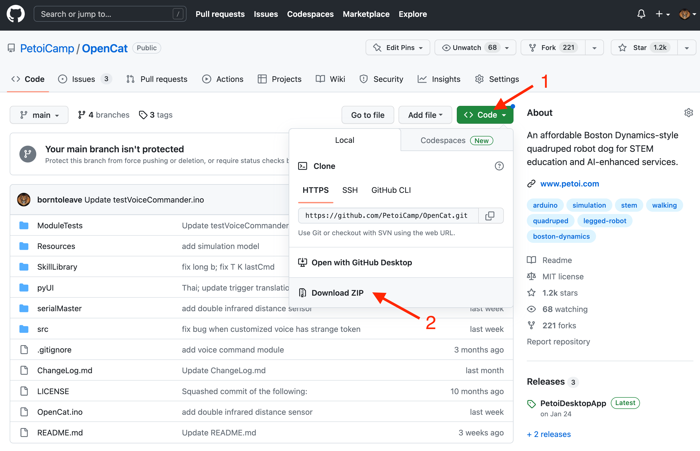
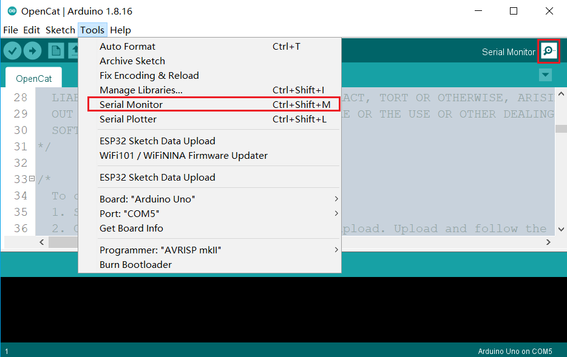
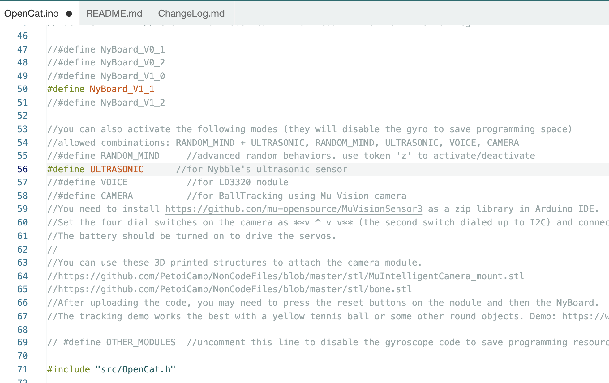
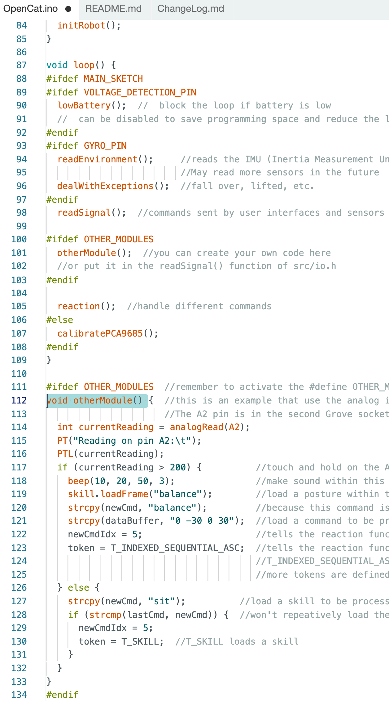
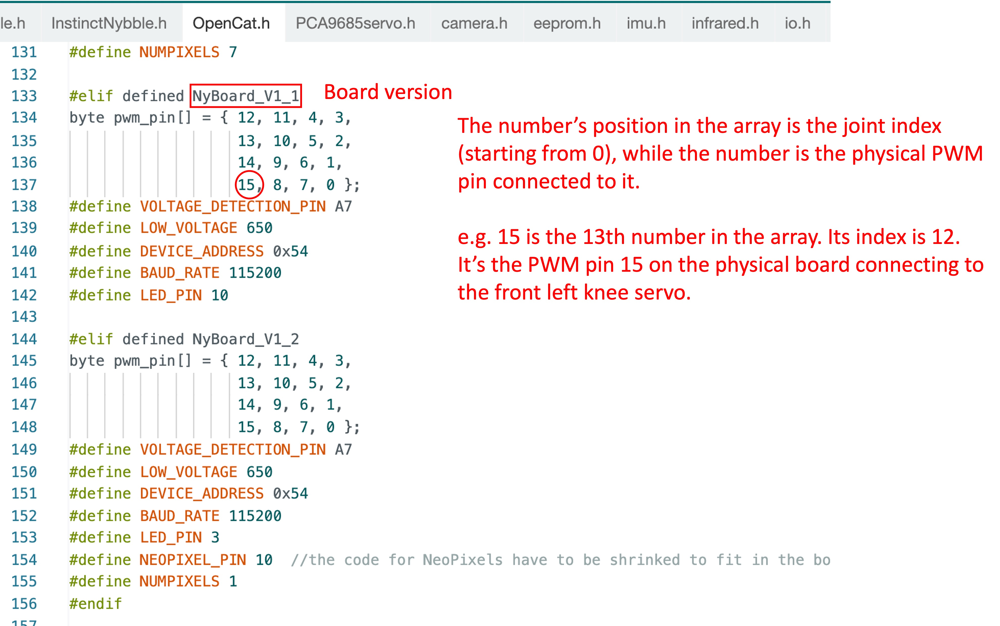
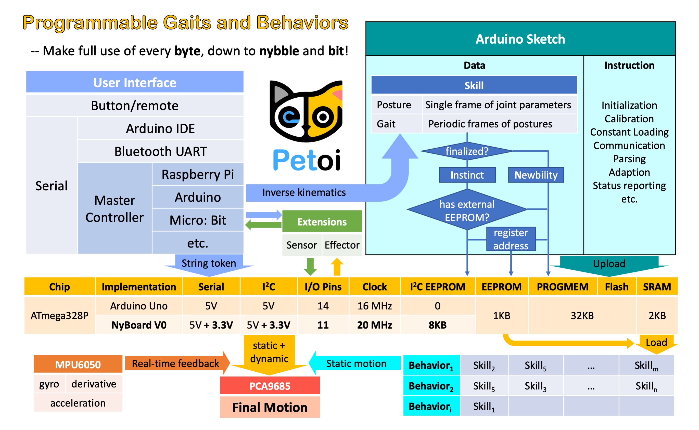

# Upload Sketch for NyBoard

## Setup Process

OpenCat software works on both Nybble and Bittle, controlled by NyBoard based on ATmega328P. More detailed documentation can be found at the [_NyBoard V1\_0_](../nyboard/nyboard-v1\_0.md) _or_ [_NyBoard V1\_1_](../nyboard/nyboard-v1\_1-and-nyboard-v1\_2.md).


Note: the version number is here




### Dial the I2C switch (SW2) to Arduino.

The I2C switch changes the master of I2C devices (gyro/accelerometer, servo driver, external EEPROM). On default “Arduino”, NyBoard uses the onboard ATmega328P as the master chip; On “RPi”, NyBoard uses external chips connected through the I2C ports (SDA, SCL) as the master chip.


.png>)


Notes：

* Sometimes if you cannot go through the bootup stage, such as repetitively printing "IMU" and restarting, maybe you have accidentally dialed the switch to the "RPi" side.&#x20;
* Before uploading the firmware, please make sure not to connect any I2C device to the I2C interface of the mainboard, otherwise, the firmware upload will fail. The location of the I2C interface is as shown below (in the red box): 


## Quick Start Tutorial Video



The setup process for Nybble is almost the same, except that you need to change the model definition to `#define NYBBLE.` Make sure you read through the following detailed steps.&#x20;

### Downloads and installations of Arduino IDE


You will need the newest [Arduino IDE](https://www.arduino.cc/en/software) to set up the environment. Older versions tend to compile larger hex files that may exceed the memory limit.&#x20;


With **NyBoard V1\_\***, you can simply choose **Arduino Uno**.&#x20;

.png>)


Only if the bootloader of NyBoard collapsed, which is very unlikely to happen

### Burn the bootloader (no need for normal use)

●      [What is a bootloader?](https://www.arduino.cc/en/Hacking/Bootloader?from=Tutorial.Bootloader)

Every NyBoard has to go through functionality checks before shipping, so they should already have a compatible bootloader installed. However, in rare cases, the bootloader may collapse then you won't be able to upload sketches through Arduino IDE.

Well, it's not always the bootloader if you cannot upload your sketch:

* &#x20;Sometimes your USB board will detect a large current draw from a device and deactivate the whole USB service. You will need to restart your USB service, or even reboot your computers;
* You need to install the driver for the FTDI USB 2.0 to the UART uploader;
* You haven't selected the correct port;
* Bad contacts;
* Bad luck. Tomorrow is another day! &#x20;

If you really decide to re-burn the bootloader:

please refer to the chapter [**Burn Bootloader for NyBoard**](https://docs.petoi.com/technical-support/burn-bootloader-for-nyboard)


### Connect the uploader (sometimes referred to as the programmer)


This step does not require the NyBoard to be mounted on the robot.


For specific steps, please refer to the [Connect NyBoard section](https://docs.petoi.com/communication-modules/usb-downloader-ch340c#connect-nyboard) in the USB uploader module.

### Connect Bluetooth uploader (optional)

For specific steps, please refer to the [Connect NyBoard section](https://docs.petoi.com/communication-modules/dual-mode-bluetooth#connection-with-nyboard) in the Dual-Mode Bluetooth Module.


On Mac, the Bluetooth may lose connection after several uploads. In that case, delete the connection and reconnect to resume the functionality.&#x20;



The Bluetooth dongle is not included in the kit sold by Seeed Studio or its partners. Please write to support@petoi.com for more information.&#x20;


### Download the OpenCat package


We keep updating the codes as an open-source project. You can star and follow our [GitHub repository](https://github.com/PetoiCamp/OpenCat) to get the newest features and bug fixes. You can also share your codes with worldwide OpenCat users.&#x20;


* Download a fresh ​OpenCat repository from GitHub: [https://github.com/PetoiCamp/OpenCat](https://github.com/PetoiCamp/OpenCat). It’s better if you utilize GitHub’s version control feature. Otherwise, make sure you download the **WHOLE OpenCat FOLDER** every time. All the codes have to be the same version to work together.&#x20;

<figure><figcaption></figcaption></figure>

* If you download the Zip file of the codes, you will get an **OpenCat-main** folder after unzipping. Rename it to **OpenCat** before opening the **OpenCat.ino**, so that the two names match.&#x20;


Arduino requires the .ino file to be put in a folder with the same name. You must rename the OpenCat-main folder as OpenCat (i.e. delete the -main suffix). Otherwise, Arduino will create another OpenCat folder and move OpenCat.ino into it. It will break the path dependency of related files.&#x20;

No matter where you save the folder, the file structure should be:

.png>)&#x20;


* There are several **testX.ino** codes in **ModuleTests** folder. You can upload them to test certain modules separately. Open any **testX.ino** sketch with prefix “test”. (I recommend using **testBuzzer.ino** as your first test sketch)
* Open up the serial monitor and set up the baud rate. With NyBoard V1\_\*, choose the board as **Arduino Uno** and **later set the baud rate** to 115200 in both the code and the serial monitor.&#x20;
* Compile the code. There should be no error messages. Upload the sketch to your board and you should see Tx and Rx LEDs blink rapidly. Once they stop blinking, messages should appear on the serial monitor.

### Upload

To configure the board, please follow these steps:

#### 1. Configure the robot type and board version

Open the file **OpenCat.ino** and select your robot and board version. For example:

```cpp
#define BITTLE    //Petoi 9 DOF robot dog: 1x on head + 8x on leg
//#define NYBBLE  //Petoi 11 DOF robot cat: 2x on head + 1x on tail + 8x on leg

//#define NyBoard_V0_1
//#define NyBoard_V0_2
#define NyBoard_V1_0
//#define NyBoard_V1_1
```


The symbol **//** deactivates the line of code and turns them into comments. Make sure you have only one line of the parallel options activated.


#### 2. Setup the configuration mode

Comment out `#define MAIN_SKETCH` so that it will turn the code to the board configuration mode. Upload and follow the serial prompts to proceed.

```cpp
// #define MAIN_SKETCH
```


If you activate `#define AUTO_INIT`, the program will automatically set up without prompts. It will not reset joint offsets but calibrate the IMU. It's just a convenient option for our production line.&#x20;


#### 3. Plug the USB uploader into your computer

Install [the driver](https://docs.petoi.com/communication-modules/usb-downloader-ch340c#the-drivers) if no USB port is found under Arduino -> Tools -> Port.


#### 4.  Plug the USB uploader into the NyBoard

For specific steps, please refer to the [Connect NyBoard section](https://docs.petoi.com/communication-modules/usb-downloader-ch340c#connect-nyboard) in the USB uploader module.

#### 5. Upload the configuration mode sketch

Press the upload button.


#### 6. Open the serial monitor

You can find the button either under **Tools**, or at the top-right corner of the IDE.&#x20;



Set the serial monitor as **No line ending** and **115200** baud rate.

<figure><figcaption></figcaption></figure>

#### 7.  Reset joint offsets

The serial prompts:

```
Reset joint offsets? (Y/n):
```

Input ‘Y’ and hit enter if you want to reset all the joint offsets to 0.

The program will do the reset and then update the constants and instinctive skills in the static memory.&#x20;


To pass this step, you must enter ‘Y’ or ‘n’. Otherwise, the following parameters, including the skill data, will not be updated on the board.&#x20;


#### 8. IMU (Inertial Measurement Unit) calibration

The serial prompts:

```
Calibrate the IMU? (Y/n): 
```

Input ‘Y’ and hit enter, if you have never calibrated the IMU or want to redo calibration.

Put the robot flat on the table and don't touch it. The robot will long beep six times to give you enough time. Then it will read hundreds of sensor data and save the offsets. It will beep when the calibration finishes.

When the serial monitor prints "Ready!", you can close the serial monitor to do the next step.


.png>)

If you don't want to calibrate PCA9685(the servo driver), [Step 9 ](upload-sketch-for-nyboard.md#9.-calibrate-the-servo-controller-chip-pca9685)can **be skipped**. The do [Step 10](upload-sketch-for-nyboard.md#10.-upload-the-major-functionalities-sketch) Upload the major functionalities sketch, and [calibrate the joint servos](https://docs.petoi.com/arduino-ide/calibrate-the-joints-with-arduino-ide) if you have never calibrated the joints.


#### 9. Calibrate the servo controller chip PCA9685 on the NyBoard

After the IMU calibration, there's an optional step to calibrate the servo driver.&#x20;

```
Optional: Connect PWM 3 -> Grove pin A3 to calibrate PCA9685
```

If later you find one of the servos stops working but can resume working after re-powering it, it's probably due to an inaccurate PWM driver signal. You must redo the previous uploading, and this step **CANNOT** be skipped.&#x20;

This calibration makes the servo controller (PCA9685 chip)'s angle signal more precise. Use a short jumper wire to connect the PWM pin 3 (the signal pin of one of the servo pins) and Grove pin A3 and hold the wire steady. It doesn’t have to be a dedicated jumper wire. Any thin metal wire, such as a straightened paper clip, can work as long as it can connect the pins.

<figure><figcaption></figcaption></figure>

The program will measure the pulse width of the signal and automatically calibrate the chip after getting three identical readings successively. It usually takes less than 2 seconds. The board will **beep three** times to indicate the calibration is done. The calibration offset will be saved to the board for the next time of bootup. The process should be done at least once, and we have calibrated every board after October 2022. But you can still do it by yourself, just in case.&#x20;


The servo has a backdoor signal to modify its parameters defined by the manufacturer. The PWM signal is 2700us with a tolerance window (2650 to 2750 us). The PCA9685's internal crystal has a frequency between 23MHz and 27MHz. The standard Adafruit servo library just set it to 25MHz if not calibrated. The regular servo PWM signal ranges between 500 and 2500 us. The error (27-25)/25 = 8% usually can be tolerated by the system. But when the joint signal falls in the range of 2700us, the servo will enter the configuration mode. Only powering off will break it out of the loop.

The optional step can be a quick fix. It utilizes the input pin of the main chip, which has an accurate external crystal clock, to measure the signal from PCA9685. It compares the measured pulse width and expected value, calculates a calibrating factor, and stores it in the chip. The process can be less than 1 second or several seconds. As long as it's done once, you don't need to do it again unless the temperature changes a lot. Calibrating the signal can also make the movements more precise if you are a professional who needs to conduct motion-related research.&#x20;

The calibration can be applied to all the PCA9685-based servo drivers that omit an external crystal. To recalibrate, just run the program's first round again and connect the two pins after the IMU calibration. The calibration value can be seen in Arduino's serial monitor and should be pretty consistent.


#### 10. Upload the major functionalities sketch

Uncomment `#define MAIN_SKETCH` to make it active. This time the code becomes the normal program for the major functionalities.  Then upload the code.

```cpp
#define MAIN_SKETCH
```

Open the serial monitor. When the serial monitor prints "Ready!", the robot is ready to take your next instructions.


Please [calibrate the joint servos](https://docs.petoi.com/arduino-ide/calibrate-the-joints-with-arduino-ide) after uploading the major functionalities sketch.


#### 11. The module macro in the code&#x20;

The default code runs the standard mode. If you have some extensible modules, you may uncomment the macro definition of a specific module.  It will disable the Gyro code to save some programming space and activate the demo of the module.&#x20;

<figure><figcaption></figcaption></figure>

The behavior of the official modules is defined in separate header files in **OpenCat/src/**. You can find them in **OpenCat/src/io.h** **-> readSignal()**. The behavior of **OTHER\_MODULES** is defined in **OpenCat/OpenCat.ino ->  otherModule()**. You can study the example code to write your own functions.&#x20;

<figure><figcaption></figcaption></figure>

#### 12. Modify the "joint - pin" mapping

In certain cases, you may want to modify the "joint - pin" mapping of the robot. You can modify it in **OpenCat/src/OpenCat.h**. Make sure you are modifying the code block corresponding to the board version at the beginning of **OpenCat.ino**. After the modification, remember to save the changes and redo the uploading process from step 2.&#x20;

<figure><figcaption></figcaption></figure>

## Memory arrangement

Congratulations! Now, you have finished the standard setup steps. You may read the source codes if you want to dive deeper into the program. The skills are saved in multiple places on a NyBoard due to ATmega328P's limited resources. The following diagram may give you some hints to help you understand.&#x20;

<figure><figcaption></figcaption></figure>


There are different storage on 328P (OpenCat):

The SRAM is only 2K. It's used for the whole program, so storing all the skill data is impossible. Only one skill is loaded to the SRAM before execution for easier and faster calculations.

The skill data are stored in the PROGMEM in the first upload round. During the program’s runtime, they will be stored in the external I2C chip, and their addresses will be stored in the onboard EEPROM.&#x20;

In the second round of uploading, the skill data in PROGMEM are not enabled, so I have more memory to write the main program's logic and UI.&#x20;

To accelerate tuning the skills, I allow a few skills to be stored in the PROGMEM, even in the main program. They are called the ["Newbility" compared to the finalized "Instincts"](https://docs.petoi.com/applications/skill-creation#skill-storage-type). So I don’t need to upload it twice to tune its skill data.&#x20;

Now, I have a better serial protocol that can take a long skill data array in real time, so I don't need to re-upload to tune a skill. The token is 'K'.&#x20;

The onboard EEPROM is only 1K. It stores the skill name string and addresses in PROGMEM or I2C EEPROM. It even stores the melodies from its tail.&#x20;

On ESP32, the Flash is large enough, so I don’t need to save the skill data to I2C EEPROM. However, transferring one active skill to the SRAM is still necessary to avoid keeping all the skill arrays in the SRAM.&#x20;

