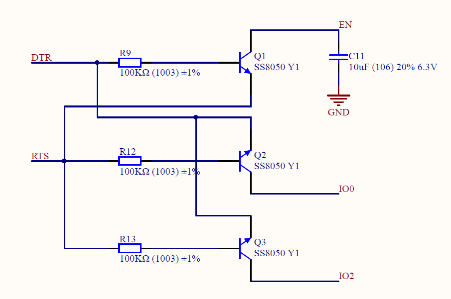
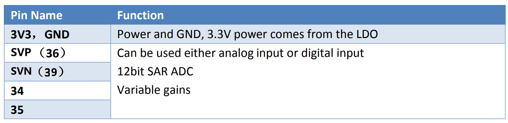

# BiBoard V0 Guide

## 1. Introduction

BiBoard is a robot dog controller based on ESP32 developed by Petoi LLC. Unlike NyBoard, which is for regular users and robot lovers, BiBoard mainly faces developers and geeks. High-performance processors, larger memory and storage (16 MB of Flash), and wireless connections. Audio function is also included.

## 2. Modules and functions

The function partition for BiBoard is shown below:

<table><thead><tr><th width="125">Part No.</th><th width="150">Module</th><th width="165">Function</th><th>Introduction</th></tr></thead><tbody><tr><td>Power 1</td><td>Battery Socket</td><td>Connects to Bittle's battery or provides external 8.4V power</td><td>Bittle battery or external 8.4V battery</td></tr><tr><td></td><td>2</td><td>Power LED</td><td>Indicates power status: Blue for 5V/3.3V, Orange for 8.4V servo power</td></tr><tr><td></td><td>3</td><td>Power</td><td>Provides 5V and 3.3V power</td></tr><tr><td>ICS</td><td>4</td><td>USB</td><td>Enables program download and soft reset of the controller</td></tr><tr><td></td><td>5</td><td>IMU</td><td>6-axis Inertial Measurement Unit (IMU) for motion sensing</td></tr><tr><td></td><td></td><td></td><td></td></tr><tr><td></td><td>6</td><td>EEPROM</td><td>External memory for storing data</td></tr><tr><td></td><td>7</td><td>DAC Amp</td><td>Amplifies audio signal for speaker output</td></tr><tr><td></td><td>8</td><td>IRDA receiver</td><td>Receives infrared signals</td></tr><tr><td>Extension</td><td>9</td><td>PWM Servo</td><td>Provides 12 pulse-width modulation (PWM) outputs for controlling servos</td></tr><tr><td></td><td>10</td><td>3 extensions</td><td>Offers additional connectivity options: 4 analog inputs, 2 serial ports, 1 I2C interface, and 5V DC-DC power (max 3A)</td></tr><tr><td>Buttons</td><td>11</td><td>Boot and Reset buttons</td><td>Press the reset button to restart the program</td></tr></tbody></table>

Block diagram for BiBoard is shown below:

.png>)

## 3. Module details:

### 3.1 Power

.png>)

There're 2 ways to power the BiBoard: USB 5V and battery socket 7.4V.

When using USB power, there’s no power output for DC-DC 5V extension and servo. So USB power mainly supplies ICs.

When using battery power at 7.4V (maximum: 8.4V). Both servos and 5V power will be supplied. You can use 5V powering the Raspberry Pi.

### 3.2 On board modules

#### 3.2.1 USB Downloader

There’s no USB circuit in the ESP32, so we use the [CP2102 USB](https://docs.petoi.com/technical-support/useful-tools#biboard-driver-to-access-the-serial-port) bridge as officially recommended. The maximum download baud is 921600. The bridge is connected to serial 1 of the ESP32.

We use the USB Type-C port; 2 resistors, CC1 and CC2, are added as the identifier.

.png>).png>)

We tried the automatic download circuit designed by ESP and the NodeMCU, but none of them works perfectly. So we modified the circuit by adding the third transistor and enlarger the capacitor.

The transistors receive standard serial modem signals DTR and RTS and trigger a unique timing-sequence forcing ESP32 into download mode and then reboot. The detail of the automatic download circuit is shown below.

#### 3.2.2 IMU

We use Invensense MPU6050, the most widely used IMU. Its I2C address is 0x68, and DMP’s interrupt is connected to IO26 of the ESP32.

With the help of Jrowberg’s MPU6050 DMP library, you can easily get the motion status of the Bittle. The Jrowberg’s MPU6050 library must be modified to adapt ESP32. The data types of “int8” and “PGMSpace” should be pre-defined instead of 8-bit AVR macros. We offer the modified library of MPU6050. You can replace the original library so that both AVR boards and ESP boards would be worked normally.

#### 3.2.3 EEPROM

There is a 64Kbit EEPROM on the BiBoard. You can directly use the EEPROM read and write a program that is used on the Arduino UNO. You can use it to store calibration data.

There is also an example program named “EEPROM” in the ESP32 support package. This is not the demo code of the I2C EEPROM. That’s the demo of the simulated EEPROM by ESP32’s QSPI flash memory.

#### 3.2.4 DAC and audio applications

We use DAC output and a class-D amplifier instead of a PWM buzzer to make Bittle more vivid. You can use 3 ways to drive the audio module:

1. Use Arduino “Tone()” function.
2. Use ESP32 “dacWrite()” function like “analogWrite()” in Arduino. The data quality produced by the DAC is better than the PWM.
3. Use ESP MP3 decode library developed by XTronical, you can play MP3 files. You should configure a file system like SPIFFS or FAT in the flash before you use this MP3 decoder.

URL：[https://www.xtronical.com/basics/audio/dacs-on-esp32/](https://www.xtronical.com/basics/audio/dacs-on-esp32/)

#### 3.2.5 IR modules

The IR sensor on Nyboard and BiBoard are the same, so you can directly use the sketch from the Nyboard. The BiBoard’s flash is large enough so that you don’t have to disable macros in IRremote.h.

## 4. Servo sockets

There’re 12 PWM servo sockets on the BiBoard, and the pin number is marked near the socket.

We transform the direction of the PWM servo socket by 90 degrees since the size of the ESP32 module. You should connect the wires first before you screw the BiBoard on the cage.

## 5. Extension sockets

There’re 3 extension sockets on the BiBoard that marked with P15, P16 and P17.

### 5.1 Analog input sockets（P15）

This socket is used for analog input extension, you can try to connect foot press sensors to this socket.

### 5.2 Bus extension sockets（P16）

This socket is used for bus extension of the ESP32.

.png>)

### 5.3 Raspberry Pi interface (P17)

You can use this interface to connect to the Raspberry Pi, but you cannot directly mount the Raspberry Pi above the BiBoard. Use wires or adapters instead.

.png>)
