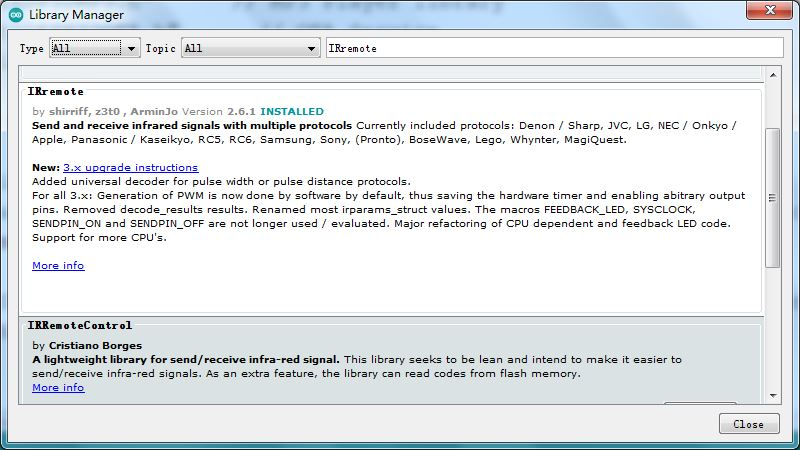

# 7.Infrared remote control

BiBoard is equipped with an infrared sensor, which is connected to the 23rd pin. The use of infrared is exactly the same as which is on Arduino UNO based on AVR.

First download the 2.6.1 version of the IRremote library, you need to manually select the 2.6.1 version. Because the infrared-related codes have changed in later versions, if you use the 3.X version, the commands will not be translated. In order to be compatible with our previous products, we decided to use the 2.6.1 version after testing.



When using NyBoard, in order to ensure that the code can be compiled smoothly, we need to remove unnecessary code in the IRremote library, that is, remove the encoder/decoder that we don't use, and only keep the NEC\_DECODER, which is the 38KHz signal decoder in NEC format.

Due to the flash memory capacity of BiBoard is “huge”, we don’t need to remove unnecessary code in the IRremote library.


Finally, a demo is attached, which accepts infrared signals and prints via the serial port. You can also use official demo for testing.

```cpp
#include <Arduino.h>
#include <IRremote.h>

int RECV_PIN = 23;

IRrecv irrecv(RECV_PIN);

decode_results results;

void setup() {
  Serial.begin(115200);
  irrecv.enableIRIn();
  Serial.println("IR Receiver ready");
}

void loop() {
  if (irrecv.decode(&results)) {
    Serial.println(results.value, HEX);
    Serial.print(" - ");
    irrecv.resume(); // Receive the next value
  }
  delay(300);
}
```

