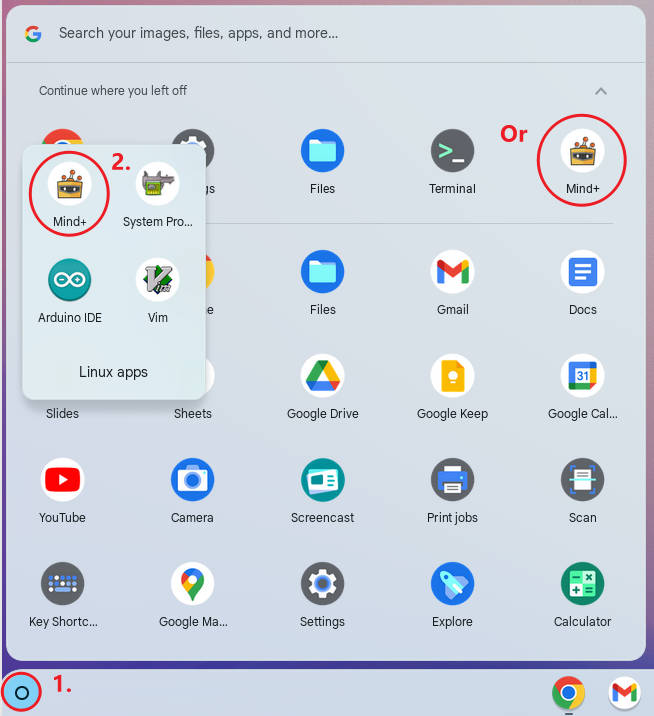

# Install Mind+ on Chromebook

## Configure the Linux environment

You need to [**turn on Linux**](https://docs.petoi.com/apis/set-up-development-environment-on-chromebook#turn-on-linux) on the Chromebook to access the Linux environment via the terminal app.

Then, follow the following steps to install Mind+.

## Check the processor architecture

Use the following command to check the processor architecture in the terminal:\
&#xNAN;_**`uname -m`**_\
The output will be similar to "i686", "x86\_64" or "armv7":\
i686 (or similar) - 32-bit Intel/AMD processor (common in older computers).\
x86\_64 (or similar) - 64-bit Intel/AMD processors (modern laptops, desktops, and most Chromebooks).\
armv7 (or higher) - ARM processor. (Mobile phones, tablets, 2nd and 3rd generation Raspberry Pis running Ubuntu Mate, and some Chromebooks. Most are 32-bit now)\

## Download package

According to different  architectures to download different versions:[https://mindplus.dfrobot.com/linux](https://mindplus.dfrobot.com/linux)\

## Installation

Use the following command in the terminal to install it (Replace **\*\*\*\*\*** with the file name of the installation package):\
&#xNAN;_**`sudo dpkg -i *****.deb`**_\
&#xNAN;_**`sudo apt-get -f install`**_

After installed, you can start the **Mind+** app in the Chromebook launcher:

<figure><figcaption></figcaption></figure>

## Run Mind+

Now, you can proceed to the [Mind+ tutorial](https://docs.petoi.com/block-based-programming/petoi-coding-blocks).


Currently, connection via Bluetooth is not supported.&#x20;

