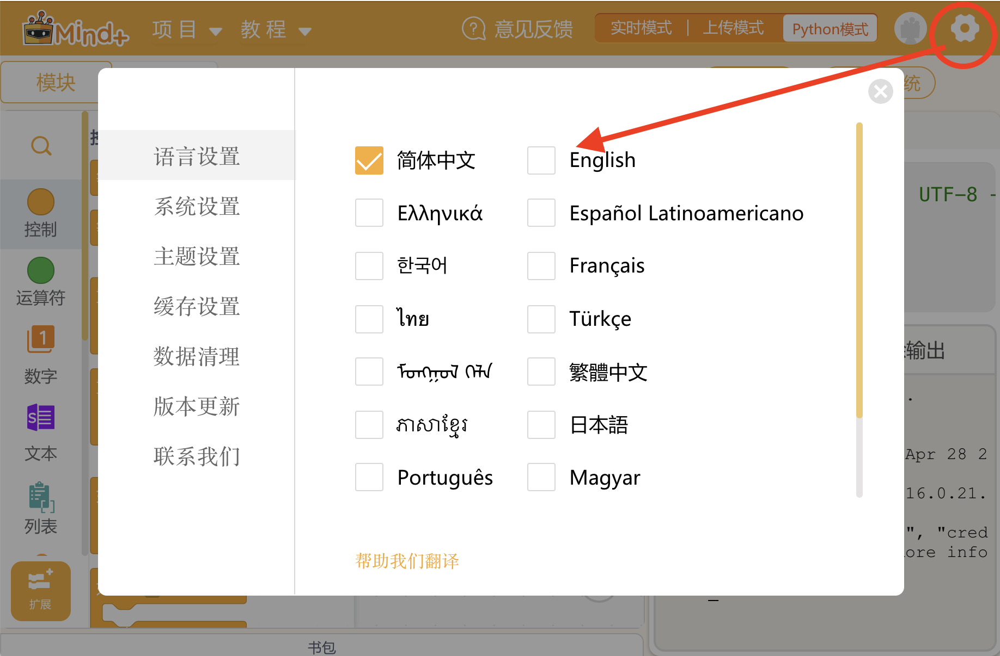

# Petoi Coding Blocks

## Prepare Mind+

* Download the latest version from the [Mind+ official website](https://mindplus.cc/download-en.html)
  * For Windows: Mind+ version **>= V1.7.0**
  * For Mac O&#x53;**:** Mind+ version **>= V1.7.3 RC2.0**


If you can not download the software from Mind+'s official website, you can download a stable version from [the Google Drive folder](https://drive.google.com/drive/folders/1V9WSnNiEOKZznP05W_RPxUD0TqAFFK7T). However, we strongly recommend that you download and use the official latest version.



**For macOS only:** If you have already installed the old Mind+ version (**<=**&#x56;1.7.2 RC3.0), we recommend that

1. You uninstall it first
2. Delete this folder /Users/\[vour username]/Documents/mindplus-pv/environment/Python3.6.5.64/ib/python3.6/site-packages/
3. Download and install the latest version of **Mind+**.


* After the installation is complete, you can open Mind+


If the default installation language is Chinese, you can switch to **English** as follows:




## Watch the video tutorials

We provide [a series of video tutorials](https://www.youtube.com/playlist?list=PLHMFXft_rV6POrzm8O12Nybdy1-FS1ymg) on using Petoi Coding Blocks with [the free Scratch-like robotics coding curriculum](https://www.petoi.com/pages/free-quadruped-robotics-curriculum-scratch-coding).   Be sure to click next to go through all the videos.



## Prepare Petoi Robot

Please follow the instructions in the subpages to prepare according to the robot's mainboard.

## Import Petoi Mind+ extension library

<figure><figcaption></figcaption></figure>

Paste the GitHub URL([https://github.com/PetoiCamp/Petoi\_MindPlusLib](https://github.com/PetoiCamp/Petoi_MindPlusLib)) in the text box of the import interface:

<figure><figcaption></figcaption></figure>

<figure><figcaption></figcaption></figure>

## Programming and Running

<figure><figcaption></figcaption></figure>


Petoi Coding Blocks is a user-extended library of Mind+.&#x20;

If you open **Mind+** by double-clicking the icon.png>), it will not automatically load this extension library, and you need to re-import it manually every time you open the app.&#x20;

If you open Mind+ by double-clicking the code file(suffix **mp** or **sb3**) that uses this extension library or load these code files after opening Mind+, Mind+ will automatically load this extension library.


## The principle and process

This extension library can control the robot without compiling and uploading the code to the robot's main board. Click the "Run" button directly to run the program on the Python level and send instructions to the robot's serial port. If you need to stop the program while running, you can click the "Stop" button anytime. The process of the program can be divided into three steps:

1. &#x20;Open the serial port
2. &#x20;Control the robot
3. &#x20;Close the serial port

## The instructions for blocks

### Open the serial port

There are two ways to open the serial port:

* Automatically identify and open the serial port\
  .png>)
* Enter the name of the serial port to open the serial port\
  .png>)


If it fails to open the serial port, you can refer to the printed information in the terminal window to replace the name of the serial port:

.png>)


### Deactivate Gyro

.png>)

When the gyroscope function is turned on, the robot can balance its body in real-time. It may be seen that when the robot is doing preset actions (especially when performing more violent actions), the body will shake back and forth, and even the body will tip over. The robot will automatically perform recovery actions, which may disrupt your preset steps.

If the uploaded sketch is **Mind+ mode** sketch(**`#define GROVE_SERIAL_PASS_THROUGH`** this line is activated), the gyroscope function will be turned off, and the robot will not be able to balance or auto-recover, so there is no need to add this block.


If the robot is in [**standard mode**](https://docs.petoi.com/arduino-ide/upload-sketch-for-nyboard#11.-the-module-macro-in-the-code), you'd better deactivate the Gyro after the serial port-opening block. It deactivates the gyroscope function to prevent the robot from performing balance feedback actions in real-time. For example:

.png>)


### Perform inherent skills

<div align="left"><figure><figcaption></figcaption></figure></div>

Use this block to let the robot perform skills pre-built on the robot's main board. Skills from "**sit**" to "**zero**" are **postures** (containing only one action frame).  Skills from "**boxing**" to "**sniff**" are **behaviors** (containing multiple posture frames and are performed only once).  Skills from "**stepping**" to "**trotRight**" are **gaits** (containing multiple posture frames, and are repeated in periodical loops until stopped).&#x20;

After finishing the current block's task, the program will wait a short time (delay xx seconds) before moving to the next block.&#x20;

### Perform the last skill exported from the Skill Composer

<div align="left"><figure><figcaption></figcaption></figure></div>

Use this block to let the robot perform the last skill exported from the [Skill Composer](https://docs.petoi.com/desktop-app/skill-composer#export-the-skill).&#x20;


It is equivalent to inputting the serial command 'T' in the [serial monitor](https://docs.petoi.com/arduino-ide/serial-monitor) and then delaying the preset time.


### Perform the skill in the file

<div align="left"><figure><figcaption></figcaption></figure></div>

Use this block to let the robot perform the skill in the skill files, which are in the following directory:

* **Windows**: C:\Users\\{your user name}\\.config\Petoi\SkillLibrary\\{model}
* **MacOS** : /Users/{your user name}/.config/Petoi/SkillLibrary/{model}
* **Linux**: /home/{your user name}/.config/Petoi/SkillLibrary/{model}

The folder name **{model}** is Bittle or Nybble. When [exporting](https://docs.petoi.com/desktop-app/skill-composer#export-the-skill) a skill file from the **Skill Composer**, it will automatically save the skill file to this directory.


Tips: you can also copy & paste the [SkillLibrary](https://github.com/PetoiCamp/OpenCat/tree/main/SkillLibrary) folder from the source code of the OpenCat project on GitHub to the _**.config/Petoi**_ directory. Therefore, you can use some sample skills for your Mind+ program, and there is no need to use the export function in the Skill Composer.

.png>)



The folder **.config** is a hidden directory on MacOS/Linux but can be visited in the terminal or through a specific view setting:

*   MacOS\
    open the directory /Users/{username} in Finder, then press the “**Command**” + “**Shift**” + “**.**” (period) keys at the same time.\


    <figure><figcaption></figcaption></figure>


### Rotate joints in a sequence.

<div align="left"><figure><figcaption></figcaption></figure></div>

Use this block to control one joint or multiple joints to rotate in sequence. There are several ways to use the blocks for reference:

*   Controls individual joint rotations to an absolute angle value.\


    <figure><figcaption></figcaption></figure>
*   Controls individual joint rotations to a relative angle value.\


    <figure><figcaption></figcaption></figure>
*   Control multiple joints to rotate sequentially to **absolute** angle values or **relative** angle values.\


    <figure><figcaption></figcaption></figure>
*   Use the joint angle list to control multiple joints to rotate to absolute angle values in a sequence.\


    <div align="left"><figure><figcaption></figcaption></figure></div>


- , represents a list consisting of a [joint index](https://docs.petoi.com/petoi-robot-joint-index) and an angle value. For example, \[Head panning to 30 degrees] represents the list \[0, 30].
- \
  It consists of one or more pairs of[ joint index](https://docs.petoi.com/petoi-robot-joint-index) + angle value, and the specific format is as follows: \
  \[joint index, angle value, joint index, angle value...]


### Rotate joints simultaneously&#x20;

<div align="left"><figure><figcaption></figcaption></figure></div>

Using this block can control multiple joints to rotate at the same time. There are several ways to use the blocks for reference:

*   Control multiple joints to rotate to absolute angle values or relative angle values at the same time\


    <figure><figcaption></figcaption></figure>
*   Use the joint angle list to control the simultaneous rotation of multiple joints to absolute angle values.\


    <div align="left"><figure><figcaption></figcaption></figure></div>

### Get the current angle value of a joint.

<div align="left"><figure><figcaption></figcaption></figure></div>

Use this block to get the current angle value of the selected joint. It is recommended to assign it to a variable first and then use the variable and algorithm to control other joints to rotate.


The return value of this block is only an angle value, which cannot be filled in the "Turn sequentially" and "'Turn simultaneously" blocks alone.


Demo code:

<figure><figcaption></figcaption></figure>



### Transform to frame

<div align="left"><figure><figcaption></figcaption></figure></div>

Use this block to control all joints to rotate at the same time. Please use it with the "Action frame" block. As shown below:

<div align="left"><figure><figcaption></figcaption></figure></div>


The "Action frame" block represents a list of 16 angle values. Each angle value corresponds to the absolute angle value to which the corresponding [joint index](https://docs.petoi.com/petoi-robot-joint-index) servo rotates.


### Play a melody

.png>)

Use this block to control the robot to play music. There are several ways to use  blocks together for reference:

*   A list made up of multiple "Tone + Duration" blocks\


    <div align="left"><figure><figcaption></figcaption></figure></div>
*   Using a tone duration list\


    <div align="left"><figure><figcaption></figcaption></figure></div>


.png>)

Consists of one or more pairs of Tone + Duration, the specific format is as follows:

\[tone, duration, tone, duration, tone, duration...]


#### Tutorials

For more detailed tutorials, please refer to [Melody Creation](https://docs.petoi.com/applications/melody-creation).

### Execute a serial command

<div align="left"><figure><figcaption></figcaption></figure></div>

Use this block to send a serial command to the robot, which can provide you with more and more flexible control methods. For example, you can input "**kkcL**" (kick the left front leg), and "**khiR**" (raise the right front leg to say hello). For more serial port commands, please refer to [the serial protocol](https://docs.petoi.com/api/serial-protocol).&#x20;

### Write analog value

<div align="left"><figure><figcaption></figcaption></figure></div>

Use this block to write an analog value to a specified pin. Analog value range: 0\~255

### Read analog value

.png>)

Use this block to read an analog value from a specified pin.

### Write digital value

.png>)

Use this block to write a high/low-level value to the specified pin. High-level: 1; Low-level: 0.

### Read digital value

.png>)

Use this block to read the high/low-level value of the specified pin.

### Read Ultrasonic sensor distance

<div align="left"><figure><figcaption></figcaption></figure></div>

Use this block to read the distance value from the ultrasonic sensor.

For the [Petoi RGB Ultrasonic Sensor](https://docs.petoi.com/extensible-modules/ultrasonic-sensor) (or **RUS-04**), you can set the two pins ( Trigger and Echo) like this:

*   **NyBoard** (connects to the D6 and D7 pins)\


    <div align="left"><figure><figcaption></figcaption></figure></div>
*   **BiBoard** (connects to the Rx and Tx pins)\


    <div align="left"><figure><figcaption></figcaption></figure></div>


For other ultrasonic sensor models (e.g., **HC-SR04** connects to the D6 and D7 pins), you can set the two pins like this:




### Read the target coordinates <a href="#read-the-target-coordinates" id="read-the-target-coordinates"></a>

<div align="left"><figure><figcaption></figcaption></figure></div>

Use this block to Read the coordinates of the identified target from the camera module([MU camera](https://docs.petoi.com/extensible-modules/mu-camera) / [Petoi AI Vision module](https://docs.petoi.com/extensible-modules/petoi-ai-vision-module)) which connect to the BiBoard.

#### Test code screenshot

<figure><figcaption></figcaption></figure>

You can download this test code ([**testCamera.mp**](https://github.com/PetoiCamp/Petoi_MindPlusLib/raw/refs/heads/main/examples/BiBoard/testCamera.mp)) and run in the Mind+.

### Get the gesture value

<div align="left"><figure><figcaption></figcaption></figure></div>

Use this block to Read the gesture value from the [gesture sensor](https://docs.petoi.com/extensible-modules/gesture-sensor#biboard) which connect to the BiBoard.

the gesture value meaning is as following:

```
0: Up; 
1: Down; 
2: Left;
3: Right;
```

#### Test code screenshot

<figure><figcaption></figcaption></figure>

You can download this test code ([**testGesture.mp**](https://github.com/PetoiCamp/Petoi_MindPlusLib/raw/refs/heads/main/examples/BiBoard/testGesture.mp)) and run in the Mind+.

### Close the serial port

.png>)

Generally, at the end of the program, it is recommended to use this block to close the serial port communication.

### Demos

We provide some demos to download for reference in the GitHub repository (Petoi\_MindPlusLib/examples).

<figure><figcaption></figcaption></figure>

### Free block-based robotics coding curriculum



