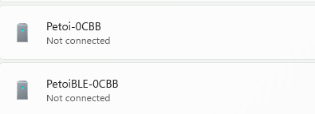

# BiBoard

## Connection steps

1. Power on the mainboard via the battery (plug in the battery to the mainboard, and long-press the battery button > 3 seconds); after powering on, the mainboard's <mark style="color:blue;">blue</mark> LED and <mark style="color:yellow;">yellow</mark> LED should be on.
2.  For **Windows**, Open the Bluetooth & other devices  setting page, and turn on the Bluetooth button as follows: 

    <figure><figcaption></figcaption></figure>
3.  Add the BiBoard Bluetooth for the first time as follows: 

    <figure><figcaption></figcaption></figure>

    <figure><figcaption></figcaption></figure>

    Select the one with the name <mark style="color:blue;">**Bittle\*\*\_BLE**</mark>:

<figure><figcaption></figcaption></figure>

After paired successfully, it shows：

<figure><figcaption></figcaption></figure>

<figure><figcaption>
Windows 10
</figcaption></figure>


For **Windows 11**, after the initial Bluetooth pairing, the device might show “not connected” as follows. However, as long as the robot is not rebooted after the pairing, the associated COM port is still registered in the system. You can connect to the serial port within the Petoi application, such as the Desktop app and the Mind+.



Check the **outgoing** serial port, which we will use later in the Mind+ or Petoi Desktop App in the **More Bluetooth options**:

<figure><figcaption>
More Bluetooth options
</figcaption></figure>

<figure><figcaption>
Bluetooth Settings
</figcaption></figure>


If you have already added the BiBoard Bluetooth before, after powering off and powering on the robot, you should remove both of the two devices in the list as follows:

.png>)\
Then re-do the _**Step 3**_.



**Don't** add the one with the name Bittle\*\*\_SSP that auto-generates a PIN code:\
.png>)\
Click the button _**Cancel**_ to quit.


4.  Test in Mind+: 

    <figure><figcaption></figcaption></figure>
