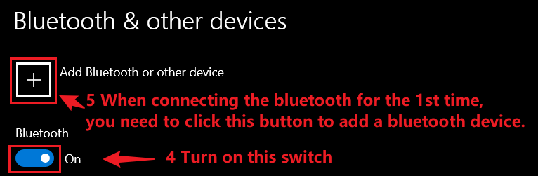

# Dual Mode Bluetooth&#x20;

### Introduction

The Bluetooth module is a standard transparent transmission module, which sends serial port data to devices connected to Bluetooth.

You can wirelessly upload firmware or control the motion of the robot through a Bluetooth connection. You can even control the robot using our smartphone app [Petoi](https://docs.petoi.com/mobile-app/app-guide). We have included our official Bluetooth module in the standard robot kit. As shown below:

.png>)

### Connection with NyBoard

The connection between the Bluetooth module and the NyBoard is shown in the figure below, you need to plug the Bluetooth module into the 6-pin socket on the NyBoard. Note the pin order of the Bluetooth module. Once the battery is connected to the NyBoard, press and hold the button on the battery to power the robot. A blinking LED on the Bluetooth module indicates waiting for a connection.

.jpg>)

### Connect the dongle with your phone

You need to connect the dongle within the Petoi App, rather than your phone's system Bluetooth settings. On some phones, you need to grant Bluetooth and location services permissions to the app.&#x20;

A more detailed setup can be found in the [mobile app](https://docs.petoi.com/mobile-app/app-guide) section.&#x20;

### Connect the dongle with your computer

In your system's Bluetooth settings, search for a Bluetooth device name started with Petoi or Bittle, and connect. The default PIN for pairing is “0000“ or “1234”. After the pairing is successful, the system will assign a serial port name.


On Mac, go to System Preference -> Bluetooth, find a device name started with Petoi or Bittle, and connect.&#x20;



On Windows, add the Bluetooth device in the system settings.


 

 

.png>)


For Win10 users, the system will assign the "incoming" COM port and the "outgoing" COM port to Bluetooth. Please use the "outgoing" COM port. For details, please check in the "More Bluetooth options" of Win10 as below:


You can then select it under **Tools**->**Port** in the Arduino IDE, using the same method as the USB uploader. After opening the serial monitor, please select: **No line ending**, and the baud rate is set to **115200**.


The Bluetooth connection with the computer may occasionally drop. Keeping the serial monitor open can make it more stable. But note it will also occupy the port and block other applications that want to connect.&#x20;


### Configure the Bluetooth module

If you want to configure the Bluetooth module, please refer to "JDY-23 AT Command List". Plug the Bluetooth module into the USB adapter debugging interface. As shown below:

The commonly used commands are listed below:

| Usage                        | Command                                           | Demo                                                                                            |
| ---------------------------- | ------------------------------------------------- | ----------------------------------------------------------------------------------------------- |
| Check BT module version      | AT+VER                                            | 
AT+VER

>+VER=JDY-23A-V2.21,Bluetooth V3.0+BLE

（BT module version infomation）
 |
| Check BT broadcast name      | AT+NAME                                           | 
AT+NAME

>+NAME=BITTLE
                                                              |
| Change BT broadcast name     | AT+NAME(name)                                     | 
AT+NAMEPuppy

>+OK

AT+NAME

>+NAME=Puppy
                                 |
| Change BT BLE broadcast name | AT+NAM<mark style="color:red;">**B**</mark>(name) | 
AT+NAMBPuppy

>+OK

AT+NAMB

>+NAMB=Puppy
                                 |
| Check serial baud rate       | AT+BAUD                                           | 
AT+BAUD

>+BAUD=8 （8 = 115200， 7=57600）
                                             |
| Change serial baud rate      | AT+BAUD                                           | 
AT+BAUD7

>+OK （Set serial monitor to 57600）

AT+BAUD

>+BAUD=7
           |

When you use the serial terminal like "Arduino serial monitor" to set JDY-23 with AT commands, you must set "**NL and CR**",  and the baud rate is set to **115200,** or the JDY-23 module will not identify any AT command you send.

.png>)


If you are a developer, you can use Lightblue or other tools to connect the dongle's BLE service.

