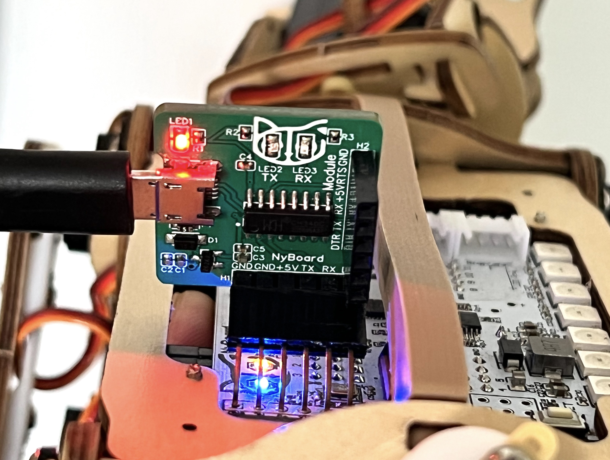

# USB Uploader (CH340C or CH343G)

The module is also called **USB Adapter**. It uses a CH340C USB bridge. Windows 10, Linux, and macOS are all drive-free. The specific interface is shown in the following figure:

**NyBoard download interface**: used to connect to NyBoard, download program firmware to the robot, and communicate with the computer via serial port.

**Communication module debugging interface**: used to connect the Bluetooth or WiFi module, update the module program and debug the parameters. In order to avoid the cumbersome operation when connecting with Dupont wires, the pin ordering is slightly different from the NyBoard download interface - the TX/RX interface is reversed, and a GND pin becomes an RTS pin. For details on how to use the debugging interface of the communication module, see the following chapters.


Do not plug in the NyBoard and the other module(WiFi or Bluetooth) at the same time! That will block the serial port.


<figure><figcaption></figcaption></figure>

## Connect NyBoard

 

Insert the 6-pin(H1) of the USB uploader to the NyBoard's uploader socket and then use the included USB data cable to insert one end into the MicroUSB interface of the USB upload module; the other end into the USB interface of the PC.

Right-click on "**This PC**" on the Windows desktop, and then click on "**Manage**" with the left mouse button (of course, you can also operate in the folder browser), as shown in the figure below, and then  select "**Device Manager**" in the "**Computer Management**" page to check the connected serial port:

 

Open the Arduino IDE, or the Desktop App Firmware Uploader interface, and select the corresponding COM port to upload the firmware for the NyBoard and use the serial monitor to communicate.

The uploader has three LEDs: power, Tx, and Rx. Right after the connection, the Tx and Rx should blink for one second indicating initial communication, then dim. Only the power indicator LED should keep lighting up. You can find a new port under **Tool->Port** as

* &#x20;“/dev/cu.usbserial-xxxxxxxx” (Mac)&#x20;
* “COM#” (Windows)
* “ttyUSB#**”**  (Linux)


For Linux, once the uploader is connected to your computer, you will see a “ttyUSB#**”** in the serial port list. But you may still get a serial port error when uploading. You will need to give the serial port permission. Please go to this link and follow the instructions: [https://playground.arduino.cc/Linux/All/#Permission](https://playground.arduino.cc/Linux/All/#Permission)


.png>)

If Tx and Rx keep lighting up, there’s something wrong with the USB communication. You won’t see the new port. It’s usually caused by overcurrent protection by your computer, if you’re not connecting NyBoard with an external power supply and the servos move all at once.&#x20;

### The Drivers

#### CH340

If you cannot find the serial port after connecting to your computer, you may need to install the driver for the CH340 chip.&#x20;

* Mac: [http://www.wch-ic.com/download/CH341SER\_MAC\_ZIP.html](http://www.wch-ic.com/download/CH341SER\_MAC\_ZIP.html)
* Windows: [http://www.wch-ic.com/downloads/CH341SER\_EXE.html](http://www.wch-ic.com/downloads/CH341SER\_EXE.html)
* Linux: [http://www.wch-ic.com/downloads/CH341SER\_LINUX\_ZIP.html](http://www.wch-ic.com/downloads/CH341SER\_LINUX\_ZIP.html)

#### CH343G (with two USB ports)

The CH343G version should install the driver automatically on most systems. However, if you are using the module on Mac to configure the ESP8266 module, please download the driver. It will be recognized as two USB devices (usbserial and usbmodem). You may try either one to connect.&#x20;




For ChromeOS:

1. &#x20;Download the Arduino IDE(e.g. 1.8.19) for Linux from [https://github.com/arduino/Arduino/releases/download/1.8.19/arduino-1.8.19.tar.xz](https://github.com/arduino/Arduino/releases/download/1.8.19/arduino-1.8.19.tar.xz)
2. &#x20;Install it on the Chromebook. Please refer to the video at [https://www.youtube.com/watch?v=2cve6n4LZqI](https://www.youtube.com/watch?v=2cve6n4LZqI)
3. &#x20;Plug the Bittle USB adapter into the robot and the Chromebook.
4. Set the Chromebook Linux VM to recognize the USB port

&#x20;      Settings => Advanced => Developers => Linux development environment => Manage USB devices => USB Serial (turn on)

NOTE: Step 4 must be repeated every time when the USB connection is reconnected/powered on.

