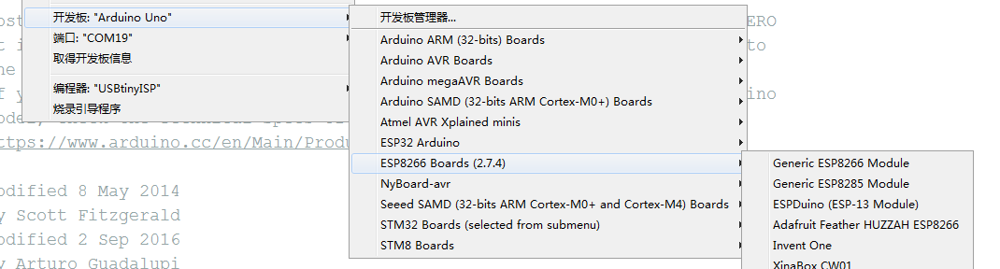
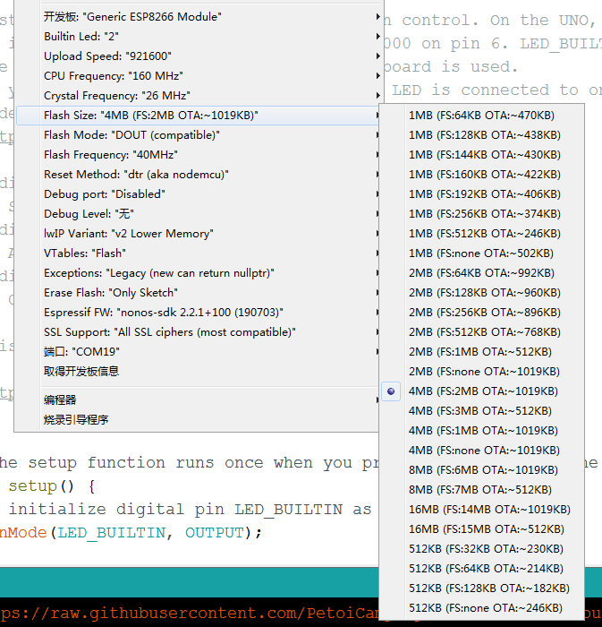
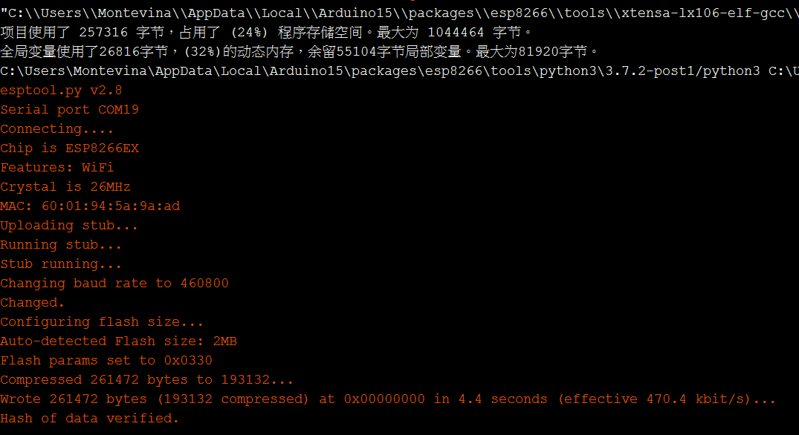
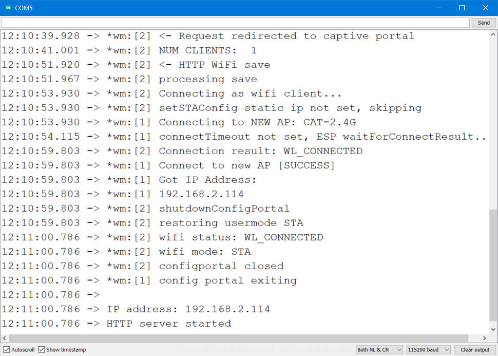

# WiFi ESP8266

### WiFi module ESP8266

### Introduction

This module uses the ESP8266EX's official model ESP-WROOM-02D, which has 4MB of QSPI Flash. It is certified by the FCC in the United States, CE-RED in Europe, TELEC in Japan, and KC in South Korea.

The module is fully opened. You can program it separately. This is not a simple, transparent transmission module.

### Module Functions

The module includes an automatic download circuit and a communication module. The automatic download circuit refers to the official recommendation to use 2 S8050 transistors to receive the RTS and DTR signals from the CH340C downloader and trigger the download sequence.

### Assembly

Connect to the NyBoard：

.jpeg>)

Update sketches through USB downloader：


## Development Environment Settings

We use the Arduino as the development environment.

### 2.1 Add ESP8266 source to the board manager

.png>)

.png>)

URL：[http://arduino.esp8266.com/stable/package\_esp8266com\_index.json](http://arduino.esp8266.com/stable/package\_esp8266com\_index.json). Paste it into the URL of the additional development board in the Arduino preferences.

Then open the "Board Manager" and enter ESP8266 or 8266 to search for the board support package:

.png>)

Download the package ESP8266 by ESP8266 Community.

### Configuration of the Module

After downloading the board support package, we select ESP8266 Board (current version: 2.74) -> Generic ESP8266 Module.



.png>)

Then we set the parameters：

| Parameters    | Settings                                                        |
| ------------- | --------------------------------------------------------------- |
| Builtin Led   | 2                                                               |
| Upload Speed  | 921600（Auto-negotiation during downloading, 115200 is too slow） |
| CPU Frequency | 160MHz                                                          |
| Flash Size    | 4MB                                                             |
| Reset Method  | DTR reset                                                       |
| lwIP variant  | V2 Lower memory                                                 |
| Erase Flash   | Only sketch                                                     |



### Download Test

After configuration, we used the Arduino classic "Blink" program to test the ESP8266 development board.&#x20;

Open the Blink project, configure the development board, plug the module into the communication module debugging interface of the USB downloader, and download the Blink example.&#x20;

Compared with the Arduino UNO, the compilation time is slightly longer. After Linking, the download progress will be displayed as a percentage:



The "Blink sketch" uses 257KB of flash and 26.8KB of the SRAM.&#x20;

## Download WiFi Firmware

Project URL：[https://github.com/PetoiCamp/OpenCat/tree/main/ModuleTests/ESP8266WiFiController](https://github.com/PetoiCamp/OpenCat/tree/main/ModuleTests/ESP8266WiFiController)

There're 3 files in the project:

* ESP8266WiFiController.ino: Arduino sketch with server core code.
* mainpage.h：welcome page (html) in a char array.
* actionpage.h：action controller page (html) in a char array.

Please put them in the folder named "ESP8266WiFiController",  then open the ino file and download it to the ESP8266 WiFi module.

## How to Use

After the sketch downloader to the WiFi module, we strongly recommend run it with your USB downloader so you can get the serial output in the Arduino serial monitor.

Open your smartphone WiFi scanner and find an access point named "Bittle-AP" that is not encrypted. Connect it.

<figure><figcaption><p>Mobile Phone</p></figcaption></figure>

.png>)


If your smartphone automatically optimizes your network connection,  it will cut the connection of "Bittle-AP" because there is no Internet connection. Your smartphone may connect to the WiFi with an Internet connection or even use your cellular data.


Your smartphone may auto jump to the "WiFiManager" page when connecting to "Bittle-AP".&#x20;

.png>)

If not, please open your browser and enter **192.168.4.1** to enter the WiFi connection configuration page manually.

.png>)

On the WiFiManager page, Bittle's wireless module will automatically search for all nearby WiFi SSIDs and display them. After you click on your own WiFi SSID and enter the password, Bittle will connect to this network first.

.png>)

After connecting to the WiFi successfully, Bittle will print out the IP address assigned by DHCP through the serial port. You can also configure a fixed IP address in Arduino.

<figure><figcaption></figcaption></figure>

Enter the WiFi module's IP address in the web browser, and you can now control the Bittle through WiFi! &#x20;

<figure><figcaption><p>Home page</p></figcaption></figure>

<figure><figcaption><p>Actions page</p></figcaption></figure>

<figure><figcaption><p>Calibration page</p></figcaption></figure>

## About the Sample Code&#x20;

The sample code is a simple web server example, including 2 HTML pages. The two pages are stored in two header files in the form of string constants. The advantage is to avoid calling the client. print function constantly.

### 3.1 Set Up the WiFi Networks

Before we start our web server, we should configure the WiFi to connect to your local area network(LAN). We used to enter the WiFi SSID and password in the program, but it is very inconvenient when we need to change the network environment.

We use the WiFi manager library to configure the WiFi information online.&#x20;

```
  // WiFiManager
  WiFiManager wifiManager;

  // Start WiFi manager, default gateway IP is 192.168.4.1
  wifiManager.autoConnect("Bittle-AP");
```

### 3.2 Web server

Create a new web server and configure port 80 (commonly used HTTP server port)

```
ESP8266WebServer server(80);
```

### 3.3 Configure 3 HTTP service handler

The HTTP response function is to handle the incoming HTTP requests.

```
void handleMainPage() {
 //Serial.println("GET /");
 server.send(200, "text/html", mainpage);
}
void handleActionPage() {
 //Serial.println("GET /actionpage");
 server.send(200, "text/html", actionpage);
}
```

The handleMainPage and handleActionPage response 200 (OK) and corresponding web HTML code for your web browser (client).

```
void handleAction(){
  String argname = server.arg("name");

  if(argname == "gyro"){              // gyro switch
    Serial.print("g");
  }
…
```

The HandleAction function is slightly different. This is an HTTP request processing function with parameter passing. When the parameter is "gyro," the WiFi module's serial port sends out the command ("g", switch IMU) so that our Bittle will execute the command.

So, how is this "gyro" parameter generated and passed? Because we sent such an HTTP request with a value to the server:

```
http：//IP address or DomainName/action?name=gyro
```

The server parses the action parameter by the function and resolves that the name is "gyro".

We can directly enter this URL in the browser and execute it with the keyboard. The more common method is to add a link to the "Walk" button on the ActionPage web page. When the gyro button is pressed, the above URL will be sent to the host.&#x20;

The complete walk button configuration is as follows:

```
<button style="width: 25%" onclick="location.href='/action?name=gyro'">GyroOn/Off</button>
```

We will send the action page again after parsing the "name" parameter.

```
server.send(200, "text/html", actionpage);
```

We bond the handler method with the corresponding URLs.

```
server.on("/", handleMainPage);
server.on("/actionpage", handleActionPage);
server.on("/action", handleAction);
```

### 3.4 Start the Web Server

```
server.begin();
Serial.println("HTTP server started");
```

### 3.5 Handle Client Requests

```
void loop(void){
 server.handleClient();
}
```

## More Ways Playing the WiFi Module

Compared to the ATMega328P on the NyBoard, the ESP8266 has more hardware and software resources, so you can do more experiments with it.&#x20;

Connect your Bittle to IoT platforms with HTTP restful APIs.&#x20;

MQTT and node-red.&#x20;

OTA with WiFi.&#x20;

Make ESP8266 a strong co-processor for NyBoard for motion data fusion.
