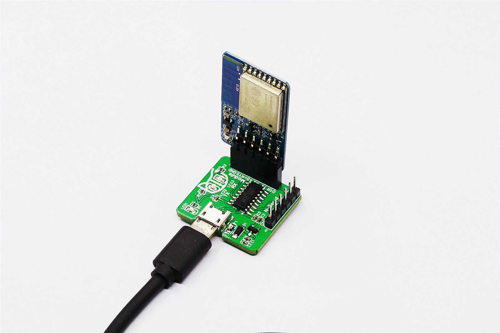
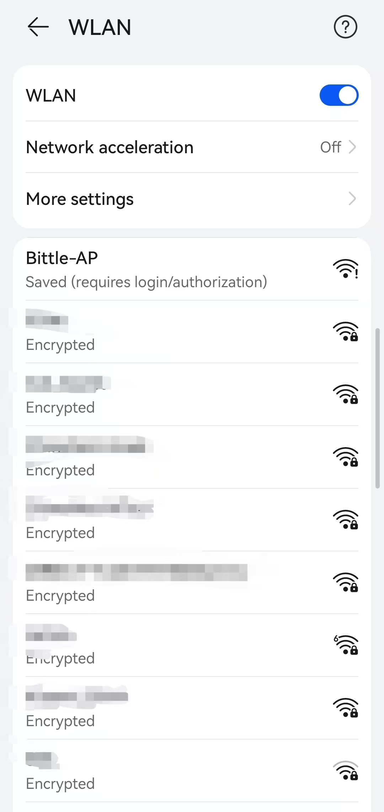
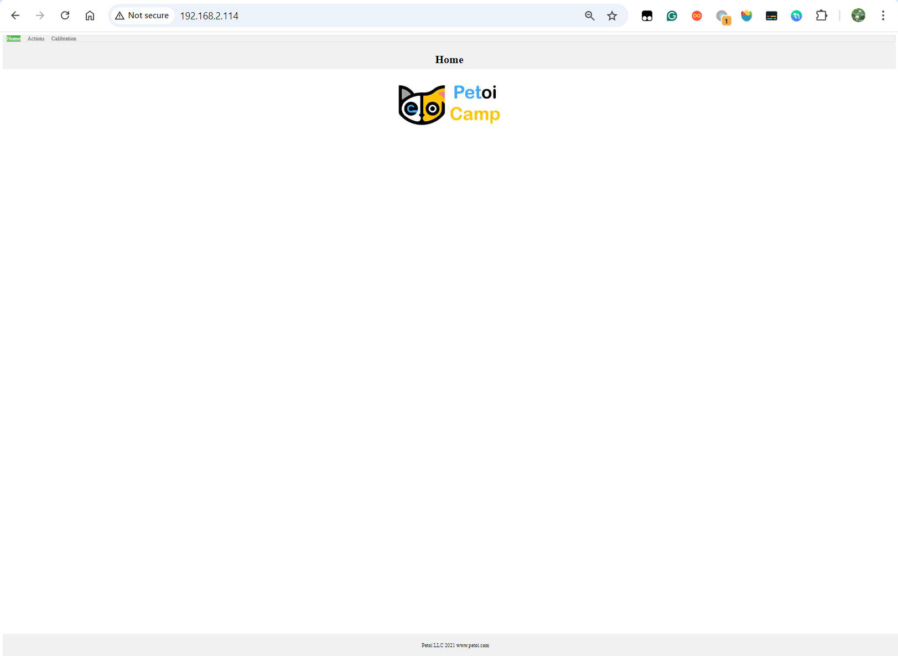
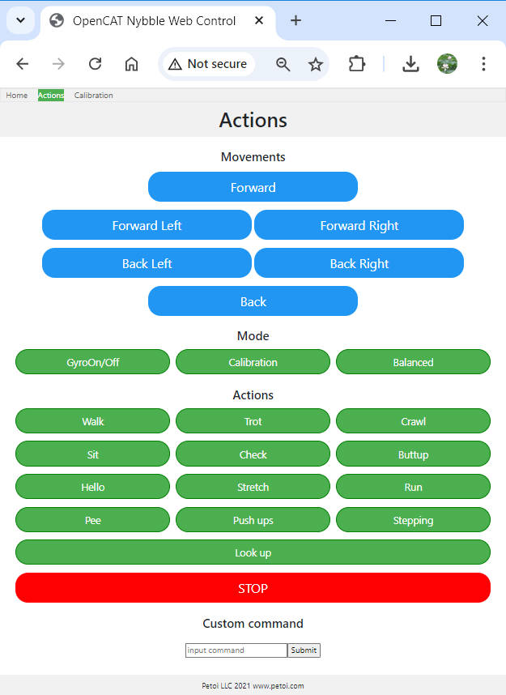
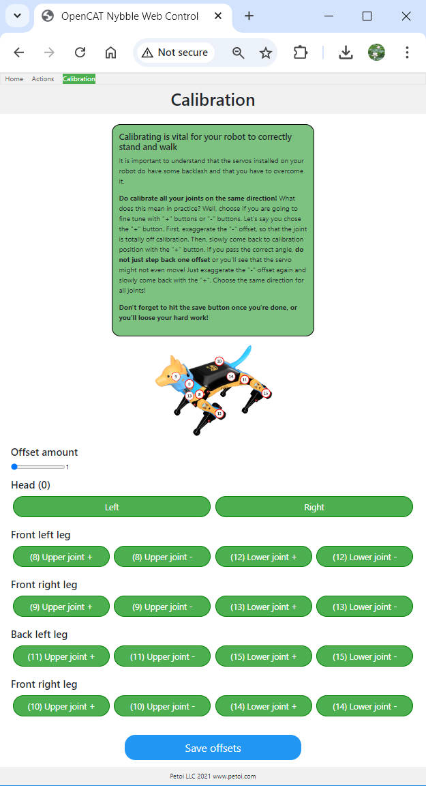

# WiFi module ESP8266

## Introduction

This module uses the ESP8266EX's official model ESP-WROOM-02D, which has 4MB of QSPI Flash. It is certified by the FCC in the United States, CE-RED in Europe, TELEC in Japan, and KC in South Korea.

The module is fully opened. You can program it separately. This is not a simple, transparent transmission module.

## Module Functions

The module includes an automatic upload circuit and a communication module. The automatic upload circuit recommends using 2 S8050 transistors to receive the RTS and DTR signals from the [USB uploader](../usb-downloader-ch340c.md) (CH340C or CH343G) and trigger the upload sequence.

## Assembly

Connect to the NyBoard：

.jpeg>)

Update sketches through USB uploader：



## Development Environment Settings

We use the Arduino IDE as the development environment.


You must download and install [Arduino IDE](https://www.arduino.cc/en/software) first.&#x20;


### 2.1 Add ESP8266 source to the board manager

<figure><figcaption></figcaption></figure>

<figure><figcaption></figcaption></figure>

<figure><figcaption></figcaption></figure>

URL：[http://arduino.esp8266.com/stable/package\_esp8266com\_index.json](http://arduino.esp8266.com/stable/package_esp8266com_index.json). Paste it into the Additional Boards Manager URLs in the Arduino IDE preferences.

Then open the **Board Manager** and input _ESP8266_ or _8266_ to search for the board support package:

<figure><figcaption></figcaption></figure>

<figure><figcaption></figcaption></figure>

Download the latest version of ESP8266 from ESP8266 Community.

### Configuration of the Module

After downloading the board support package, we select Board -> ESP8266 -> Generic ESP8266 Module.

<figure><figcaption></figcaption></figure>

Then we set the parameters：

| Parameters    | Settings                                                      |
| ------------- | ------------------------------------------------------------- |
| Builtin Led   | 2                                                             |
| Upload Speed  | 921600（Auto-negotiation during uploading, 115200 is too slow） |
| CPU Frequency | 160MHz                                                        |
| Flash Size    | 4MB                                                           |
| Reset Method  | DTR reset                                                     |
| lwIP variant  | V2 Lower memory                                               |
| Erase Flash   | Only sketch                                                   |

<figure><figcaption></figcaption></figure>

### Upload the test program.

After configuration, we used the Arduino classic "Blink" program to test the ESP8266 development board.&#x20;

Open the Blink project, configure the development board, plug the module into the communication module debugging interface of the USB uploader (USB Adapter), and upload the **Blink** sketch.&#x20;

<figure><figcaption></figcaption></figure>

<figure><figcaption></figcaption></figure>

Compared with the Arduino UNO, the compilation time is slightly longer. After Linking, the uploading progress will be displayed as follows:

````
```
. Variables and constants in RAM (global, static), used 28104 / 80192 bytes (35%)
║   SEGMENT  BYTES    DESCRIPTION
╠══ DATA     1496     initialized variables
╠══ RODATA   920      constants       
╚══ BSS      25688    zeroed variables
. Instruction RAM (IRAM_ATTR, ICACHE_RAM_ATTR), used 59667 / 65536 bytes (91%)
║   SEGMENT  BYTES    DESCRIPTION
╠══ ICACHE   32768    reserved space for flash instruction cache
╚══ IRAM     26899    code in IRAM    
. Code in flash (default, ICACHE_FLASH_ATTR), used 232148 / 1048576 bytes (22%)
║   SEGMENT  BYTES    DESCRIPTION
╚══ IROM     232148   code in flash   

"C:\Users\wjf-1\AppData\Local\Arduino15\packages\esp8266\tools\python3\3.7.2-post1/python3" -I "C:\Users\wjf-1\AppData\Local\Arduino15\packages\esp8266\hardware\esp8266\3.1.2/tools/upload.py" --chip esp8266 --port "COM51" --baud "921600" ""  --before default_reset --after hard_reset write_flash 0x0 "C:\Users\wjf-1\AppData\Local\arduino\sketches\E155A600E863F22636B5717F21F23873/Blink.ino.bin"
esptool.py v3.0
Serial port COM51
Connecting....
Chip is ESP8266EX
Features: WiFi
Crystal is 26MHz
MAC: e8:db:84:fc:63:f0
Uploading stub...
Running stub...
Stub running...
Changing baud rate to 460800
Changed.
Configuring flash size...
Auto-detected Flash size: 4MB
Compressed 265616 bytes to 195731...
Writing at 0x00000000... (8 %)
Writing at 0x00004000... (16 %)
Writing at 0x00008000... (25 %)
Writing at 0x0000c000... (33 %)
Writing at 0x00010000... (41 %)
Writing at 0x00014000... (50 %)
Writing at 0x00018000... (58 %)
Writing at 0x0001c000... (66 %)
Writing at 0x00020000... (75 %)
Writing at 0x00024000... (83 %)
Writing at 0x00028000... (91 %)
Writing at 0x0002c000... (100 %)
Wrote 265616 bytes (195731 compressed) at 0x00000000 in 4.4 seconds (effective 482.9 kbit/s)...
Hash of data verified.

Leaving...
Hard resetting via RTS pin...

```
````

## Upload the WiFi Firmware to the ESP8266 module.

Project URL：[https://github.com/PetoiCamp/OpenCat/tree/main/ModuleTests/ESP8266WiFiController](https://github.com/PetoiCamp/OpenCat/tree/main/ModuleTests/ESP8266WiFiController)

There are seven files in the project:

* ESP8266WiFiController.ino: Arduino sketch with server core code.
* mainpage.h： welcome page (HTML) in a char array.
* actionpage.h： action controller page (HTML) in a char array.
* actions.h
* actions.json
* calibrationpage.h
* commons.h

Please open the **ESP8266WiFiController.ino** in the Arduino IDE and install the library **WiFiManager** and **Dictionary** in the Library Manager:

<figure><figcaption></figcaption></figure>

<figure><figcaption></figcaption></figure>

<figure><figcaption></figcaption></figure>

Then, upload the sketch to the ESP8266 WiFi module.

<figure><figcaption></figcaption></figure>

## How to Use

After the sketch is uploaded to the WiFi module, we strongly recommend running it with your USB uploader (USB Adapter) so you can get the serial output in the serial monitor of Arduino IDE.

Open the serial monitor in Arduino IDE as follows. Then, unplug and re-plug the WiFi module into the USB uploader.

<figure><figcaption><p>Open the serial monitor</p></figcaption></figure>

<figure><figcaption></figcaption></figure>

Open your smartphone's WiFi scanner and find an unencrypted access point named "Bittle-AP." Connect it.

<figure><figcaption><p>Mobile Phone</p></figcaption></figure>

.png>)


If your smartphone automatically optimizes your network connection,  it will cut the connection of "Bittle-AP" because there is no Internet connection. Your smartphone may connect to the WiFi with an Internet connection or even use your cellular data. Please turn off your smartphone's network connection optimization function and force it to connect to the "**Bittle-AP**" hotspot.


Your smartphone may auto-jump to the "WiFiManager" page when connecting to "**Bittle-AP**."&#x20;

.png>)

If not, please open your browser and enter **192.168.4.1** to enter the WiFi connection configuration page manually.

.png>)

On the WiFiManager page, Please click the **Configure WiFi** button. The WiFi module will automatically search for and display all nearby WiFi SSIDs. After you click on your WiFi SSID and enter the password, the WiFi module will connect to this network first.

.png>)

After successfully connecting to the network, the WiFi module will print out the IP address assigned by DHCP through the serial port on the serial monitor.&#x20;

<figure><figcaption></figcaption></figure>

Enter the WiFi module's IP address in the web browser, and you can now control the Bittle through WiFi! &#x20;

<figure><figcaption><p>Home page</p></figcaption></figure>

<figure><figcaption><p>Actions page</p></figcaption></figure>

<figure><figcaption><p>Calibration page</p></figcaption></figure>

## About the Sample Code&#x20;

The sample code is a simple web server example, including 2 HTML pages. The two pages are stored in two header files in the form of string constants. The advantage is to avoid calling the client. print function constantly.

### 3.1 Set Up the WiFi Networks

Before we start our web server, we should configure the WiFi to connect to your local area network(LAN). We used to enter the WiFi SSID and password in the program, but it is very inconvenient when we need to change the network environment.

We use the WiFi manager library to configure the WiFi information online.&#x20;

```
  // WiFiManager
  WiFiManager wifiManager;

  // Start WiFi manager, default gateway IP is 192.168.4.1
  wifiManager.autoConnect("Bittle-AP");
```

### 3.2 Web server

Create a new web server and configure port 80 (commonly used HTTP server port)

```
ESP8266WebServer server(80);
```

### 3.3 Configure 3 HTTP service handler

The HTTP response function is to handle the incoming HTTP requests.

```
void handleMainPage() {
 //Serial.println("GET /");
 server.send(200, "text/html", mainpage);
}
void handleActionPage() {
 //Serial.println("GET /actionpage");
 server.send(200, "text/html", actionpage);
}
```

The handleMainPage and handleActionPage response 200 (OK) and corresponding web HTML code for your web browser (client).

```
void handleAction(){
  String argname = server.arg("name");

  if(argname == "gyro"){              // gyro switch
    Serial.print("g");
  }
…
```

The HandleAction function is slightly different. This is an HTTP request processing function with parameter passing. When the parameter is "gyro," the WiFi module's serial port sends out the command ("g", switch IMU) so that our Bittle will execute the command.

So, how is this "gyro" parameter generated and passed? Because we sent such an HTTP request with a value to the server:

```
http：//IP address or DomainName/action?name=gyro
```

The server parses the action parameter by the function and resolves that the name is "gyro".

We can directly enter this URL in the browser and execute it with the keyboard. The more common method is to add a link to the "Walk" button on the ActionPage web page. When the gyro button is pressed, the above URL will be sent to the host.&#x20;

The complete walk button configuration is as follows:

```
<button style="width: 25%" onclick="location.href='/action?name=gyro'">GyroOn/Off</button>
```

We will send the action page again after parsing the "name" parameter.

```
server.send(200, "text/html", actionpage);
```

We bond the handler method with the corresponding URLs.

```
server.on("/", handleMainPage);
server.on("/actionpage", handleActionPage);
server.on("/action", handleAction);
```

### 3.4 Start the Web Server

```
server.begin();
Serial.println("HTTP server started");
```

### 3.5 Handle Client Requests

```
void loop(void){
 server.handleClient();
}
```

## More Ways Playing the WiFi Module

Compared to the ATMega328P on the NyBoard, the ESP8266 has more hardware and software resources, so you can do more experiments with it.&#x20;

Connect your Bittle to IoT platforms with HTTP restful APIs.&#x20;

MQTT and node-red.&#x20;

OTA with WiFi.&#x20;

Make ESP8266 a strong co-processor for NyBoard for motion data fusion.
