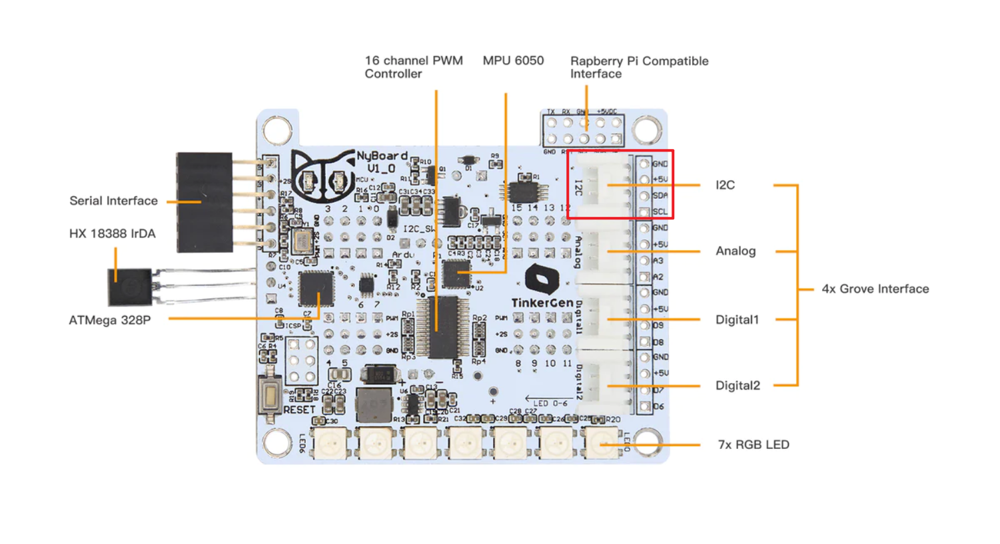
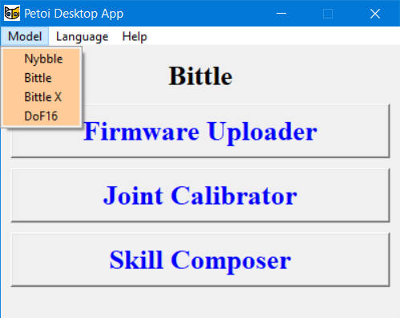
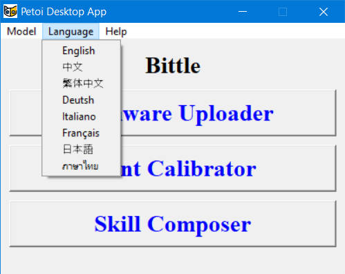
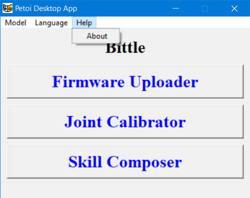
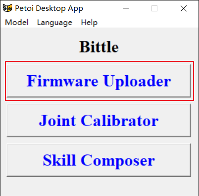
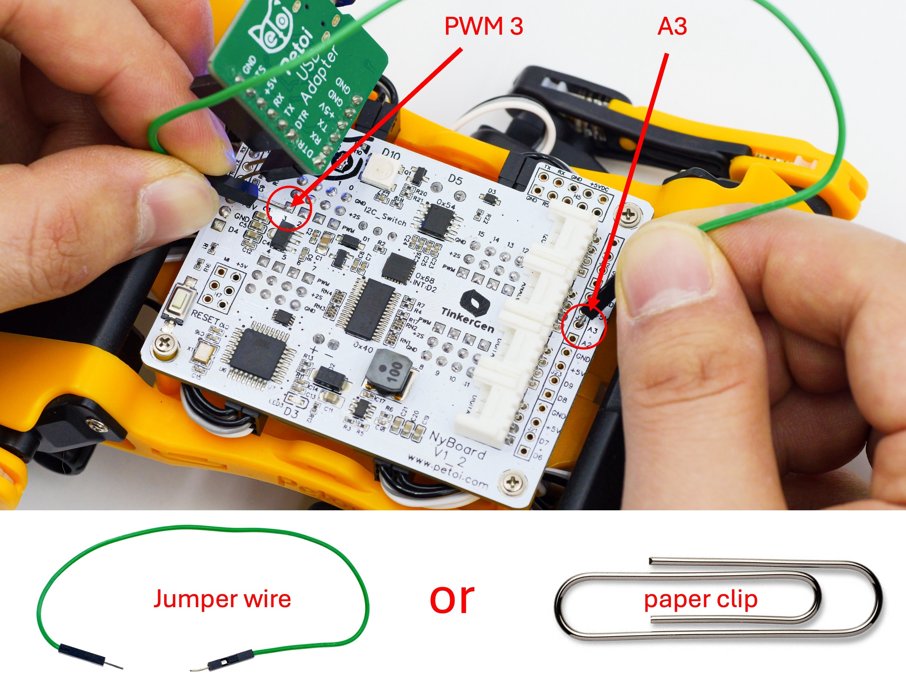

# Firmware Uploader

## \*\* Download the latest version of the [Petoi Desktop APP](https://github.com/PetoiCamp/OpenCat/releases). \*\*


* After downloading the compressed file(.zip), please unzip it first.
* Do **NOT** move the UI.exe to another location in Windows.


Petoi Desktop App works on both Nybble and Bittle controlled by NyBoard based on ATmega328P or Bittle X controlled by [BiBoard](https://docs.petoi.com/biboard/biboard-v0) based on ESP32. For NyBoard, more detailed documentation can be found at NyBoard V1\_0, NyBoard V1\_1, or NyBoard V1\_2 (which _is similar to NyBoard V1\_1)_.

## Connect the mainboard to the computer

### **NyBoard(for Bittle & Nybble)**

Use the [**USB uploader for NyBoard**](../upload-firmware.md#nyboard)**.**

For more details, please refer to the [Connect NyBoard](https://docs.petoi.com/communication-modules/usb-downloader-ch340c#connect-nyboard) section in the USB uploader module for specific steps.

<figure><figcaption>
NyBoard
</figcaption></figure>

#### NyBoard Version

You can find the board version number on the NyBoard.


Note:&#x20;

For **NyBoard V1\_1**, the board version number is here:

.jpg>)\

Dial the I2C switch(Sw2) to the "**Arduino**" side

The I2C switch changes the master of I2C devices (gyro/accelerometer, servo driver, external EEPROM). On default “Arduino”, NyBoard uses the onboard ATmega328P as the master chip; On “RPi”, NyBoard uses external chips connected through the I2C ports (SDA, SCL) as the master chip. Always select "Arduino" unless you can connect the I2C devices from the external chip.&#x20;



Notes：

* Sometimes, if you cannot go through the bootup stage, such as repetitively printing "IMU" and restarting, you may have accidentally dialed the switch to the "RPi" side.&#x20;
* Before uploading the firmware, please ensure that no I2C device is connected to the I2C interface of the mainboard. Otherwise, the firmware upload will fail. The location of the I2C interface is as shown below (in the red box): 


### **BiBoard(for Bittle X)**

Use the [**USB type-C data cable for BiBoard**](../upload-firmware.md#biboard)**.**


If you cannot find the serial port after connecting to your computer:

* You may need to install [the driver](https://docs.petoi.com/technical-support/useful-tools#biboard-driver-to-access-the-serial-port) for the CP210x chip for BiBoard V0.&#x20;
* You may need to install [the driver](../technical-support/useful-tools.md#biboard-v1-usb-driver-to-access-the-serial-port) for the CH343 chip for BiBoard V1.&#x20;
* If the battery powers the BiBoard, please long-press the button on the battery >=3s to power off the mainboard so that the board is only powered through the USB cable and only the blue LED is lit up.&#x20;


#### BiBoard V0

<figure><figcaption></figcaption></figure>

You can find the board version number on the BiBoard V0:

<figure><figcaption></figcaption></figure>


On the pre-assembled Bittle X, you can check the version information of BiBoard like this by taking a picture and zooming in to see the version information:



#### BiBoard V1

<figure><figcaption></figcaption></figure>

## Upload the firmware using the Petoi Desktop app.

### Download the latest version of the [Petoi Desktop APP](https://github.com/PetoiCamp/OpenCat/releases).&#x20;


There may be some OS platform compatibility issues with different computers.

You can still run the app directly from your terminal:

1. Go to OpenCat/pyUI/ in your terminal.
2. Install _**pyserial**_ and _**pillow**_ for your Python. You may get a clean Anaconda environment and `pip3 install pyserial pillow`
3. Run `python3 UI.py`

For **NyBoard**, the firmware uploader calls the application **avrdude** to upload firmware files to the mainboard.&#x20;

**Linux OS**

For Linux system users, in addition to the above steps, you also need to perform the following steps:

1\. Install **avrdude**&#x20;

* Fedora: dnf install avrdude
* CentOS: yum install avrdude
* Debian / Ubuntu: apt install avrdude

2\. Modify the variable **avrdudeconfPath** in FirmwareUploader.py

* Fedora / CentOS : `avrdudeconfPath = '/etc/avrdude/'`
* Debian / Ubuntu : `avrdudeconfPath = '/etc/'`

For **BiBoard**, the firmware uploader calls the application **esptool** to upload firmware files to the mainboard.&#x20;


### Open the PetoiDesktopApp

**After** properly connecting the USB uploader, open the PetoiDesktopApp (for Windows: UI.exe / for Mac: Petoi Desktop App), and select your **Model** and **Language**.

#### Menu bar in Petoi Desktop APP

  

### Click the Firmware Uploader button

### Auto Detect the Serial Port&#x20;

If there is **no** serial port or **more than one** serial port are detected by the desktop app:

<figure><figcaption></figcaption></figure>

After clicking the **Firmware Uploader** button,  there will be a message box prompt as follows:

<figure><figcaption></figcaption></figure>

Please follow the prompts in the message box. \
After clicking the **Confirm** button, If you complete the prompts within 10 seconds, the desktop app will automatically identify the serial port name connecting the robot to the computer.\
If you complete the operation of unplugging and plugging the USB interface on the computer for more than 10 seconds, the desktop application will enter the manual selection of the serial port name mode：

<figure><figcaption></figcaption></figure>

Click the **OK** button in the Warning message box first, then you can refresh the serial port list or select one of them (e.g. **COM3**) and click the **OK** button in the **Manual mode** window to open the Firmware Uploader interface as follows:

<figure><figcaption>
<strong>Firmware Uploader interface</strong>
</figcaption></figure>

Once the Firmware Uploader interface is opened, you can also unplug and replug the USB cable from the COMPUTER side. The desktop app will automatically identify the serial port name connecting the robot to the computer.

<figure><figcaption></figcaption></figure>

If unplug the **COM5** and replug it on the computer side, it will be discovered by the desktop app as follows:

<figure><figcaption></figcaption></figure>

<figure><figcaption></figcaption></figure>

<figure><figcaption></figcaption></figure>

### Select the correct options to upload the latest firmware.&#x20;


The 1.0 software won't work properly with the Joint Calibrator, the Skill Composer, and other APIs. Only use it when you want to use CodeCraft (a graphical coding interface by our partner, TinkerGen).&#x20;


<table><thead><tr><th width="176">Options</th><th width="293">Values</th><th>Note</th></tr></thead><tbody><tr><td>Software version</td><td>
1.0

2.0 (default)
</td><td>The 1.0 version is obsolete.</td></tr><tr><td>Board version</td><td>
NyBoard_V1_0 (default<em>)</em> NyBoard_V1_1 NyBoard_V1_2 BiBoard_V0_1

BiBoard_V0_2 BiBoard_V1_0
</td><td>BiBoard_V0_1 or BiBoard_V0_2  is for Bittle X.   BiBoard_V1_0 is for Bittle X V2 only.</td></tr><tr><td>Product</td><td>Bittle (default) Nybble Bittle X</td><td></td></tr><tr><td>Mode</td><td>Standard (default) RandomMind  Voice Mind+ Camera  Ultrasonic  RandomMind_Ultrasonic Light Touch PIR Gesture IR distance</td><td>
For NyBoard, these 12 modes can be selected. All of these modes are applicable to both <strong>Bittle</strong> and <strong>Nybble</strong>.

For <strong>BiBoard</strong>, You only need to upload the <strong>Standard</strong> mode firmware, and you can switch between different modes via serial port commands. [1]
</td></tr><tr><td>Serial port</td><td>Auto detection or by manual selection. </td><td>You can find the correct one through unplug and replug the USB socket on the computer side</td></tr></tbody></table>


1. You can use the serial commands to [switch modes](../arduino-ide/upload-sketch-for-biboard.md#id-2.8-swith-mode-via-the-serial-commands) for **BiBoard**:\
   For **BiBoard,** Mind+ mode is supported by default, so it doesn't require a serial command to switch on.\
   You can learn about the function of each module through the [**EXTENSIBLE MODULES**](https://docs.petoi.com/extensible-modules/introduction).



There's no correlation between the board (hardware) version and the code (software) version.


#### Uploading options

* **Factory Reset**\
  Our factory uses it to improve efficiency. However, it automatically resets all the parameters, including the calibration parameters of the servos and the IMU, so it's not recommended for regular users.&#x20;
* **Upgrade the Firmware**\
  It will upgrade both the parameters and the main function.
  * It is mandatory if you just downloaded a new version of this desktop app.
* **Update the Mode Only**\
  If you have **upgraded the firmware** at least once after downloading a new version of this desktop app, you can switch between the modes without refreshing the parameters. It's faster by skipping the firmware upgrade stage.&#x20;

#### **Upgrade the firmware** process for NyBoard

After clicking the **Upgrade the Firmware** button, the uploading process starts immediately. The status bar at the bottom shows the current progress in real time and the results of key processes.

After the **Parameters** firmware has been successfully uploaded, the board runs the configuration program. Some message windows will pop up in sequence for you to confirm or cancel:

*   Reset joint offsets? (Y/N)\

    <figure><figcaption></figcaption></figure>

Select "Yes, " and the program will reset all servo calibration parameters to zero. The status bar will update the corresponding process and result in real time.

Select "No" to preserve the calibration value(so that you don't need to calibrate again if you have done so before). &#x20;


For software version **1.0**, there is a warning message window of "Update Instincts? (Y/N)"   will pop up as follows:\
.png>)

If you select "Yes," the program will upload all skill configuration parameters, and the status bar will update the corresponding process and result in real-time.

Select "No," and the program will skip this step.

If you upload this version of the software for the first time,  be sure to select "Yes"!

For software version **2.0**, this choice is automatically processed as Y in the background.&#x20;


*   Calibrate IMU? (Y/N)\

    <figure><figcaption></figcaption></figure>

Select "Yes, " and the program will calibrate the gyroscope (IMU) to balance the robot correctly. The status bar will update the corresponding process and result in real time.

Select "No," and the program will skip this step.


Note:&#x20;

1. &#x20;Ensure the mainboard is positioned horizontally before clicking the "Yes" button.&#x20;
2. &#x20;When uploading this firmware version for the first time, click the "Yes" button!&#x20;


When all the steps are completed, a message window will appear showing "Parameter initialization complete!" You must confirm to proceed to the second round of uploading the main functional code.&#x20;

<figure><figcaption></figcaption></figure>


### Calibrate the servo controller chip PCA9685 on the NyBoard.

When the above window pops up, there's an optional step to calibrate the servo driver before clicking OK. If later you find one of the servos stops working but can resume working after re-powering it, it's probably due to an inaccurate PWM driver signal. Please redo the previous uploading, and this step **CANNOT** be skipped.&#x20;

This calibration makes the servo controller's (PCA9685 chip) angle signal more precise. A short jumper wire is used to connect the PWM pin 3 (the signal pin of one of the servo pins) and Grove pin A3, and the wire is steady. It doesn’t have to be a dedicated jumper wire. Any thin metal wire, such as a straightened paper clip, can work as long as it can connect the pins.

The program measures the pulse width of the signal and automatically calibrates the chip after successively getting three identical readings. It usually takes less than 2 seconds. The board will beep three times to indicate the calibration is done. The calibration offset will be saved to the board for the next bootup. The process should be done at least once, and we have calibrated every board after October 2022. But you can still do it by yourself, just in case.&#x20;


### Finish uploading the firmware

After the upload, the status bar will update the corresponding result, such as the success or failure of firmware uploading. If the uploading is successful, a message window of "Firmware upload complete!" will pop up simultaneously.

<figure><figcaption></figcaption></figure>


Note:&#x20;

1. When you open the software and upload the firmware for the first time, the program will first upload the "**Parameters**" firmware and then the "**Main function**" firmware. If you re-upload after a successful upload, the program will only upload the "**Main function**" firmware as long as you only modify the "**Mode**" option.
2. If the NyBoard is not connected to the battery and powered on, you will hear repetitive descending melodies, indicating that the battery is low or disconnected. You need to connect the battery and turn on its power.&#x20;


### Check the log file

If the uploading fails, the following message box will pop up:

<figure><figcaption></figcaption></figure>

The log file is located at:

*   For Windows: \
    The log file is in the same directory as **UI.exe**\

    <figure><figcaption></figcaption></figure>
*   For macOS:\
    You can check the log file as follows:\

    <figure><figcaption></figcaption></figure>

    <figure><figcaption></figcaption></figure>

When you contact our **support@petoi.com**, please attach the log file to your email.&#x20;


If you have Arduino IDE programming experience, you can see the same log message when uploading.

* For NyBoard, you can refer to [Upload Sketch For NyBoard](https://docs.petoi.com/arduino-ide/upload-sketch-for-nyboard).
* For BiBoard, you can refer to [Upload Sketch For BiBoard](https://docs.petoi.com/arduino-ide/upload-sketch-for-biboard).

