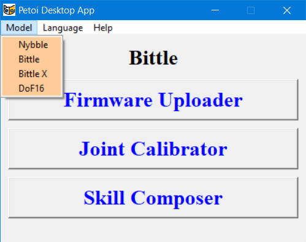
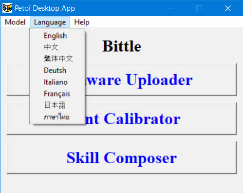
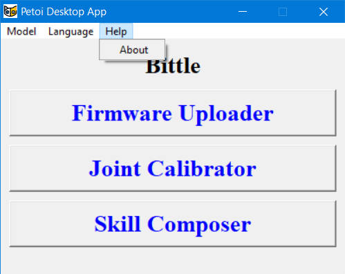

# Firmware Uploader

## \*\* Download the latest version of the [Petoi Desktop APP](https://github.com/PetoiCamp/DesktopAppRelease/releases). \*\*


* After downloading the compressed file(.zip), please unzip it first.
* Do **NOT** move the UI.exe to another location in Windows.


Petoi Desktop App works on both Nybble and Bittle controlled by NyBoard based on ATmega328P or Bittle X controlled by [BiBoard](https://docs.petoi.com/biboard/biboard-v0) based on ESP32.


For [**NyBoard**](https://docs.petoi.com/nyboard/overview), more detailed documentation can be found at [NyBoard V1\_0](https://docs.petoi.com/nyboard/nyboard-v1_0), [NyBoard V1\_1, or NyBoard V1\_2](https://docs.petoi.com/nyboard/nyboard-v1_1-and-nyboard-v1_2) (which _is similar to NyBoard V1\_1)_.


## Connect the mainboard to the computer

You can connect the computer to the mainboard using a USB cable, following the instructions on the subsequent sub-pages, which are specific to the robot's mainboard model. To see the sub-pages as in the following picture:

<figure><figcaption></figcaption></figure>

## Upload the firmware using the Petoi Desktop app

### Open the PetoiDesktopApp

**After** properly connecting the USB uploader, open the PetoiDesktopApp (for Windows: UI.exe / for Mac: Petoi Desktop App), and select your **Model** and **Language**.

#### Menu bar in Petoi Desktop APP

  

### Click the Firmware Uploader button

### Auto Detect the Serial Port&#x20;

If there is **no** serial port or **more than one** serial port are detected by the desktop app:

<figure><figcaption></figcaption></figure>

After clicking the **Firmware Uploader** button,  there will be a message box prompt as follows:

<figure><figcaption></figcaption></figure>

Please follow the prompts in the message box. \
After clicking the **Confirm** button, If you complete the prompts within 10 seconds, the desktop app will automatically identify the serial port name connecting the robot to the computer.\
If you complete the operation of unplugging and plugging the USB interface on the computer for more than 10 seconds, the desktop application will enter the manual selection of the serial port name mode：

<figure><figcaption></figcaption></figure>

Click the **OK** button in the Warning message box first, then you can refresh the serial port list or select one of them (e.g. **COM3**) and click the **OK** button in the **Manual mode** window to open the Firmware Uploader interface as follows:

<figure><figcaption>
<strong>Firmware Uploader interface</strong>
</figcaption></figure>

Once the Firmware Uploader interface is opened, you can also unplug and replug the USB cable from the COMPUTER side. The desktop app will automatically identify the serial port name connecting the robot to the computer.

<figure><figcaption></figcaption></figure>

If unplug the **COM5** and replug it on the computer side, it will be discovered by the desktop app as follows:

<figure><figcaption></figcaption></figure>

<figure><figcaption></figcaption></figure>

<figure><figcaption></figcaption></figure>

### Select the correct options to upload the latest firmware.&#x20;


The 1.0 software won't work properly with the Joint Calibrator, the Skill Composer, and other APIs. Only use it when you want to use CodeCraft (a graphical coding interface by our partner, TinkerGen).&#x20;


<table><thead><tr><th width="176">Options</th><th width="293">Values</th><th>Note</th></tr></thead><tbody><tr><td>Software version</td><td>
1.0

2.0 (default)
</td><td>The 1.0 version is obsolete.</td></tr><tr><td>Board version</td><td>
NyBoard_V1_0 (default<em>)</em> NyBoard_V1_1 NyBoard_V1_2 BiBoard_V0_1

BiBoard_V0_2 BiBoard_V1_0
</td><td>BiBoard_V0_1 or BiBoard_V0_2  is for Bittle X.   BiBoard_V1_0 is for Bittle X V2 only.</td></tr><tr><td>Product</td><td>Bittle (default) Nybble Bittle X</td><td></td></tr><tr><td>Mode</td><td>Standard (default) RandomMind  Voice Mind+ Camera  Ultrasonic  RandomMind_Ultrasonic Light Touch PIR Gesture IR distance</td><td>
For NyBoard, these 12 modes can be selected. All of these modes apply to both <strong>Bittle</strong> and <strong>Nybble</strong>.

For <strong>BiBoard</strong>, You only need to upload the <strong>Standard</strong> mode firmware, and you can switch between different modes via serial port commands. [1]
</td></tr><tr><td>Serial port</td><td>Auto detection or by manual selection. </td><td>You can find the correct one through unplug and replug the USB socket on the computer side</td></tr></tbody></table>


1. You can use the serial commands to [switch modes](../../arduino-ide/upload-sketch-for-biboard.md#id-2.8-swith-mode-via-the-serial-commands) for **BiBoard**:\
   For **BiBoard,** Mind+ mode is supported by default, so it doesn't require a serial command to switch on.\
   You can learn about the function of each module through the [**EXTENSIBLE MODULES**](https://docs.petoi.com/extensible-modules/introduction).



There's no correlation between the board (hardware) version and the code (software) version.


### Finish uploading the firmware

After the upload, the status bar will update the corresponding result, such as the success or failure of firmware uploading. If the uploading is successful, a message window of "Firmware upload complete!" will pop up simultaneously.

<figure><figcaption></figcaption></figure>


Note:&#x20;

1. For NyBoard, when you open the software and upload the firmware for the first time, the program will first upload the "**Parameters**" firmware and then the "**Main function**" firmware.&#x20;
2. After uploding the firmware, if the NyBoard or BiBoard V1 is not connected to the battery and powered on, you will hear repetitive descending melodies, indicating that the battery is low or disconnected. You need to connect the battery and turn on its power.&#x20;


### Check the log file

If the uploading fails, the following message box will pop up:

<figure><figcaption></figcaption></figure>

The log file is located at:

*   For Windows: \
    The log file is in the same directory as **UI.exe** 

    <figure><figcaption></figcaption></figure>
*   For macOS:\
    You can check the log file as follows: 

    <figure><figcaption></figcaption></figure>

    <figure><figcaption></figcaption></figure>

When you contact our **support@petoi.com**, please attach the log file to your email.&#x20;


There may be some OS platform compatibility issues with different computers.

You can still run the app directly from your terminal:

1. Go to OpenCat/pyUI/ in your terminal.
2. Install _**pyserial**_ and _**pillow**_ for your Python. You may get a clean Anaconda environment and `pip3 install pyserial pillow`
3. Run `python3 UI.py`

For **NyBoard**, the firmware uploader calls the application **avrdude** to upload firmware files to the mainboard.&#x20;

**Linux OS**

For Linux system users, in addition to the above steps, you also need to perform the following steps:

1\. Install **avrdude**&#x20;

* Fedora: dnf install avrdude
* CentOS: yum install avrdude
* Debian / Ubuntu: apt install avrdude

2\. Modify the variable **avrdudeconfPath** in FirmwareUploader.py

* Fedora / CentOS : `avrdudeconfPath = '/etc/avrdude/'`
* Debian / Ubuntu : `avrdudeconfPath = '/etc/'`

For **BiBoard**, the firmware uploader calls the application **esptool** to upload firmware files to the mainboard.&#x20;



If you have Arduino IDE programming experience, you can see the same log message when uploading.

* For NyBoard, you can refer to [Upload Sketch For NyBoard](https://docs.petoi.com/arduino-ide/upload-sketch-for-nyboard).
* For BiBoard, you can refer to [Upload Sketch For BiBoard](https://docs.petoi.com/arduino-ide/upload-sketch-for-biboard).

