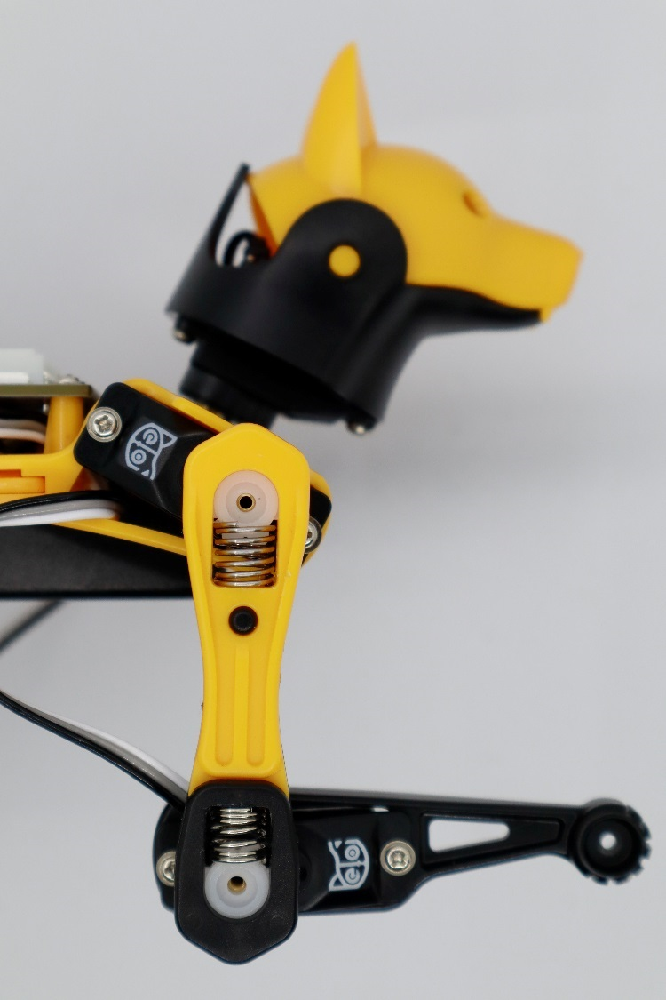

# Joint Calibrator

### \*\* Download the latest version of the [Petoi Desktop APP](https://github.com/PetoiCamp/OpenCat/releases). \*\*


* After downloading the compressed file(.zip), please unzip it first.
* Do **NOT** move the UI.exe to another location in Windows.


## Prepare for calibration


Make sure you have uploaded the OpenCat [**Main function**](https://docs.petoi.com/desktop-app/firmware-uploader#uploading-process) firmware before calibrating. Only the software version 2.0 can calibrate the joints via this App.


You need to connect the [**USB adapter**](https://docs.petoi.com/communication-modules/usb-downloader-ch340c#connect-nyboard) and USB data cable or [**Bluetooth module**](https://docs.petoi.com/communication-modules/dual-mode-bluetooth#connection-with-nyboard) (for NyBoard only ) to the computer, install the battery and long-press the button on the battery to power the robot.

## Enter the calibration state

&#x20;After the robot is powered on, there are 2 methods to enter the calibration state:

*   It will enter the calibration state automatically when you click the **Joint Calibrator** button.\

    <figure><figcaption></figcaption></figure>
*   Click the **Calibrate** button in the calibrator interface.\

    <figure><figcaption></figcaption></figure>

#### The Joint Calibrator interface


Note: Since Nybble uses two more servos (head and tail) than Bittle, the joint index numbers of Nybble and Bittle servos are different, and the calibration poses of Nybble and Bittle after entering the calibration state are also different, as shown in the following picture( The servo slider is not available in the light yellow background area in the interface):


#### Nybble

.png>)

#### Bittle

.png>)

### Install the head


You need to install the battery and long-press the button on the battery to power the robot before installation.


In the calibration state, place the head as close to the central axis as possible and insert its servo shaft into the servo arm of the neck.

<figure><figcaption></figcaption></figure>

Press down on the head so it is firmly attached to the neck.

<figure><figcaption></figcaption></figure>

### Install the legs&#x20;

Install upper leg and lower leg components to the output teeth of the servos after the Bittle is powered on and in the calibrated neutral position. Please keep the torso, upper leg, and lower leg installed vertically as much as possible, and do not install the lower leg backward, as shown in the picture.&#x20;

<figure><figcaption></figcaption></figure>


The pre-assembled robot should already have the legs properly installed. You can do the joint calibration for fine-tuning.&#x20;


Use the included L-shaped tool as a reference during calibration. According to the index numbers of the joints shown at the top of the interface (when calibrating the servos, adjust the upper leg first, then adjust the lower leg). Drag the corresponding slider (below the index number), or click the blank part of the slider track to fine-tune the joint to right angles.

#### Nybble

.jpg>)

#### Bittle


If the offset is more than +/- 9 degrees, you need to remove the corresponding leg and re-install it by rotating one tooth, and then drag the corresponding slider. For example, when it is adjusted to +9 and is still not right, remove the corresponding leg and shift one tooth when attaching it. Then you should get a smaller offset in the opposite direction.&#x20;


You can switch between  "**Rest**", "**Stand up**" and "**Walk**" to test the calibration effect.&#x20;

If you want to continue calibrating, please click the **Calibration** button, and the robot will be in the calibration state again (all servos will move to the calibration position immediately).&#x20;

 .png>)


Note:&#x20;

You may need a second round of calibrations to achieve optimal results.


After calibration, remember to click the "**Save**" button to save the calibration offset. Otherwise, click the "**Abort**" button to abandon the calibration data. You can save the calibration in the middle in case your connection is interrupted.&#x20;


When you close this window, there is a message box shown below:

.png>)

If you want to save the calibration data, please click the "**Yes**" button; otherwise, click the "**No**" button. Click the "**Cancel**" button to cancel to quit.


### Install the screws

After completing the joint calibration, install the center screws to fix the leg parts and servo gears.
