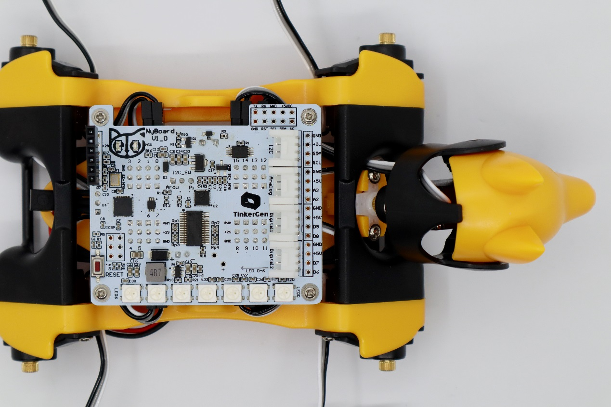

# Bittle / Bittle X

The subpages mention the joint calibration interface for Bittle / Bittle X in the Petoi Desktop App.

## Installation for the construction kit

After entering the calibration state, with all servos rotated to their zero angles, attach the head, and legs prepared in the previous section to the body. They are generally perpendicular to their linked body frames. The calibration pose is shown below:

<figure><figcaption>
Bittle's Calibration State
</figcaption></figure>

Install the servo-related components according to the picture above and try to ensure that they are perpendicular to each other (the upper leg is perpendicular to the torso, and the lower leg is perpendicular to the upper leg).

### Install the head

In the calibration state, place the head as close to the central axis as possible and insert its servo shaft into the servo arm of the neck.

<figure><figcaption></figcaption></figure>

Press down on the head so it is firmly attached to the neck.

<figure><figcaption></figcaption></figure>

### Install the legs&#x20;

Install upper leg and lower leg components to the output teeth of the servos after the Bittle is powered on and in the calibrated neutral position. Please keep the torso, upper leg, and lower leg installed vertically as much as possible, and do not install the lower leg backward, as shown in the picture.&#x20;

<figure><figcaption></figcaption></figure>

## Fine-tuning


The **pre-assembled** robot should already have the components adequately installed. You can do the joint calibration for fine-tuning.&#x20;


Use the included L-shaped tool as a reference during calibration. According to the index numbers of the joints shown at the top of the interface (when calibrating the servos, adjust the upper leg first, then adjust the lower leg). Drag the corresponding slider (below the index number), or click the blank part of the slider track to fine-tune the joint to right angles.


If the offset is more than +/-9 degrees, you need to remove the corresponding leg and reinstall it by rotating one tooth and then dragging the corresponding slider. For example, when it is adjusted to +9 and still not right, remove the corresponding leg and shift one tooth when attaching it. Then, you should get a smaller offset in the opposite direction.&#x20;

