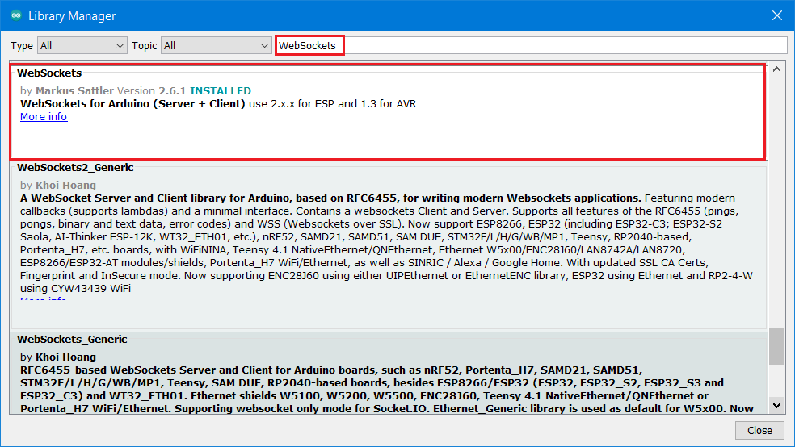

# Grove Vision AI V2

## Function introduction

Grove Vision AI V2 is based on the Arm Cortex-M55 and Ethos-U55 embedded vision module. The Ethos-U55 has 64 to 512 GOP/s of arithmetic power to meet the growing demand for downloading machine learning.

<figure><figcaption></figcaption></figure>

## BiBoard 

### Hardware setup 

#### BiBoard V0

#### BiBoard V1

Note: The position of the left and right switches (left: down and up; right: down and down) must be dialed to the position shown in the figure.

Fix the end connected to the camera to the robot's head (included in Bittle's / Bittle X's mouth).

### Software setup 

#### **Petoi Desktop App**

You can use the [Firmware Uploader](https://docs.petoi.com/desktop-app/firmware-uploader#select-the-correct-options-to-upload-the-latest-firmware) within the Petoi Desktop App.

Please select the correct _**Product**_ type, _**Borard version**_, and _**Serial port**_. The mode should be **Standard**, so press the **Upgrade the Firmware** button. for example, Bittle, BiBoard\_V0\_2, COM5 as follows:

After uploading, [open the serial monitor](https://docs.petoi.com/arduino-ide/serial-monitor#biboard) and use the serial command "_**XC**_" to switch to using the camera mode.

#### **Arduino IDE**

1. First, download and install the [MU camera library](https://github.com/mu-opensource/MuVisionSensor3) into the [Arduino IDE](https://www.arduino.cc/en/software).

2\. Use Arduino IDE to [upload the sketch](https://docs.petoi.com/arduino-ide/upload-sketch-for-biboard#id-2.-set-up-biboard)(_**OpenCatEsp32.ino**_).

Use the latest OpenCatESP32 source code to finish the setup. For example, to modify the code for _**Bittle**_ as shown below:

After uploading, [open the serial monitor](https://docs.petoi.com/arduino-ide/serial-monitor#biboard) and use the serial command "_**XC**_" to switch to using the camera mode.
