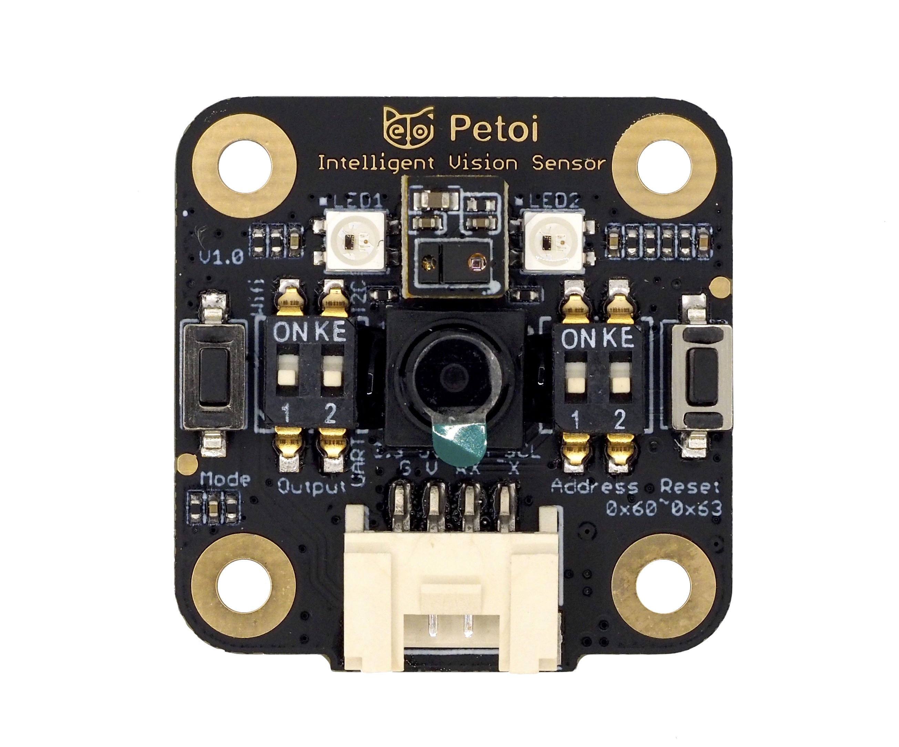
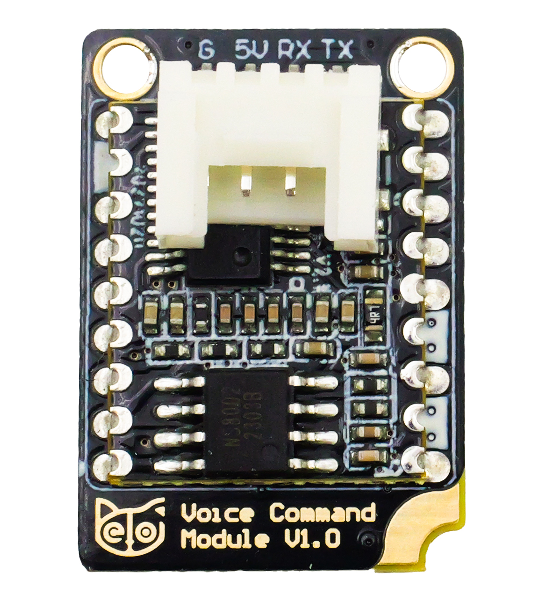
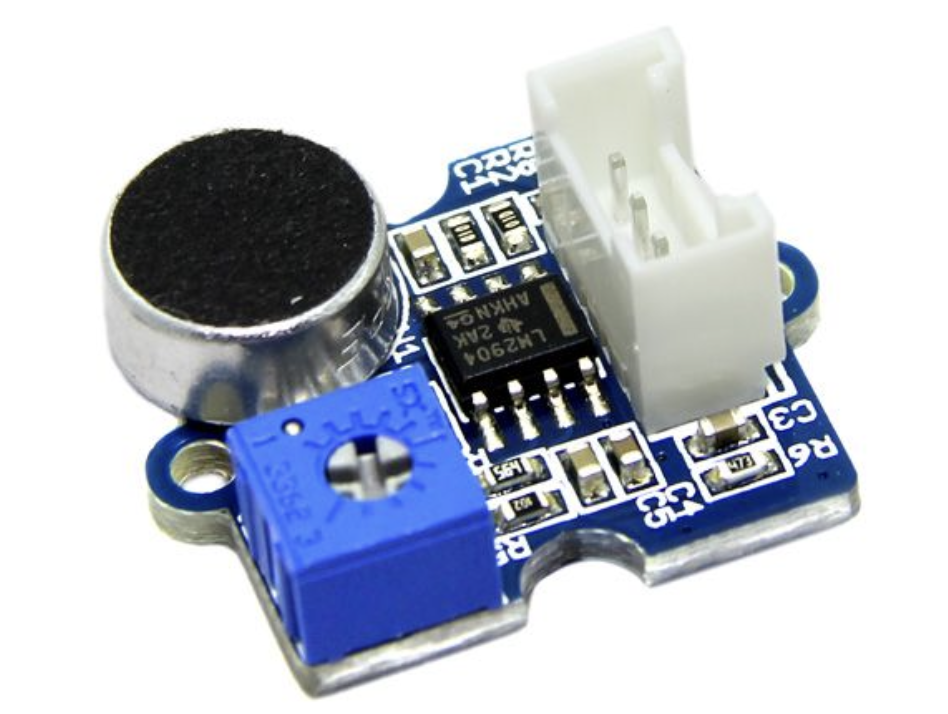
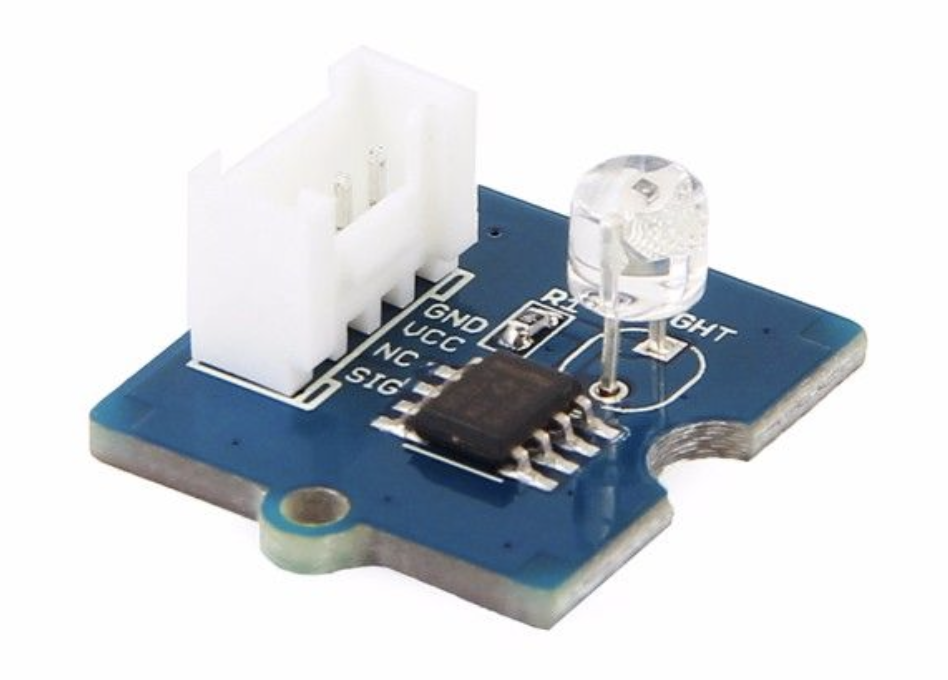
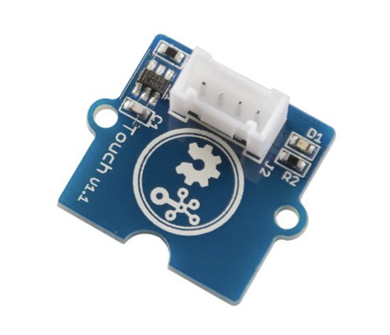
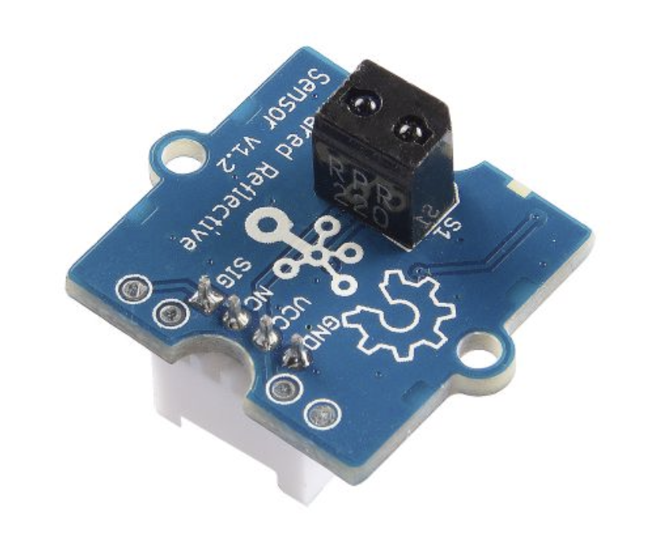
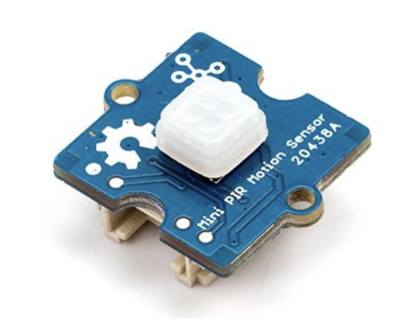
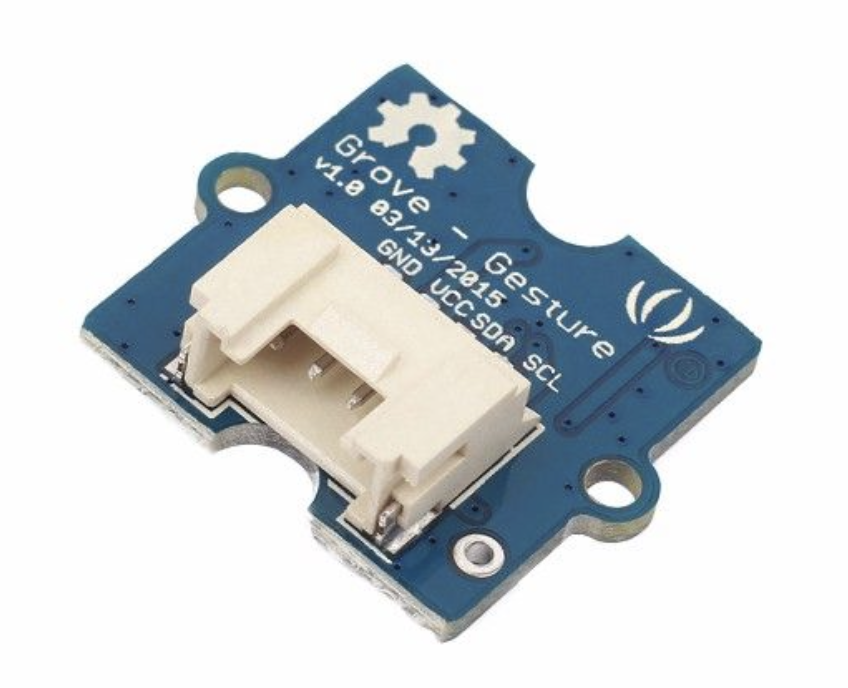
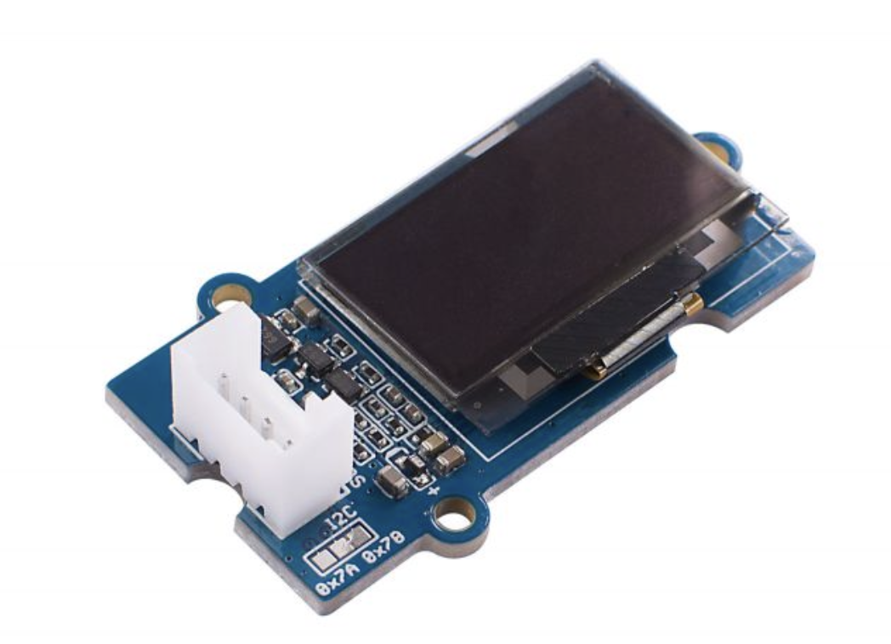

# Introduction

The head of Bittle is designed as a clip to hold extensible modules. We compiled a sensor pack with some popular modules, but its contents may change. Thanks to the rich content of the Arduino and Raspberry Pi communities, you can also wire other add-ons.&#x20;


To use the following sensors:

For **NyBoard**, you need to [upload the firmware](https://docs.petoi.com/upload-firmware#nyboard) in a different mode.

For **BiBoard**, you can use the serial commands to [switch modes](../arduino-ide/upload-sketch-for-biboard.md#id-2.8-swith-mode-via-the-serial-commands)**.**


[Light sensor](https://docs.petoi.com/extensive-modules/light-sensor)

.png>)[Touch sensor](https://docs.petoi.com/extensive-modules/touch-sensor)

.png>)[Gesture sensor](https://docs.petoi.com/extensive-modules/gesture-sensor)

[PIR motion sensor](https://docs.petoi.com/extensive-modules/pir-motion-sensor)

[IR distance sensor](https://docs.petoi.com/extensible-modules/ir-distance-sensor)

   [MU vision sensor](https://docs.petoi.com/extensive-modules/mu-camera)

[Voice command module](https://docs.petoi.com/extensible-modules/voice-command-module) (Built-in on Bittle X)

[Ultrasonic sensor](https://docs.petoi.com/extensive-modules/ultrasonic-sensor) (Built-in on Nybble)

You can also purchase the following third-party sensors (such as Seeed studio):

The loudness and light level modules can generate [analog readings](https://github.com/PetoiCamp/OpenCat/tree/main/ModuleTests/test\_Loudness\_Light) for the corresponding signals and should be connected to the analog Grove socket.&#x20;

&#x20;[Grove - Sound Sensor/ Noise Detector](https://www.seeedstudio.com/Grove-Loudness-Sensor.html)

[Grove - Light Sensor v1.2 - LS06-S phototransistor](https://www.seeedstudio.com/Grove-Light-Sensor-v1-2-LS06-S-phototransistor.html)

The touch, reflection, and PIR sensors can generate digital 1 or 0 as a switch signal. So, they should be connected to the digital Grove socket. We use the fourth socket with D6 and D7 in the demo code.

&#x20;[Grove - Touch Sensor](https://www.seeedstudio.com/Grove-Touch-Sensor.html)

[Grove - Infrared Reflective Sensor v1.2](https://www.seeedstudio.com/Grove-Infrared-Reflective-Sensor-v1-2.html)

[Grove - mini PIR motion sensor](https://www.seeedstudio.com/Grove-mini-PIR-motion-sensor-p-2930.html)

The [intelligent camera](https://github.com/PetoiCamp/BallTracking), [gesture](https://github.com/PetoiCamp/OpenCat/tree/main/ModuleTests/testGesture), and [OLED](https://github.com/PetoiCamp/OpenCat/tree/main/ModuleTests/testOLED) module should be connected to the I2C Grove socket.&#x20;

[Grove - Gesture Sensor for Arduino (PAJ7620U2)](https://www.seeedstudio.com/Grove-Gesture-PAJ7620U2.html)

[Grove - OLED Display 0.96" (SSD1315)](https://www.seeedstudio.com/Grove-OLED-Display-0-96-SSD1315-p-4294.html)
