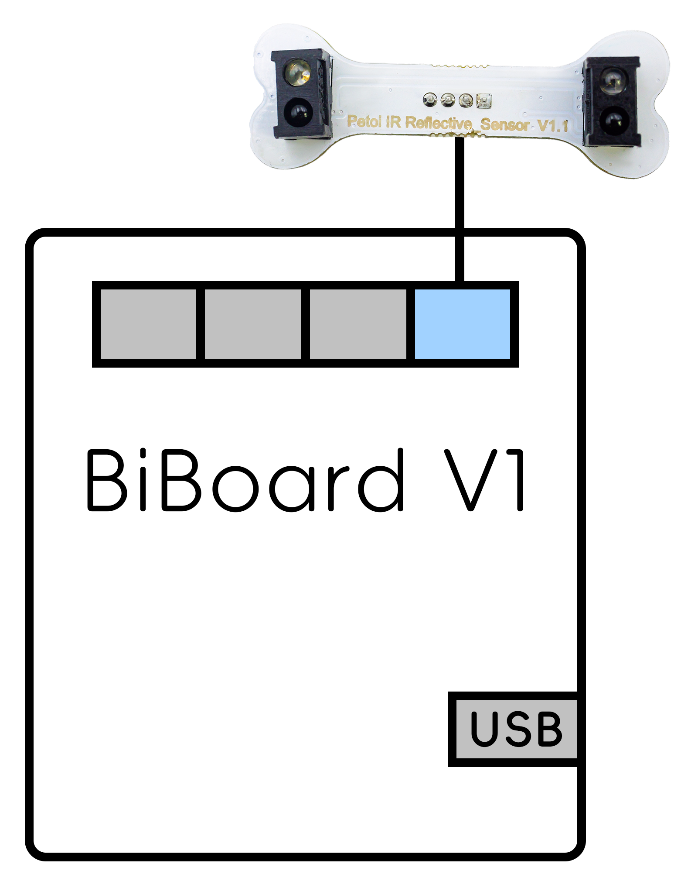

# IR Distance Sensor(Double Infrared Reflection Sensor)



## Function introduction

This module integrates two IR distance sensors; it measures distance through reflected light waves and is used to detect the presence of an object within a specific range. The sensor comprises an IR LED and a photosensor (phototransistor) pair. The light emitted by the IR LED is reflected by any object placed in front of the sensor, and this reflection is detected by the photosensor(phototransistor). Any white (or lighter) colored surface reflects more than a black (or darker) colored surface. It is suitable for measuring complex objects, such as tracing an object.

<figure><figcaption></figcaption></figure>

## NyBoard

### Software setup

There are two methods to upload the infrared distance mode firmware :

* Using the Petoi Desktop App
* Using the Arduino IDE

#### Petoi Desktop App

*   You can use the [Firmware Uploader ](https://docs.petoi.com/desktop-app/firmware-uploader#select-the-correct-options-to-upload-the-latest-firmware)within the Petoi Desktop App.\
    Please select the correct _**Product**_ type, _**Board version**_, and _**Serial port**_ according to your actual use. The mode should be **InfraredDistance**, so press the **Upgrade the Firmware** button. \
    For example, Nybble, NyBoard\_V1\_2, COM5 as follows:\

    <figure><figcaption></figcaption></figure>

#### Arduino IDE

* You can use [Arduino IDE](https://www.arduino.cc/en/software)  to upload and modify the source code.&#x20;

Install the latest version of the **Adafruit NeoPixel** library using the Arduino IDE.

<figure><figcaption></figcaption></figure>

<figure><figcaption></figcaption></figure>

The code using this sensor has been integrated into the [**OpenCat**](https://github.com/PetoiCamp/OpenCat) project. Uncomment the line **`#define DOUBLE_INFRARED_DISTANCE`**  in the **OpenCat.ino**, as shown in the figure below, and use the Arduino IDE to upload the sketch to the robot main board. The sketch can reproduce the example function of integrating the robot action.

#### Prepare the Arduino UNO development environment.

With **NyBoard V1\_\***, you can choose **Arduino Uno**.&#x20;

<figure><figcaption></figcaption></figure>

#### Modify the code in the OpenCat.ino

<figure><figcaption></figcaption></figure>

### Hardware setup

Connecting to the NyBoard with wire as shown in the following picture:

<figure><figcaption></figcaption></figure>

## BiBoard

### Software setup

There are two methods to upload the firmware :

* Using the Petoi Desktop App
* Using the Arduino IDE

#### Petoi Desktop App

*   You can use the [Firmware Uploader](https://docs.petoi.com/desktop-app/firmware-uploader#select-the-correct-options-to-upload-the-latest-firmware) within the Petoi Desktop App.\
    Please select the correct _**Product**_ type, _**Board version**_, and _**Serial port**_ according to your actual use. The mode should be **Standard**, so press the **Upgrade the Firmware** button. \
    For example, Bittle, BiBoard\_V0\_2, COM5 as follows:\

    <figure><figcaption></figcaption></figure>

#### Arduino IDE

*   You can use [Arduino IDE](https://www.arduino.cc/en/software) to [upload the sketch](https://docs.petoi.com/arduino-ide/upload-sketch-for-biboard#id-2.-set-up-biboard)(_**OpenCatEsp32.ino**_). \
    Use the latest OpenCatESP32 code to finish the setup. For example, to modify the code for _**Bittle**_ as shown below:\

    <figure><figcaption></figcaption></figure>

After uploading, there are two methods to _**activate/deactivate**_ the infrared distance mode:

* Serial Monitor
  * [Open the serial monitor](../arduino-ide/serial-monitor.md#biboard) and use the serial command "_**XD**_" to activate the infrared distance mode.
  * Open the serial monitor and use the serial command "_**Xd**_" to deactivate the infrared distance mode.
* Mobile App
  * Create [a mobile app command](https://docs.petoi.com/mobile-app/controller#create-a-single-command) called "**Activate infrared distance**" and use the code: _`X68`_
  * Create a mobile app command called "**Deactivate infrared distance**" and use the code: _`X100`_

### Hardware setup

#### BiBoard V0

<figure><figcaption></figcaption></figure>

#### BiBoard V1

<figure><figcaption></figcaption></figure>

For specific use, the end connected to the sensor can be fixed on the robot's head (included in Bittle's mouth or attached to the top of Nybble's head). Of course, you can also use your creativity according to your needs.

## Testing code

If you want to test this sensor's function alone or learn more about its principles. You can use the Arduino IDE to upload the demo sketch(**testDoubleInfraredDistance.ino**) :

* [For NyBoard](https://github.com/PetoiCamp/OpenCat/tree/main/ModuleTests/testDoubleInfraredDistance)
* [For BiBoard](https://github.com/PetoiCamp/OpenCatEsp32/tree/main/ModuleTests/testDoubleInfraredDistance)

This demo sketch implements real-time printing of the analog values (rL, rR) and data that have been processed (dL,dR) of the two analog pins (_**A2**_ and _**A3**_ for **NyBoard** / _**34**_ and _**35**_ for **BiBoard**) in the [serial monitor](https://docs.petoi.com/arduino-ide/serial-monitor). You can also use the serial plotter to view the two analog pins (_**A2**_ and _**A3**_ for **NyBoard** / _**34**_ and _**35**_ for **BiBoard**) more intuitively. The waveform graph is generated by the analog value of the pin output along the time axis.

<figure><figcaption></figcaption></figure>

<figure><figcaption></figcaption></figure>

<figure><figcaption></figcaption></figure>
