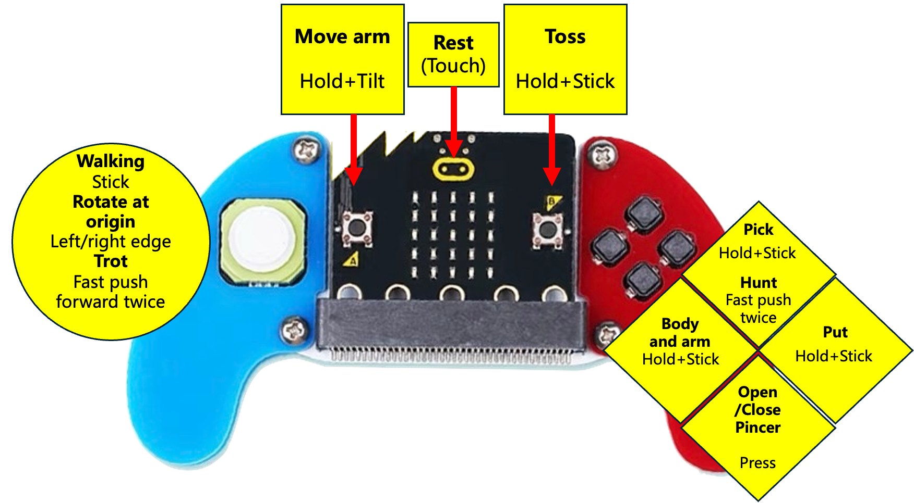

# 🎮 Joystick with micro:bit

This remote controller is a micro:bit based gamepad. It includes a 4-direction joystick and four undefined buttons. To enhance the gaming experience, it is also paired with a buzzer and vibration motor. It is compact in appearance, comfortable in hand, and can be remotely controlled.

<figure><figcaption></figcaption></figure>

## Software setup


micro:bit V1 has a smaller memory. So, the full functionality requires **micro:bit V2**.


### Download the program

You can download the program file, which is used to control **Bittle R** (with robot arm):



### Import to the makecode

import the program to [the programming platform makecode](https://makecode.microbit.org) as follows:


We recommend you use the **Chrome** browser.


<figure><figcaption></figcaption></figure>

### Download the program to the micro:bit V2

Connect your PC to the micro:bit V2 using a USB cable.

After a successful connection, a disk drive named `MICROBIT` is recognized on the computer.

Click on the bottom left corner of the  button， Select `Connect Device`.

Click  button.

Click

Select `BBC micro:bit CMSIS-DAP` in the pop-up window and then select Connect. At this point, our micro:bit has connected successfully.

<figure><figcaption></figcaption></figure>

Click to download the program.

## How to use&#x20;

1. [Upload the newest firmware](https://docs.petoi.com/upload-firmware) to the robot (mainboard type: **BiBoard**)
2. Install 2 x #7 AAA batteries and plug in the micro:bit V2 to the remote controller. Then power on the remote controller as follows:\
   .png>)\

3. Power on the robot. After the robot startup, it can connect to the controller automatically.\
   If there are many remote controllers and robots, the connection is one-to-one and first-come-first-served.

## Controller function introduction

### To control Bittle R(with robot arm):

<figure><figcaption></figcaption></figure>

