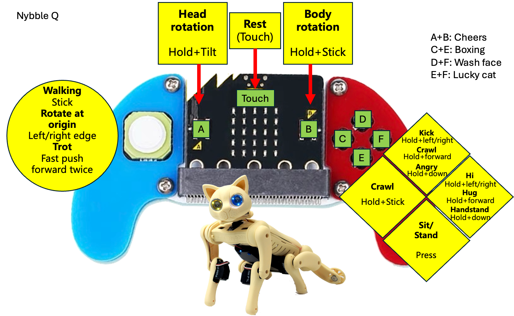

# 🎮 Joystick with Micro:Bit



This remote controller is a Micro: Bit-based gamepad. It includes a 4-direction joystick and four undefined buttons. To enhance the gaming experience, it is also paired with a buzzer and vibration motor. It is compact in appearance, comfortable in hand, and can be remotely controlled.

<figure><figcaption></figcaption></figure>

## Hardware


Micro: Bit V1 has a smaller memory. So, the full functionality requires **Micro: Bit V2**.


## Software setup

The Joystick's source code is now open-sourced. It can control Bittle X, Bittle X+Arm (Bittle with a robotic arm), and Nybble Q. For more information, please refer to our [GitHub repository](https://github.com/PetoiCamp/ESP32_Microbit_Controller).

You can download the program file([microbit-JoyStick.hex](https://raw.githubusercontent.com/PetoiCamp/ESP32_Microbit_Controller/refs/heads/main/microbit-JoyStick.hex)), then import the program to [the programming platform MakeCode](https://makecode.microbit.org) as follows:


We recommend you use the **Chrome** browser.


<figure><figcaption></figcaption></figure>

Alternatively, you can click "New Project" and drag the program file into the coding window to load it.&#x20;

### Download the program to the Micro: Bit V2

Connect your PC to the Micro: Bit V2 using a USB cable.

After a successful connection, a disk drive named `MICROBIT` is recognized on the computer.

Click on the bottom left corner of the  button， Select `Connect Device`.

Click  button.

Click

Select `BBC micro:bit CMSIS-DAP` in the pop-up window and then select Connect. At this point, our Micro: Bit has connected successfully.

<figure><figcaption></figcaption></figure>

Click to download the program.

## How to use&#x20;

1. [Upload the newest firmware](https://docs.petoi.com/upload-firmware) to the robot (mainboard type: **BiBoard**)
2. Install 2 x #7 AAA batteries and plug in the Micro: Bit V2 to the remote controller. Then, power on the remote controller as follows:\
    (1) (1) (1).png>)\

3. Power on the robot. During bootup, it can connect to the controller automatically via Bluetooth.\
   If there are many remote controllers and robots, the connection is one-to-one and first-come, first-served.


**Timed lock feature**

This feature limits the play time for each user during exhibitions or science festivals. It is deactivated by default.

After normal startup and Bluetooth connection, you can activate the limited-time usage function for the controller by pressing and holding the middle Logo (touch button) on the Micro:bit while keeping the controller upright (with the left joystick at the bottom). Once activated, the controller will send a rest command to the robot every 20 minutes and no longer respond to subsequent operations. The LED indicator matrix will dynamically display an hourglass pattern, as shown in the figure below:

You can reset the countdown and reactivate the controller using the same operation described above. The controller will play a prompt tone, and the LED indicator matrix will display an animation of an hourglass reversing.

Once the limited-time feature is activated, it can only be turned off by rebooting the controller. After the controller restarts, you must reset the robot (by clicking the **reset** button on the mainboard) or reboot the robot to reconnect.


## Controller function introduction

### To control Bittle X+Arm (with robot arm):

<figure><figcaption></figcaption></figure>

### Demo



### To control Bittle X:

<figure><figcaption></figcaption></figure>

### To control Nybble Q:

<figure><figcaption></figcaption></figure>
