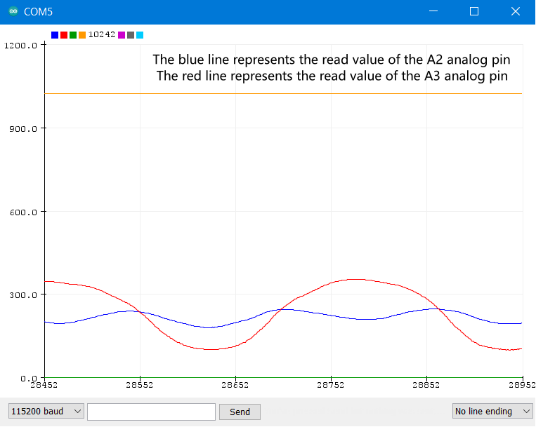
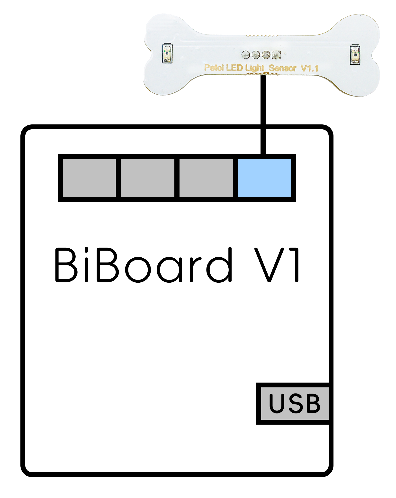

# Light Sensor



## Function introduction

The sensor integrates two photoresistors (depending on the light intensity adjustment resistance) to detect the light intensity. The photoresistor is a particular resistance that uses the photoconductive effect, and its resistance is directly related to the intensity of the incident light. When the light intensity increases, the resistance decreases; when the light intensity decreases, the resistance increases. The output signal is an analog value. The brighter the brightness, the larger the value. You can realize the function you want by judging the value of the detected light intensity, such as the function of a robot tracing light.

<figure><figcaption></figcaption></figure>

## NyBoard

### Hardware setup

Connecting to the NyBoard with a wire as shown in the following picture:

<figure><figcaption></figcaption></figure>

### Software setup

There are two methods to upload the light mode firmware :

* Using the Petoi Desktop App
* Using the Arduino IDE

#### Petoi Desktop App

*   You can use the [Firmware Uploader ](https://docs.petoi.com/desktop-app/firmware-uploader#select-the-correct-options-to-upload-the-latest-firmware)within the Petoi Desktop App.\
    Please select the correct _**Product**_ type, _**Board version**_, and _**Serial port**_ according to your actual use. The mode should be **Light**, so press the **Upgrade the Firmware** button. \
    For example, Nybble, NyBoard\_V1\_2, COM5 as follows:\

    <figure><figcaption></figcaption></figure>

#### Arduino IDE

* You can use [Arduino IDE](https://www.arduino.cc/en/software)  to upload and modify the source code.&#x20;

The code using this sensor has been integrated into the [**OpenCat**](https://github.com/PetoiCamp/OpenCat) project. Uncomment the line **`#define DOUBLE_LIGHT`**  In the **OpenCat.ino**, as shown in the figure below, use the Arduino IDE to upload the sketch to the robot main board, which can reproduce the example function of integrating the robot action.

#### Prepare the Arduino UNO development environment.

With **NyBoard V1\_\***, you can choose **Arduino Uno**.&#x20;

<figure><figcaption></figcaption></figure>

For example,  to modify the code for _**Bittle**_ as shown below:

<figure><figcaption></figcaption></figure>

### Arduino module test code

Suppose you want to test a light sensor's function alone or learn more about its principles. You can use the Arduino IDE to upload the test code(**testDoubleLight.ino**):

The test code is in the **OpenCat** project source code ([ModuleTests/testDoubleLight](https://github.com/PetoiCamp/OpenCat/blob/main/ModuleTests/testDoubleLight/testDoubleLight.ino))

This test code implements real-time printing of the analog values of the two analog pins (A2 and A3) in the [serial monitor](https://docs.petoi.com/arduino-ide/serial-monitor). You can also use the serial plotter to view the two analog pins (A2 and A3) more intuitively. The waveform graph is generated by the analog value of the pin output along the time axis.

<figure><figcaption></figcaption></figure>

<figure><figcaption></figcaption></figure>

## BiBoard

### Hardware setup

#### BiBoard V0&#x20;

<figure><figcaption></figcaption></figure>

#### BiBoard V1

<figure><figcaption></figcaption></figure>

For specific use, the end connected to the sensor can be fixed on the robot's head (included in Bittle's mouth or attached to the top of Nybble's head). Of course, you can also use your creativity according to your needs.

### Software setup

There are two methods to upload the firmware :

* Using the Petoi Desktop App
* Using the Arduino IDE

#### Petoi Desktop App

*   You can use the [Firmware Uploader](https://docs.petoi.com/desktop-app/firmware-uploader#select-the-correct-options-to-upload-the-latest-firmware) within the Petoi Desktop App.\
    Please select the correct _**Product**_ type, _**Board version**_, and _**Serial port**_ according to your actual use. The mode should be **Standard**, so press the **Upgrade the Firmware** button. \
    For example, Bittle, BiBoard\_V0\_2, COM5 as follows:

    <figure><figcaption></figcaption></figure>

#### Arduino IDE

*   You can use [Arduino IDE](https://www.arduino.cc/en/software) to [upload the sketch](https://docs.petoi.com/arduino-ide/upload-sketch-for-biboard#id-2.-set-up-biboard)(_**OpenCatEsp32.ino**_). \
    Use the latest OpenCatESP32 source code to finish the setup. For example,  to modify the code for _**Bittle**_ as shown below:\

    <figure><figcaption></figcaption></figure>

After uploading, there are two methods to _**activate/deactivate**_ the light mode:

* Serial Monitor
  * [Open the serial monitor](../arduino-ide/serial-monitor.md#biboard) and use the serial command "_**XL**_" to activate the light mode.
  * Open the serial monitor and use the serial command "_**Xl**_" to deactivate the light mode.
* Mobile App
  * Create [a mobile app command](https://docs.petoi.com/mobile-app/controller#create-a-single-command) called "**Activate light**" and use the code: _`X76`_
  * Create a mobile app command called "**Deactivate light**" and use the code: _`X108`_
