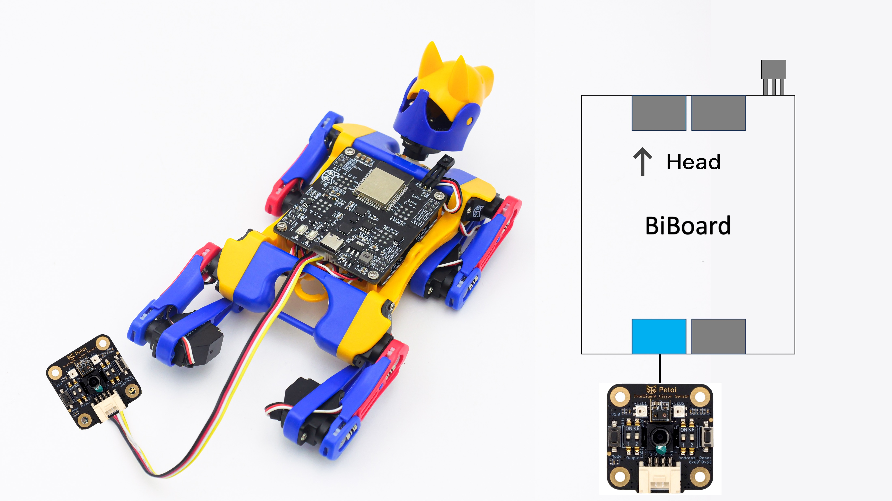

# MU Camera

## Function introduction

Petoi Intelligent Vision Sensor can recognize many objects with a deep-learning algorithm. For example, it can detect color blocks, balls, the human body, and cards. Its detection result can be transmitted through the UART or I2C interface. MU is compact, has low power consumption, processes all algorithms locally, and can be widely used in intelligent toys, AI+STEAM lessons, creators, and other products or fields.

<figure><figcaption></figcaption></figure>

## NyBoard

### Hardware setup

After uploading the firmware, switch the dial (left: **down** and **up**; right: **down** and **down**) on the MU Vision Sensor and connect to the mainboard with wire as shown in the following picture:

### Software setup

#### Petoi Desktop App

*   You can use the [Firmware Uploader ](https://docs.petoi.com/desktop-app/firmware-uploader#select-the-correct-options-to-upload-the-latest-firmware)within the Petoi Desktop App.\
    Please select the correct _**Product**_ type, _**Borard version**_, and _**Serial port**_. The mode should be **Camera**, so press the **Upgrade the Firmware** button. for example, Bittle, NyBoard\_V1\_2, COM5 as follows:\

    <figure><figcaption></figcaption></figure>

#### Arduino IDE

* You can use [Arduino IDE](https://www.arduino.cc/en/software) to upload and modify the source code.&#x20;

1. First, download and install the [MU camera library](https://github.com/mu-opensource/MuVisionSensor3) into your Arduino IDE.&#x20;

2\. Use the latest [OpenCat](https://github.com/PetoiCamp/OpenCathttps:/github.com/PetoiCamp/OpenCat) code to finish the setup.&#x20;

Use the latest OpenCat code to finish the setup. For example,  to modify the code for _**Bittle**_ as shown below:

.png>)

If you have already uploaded the latest OpenCat code to make Bittle  walk, you only need to uncomment **`#define CAMERA`** At the beginning of OpenCat.ino, then upload the code.&#x20;

If unsure, you need to finish the [upload process for the standard mode](https://docs.petoi.com/arduino-ide/upload-sketch-for-nyboard) (Step 1 to Step 10) to ensure everything is configured correctly, then upload the code in the camera mode.&#x20;

If the camera code is uploaded correctly, Bittle maintains the rest position. Success messages are printed on the [serial monitor](https://docs.petoi.com/arduino-ide/serial-monitor) of Arduino IDE. When the MU Vision Sensor recognizes a target, the two LEDs will turn blue, and Bittle's head can follow the target and swing left and right. The demo code will auto-switch the target between a yellow tennis ball and a human body if it fails to find any object.

### Arduino code demo

The demo video is as follows:



## BiBoard

### Hardware setup

#### BiBoard V0

<figure><figcaption></figcaption></figure>

#### BiBoard V1

<figure><figcaption></figcaption></figure>


Note: The position of the left and right switches (left: **down** and **up**; right: **down** and **down**) must be dialed to the position shown in Figure 1.


Fix the end connected to the camera to the robot's head (included in Bittle's / Bittle X's mouth).

### Software setup

#### Petoi Desktop App

You can use the [Firmware Uploader](https://docs.petoi.com/desktop-app/firmware-uploader#select-the-correct-options-to-upload-the-latest-firmware) within the Petoi Desktop App.

Please select the correct _**Product**_ type, _**Borard version**_, and _**Serial port**_. The mode should be **Standard**, so press the **Upgrade the Firmware** button. for example, Bittle, BiBoard\_V0\_2, COM5 as follows:

<figure><figcaption></figcaption></figure>

After uploading,  [open the serial monitor](../arduino-ide/serial-monitor.md#biboard) and use the serial command "_**XC**_" to switch to using the camera mode.

#### Arduino IDE

1. First, download and install the [MU camera library](https://github.com/mu-opensource/MuVisionSensor3) into the [Arduino IDE](https://www.arduino.cc/en/software).&#x20;

2\. Use Arduino IDE to [upload the sketch](https://docs.petoi.com/arduino-ide/upload-sketch-for-biboard#id-2.-set-up-biboard)(_**OpenCatEsp32.ino**_).&#x20;

Use the latest OpenCatESP32 source code to finish the setup. For example,  to modify the code for _**Bittle**_ as shown below:\

<figure><figcaption></figcaption></figure>

After uploading,  [open the serial monitor](../arduino-ide/serial-monitor.md#biboard) and use the serial command "_**XC**_" to switch to using the camera mode.

## FAQ


If the MU Vision Sensor cannot identify the target object, please press the reset button on the camera and then the reset button on the main board.



While the MU Vision Sensor connects with BiBoard if the white LED on the back of the MU Vision Sensor isn't lit up.

Please plug the battery into the BiBoard and long-press the button on the battery to power the BiBoard. Then, click the camera's reset button and the main board's reset button in order.


This module also supports the following developing environment:

* MicroPython APIs
* Mixly IDE
* MakeCode IDE

For more details, please refer to [the Technical Support Document](https://morpx-docs.readthedocs.io/en/latest/MUVS3/introduction.html).
