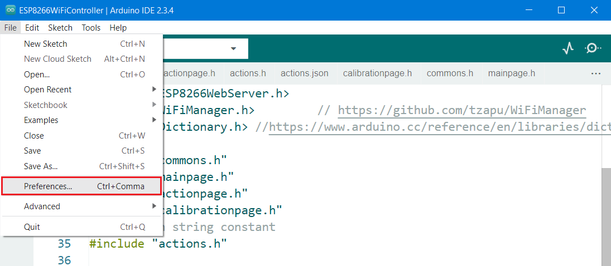

# Petoi AI Vision

## Function introduction

Petoi AI Vision Module is based on the Arm Cortex-M55, and Ethos-U55 embedded vision module. The Ethos-U55 has 64 to 512 GOP/s of arithmetic power to meet the growing demand for downloading machine learning.

<figure><figcaption></figcaption></figure>

## Hardware setup 

### BiBoard V0

<figure><figcaption>
Bittle X
</figcaption></figure>

### BiBoard V1

<figure><figcaption>
Bittle X
</figcaption></figure>

<figure><figcaption>
Bittle X+Arm
</figcaption></figure>

Fix the end connected to the camera to the robot's head (included in Bittle's / Bittle X's mouth or attached to Bittle X+Arm's robotic arm).

## Software setup 

### **Petoi Desktop App**

You can use the [Firmware Uploader](https://docs.petoi.com/desktop-app/firmware-uploader#select-the-correct-options-to-upload-the-latest-firmware) within the Petoi Desktop App.

Please select the correct _**Product**_ type, _**Borard version**_, and _**Serial port**_. The mode should be **Standard**, so press the **Upgrade the Firmware** button. for example, Bittle, BiBoard\_V0\_2, COM5 as follows:

<figure><figcaption></figcaption></figure>

After uploading, [open the serial monitor](https://docs.petoi.com/arduino-ide/serial-monitor#biboard) and send the serial command "_**XC**_" to switch to using the camera mode.

### **Arduino IDE**

For more details, please refer to [Upload Sketch for BoBoard](../arduino-ide/upload-sketch-for-biboard.md).

After uploading, [open the serial monitor](https://docs.petoi.com/arduino-ide/serial-monitor#biboard) and send the serial command "_**XC**_" to switch to using the camera mode.


If the camera mode can't be activated, as following:

You can use the [web debug GUI ](https://sensecraft.seeed.cc/ai/#/device/local)to upgrade the camera firmware and upload the Face Detection model.




To run the example code (inference.ino) in the library [Seeed\_Arduino\_SSCMA](https://github.com/Seeed-Studio/Seeed_Arduino_SSCMA/releases), you should add the library to your Arduino IDE by selecting Sketch > Include Library > Add .ZIP Library and choosing the downloaded file.

Or you can install the library in the Library Manager of the Arduino IDE as follows:

\
\
.png>)

