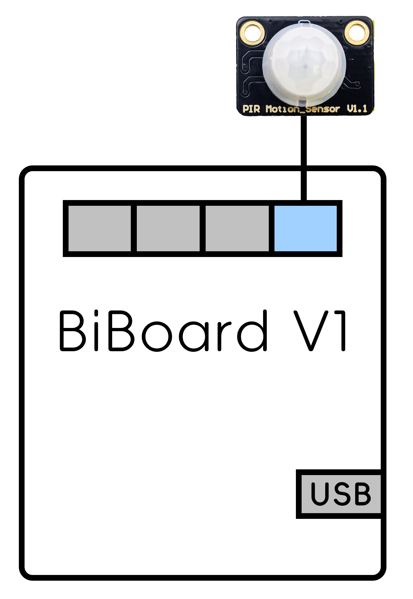
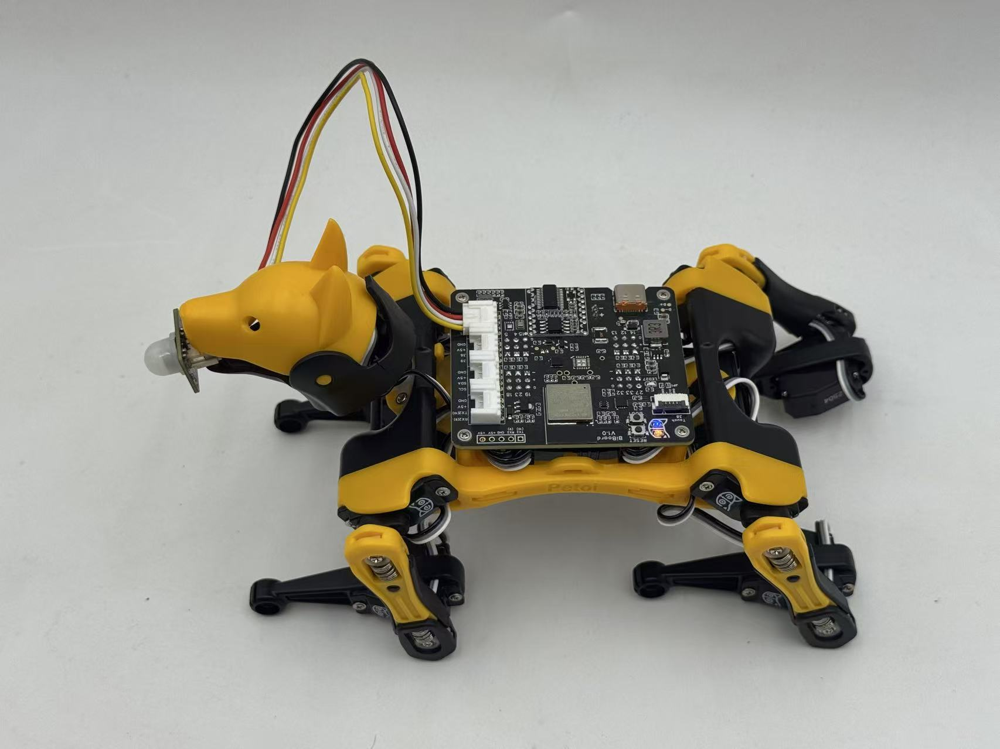

# PIR Motion Sensor



## Function introduction

This sensor allows you to detect animals' movement, usually humans' movement within its detection range. Just connect it to the NyBoard and program it, and when anyone moves within its detection range, the sensor will output a high potential on its **SIG** pin.

<figure><figcaption></figcaption></figure>

## NyBoard

### Software setup

There are two methods to upload the PIR mode firmware :

* Using the Petoi Desktop App
* Using the Arduino IDE

#### Petoi Desktop App

*   You can use the [Firmware Uploader ](https://docs.petoi.com/desktop-app/firmware-uploader#select-the-correct-options-to-upload-the-latest-firmware)within the Petoi Desktop App.\
    Please select the correct _**Product**_ type, _**Board version**_, and _**Serial port**_ according to your actual use. The mode should be **PIR**, so press the **Upgrade the Firmware** button. \
    For example, Nybble, NyBoard\_V1\_2, COM5 as follows: 

    <figure><figcaption></figcaption></figure>

#### Arduino IDE

* You can use [Arduino IDE](https://www.arduino.cc/en/software)  to upload and modify the source code.&#x20;

The code using this sensor has been integrated into the [**OpenCat**](https://github.com/PetoiCamp/OpenCat) project. Uncomment the line **`#define PIR`**  in the **OpenCat.ino**, as shown in the figure below, and use the Arduino IDE to upload the sketch to the robot main board, which can reproduce the example function of integrating the robot action.

#### Prepare the Arduino UNO development environment.

With **NyBoard V1\_\***, you can choose **Arduino Uno**.&#x20;

<figure><figcaption></figcaption></figure>

#### Modify the code in the OpenCat.ino

<figure><figcaption></figcaption></figure>

### Hardware setup

Connecting to the NyBoard with wire as shown in the following picture:

<figure><figcaption></figcaption></figure>

## &#x20; BiBoard

### Software setup

There are two methods to upload the firmware :

* Using the Petoi Desktop App
* Using the Arduino IDE

#### Petoi Desktop App

*   You can use the [Firmware Uploader](https://docs.petoi.com/desktop-app/firmware-uploader#select-the-correct-options-to-upload-the-latest-firmware) within the Petoi Desktop App.\
    Please select the correct _**Product**_ type, _**Board version**_, and _**Serial port**_ according to your actual use. The mode should be **Standard**, so press the **Upgrade the Firmware** button. \
    For example, Bittle, BiBoard\_V0\_2, COM5 as follows: 

    <figure><figcaption></figcaption></figure>

#### Arduino IDE

*   You can use [Arduino IDE](https://www.arduino.cc/en/software) to [upload the sketch](https://docs.petoi.com/arduino-ide/upload-sketch-for-biboard#id-2.-set-up-biboard)(_**OpenCatEsp32.ino**_).\
    Use the latest OpenCatESP32 code to finish the setup. For example, to modify the code for _**Bittle**_ as shown below: 

    <figure><figcaption></figcaption></figure>

After uploading, there are two methods to _**activate/deactivate**_ the PIR mode:

* Serial Monitor
  * [Open the serial monitor](../arduino-ide/serial-monitor.md#biboard) and use the serial command "_**XI**_" to activate the PIR mode.
  * Open the serial monitor and use the serial command "_**Xi**_" to deactivate the PIR mode.
* Mobile App
  * Create [a mobile app command](https://docs.petoi.com/mobile-app/controller#create-a-single-command) called "**Activate PIR**" and use the code: _`X73`_
  * Create a mobile app command called "**Deactivate PIR**" and use the code: _`X105`_

### Hardware setup

#### BiBoard V0&#x20;

<figure><figcaption></figcaption></figure>

#### BiBoard V1

<figure><figcaption></figcaption></figure>

<figure><figcaption></figcaption></figure>

For specific use, the end connected to the sensor can be fixed on the robot's head (included in Bittle's mouth or attached to the top of Nybble's head). Of course, you can also use your creativity to meet your needs.

## Testing code

If you want to test a PIR motion sensor's function alone or learn more about its principles. You can use the Arduino IDE to upload the demo sketch(**test\_Touch\_Reflection\_PIR.ino**):

* [For NyBoard](https://github.com/PetoiCamp/OpenCat/tree/main/ModuleTests/test_Touch_Reflection_PIR)
* [For BiBoard](https://github.com/PetoiCamp/OpenCatEsp32/tree/main/ModuleTests/test_Touch_Reflection_PIR)

This demo sketch implements real-time printing of sensor detection results in the [serial monitor](https://docs.petoi.com/arduino-ide/serial-monitor) - when anyone moves within its detection range, print 1; otherwise, print 0.

<figure><figcaption></figcaption></figure>
