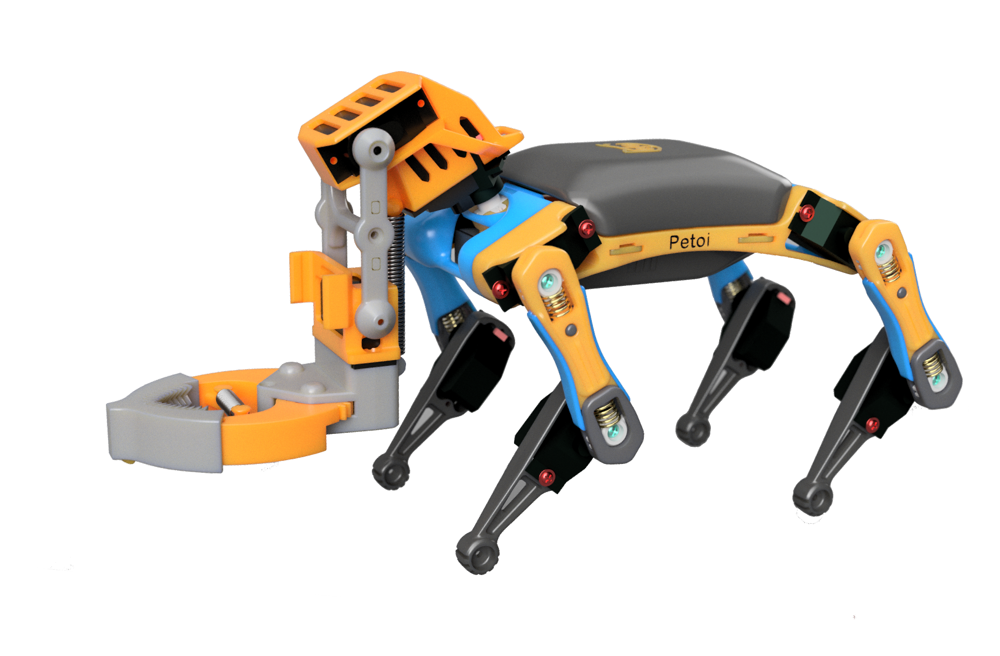
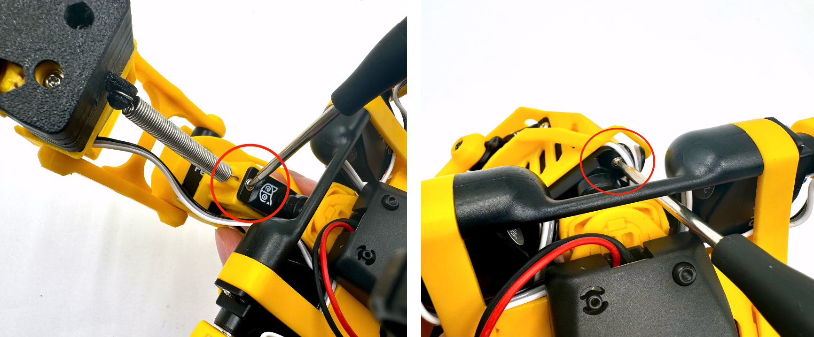
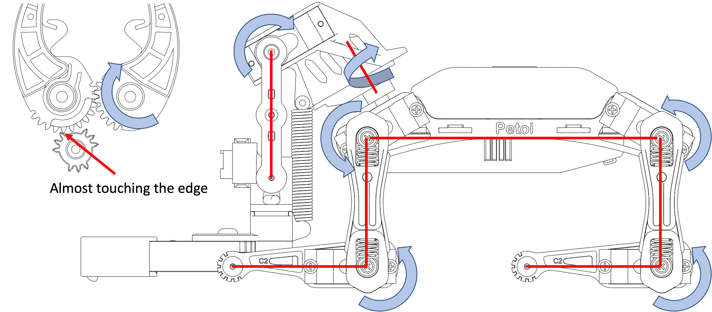

# Robot Arm

Equipped with a robotic arm, **Bittle R** has more functions. It can perform more complex skills, such as grabbing objects for show or moving objects to different places.


When the robot arm is in motion, please do not put your hands between the robot claws to avoid being pinched.


<figure><figcaption></figcaption></figure>

## Installation

This robot arm is already fully assembled. You only need to install the servo with the neck structure in the servo slot with two M2\*5 self-tapping screws.

<figure><figcaption></figcaption></figure>

## Upload the firmware

In the [**Petoi Desktop App**](https://docs.petoi.com/desktop-app/introduction), choose the model **Bittle R**, then click the **Firmware Uploader** button to upload the firmware for the robot with an arm.

<div><figure><figcaption></figcaption></figure> <figure><figcaption></figcaption></figure></div>

<figure><figcaption></figcaption></figure>

## Joint Calibration

The robot arm must be finely calibrated to make it more precise when performing actions and to prevent the robot claw from jamming and overheating.

You can use the [**Petoi Desktop App**](https://docs.petoi.com/desktop-app/joint-calibrator) to calibrate it.

### Prepare for calibration <a href="#prepare-for-calibration" id="prepare-for-calibration"></a>

You must connect the motherboard to the computer via a USB data cable or [Bluetooth](https://docs.petoi.com/bluetooth-connection#for-biboard) wireless.

Then, install the battery and long-press the button on the battery to power the robot.

### Enter the calibration state

After the robot is powered on, there are two methods to enter the calibration state:

* It will enter the calibration state automatically when you click the **Joint Calibrator** button.

<figure><figcaption></figcaption></figure>

* Click the **Calibrate** button in the calibrator interface.

**BiBoard\_V1\_\***

<figure><figcaption></figcaption></figure>


BiBoard\_V0\_\*





The servo slider is not available in the interface's light yellow background area.


### Fine calibration

Click the corresponding slider track of the robot arm and adjust the robot arm by calibrating the posture as shown below：

<figure><figcaption></figcaption></figure>

The joint index corresponding to the claw is 2. It can be auto-calibrated by pressing the **Auto** button or inputting the serial command "**c-2**" on the [serial monitor](https://docs.petoi.com/arduino-ide/serial-monitor#biboard) of Arduino IDE. You can also manually click the corresponding slider track and adjust the gear on the servo output shaft to the position shown in the figure above.

## How to use

### Voice command

The robot program defaults to voice mode. Before controlling the robotic arm with voice commands, you must say "**Start learning**" to activate the custom voice command mode. Then, follow the voice prompts to [record your voice commands](https://docs.petoi.com/extensible-modules/voice-command-module#record-customized-voice-commands) in the following order to call predefined skill actions:

1. "**Pick up**"
2. "**Put it down**"
3. "**Hunt**"
4. "**Show off the object**"
5. "**Put away**"
6. "**Throw away**"
7. "**Shoot**"
8. "**Clap**"
9. "**Throw out**"

Once you have finished recording your voice commands, say "**Stop learning**" to exit the custom voice command mode.

The meaning of the voice commands:

"**Pick up**": To pick up the object.

&#x20;"**Put it down**": To put the object down.

"**Hunt**": To grab the object quickly.

"**Show off the object**": To show off the object.

"**Put away**": To put away the object.

"**Throw away**": To throw the object aside.

&#x20;"**Shoot**":  To throw the object forward.

"**Clap**": To clap the claw.

**Throw out**": To throw the object out.

### Mind+

You can use the **Perform robot arm skill** block in the [**Petoi Coding Blocks**](https://docs.petoi.com/block-based-programming/petoi-coding-blocks) to do some pre-defined skills.

For example:

<figure><figcaption></figcaption></figure>

### Serial command

After connecting the motherboard to the computer via a USB data cable or [Bluetooth](https://docs.petoi.com/bluetooth-connection#for-biboard) wireless, you can use the following commands in the Arduino IDE [serial monitor.](https://docs.petoi.com/arduino-ide/serial-monitor#biboard)

```cpp
  "kpickD",      // Pick up the object under the robotic arm.
  "kpickF",      // Pick up the object in front of the robotic arm.
  "kpickL",      // Pick up the object to the left of the robotic arm.
  "kpickR",      // Pick up the object to the right of the robotic arm.
  "kputD",       // Place the grasped object under the robotic arm.
  "kputF",       // Place the grasped object in front of the robotic arm.
  "kputL",       // Place the grasped object to the left of the robotic arm.
  "kputR",       // Place the grasped object to the right of the robotic arm.
  "klaunch",     // Launch the grasped object forward.
  "ktossF",      // Throw the grasped object forward.
  "ktossL",      // Throw the grasped object to the left.
  "ktossR",      // Throw the grasped object to the right.
  "khunt",       // Quickly grasp the object in front.
  "kshowOff",    // Show the grasped object.
  "kclap",       // Make a clapping motion with the robotic gripper.
```

### Skill and directional combinations

| Skill Name | Front | Left   | Right | Down           |
| ---------- | ----- | ------ | ----- | -------------- |
| pick       | pickF |  pickL | pickR | pickD          |
| drop       | dropF | dropL  | dropR | dropD          |
| put        | putF  | putL   | putR  | putD           |
| toss       | tossF | tossL  | tossR | tossD = launch |
| hunt       |       |        |       |                |
| showOff    |       |        |       |                |
| clap       |       |        |       |                |

## Advanced Usage

### Create new skill

You can use the [Skill Composer](https://docs.petoi.com/desktop-app/skill-composer) in the Petoi Desktop App to create new skills for the robot arm and [export](https://docs.petoi.com/desktop-app/skill-composer#export-the-skill) them to the mobile app, the [Mind+ program](https://docs.petoi.com/block-based-programming/petoi-coding-blocks#perform-the-skill-in-the-file),  or the [source code](https://docs.petoi.com/applications/skill-creation).

<figure><figcaption></figcaption></figure>

### Extensional application

This robot arm can be used in combination with other sensors. The installation method is shown in the figure below. e.g., adding the [Grove Vision AI V2](https://docs.petoi.com/extensible-modules/advanced-development-and-application-of-ai-vision-modules) module:

<figure><figcaption></figcaption></figure>

The source code also needs to be modified. The sample demo code is being written, so stay tuned.

