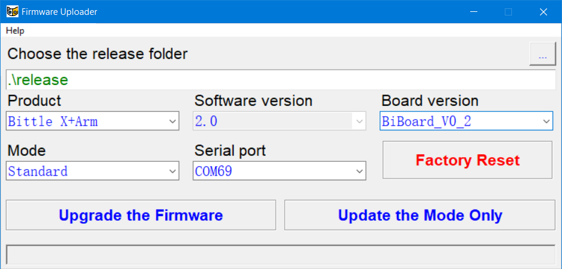
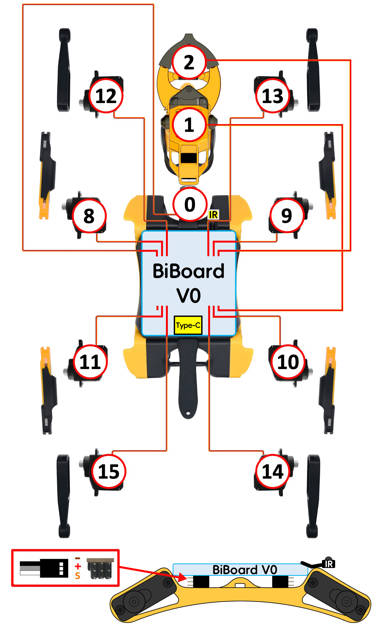

# Upgrade your older Bittle/Bittle X for the robotics arm gripper

The older Bittle/Bittle X models have different hardware configurations. The following table shows what components need to be upgraded for different models to work with [Bittle robotic arm gripper extension kit with alloy servos](https://www.petoi.com/products/bittle-arm-extension-with-metal-servos):

* <mark style="color:red;">A red color</mark> means the part must be upgraded
* <mark style="color:green;">A green color</mark> means the part can be reused.&#x20;
* <mark style="color:blue;">A blue color</mark> indicates that the board's wiring and other configurations must be adjusted.&#x20;

|                     | Current board                                | Current servos                                           | You need these for the upgrades                     |
| ------------------- | -------------------------------------------- | -------------------------------------------------------- | --------------------------------------------------- |
| **Bittle X+Arm**    | <mark style="color:green;">BiBoard V1</mark> | <mark style="color:green;">Feedback alloy  servos</mark> | N/A                                                 |
| Bittle Robotics kit | <mark style="color:red;">NyBoard</mark>      | <mark style="color:green;">Alloy servos</mark>           | BiBoard V1                                          |
| Bittle STEM kit     | <mark style="color:red;">NyBoard</mark>      | <mark style="color:red;">Lite(plastic) servos</mark>     | BiBoard V1 + alloy servos(with or without feedback) |
| Bittle X V1         | <mark style="color:blue;">BiBoard V0</mark>  | <mark style="color:red;">Lite(plastic) servos</mark>     | Alloy servos(with or without feedback)              |

The simplest solution is to buy the newest components to match the Bittle X+Arm configuration. We offer discounted combo kits to help you upgrade.

The following instructions will guide you in reconfiguring the BiBoard V0 for the Arm. **You must complete all the following steps.**

## 1. BiBoard V0 Re-configuration

The arm's alloy servos require much more current. To bypass the fuse (marked X30 or X70), you must directly solder its two ends.

<figure><figcaption></figcaption></figure>

## 2. Firmware

### You will need to upgrade the firmware via Firmware Uploader with the following option:

Model: Bittle X+Arm

Board: BiBoard V0\_\*

Mode: Standard\

<figure><figcaption></figcaption></figure>

### Or via Arduino IDE with the following macro activated:

\#define BITTLE\
\#define BiBoard\_V0\_2\
\#define ROBOT\_ARM

<figure><figcaption></figcaption></figure>

## 3. Wiring

Please refer to the wiring diagram to attach the robotic arm。\

<figure><figcaption></figcaption></figure>

## 4. Calibration

The robot arm needs to be calibrated to work correctly. Please refer to the [corresponding chapter](https://docs.petoi.com/extensible-modules/robot-arm#joint-calibration) for details.&#x20;
