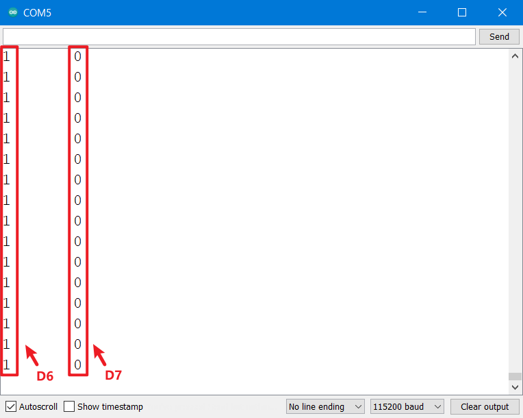
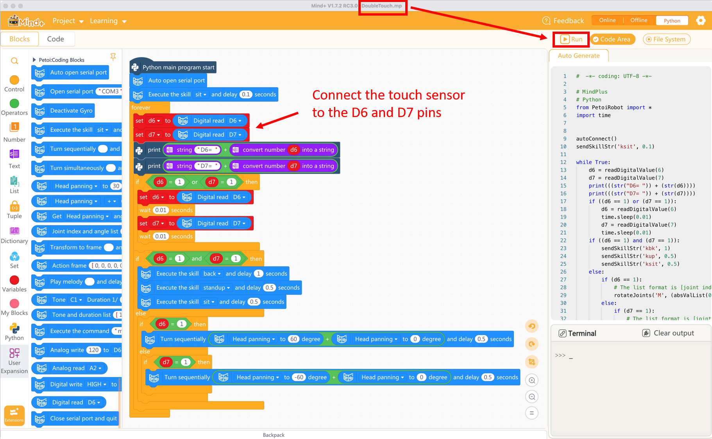
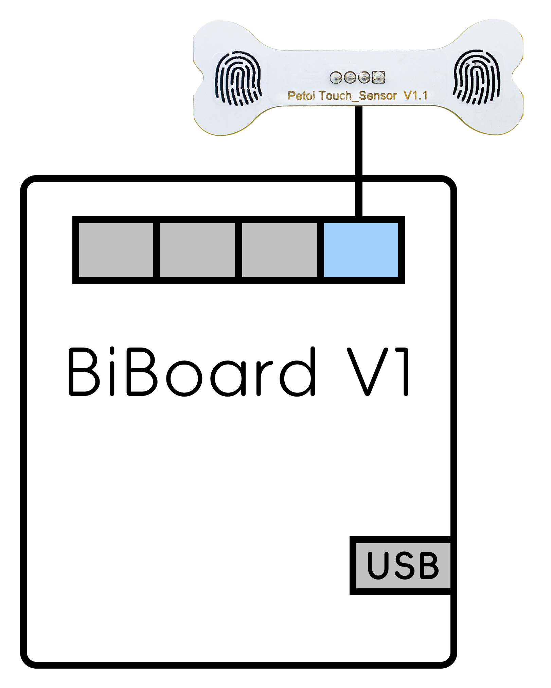
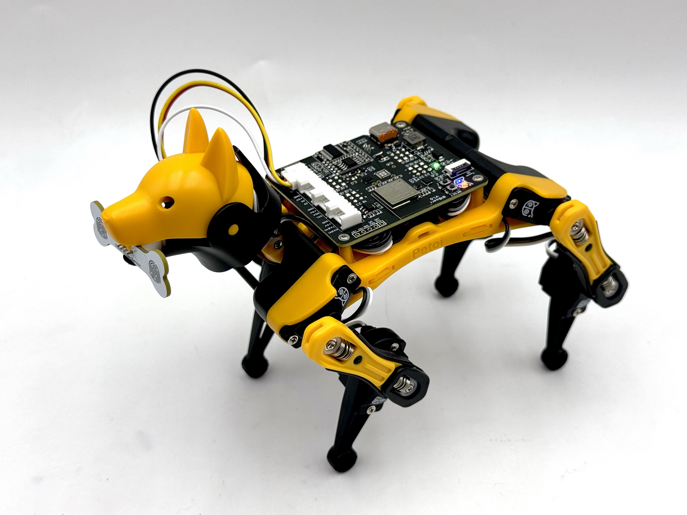

# Touch Sensor



## Function introduction

The sensor contains two touch parts (left and right) and can detect changes in capacitance when a finger approaches. This means the touch sensor will output a high level whether your finger touches lightly or presses hard. You can realize the function you want by judging the detected value (1 for high level, 0 for low level).

<figure><figcaption></figcaption></figure>

## NyBoard

### Hardware setup

Connecting to the NyBoard with wire as shown in the following picture, connect to the NyBoard Grove interface, which includes D6, D7:

<figure><figcaption></figcaption></figure>

### Software setup

There are two methods to upload the touch mode firmware :

* Using the Petoi Desktop App
* Using the Arduino IDE

#### Petoi Desktop App

* You can use the [Firmware Uploader ](https://docs.petoi.com/desktop-app/firmware-uploader#select-the-correct-options-to-upload-the-latest-firmware)within the Petoi Desktop App.\
  Please select the correct _**Product**_ type, _**Board version**_, and _**Serial port**_ according to your actual use. The mode should be **Touch**, so press the **Upgrade the Firmware** button. \
  For example, Nybble, NyBoard\_V1\_2, COM5 as follows:

<figure><figcaption></figcaption></figure>

#### Arduino IDE

* You can use [Arduino IDE](https://www.arduino.cc/en/software) to upload and modify the source code.&#x20;

The code using this sensor has been integrated into the [**OpenCat**](https://github.com/PetoiCamp/OpenCat) project. Uncomment the line **`#define DOUBLE_TOUCH`**  in the **OpenCat.ino**, as shown in the figure below, use the Arduino IDE to upload the sketch to the robot main board, which can reproduce the example function of integrating the robot action.

#### Prepare the Arduino UNO development environment.

With **NyBoard V1\_\***, you can choose **Arduino Uno**.&#x20;

<figure><figcaption></figcaption></figure>

For example,  to modify the code for _**Bittle**_ as shown below:

<figure><figcaption></figcaption></figure>

#### Arduino module test code

If you want to test a touch sensor's function alone or learn more about its principles. You can use the Arduino IDE to upload the test code(**testDoubleTouch.ino**):

The test code is in the **OpenCat** project source code ([ModuleTests/testDoubleTouch](https://github.com/PetoiCamp/OpenCat/blob/main/ModuleTests/testDoubleTouch/testDoubleTouch.ino))

This demo sketch implements real-time printing of the detection values of D6 and D7 pins in the [serial monitor](https://docs.petoi.com/arduino-ide/serial-monitor):&#x20;

<figure><figcaption></figcaption></figure>

#### Mind+ Demo

1.  &#x20;You can upload the firmware via the Petoi Desktop App:

    .png>)


Or you can upload the **OpenCat.ino** as follows, uncomment the line **`#define GROVE_SERIAL_PASS_THROUGH`** in the **OpenCat.ino:**




For BiBoard, you can skip this step.


&#x20;2\.    Follow [the instructions](https://docs.petoi.com/block-based-programming/petoi-coding-blocks#import-petoi-mind+-extension-library) to import the Petoi Coding Blocks in the app **Mind+**, and load the Mind+ code file.

3. &#x20;Connect the robot and computer with the [USB adapter](https://docs.petoi.com/communication-modules/usb-downloader-ch340c)(USB uploader) or [Bluetooth module](https://docs.petoi.com/communication-modules/dual-mode-bluetooth).
4. &#x20;Power on the robot and click the **Run** button .png>) in **Mind+.**\

<figure><figcaption></figcaption></figure>

#### Mind+ Demo code

[https://github.com/PetoiCamp/Petoi\_MindPlusLib/blob/main/examples/NyBoard/DoubleTouch\_NyBoard.mp](https://github.com/PetoiCamp/Petoi_MindPlusLib/blob/main/examples/NyBoard/DoubleTouch_NyBoard.mp)

## BiBoard

### Hardware setup

#### BiBoard V0&#x20;

<figure><figcaption></figcaption></figure>

#### BiBoard V1

<figure><figcaption></figcaption></figure>

<figure><figcaption></figcaption></figure>

For specific use, the end connected to the sensor can be fixed on the robot's head (included in Bittle's mouth or attached to the top of Nybble's head). Of course, you can also use your creativity according to your needs.

### Software setup

There are two methods to upload the firmware :

* Using the Petoi Desktop App
* Using the Arduino IDE

#### Petoi Desktop App

*   You can use the [Firmware Uploader](https://docs.petoi.com/desktop-app/firmware-uploader#select-the-correct-options-to-upload-the-latest-firmware) within the Petoi Desktop App.

    Please select the correct _**Product**_ type, _**Board version**_, and _**Serial port**_ according to your actual use. The mode should be **Standard**, so press the **Upgrade the Firmware** button. \
    For example, Bittle, BiBoard\_V0\_2, COM5 as follows:

    <figure><figcaption></figcaption></figure>

#### Arduino IDE

*   You can use [Arduino IDE](https://www.arduino.cc/en/software) to [upload the sketch](https://docs.petoi.com/arduino-ide/upload-sketch-for-biboard#id-2.-set-up-biboard)(_**OpenCatEsp32.ino**_).&#x20;

    Use the latest OpenCatESP32 code to finish the setup. For example,  to modify the code for _**Bittle**_ as shown below:\

    <figure><figcaption></figcaption></figure>

After uploading, there are two methods to _**activate/deactivate**_ the touch mode:

* Serial Monitor
  * [Open the serial monitor](../arduino-ide/serial-monitor.md#biboard) and use the serial command "_**XT**_" to activate the touch mode.
  * Open the serial monitor and use the serial command "_**Xt**_" to deactivate the touch mode.
* Mobile App
  * Create [a mobile app command](https://docs.petoi.com/mobile-app/controller#create-a-single-command) called "**Activate touch**" and use the code: _`X84`_
  * Create a mobile app command called "**Deactivate touch**" and use the code: _`X116`_

#### Arduino module test code

The test code is in the **OpenCatESP32** project source code ([ModuleTests/testDoubleTouch](https://github.com/PetoiCamp/OpenCatEsp32/blob/main/ModuleTests/testDoubleTouch/testDoubleTouch.ino))

#### Mind+ Demo code

[https://github.com/PetoiCamp/Petoi\_MindPlusLib/blob/main/examples/BiBoard/DoubleTouch\_BiBoard.mp](https://github.com/PetoiCamp/Petoi_MindPlusLib/blob/main/examples/BiBoard/DoubleTouch_BiBoard.mp)

