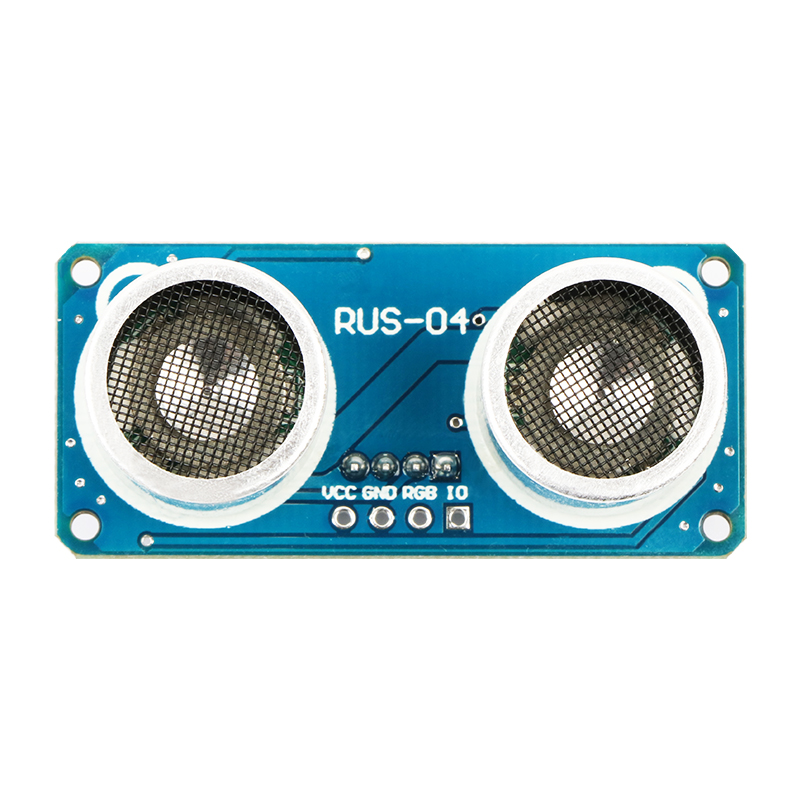
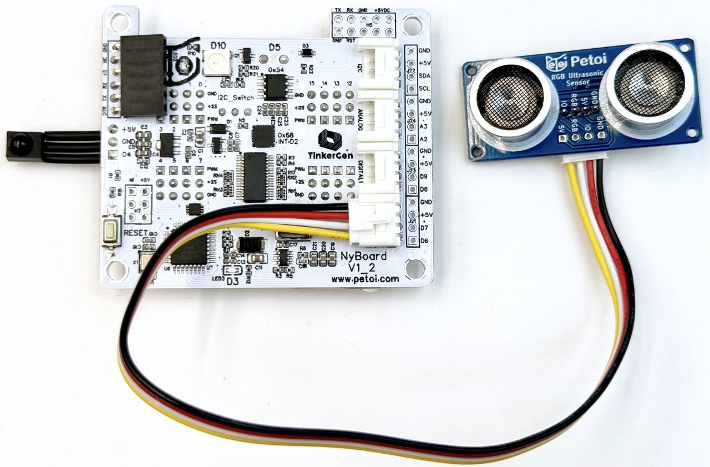
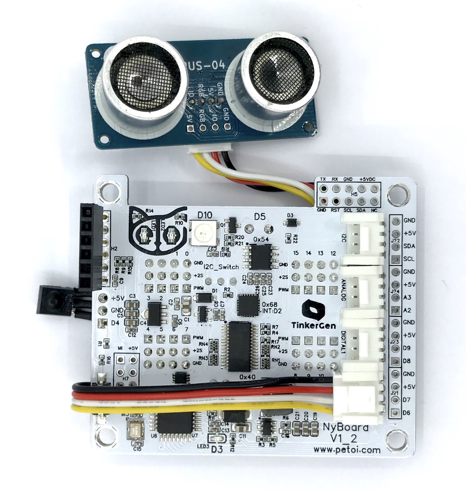
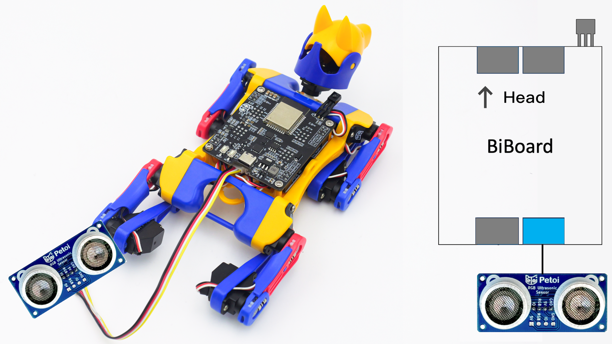
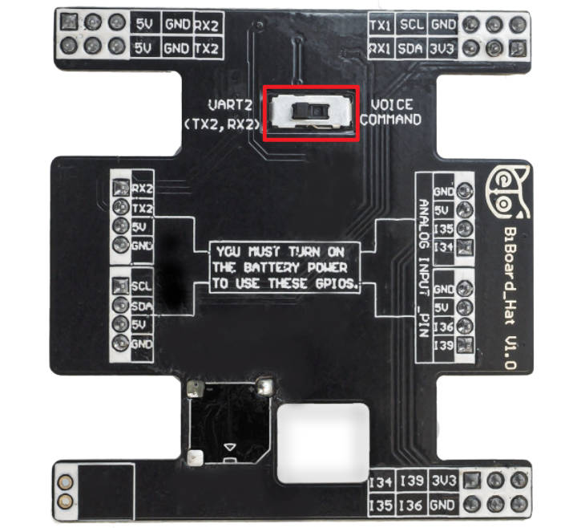
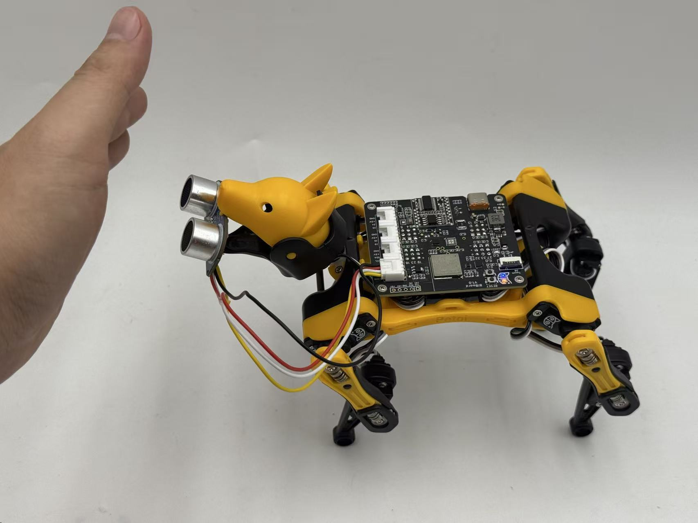

# Ultrasonic Sensor

## Function introduction

Petoi RGB Ultrasonic Sensor is a new module that integrates RGB LED and ultrasonic ranging. Only one GPIO is needed to operate the ultrasonic transceiver. While the ultrasonic probe measures the distance, the other GPIO pin can drive RGB LEDs with various light effects.

<figure><figcaption></figcaption></figure>


The previous one:



## NyBoard

### Hardware setup

Connecting to the NyBoard with wire as shown in the following picture:

<figure><figcaption></figcaption></figure>


The previous one:



Attach the ultrasonic sensor to [Nybble's eye](https://youtu.be/g7_ODr_3DTc).



### Software setup

There are two methods to upload the ultrasonic mode firmware :

* Using the Petoi Desktop App
* Using the Arduino IDE

#### Petoi Desktop App

* You can use the [Firmware Uploader](https://docs.petoi.com/desktop-app/firmware-uploader#select-the-correct-options-to-upload-the-latest-firmware) within the Petoi Desktop App.\
  Please select the correct _**Product**_ type, _**Board version**_, and _**Serial port**_ according to your actual use. The mode should be **Ultrasonic**, so press the **Upgrade the Firmware** button. \
  For example, Nybble, NyBoard\_V1\_2, COM5 as follows:

<figure><figcaption></figcaption></figure>

#### Arduino IDE

* You can use [Arduino IDE](https://www.arduino.cc/en/software) to upload and modify the source code.&#x20;

Use the latest OpenCat code to finish the setup. For example,  to modify the code for _**Nybble**_ as shown below:

.png>)

If you have already uploaded the latest OpenCat code to make Nybble walk, you only need to uncomment the **`#define ULTRASONIC`** at the beginning of OpenCat.ino, then upload the code.&#x20;

If you are unsure, you need to finish the [upload process for the standard mode](https://docs.petoi.com/arduino-ide/upload-sketch-for-nyboard) (Step 1 to Step 10) to ensure everything is configured correctly, then upload the code in the Ultrasonic mode.&#x20;

If the Ultrasonic code is uploaded correctly, you can see success messages printed on the [serial monitor](https://docs.petoi.com/arduino-ide/serial-monitor) of Arduino IDE. As shown below:

<figure><figcaption></figcaption></figure>

#### Arduino code demo

Ultrasonic module code realization function: The probe inside the ultrasonic module lights up with different-colored lights according to the different distances monitored by the ultrasonic module in real-time, and Nybble will make different action responses at the same time.

The demo video is as follows:



#### Mind+ demo code

[https://github.com/PetoiCamp/Petoi\_MindPlusLib/blob/main/examples/NyBoard/avoidObs\_NyBoard.mp](https://github.com/PetoiCamp/Petoi_MindPlusLib/blob/main/examples/NyBoard/avoidObs_NyBoard.mp)

## BiBoard

### Hardware setup

#### BiBoard V0&#x20;

Take Bittle X for example, connecting to the BiBoard with a wire as shown in the following picture:

<figure><figcaption></figcaption></figure>

The dial switch on the bottom of the BiBoard extension hat is dialed to _**UART2**_ .

<figure><figcaption></figcaption></figure>

#### BiBoard V1

The sensor should connect to the first Grove socket from the top.

<figure><figcaption></figcaption></figure>

### Software setup

There are two methods to upload the firmware :

* Using the Petoi Desktop App
* Using the Arduino IDE

#### Petoi Desktop App

*   You can use the [Firmware Uploader](https://docs.petoi.com/desktop-app/firmware-uploader#select-the-correct-options-to-upload-the-latest-firmware) within the Petoi Desktop App.\
    Please select the correct _**Product**_ type, _**Board version**_, and _**Serial port**_ according to your actual use. The mode should be **Standard**, so press the **Upgrade the Firmware** button. \
    For example, Bittle, BiBoard\_V0\_2, COM5 as follows:

    <figure><figcaption></figcaption></figure>

#### Arduino IDE

*   You can use [Arduino IDE](https://www.arduino.cc/en/software) to [upload the sketch](https://docs.petoi.com/arduino-ide/upload-sketch-for-biboard#id-2.-set-up-biboard)(_**OpenCatEsp32.ino**_). \
    Use the latest OpenCatESP32 code to finish the setup. For example,  to modify the code for _**Bittle**_ as shown below: 

    <figure><figcaption></figcaption></figure>

After uploading, there are two methods to _**activate/deactivate**_ the ultrasonic mode:

* Serial Monitor
  * [Open the serial monitor](../arduino-ide/serial-monitor.md#biboard) and use the serial command "_**XU**_" to activate the ultrasonic mode.
  * Open the serial monitor and use the serial command "_**Xu**_" to deactivate the ultrasonic mode.
* Mobile App
  * Create [a mobile app command](https://docs.petoi.com/mobile-app/controller#create-a-single-command) called "**Activate ultrasonic**" and use the code: _`X85`_
  * Create a mobile app command called "**Deactivate ultrasonic**" and use the code: _`X117`_

#### Mind+ demo code

[https://github.com/PetoiCamp/Petoi\_MindPlusLib/blob/main/examples/BiBoard/avoidObs\_BiBoard.mp](https://github.com/PetoiCamp/Petoi_MindPlusLib/blob/main/examples/BiBoard/avoidObs_BiBoard.mp)
