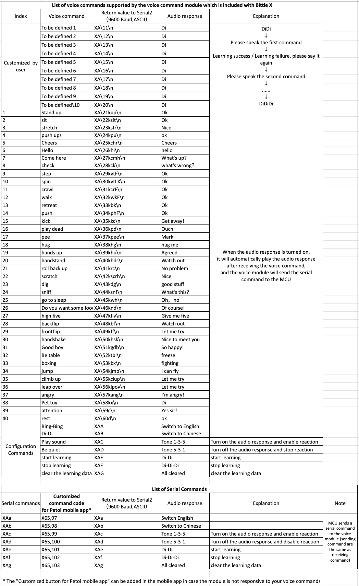
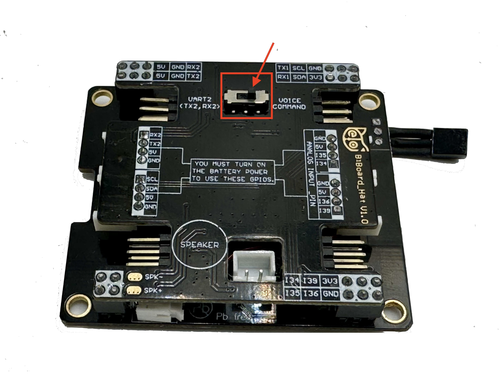

# Voice Command Module

## Demo video



## Function introduction

Using this module, you can control the Petoi robot to do various skills through voice without using wake words. Currently, the module supports 40 fixed voice commands in two languages (English and Chinese) and ten customized commands by recording any sound clips.&#x20;

## NyBoard

### Hardware setup

The module can be installed on **NyBoard** via the Grove interface.

<figure><figcaption></figcaption></figure>

Connecting to the NyBoard with wire as shown in the following picture, connect to the NyBoard Grove interface, which includes D8, D9:

<figure><figcaption></figcaption></figure>

### Software setup

#### Petoi Desktop App

*   You can use the [Firmware Uploader ](https://docs.petoi.com/desktop-app/firmware-uploader#select-the-correct-options-to-upload-the-latest-firmware)within the Petoi Desktop App.\


    <figure><figcaption></figcaption></figure>

#### Arduino IDE

* You can use [Arduino IDE](https://www.arduino.cc/en/software)  to upload and modify the source code.&#x20;

The module code is integrated into the [**OpenCat**](https://github.com/PetoiCamp/OpenCat) project. Uncomment the line **`#define VOICE`**  in the **OpenCat.ino**, as shown in the figure below. Then, use Arduino IDE to upload the sketch to the robot's main board. The robot will work in **Voice mode.** This sketch will allow the robot to behave under voice commands.&#x20;

<figure><figcaption></figcaption></figure>

## BiBoard

### Hardware setup

#### BiBoard V0

It is built into the [**BiBoard V0's extension hat**](https://docs.petoi.com/biboard/biboard-extension-hat#peripherals) as follows:

<figure><figcaption></figcaption></figure>

#### BiBoard V1

It is built into the [BiBoard V1](https://docs.petoi.com/biboard/biboard-v1-guide) board as follows:

<figure><figcaption></figcaption></figure>

### Software setup

#### 1. Upload Firmware

* **Petoi Desktop App**

You can use the [Firmware Uploader](https://docs.petoi.com/desktop-app/firmware-uploader#select-the-correct-options-to-upload-the-latest-firmware) within the Petoi Desktop App.

Please select the correct _**Product**_ type, _**Borard version**_, and _**Serial port**_. The mode should be **Standard**, so press the **Upgrade the Firmware** button. for example, Bittle, BiBoard\_V0\_2, COM5 as follows:


* **Arduino IDE**

You can use [Arduino IDE](https://www.arduino.cc/en/software) to [upload the sketch](https://docs.petoi.com/arduino-ide/upload-sketch-for-biboard#id-2.-set-up-biboard)(_**OpenCatEsp32.ino**_).&#x20;

Use the latest OpenCatESP32 code to finish the setup. For example, to modify the code for _**Bittle**_ as shown below:


#### 2. Switch mode

After uploading,  the firmware is in **Voice** mode by default. If you need to switch, please open the serial monitor and input the serial command _**`XA`**_ to switch to **Voice** mode.

## Play with the voice commands.

### Common use cases

When the robot is restarted, the voice module will be automatically reset to its default language setting. The robot's default language setting is English.


This feature is exclusively designed for robots using **BiBoard** as their mainboard.


#### 1. Set the default language

There are two ways to set the default language:

* Using the serial commands
  * Open the [serial monitor](https://docs.petoi.com/arduino-ide/serial-monitor):
    * To set the default language to **English**, use the command: _**`XAa`**_.&#x20;
    * To set it to **Chinese**, use the command: _**`XAb`**_.
  * In the [mobile app](https://docs.petoi.com/mobile-app/controller#create-a-single-command):
    * To set the default language to **English**, create a mobile app command called **English** and use the code: _**`X65,97`**._
    * To set it to **Chinese**, create a mobile app command called **Chinese** and use the code: _**`X65,98`**._
* Using the voice commands
  * To set the default language to **English**, you need to say the voice command "**Lizheng**" (phonetic) first and then say "**Bing-Bing**" (phonetic).
  * To set it to **Chinese**, you need to say the voice command "**Attention**" first and then say "**Di-Di**"(phonetic).

#### 2. Switch the language temporarily

* To switch to **English**, you can say "**Bing-Bing**" (phonetic)
* Switch to **Chinese**, you can say "**Di-Di**" (phonetic)


Note: Use this method after rebooting the robot. The language will switch to the default language setting. Therefore, if you accidentally switch the language mode, you can restore the default language setting by restarting the robot.


#### 3. Turn on/off the voice command functionality(audio response and robotics reaction)

To turn on

* Speak **Play sound**&#x20;
* Create [a mobile app command](https://docs.petoi.com/mobile-app/controller#create-a-single-command) called "**Enable voice**" and use the code: _`X65,99`_

To turn off

* Speak **Be quiet**
* Create [a mobile app command](https://docs.petoi.com/mobile-app/controller#create-a-single-command) called **Disable voice** and use the code: _`X65,100`_

#### 4.  Use the predefined voice commands

You can refer to the list of available voice commands shown below:

<figure><figcaption></figcaption></figure>

See [**this doc**](https://docs.google.com/spreadsheets/d/1Lr6Cd1T-H9sSdUi_bI-OeMClkVOKjTQM/edit?usp=sharing\&ouid=106975882561093680387\&rtpof=true\&sd=true) for the latest version.


To avoid inadvertently triggering the robot to respond to voice commands, you can say **Be quiet** to the robot to disable the voice module, such as when talking with others.

If the above voice commands don't take effect in **English mode**, try to use the mobile app and create a new button with the code: _**`X65,100`**_, or input _**`XAd`**_ in the [serial monitor](https://docs.petoi.com/arduino-ide/serial-monitor) to disable the voice module.

\
You can say  **Play sound** to the robot to enable the voice module.

Use the mobile app and create a new button with the code: _**`X65,99`**_, or input _**`XAc`**_ in the [serial monitor](https://docs.petoi.com/arduino-ide/serial-monitor) to enable the voice module.





The voice command **Climb-up** is a challenge for you. You can [design the behavior](../desktop-app/skill-composer/) by yourself. Then, you can post it on the [Petoi Forum Challenge](https://www.petoi.camp/forum/challenge) or email support@petoi.com. We may adopt it in our official firmware and send you a gift!

For example, you can share your behavior like this:




### How to debug if the voice command doesn't work

In some cases, the voice module may not respond to your voice. Please check the following:

1\. On Bittle X, the dial switch on the bottom of the BiBoard extension hat is dialed to **Voice Command**.

<figure><figcaption></figcaption></figure>

2\. Say **Play sound** to check if the robot responds with **Do-Re-Mi**. Sometimes, the voice may be accidentally set to muted mode triggered by **Be Quiet**.

3\. If the module doesn't make any sound with Play sound, say **Bing-Bing** to switch to English mode. You may try different tones and speeds to say **Bing-Bing**. The robot should respond with **Switch English** if not in **English mode**. It won't react with anything if it's already in English.&#x20;

4\. If the voice module still doesn't make any sound, you can try to reset it in our software tools.

#### Mobile app:

From version **1.2.0** of the mobile app, you can create a new button with the compound code:&#x20;

_**`^X65,99;!1000;X65,98;!1000;X65,97`**_

To reset the voice module to English mode. &#x20;

<figure><figcaption></figcaption></figure>


_**`X65,99`**_, or input _**`XAc`**_ in the [serial monitor](https://docs.petoi.com/arduino-ide/serial-monitor) enables the voice module.


_**`X65,97`**_ or  input _**`XAa`**_ in the serial monitor is equivalent to saying **Bing-Bing**, but excludes the chance that the voice is not recognized. Then you can try to say **Play sound** again.&#x20;




#### Desktop app:

From version 1.2.1, you can use the debugger tool to reset the voice module.



The above steps validate that the voice module is working. It's powered separately from the motion unit and should work regardless of the robot's status.&#x20;

5. Next, if you say **Hello**, the robot should wave its hand and validate that the complete reaction loop is good. Then, you can try other voice commands.&#x20;
6. Try powering off the mainboard by disconnecting the USB data cable, long-pressing the battery's button, and then re-powering the mainboard.

If the above steps cannot fix the problem, contact support@petoi.com for help.&#x20;

### Record customized voice commands

When the robot works in **English mode**,  you can speak **Start learning** (or input the serial command **XAe** in the serial monitor) into the custom voice command mode and record your voice commands in order.&#x20;


If the module is **not** in English mode, you can speak **Bing-Bing** (or input the serial command _**`XAa`**_ in the [serial monitor](https://docs.petoi.com/arduino-ide/serial-monitor)) to switch to **English mode**.


You can record up to 10 voice commands, <mark style="color:red;">each with no more than</mark> <mark style="color:red;"></mark><mark style="color:red;">**six**</mark> <mark style="color:red;"></mark><mark style="color:red;">syllables</mark>.

To exit the custom voice command mode in the middle, you can speak **Stop learning** (or input the serial command **XAf** in the serial monitor).&#x20;

After exiting the custom voice command mode, speak one of the recorded voice commands to trigger the reaction.

Speak **Clear the learning data** to delete all the recordings at once (you cannot delete a specific recording).

There are **ten** skill strings as custom replies already defined (but only the first five can see the actual reaction of the robot because they are predefined serial commands ) in the `voice.h`:

```cpp
const char voice1[] PROGMEM = "T";                                    //call the last skill data sent by the Skill Composer
const char voice2[] PROGMEM = "kpu1";                                 //single-handed pushup
const char voice3[] PROGMEM = "m0 80 0 -80";                          //move head
const char voice4[] PROGMEM = "kmw";                                  //moonwalk
const char voice5[] PROGMEM = "b14,8,14,8,21,8,21,8,23,8,23,8,21,4";  //twinkle star
const char voice6[] PROGMEM = "6th";
const char voice7[] PROGMEM = "7th";
const char voice8[] PROGMEM = "8th";
const char voice9[] PROGMEM = "9th";
const char voice10[] PROGMEM = "10th";
```

The response actions (**`kpu1`** means single-handed pushups, **`kmw`** means moonwalk) are already defined in the program.&#x20;

Other serial commands are also supported as responses, such as joint movements(e.g. **`m0 80 0 -80`**  means shaking the head left and right) and playing a melody(e.g. **`b14,8,14,8,21,8,21,8,23,8,23,8,21,4`**)

To use these custom replies above, you need to enter the custom voice command mode, record ten voice commands (such as Single-handed Pushup, Shake Head, Moonwalk, Twinkle Star), and then exit the custom voice command mode.

If you have recorded a voice command and the corresponding custom reply is not a predefined serial command((e.g.,**`5th`**), there is no actual demonstration effect; it only prints a simple message on the serial monitor when you speak the corresponding voice command.

## Advanced usage for developers

### Understand the principle

1. &#x20;Convert the voice command collected by the microphone in the module into a serial command.
2. &#x20;Send the serial command to the mainboard MCU through the soft serial port Serial2.
3. &#x20;After receiving the serial command, the MCU parses it into the corresponding skill command, and finally, the reaction module, according to the skill command, controls the robot to respond accordingly.

Upload the demo sketch **testVoiceCommander.ino**, and you can see every serial command that is sent to MCU(including the custom voice command if you have recorded it)

<figure><figcaption></figcaption></figure>

You can open [the serial monitor](https://docs.petoi.com/arduino-ide/serial-monitor) to check the raw return values of every voice command.&#x20;

<figure><figcaption></figcaption></figure>

<figure><figcaption></figcaption></figure>


After you speak the voice command to the robot, the **Returned value** (**`X A 11`** or **`X A 21 kup`**) is the corresponding serial command sent to the mainboard MCU. The third number(11 or 21) is an invisible character. To understand it, we convert it to a numeric value and print it out.


### The test sketch

The test sketch is in the OpenCat repository on GitHub (specific path: OpenCat/ModuleTests/testVoiceCommander). You can visit our GitHub repository [https://github.com/PetoiCamp/OpenCat](https://github.com/PetoiCamp/OpenCat) to download the complete code, as shown in the following picture:

<figure><figcaption></figcaption></figure>

### Serial interface

There are seven related serial commands for configuration; you can input them into the serial monitor.&#x20;

<table><thead><tr><th width="178">Serial Command</th><th width="222">Mobile App Button Code</th><th>Function</th></tr></thead><tbody><tr><td>XAa</td><td>X65,97</td><td>Set the default language to English</td></tr><tr><td>XAb</td><td>X65,98</td><td>Set the default language to Chinese</td></tr><tr><td>XAc</td><td>X65,99</td><td>Turn on the reply tone and enable reaction</td></tr><tr><td>XAd</td><td>X65,100</td><td>Turn off the reply tone and disable reaction</td></tr><tr><td>XAe</td><td>X65,101</td><td>Enter custom voice command mode</td></tr><tr><td>XAf</td><td>X65,102</td><td>Exit custom voice command mode</td></tr><tr><td>XAg</td><td>X65,103</td><td>Delete all the custom voice commands</td></tr></tbody></table>


After inputting the command above in the message box, **press Enter** to send the command to the robot.


### How to design new reactions

For the robot in [Voice mode](https://docs.petoi.com/extensible-modules/voice-command-module#software-setup), to improve the utilization rate of custom voice control commands, you can modify the last **six** skill strings to the skill names with actual action responses.

* Using the task queue to create a sequence of motions, please refer to the source code in the `voice.h` as below:

```cpp
if (index < 61) {
    token = raw[3];         //T_SKILL;
    shift = 4;              //3;
}
const char *cmd = raw.c_str() + shift;
tQueue->addTask(token, shift > 0 ? cmd : "", 2000);
char end = cmd[strlen(cmd) - 1];
if (!strcmp(cmd, "bk") || !strcmp(cmd, "x") || end >= 'A' && end <= 'Z' || end == 'x') {
    tQueue->addTask('k', "up");
```


tQueue is the task queue defined in OpenCat.h; using the method "addTask" of this object, the robot can do some simple skills sequentially as a custom voice command response.&#x20;


* Using [the Skill Composer](https://docs.petoi.com/desktop-app/skill-composer) and binding the customized voice command to the new skills

1. &#x20;Use SkillComposer to design new skills and then [export](https://docs.petoi.com/desktop-app/skill-composer#export-the-skill) them into `InstinctX.h`&#x20;
2.  &#x20;Modify _voice.h_ to bind the customized voice command to the new skills: insert **'k'+the new skill name** into the string variable（e.g.`voice1[]`If you want to bind the first customized voice command )

    ```cpp
    const char voice1[] PROGMEM = "kskill1";     // "k" is the token for skill, skill1 is the new skill name. 
    ```

