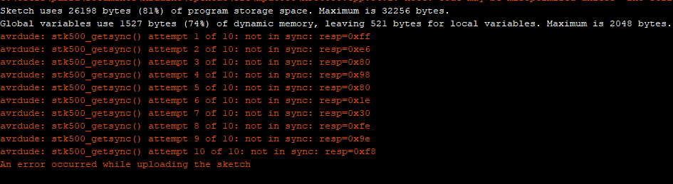
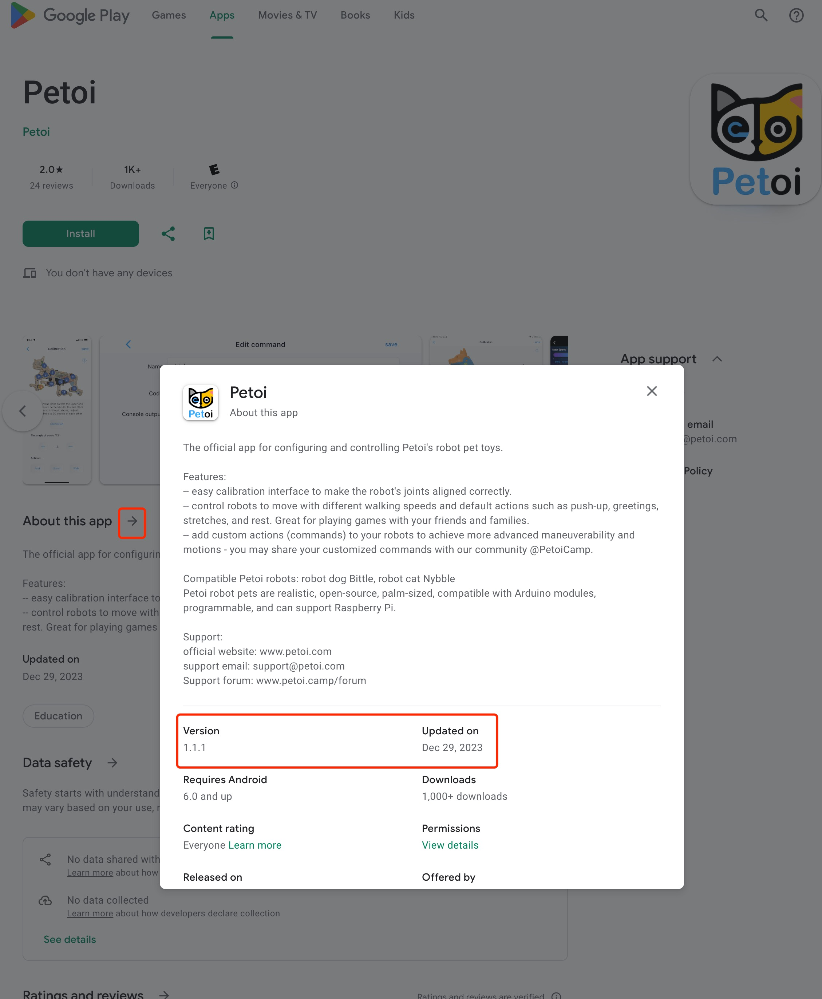

# 🙋‍♂️ FAQ(Frequently Asked Questions)

## Bittle vs Bittle X

### The doc seems to refer to Bittle and Bittle X interchangeably.   Why is that?

Bittle and Bittle X are [from the same family](https://www.petoi.com/pages/bittle-smart-robot-dog-model-overview) and share a lot of common things, except for the microcontroller difference where Bittle X uses BiBoard and Bittle uses NyBoard.  So we just refer to Bittle most of the time without specifically mentioning Bittle X.

## Sound

### What do different melodies from the board mean?

Please refer to the [**Buzzer beep meaning**](https://bittle.petoi.com/2-open-the-box#buzzer-beep-meaning)**.**

### How to adjust the buzzer volume?

* For NyBoard, please refer to [Mute/Unmute the buzzer beep](https://app.gitbook.com/s/-MPQ2vWEZUH7ol6XE55o-887967055/2-open-the-box#mute-unmute-the-buzzer-beep).
* For BiBoard, please refer to [Adjust the buzzer volume](https://app.gitbook.com/s/mRDa6shv5zOBEn468KU3/2-open-the-box#adjust-the-buzzer-volume).

## Software

### When using the mobile app, I found that my Petoi robot(Bittle or Nybble) was walking very slowly.&#x20;

Try turning off the Gyro in the [mobile app](https://docs.petoi.com/mobile-app/app-guide),  as shown in the following picture:

<figure><figcaption></figcaption></figure>

### When using the mobile app, Bittle cannot turn back up now.

Try turning on the Gyro in the [mobile app](https://docs.petoi.com/mobile-app/app-guide),  as shown in the following picture:

<figure><figcaption></figcaption></figure>

### Bittle doesn't walk very stable.

* Make sure you [calibrate](https://bittle.petoi.com/6-calibration) the joints with the included L-shaped tuner and understand the references
* Remove the rubber toe covers
* [Turning off the Gyro](faq-frequently-asked-questions.md#when-using-the-smartphone-app-i-found-that-bittle-was-walking-very-slowly.) will make slow gaits more stable

### When I use the play dead command with the mobile app, Bittle seems to be stuck in a forever loop trying to play dead again and again.

There's a known bug in one of the older firmware.  Please [upgrade to the latest firmware](https://docs.petoi.com/desktop-app/firmware-uploader).

### NyBoard can't upload firmware

The error that occurs when uploading the sketch is shown below:



<figure><figcaption></figcaption></figure>


\[1]. Do the simple checks as follows:

* Make sure there's no other program using the serial port, If you have opened the Arduino IDE and its serial monitor, it may occupy the serial port.
* Make sure the uploader is connected to the NyBoard [in the right way](https://docs.petoi.com/communication-modules/usb-downloader-ch340c#connect-nyboard).
* Make sure you're using the USB cable that comes with the kit, some USB cables may only have two wires for powering, but no data wires.

\[2]. For this operation, you can use a simple test sketch for convenience.&#x20;

* With the Petoi Desktop App, select the microcontroller type: **NyBoard\_V1\_\***, then you can upgrade the **Standard** firmware.
* With Arduino IDE, select the microcontroller type: **Board-> Arduino AVR Boards-> Arduino Uno**, then you can upload the sketch: **File-> Examples->04.Communication->ASCIITable.**

\[3]. Install [the USB uploader driver](https://docs.petoi.com/communication-modules/usb-downloader-ch340c#the-drivers).

\[4]. [Reset the bootloader](https://docs.petoi.com/technical-support/burn-bootloader-for-nyboard).


### Why there are two calibration stages?

There are two calibration steps for different components.

Because the controller board has limited resources, we divide the program into two stages.

In the first stage, we upload the program and large data to the onboard EEPROM (hard disk) and use the remaining programming space to calibrate the IMU, a sensor that measures the body orientation. The board should be leveled and untouched during the (IMU) calibration.

In the second stage, we upload the standard functional code. For the first-time configuration, we need to enter the (joint) calibration state and attach the legs in the right direction.

If you use the Arduino IDE to set up the board, you will handle those stages explicitly. The Petoi Desktop App can finish the two-stage uploading in the background. The mobile app can work only with an already configured board. Its (joint) calibration is only for attaching the legs.

### If I buy the pre-assembled Bittle, does it still need to be calibrated?

Yes, you still need to use the desktop app/mobile app/Arduino IDE [to fine-tune the joints](https://bittle.petoi.com/6-calibration) if your robot doesn't walk very stable.&#x20;

### If I buy a microcontroller such as NyBoard or BiBoard alone, do I have to buy a separate software program to make it work?

Our microcontrollers are specifically designed for our robots. The open source code is free to use and can be downloaded on [GitHub](https://github.com/PetoiCamp).

### Could Python be used to control any Petoi robot?&#x20;

You can [use Python to control any Petoi robot](https://docs.petoi.com/apis/python-api). The scripts can work either on your computer and connect to the robot wired or wirelessly.&#x20;

### Can your robot (Bittle / Nybble) function on its own? Or does it only work with the commands I give it? Also, can it learn?

It follows your instructions via the infrared remote, mobile app, or desktop app. It can also do random behaviors if you [enable the random mode](https://www.youtube.com/watch?v=nHLkE74Q3k8). Best of all, the program is open source on GitHub, and you can refer to [the relevant technical documents](https://bittle.petoi.com/11-tutorial-on-creating-new-skills) to create new skills for your robot.

### When running the Petoi Desktop App in MacOS14.1 (Sonoma), the buttons are not responsive. How to solve this problem?

This is due to the incompatibility of the Python Tk library with MacOS. The temporary solution is that you can press the button and drag the mouse slightly at the same time.

### How to set up Arduino IDE on ChromeOS (for Chromebook)

1. &#x20;Download the Arduino IDE(e.g. 1.8.19) for Linux from [https://github.com/arduino/Arduino/releases/download/1.8.19/arduino-1.8.19.tar.xz](https://github.com/arduino/Arduino/releases/download/1.8.19/arduino-1.8.19.tar.xz)
2. &#x20;Install it on the Chromebook. Please refer to the video at [https://www.youtube.com/watch?v=2cve6n4LZqI](https://www.youtube.com/watch?v=2cve6n4LZqI)
3. &#x20;Plug the USB adapter with a USB data cable (for NyBoard) or USB type-C data cable (for BiBoard) into the robot's microcontroller and the Chromebook.
4. &#x20;Set the Chromebook Linux VM to recognize the USB port

&#x20;      Settings => Advanced => Developers => Linux development environment => Manage USB devices => USB Serial (turn on)


NOTE: Step 4 must be repeated every time the USB connection is reconnected/powered on.


### Unable to find the OpenCat library

If you have downloaded and unzipped the OpenCat folder but see the following error:

```
OpenCat:82:10: fatal error: src/OpenCat.h: No such file or directory 
#include "src/OpenCat.h" 
        ^~~~~~~~~~~~~~~
compilation terminated.
```

You should rename the unzipped **OpenCat-main** folder to **OpenCat** so that the **OpenCat.ino** matches the root name.&#x20;

For more information, please refer to: [https://docs.petoi.com/arduino-ide/upload-sketch-for-nyboard#setup-process](https://docs.petoi.com/arduino-ide/upload-sketch-for-nyboard#setup-process)

\
BTW, you also can upload the firmware via the Petoi Desktop App:&#x20;

[https://docs.petoi.com/upload-firmware](https://docs.petoi.com/upload-firmware)\
[https://docs.petoi.com/desktop-app/firmware-uploader](https://docs.petoi.com/desktop-app/firmware-uploader)

### I'm on Windows 11 and cannot find the robot in the Bluetooth device list

Try to set "Bluetooth devices discovery" to "Advanced" as follows:

<figure><figcaption></figcaption></figure>

### How to install the CP210x driver on Windows

In the **Device Manager**, if you open the Other devices list, you may see a CP210X device with a triangle exclamation sign. Right-click it to find the "update driver" option, then select the enclosing folder of your [downloaded driver to install](https://docs.petoi.com/technical-support/useful-tools#biboard-driver-to-access-the-serial-port).

<figure><figcaption></figcaption></figure>

### When use mobile App connects to the robot, it indicates "The device doesn't seem to be a Petoi robot."

When connecting, the app will send handshake signals to the robot, and the robot should be running the firmware in standard mode to respond correctly. If the app returns a "not Petoi robot" error, it's probably due to a firmware issue. Please follow this debugging process:

<figure><figcaption></figcaption></figure>

\[1]. Please check the version of the app as follows:

<figure><figcaption></figcaption></figure>

<figure><figcaption></figcaption></figure>

* App Store

<figure><figcaption></figcaption></figure>

* Google Play

<figure><figcaption></figcaption></figure>

\[2]. For the startup melody in normal mode, please refer to the **00:13** in the video below:



For how to open the serial monitor and input the serial command, please refer to the instructions in the Petoi Doc Center.

* [BiBoard](https://docs.petoi.com/arduino-ide/upload-sketch-for-biboard#id-2.5-connect-to-biboard-via-usb-type-c-data-cable)
* [NyBoard](https://docs.petoi.com/arduino-ide/upload-sketch-for-nyboard#id-6.-open-the-serial-monitor)

\[3]. You can upgrade the firmware via the [Petoi Desktop App](https://docs.petoi.com/desktop-app/firmware-uploader).

For NyBoard, if the firmware can not be upgraded, please refer to [NyBoard can't upload firmware](https://docs.petoi.com/technical-support/faq-frequently-asked-questions#nyboard-cant-upload-firmware)

## Hardware

### How can I easily install the springs into the upper legs of Bittle?

Please check out [the forum](https://www.petoi.camp/forum/basic-assembly-and-setup/just-got-my-bittle-kit-can-t-install-springs) post discussing installing springs with various tools.  Or you can [request](https://www.petoi.com/pages/contact-us) Bittle upper legs with pre-installed springs

### I can't find the toe covers. What are the toe covers for?

The toe covers are for special experiments that require more friction. They are not required for regular walking and performance. We have removed them from the standard kit recently, and you may order them as optional accessories.

### Some frame structures are broken. Where can I get replacement parts?

You may [contact us](https://www.petoi.com/pages/contact-us). Show the picture of the broken pieces and explain how they broke. You may find the [3D-printable files](https://github.com/PetoiCamp/NonCodeFiles/tree/master/stl) or get a replacement directly from us.

### Bittle's neck is loose and may fall accidentally. How can I reinforce the connection?

Please refer to Bittle's instruction in [Final Assembly.](https://bittle.petoi.com/7-final-assembly#7.1-head)&#x20;

### Where can I get the bone shown in Bittle's picture?

The little bone is included in the [Intelligent Camera Module](https://docs.petoi.com/extensible-modules/mu-camera) box, and it is not being sold separately. You may download its 3D-printable file at: [`https://github.com/PetoiCamp/NonCodeFiles/blob/master/stl/Bittle_bone.stl`](https://github.com/PetoiCamp/NonCodeFiles/blob/master/stl/Bittle_bone.stl)

### Does it come with a battery, or do you have to buy a lithium battery?

Both Bittle kit and pre-assembled Bittle include one Lithium battery with a built-in charging circuit. You may add more [spare batteries](https://www.petoi.com/products/li-ion-battery-for-petoi-robot-pets).

### Does Rasberry Pi require any additional components?

You can solder the 2x5 socket on the NyBoard and then mount the Rasberry Pi on the NyBoard.&#x20;

Read more at [https://docs.petoi.com/api/raspberry-pi-serial-port-as-an-interface](https://docs.petoi.com/api/raspberry-pi-serial-port-as-an-interface)

### The robot servos don't seem to be working.  How to debug the servos?

<figure><figcaption></figcaption></figure>


\[1]. [Re-upload the firmware](https://docs.petoi.com/arduino-ide/upload-sketch-for-nyboard#5.-upload-the-configuration-mode-sketch)

\[2]. [Calibrate the PWM signal](https://docs.petoi.com/arduino-ide/upload-sketch-for-nyboard#9.-calibrate-the-servo-controller-chip-pca9685)

\[3]. [Swap the pin definitions](https://docs.petoi.com/arduino-ide/upload-sketch-for-nyboard#12.-modify-the-joint-pin-mapping)


### Quick fix the servo motor engagement

In some cases, the motor's output gear may disengage with the following gear. It will result in an abnormal buzzing sound inside the servo. You can take off the bottom of the servo and push the motor inward very hard until you hear a clicking sound.&#x20;

<figure><figcaption></figcaption></figure>

### The camera module can't work after being connected to the BiBoard extension hat.

Please refer to the [FAQ](extensible-modules/mu-camera.md#faq) on the MU camera.

### The serial port can't be found when using a USB type-C data cable to connect the BiBoard to the computer.&#x20;

Turn off the battery's power to see if the serial port can appear. Please refer to [Connect to BiBoard via USB type-C data cable](https://docs.petoi.com/arduino-ide/upload-sketch-for-biboard#id-2.5-connect-to-biboard-via-usb-type-c-data-cable).

## Resources and links

### Driver for CH340 USB uploader

* Mac: [http://www.wch-ic.com/download/CH341SER\_MAC\_ZIP.html](http://www.wch-ic.com/download/CH341SER_MAC_ZIP.html)
* Windows: [http://www.wch-ic.com/downloads/CH341SER\_EXE.html](http://www.wch-ic.com/downloads/CH341SER_EXE.html)

### Can I use block-based coding with any Petoi robot?  Do I need to purchase add-on components/modules?

You can use [Petoi Coding blocks](https://docs.petoi.com/graphical-programming-interface/petoi-coding-blocks) to do Scratch-like block-based programming with all of Petoi robots.&#x20;

There's nothing else to purchase.

<figure><figcaption></figcaption></figure>
