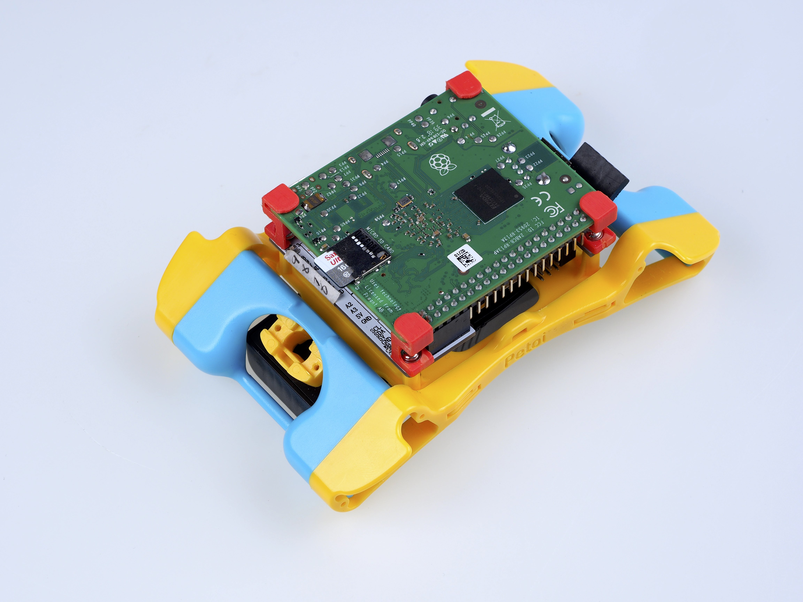

# Upload Sketch For NyBoard (software 1.0)

The following video shows the software configuration using our robot dog Bittle. The steps are identical to Nybble except that you need to change the model definition in OpenCat.h to Nybble.&#x20;

```cpp
//#include "InstinctBittle.h" //activate the correct header file according to your model 
#include "InstinctNybble.h" 
```


Quick Software Setup Guide


## 1. NyBoard

### 1.1 Read the user manual

Find the version information for your board on NyBoard. As shown below:

.jpg>)

#### Nybble

Find the version info on NyBoard. Read the user manual for [NyBoard V0\_1](https://github.com/PetoiCamp/OpenCat-Old/blob/master/Resources/NyBoard/NyBoardV0_1.pdf), [NyBoard V0\_2](https://github.com/PetoiCamp/OpenCat-Old/blob/master/Resources/NyBoard/NyBoardV0_2.pdf) , [NyBoard V1\_0](https://docs.petoi.com/nyboard/nyboard-v1_0), or [NyBoard V1\_1](https://docs.petoi.com/nyboard/nyboard-v1_1) (a light revision) accordingly.&#x20;

#### Bittle

Find the version info on NyBoard. Read the user manual for [NyBoard V1\_0](https://docs.petoi.com/nyboard/nyboard-v1_0) or [NyBoard V1\_1](https://docs.petoi.com/nyboard/nyboard-v1_1) (a light revision) accordingly.

Take NyBoard V1\_0 as an example, as shown in the following figure:



Wrong operations may damage your NyBoard!


### 1.2. Dial the slide switch to Arduino.

The slide switch changes the master of I2C devices (gyro/accelerometer, servo driver, external EEPROM).&#x20;

On default “Arduino”, NyBoard uses the onboard ATmega328P as the master chip;&#x20;

On “Pi”, NyBoard uses external chips connected through the I2C ports (SDA, SCL) as the master chip.


Sometimes if you cannot go through the bootup stage, maybe you have accidentally dialed the switch to "RPi".&#x20;



The following section is kept for Nybble older versions (V0)

### 1.3. Dial the potentiometer clockwise to start from the lowest voltage.


From NyBoard V0\_2, we provide a jumper selector to bypass the potentiometer. If you are using the metal servos in a standard Nybble kit, this section can be skipped.


Higher voltage will increase the servos’ torque and make Nybble move faster. The downside is it will increase current draw, reduce battery life, affect the stability of the circuit, and accelerate the wearing of the servos. Based on my tests, 5.5V seems to result in a balanced performance.

For the initial installation, don’t put screws on the NyBoard as you may need to take it out for tuning the potentiometer. Make sure all the servos can rotate fine in normal working conditions before making fine calibrations.


### 1.4. Adjust the NyBoard for optimized performance (no need for NyBoard V1\_0).

NyBoard is designed for two use cases. One is for Nybble that uses metal-geared servos, the other is for DIY robots that may use plastic geared servos. Plastic servos can only stand 6V so there is a step-down chip on NyBoard. The chip is rated for 5A maximal output, but can only be achieved with multiple proper settings and careful tuning.&#x20;

When using NyBoard with the metal-geared servos of Nybble, optimized performance can be achieved by some adjustment. For NyBoard\_V0\_1, you will need to do some soldering work as discussed in the [forum post](https://www.petoi.com/forum/hardware/reconfigure-nyboard-v0-1-for-pro-users). For NyBoard\_V0\_2, you can connect the jumper switch SW3 between BATT and V\_S (Considering safety for plastic servos, by default NyBoard comes with SW3 connecting V\_S and V+).&#x20;


V\_S means power for the servo. The jumper switch chooses whether to power the servos (V\_S) by the step-down chip (V+) or by the batteries (BATT) directly. So BATT and V+ should never be connected directly.



It turns out that NyBoard works more stable when powering the metal-geared servos directly with BATT rather than V+. However, if you are using NyBoard to drive your own plastic geared servos, you do need to use the step-down circuit.&#x20;



NyBoard powers the metal-geared servos directly with the 7.2V battery. It's 8.4V when fully charged. You CANNOT use NyBoard to drive your own plastic geared servos directly.

## 2. Downloads and installations


You will need the newest [Arduino IDE ](https://www.arduino.cc/en/software)to set up the environment. Older versions tend to compile larger hex files that may exceed the memory limit.&#x20;


If​ you have previously added other libraries and see an error message "XXX library is already installed", ​​​​I would recommend you delete them first (instruction:​​ [https://stackoverflow.com/questions/16752806/how-do-i-remove-a-library-from-the-arduino-environment](https://stackoverflow.com/questions/16752806/how-do-i-remove-a-library-from-the-arduino-environment)). Due to different configurations of your Arduino IDE installation, if you see any error messages regarding missing libraries during later compiling, just google and install them to your IDE.


If you downloaded the  [OpenCat(sw 1.0) ](https://github.com/PetoiCamp/OpenCat)code from GitHub after Jan 3, 2022, you can skip all the following libraries.&#x20;

### 2.1. Install through the library manager

Go to the library manager of Arduino IDE (instruction: [https://www.arduino.cc/en/Guide/Libraries](https://www.arduino.cc/en/Guide/Libraries)), search and install&#x20;

* **Adafruit PWM Servo Driver**
* **QList (optional)**
* **IRremote**

The IRremote library was updated recently. And for some reason, they even changed the encoding of the buttons. You **MUST** roll back the library's version to **2.6.1** in the library manager.

To save programming space, you **MUST** comment out the unused decoder in IRremote.h. It will save about 10% flash!

Find **Documents/Arduino/libraries/IRremote/src/IRremote.h** and set unused decoders to 0. That is, only **DECODE\_NEC** and **DECODE\_HASH** are set to 1, and others are set to 0.

```
#define DECODE_RC5           0
#define SEND_RC5             0

#define DECODE_RC6           0
#define SEND_RC6             0

#define DECODE_NEC           1
#define SEND_NEC             0

#define DECODE_SONY          0
#define SEND_SONY            0

...
set zeros all the way down the list 
...

#define DECODE_HASH          1 // special decoder for all protocols
```

### **2.2 Install by adding .ZIP library**

Go to [jrowberg/i2cdevlib: I2C device library collection for AVR/Arduino or other C++-based MCUs](https://github.com/jrowberg/i2cdevlib), download the zip file, and unzip. You can also git clone the whole repository.

​​

Use **Add .ZIP Library** to find **Arduino/MPU6050/** and **Arduino/I2Cdev/**. Click on the folders and **add them one by one**.​ They don’t have to be **.ZIP** files.​


### 2.3. Add NyBoard support to Arduino IDE&#x20;

With **NyBoard V1\_\***, you can simply choose **Arduino Uno**.&#x20;



The following section is kept for Nybble older versions (V0)

* If you have **NyBoard V0\_\*** which runs at 20MHz, you need to add our customized configuration file following the next steps:

#### Automatic method (many thanks to [A-Ron](https://github.com/asmagill)!)


1. Open the **Preferences...** panel&#x20;
2. In the **Additional Boards Manager URLs** field, add **https://raw.githubusercontent.com/PetoiCamp/OpenCat/master/Resources/NyBoard/boardManager/package\_petoi\_nyboard\_index.json**. If there are already URLs listed in this field, separate them with commas or click on the icon next to the field to open up an editor and add this URL to a new line. Make sure there's no space in the address when you copy-paste the link.
3. Click on the OK button to close the Preferences panel (you have to close the previously opened **Additional Boards Manager URLs** editor first, to close the Preference panel)
4. Open the **Boards Manager...** window with the **Tools -> Board: XXXX -> Boards Manager...** menu item.&#x20;
5. In the **Filter your search...** field, type **NyBoard**
6. Select the entry and click on **Install**
7. Click on the **Close** button
8. Select **ATmega328P (5V, 20 MHz) NyBoard** from the **Tools -> Board: XXXX** menu (NyBoardV0\_1 and NyBoardV0\_2 are using the same board settings.)

#### Manual Board Installation Method&#x20;


Only if the above method fails


●      Locate the file **boards.txt**

**Mac location**:

/Users/UserName/Library/Arduino15/packages/arduino/hardware/avr/version#/

**Or**:     &#x20;

/Applications/Arduino.app/Contents/Java/hardware/arduino/avr

To access, right-click on Arduino.app and choose Show Package Contents

**Windows location**:

C:\Program Files(x86)\Arduino\hardware\arduino\avr\\

IMPORTANT! If you have installed the Arduino IDE via the Microsoft Store, you likely will not have access to the folder where critical configuration files are stored. The easiest solution is to uninstall the IDE and download/re-install it directly from [https://www.arduino.cc](https://www.arduino.cc/).

**Linux**&#x20;

Downloading from the terminal or from the software manager might not give you the latest version which can be an issue. Please download the latest version from Arduino’s site: [https://www.arduino.cc/en/Main/Software](https://www.arduino.cc/en/Main/Software)

Unzip the package and `sudo install.sh`

The location of boards.txt files is:

Fedora: boards.txt is symlinked under:

/etc

Arch: boards.txt is found at:

/usr/share/arduino/hardware/archlinix-arduino/avr/

Mint:

location\_of\_installation/arduino/hardware/arduino/avr

Ubuntu (on 18.04 when installing with `apt-get install arduino`):&#x20;

/usr/share/arduino/hardware/arduino/boards.txt

after locating **boards.txt**:

●      Make a copy of **boards.txt** in case you want to roll back.

●      Create new **boards.txt**.

You can download my [**boards.txt**](https://raw.githubusercontent.com/PetoiCamp/OpenCat/master/Resources/NyBoard/boards.txt) file, or:

Edit your **boards.txt** with admin privilege. Find the section of&#x20;

pro.name=Arduino Pro or Pro Mini&#x20;

and insert the&#x20;

```
## Arduino Pro or Pro Mini (5V, 20 MHz) w/ ATmega328P
## --------------------------------------------------
pro.menu.cpu.20MHzatmega328=ATmega328P (5V, 20 MHz) NyBoard

pro.menu.cpu.20MHzatmega328.upload.maximum_size=30720
pro.menu.cpu.20MHzatmega328.upload.maximum_data_size=2048
pro.menu.cpu.20MHzatmega328.upload.speed=57600

pro.menu.cpu.20MHzatmega328.bootloader.low_fuses=0xFF
pro.menu.cpu.20MHzatmega328.bootloader.high_fuses=0xDA
pro.menu.cpu.20MHzatmega328.bootloader.extended_fuses=0xFD
pro.menu.cpu.20MHzatmega328.bootloader.file=atmega/ATmega328_20MHz.hex

pro.menu.cpu.20MHzatmega328.build.mcu=atmega328p
pro.menu.cpu.20MHzatmega328.build.f_cpu=20000000L

## Arduino Pro or Pro Mini (5V, 16 MHz) w/ ATmega328P
## --------------------------------------------------
```

code block in the Arduino Pro or Pro Mini section as below. Save and quit your editor.

```
##############################################################
pro.name=Arduino Pro or Pro Mini

pro.upload.tool=avrdude
pro.upload.protocol=arduino

pro.bootloader.tool=avrdude
pro.bootloader.unlock_bits=0x3F
pro.bootloader.lock_bits=0x0F

pro.build.board=AVR_PRO
pro.build.core=arduino
pro.build.variant=eightanaloginputs

## Arduino Pro or Pro Mini (5V, 20 MHz) w/ ATmega328P
## --------------------------------------------------
pro.menu.cpu.20MHzatmega328=ATmega328P (5V, 20 MHz) NyBoard

pro.menu.cpu.20MHzatmega328.upload.maximum_size=30720
pro.menu.cpu.20MHzatmega328.upload.maximum_data_size=2048
pro.menu.cpu.20MHzatmega328.upload.speed=57600

pro.menu.cpu.20MHzatmega328.bootloader.low_fuses=0xFF
pro.menu.cpu.20MHzatmega328.bootloader.high_fuses=0xDA
pro.menu.cpu.20MHzatmega328.bootloader.extended_fuses=0xFD
pro.menu.cpu.20MHzatmega328.bootloader.file=atmega/ATmega328_20MHz.hex

pro.menu.cpu.20MHzatmega328.build.mcu=atmega328p
pro.menu.cpu.20MHzatmega328.build.f_cpu=20000000L

## Arduino Pro or Pro Mini (5V, 16 MHz) w/ ATmega328P
## --------------------------------------------------
```

●      Download [ATmega328\_20MHz.hex](https://raw.githubusercontent.com/PetoiCamp/OpenCat/master/Resources/NyBoard/bootloaders/atmega/ATmega328_20MHz.hex) and put it in your Arduino folder ./bootloaders/atmega/. You should see other bootloaders with the **.hex** suffix in the same folder.

Restart your Arduino IDE. In **Tools->Boards**, select Arduino Pro or Pro Mini. You should find ATmega328P (5V, **20** MHz) in the Processor menu.



If you cannot find the board, your Arduino IDE may be using the boards.txt in another path. Search boards.txt in all the folders on your computer. Find out the right file that's in effect.




Only if the bootloader of NyBoard collapsed, which is very unlikely to happen

### 2.4. Burn the bootloader (no need for normal use)

●      [What is a bootloader?](https://www.arduino.cc/en/Hacking/Bootloader?from=Tutorial.Bootloader)

Every NyBoard has to go through functionality checks before shipping, so they should already have a compatible bootloader installed. However, in rare cases, the bootloader may collapse then you won't be able to upload sketches through Arduino IDE.

Well, it's not always the bootloader if you cannot upload your sketch:

* &#x20;Sometimes your USB board will detect a large current draw from a device and deactivate the whole USB service. You will need to restart your USB service, or even reboot your computers;
* You need to install the driver for the FTDI USB 2.0 to the UART uploader;
* You haven't selected the correct port;
* Bad contacts;
* Bad luck. Tomorrow is another day! &#x20;

If you really decide to re-burn the bootloader:

* With **NyBoard V1\_\***, you can simply choose **Arduino Uno** under the **Tool** menu of Arduino IDE.
* If you have **NyBoard V0\_\*** which runs at 20MHz, you need to choose **NyBoard (ATmega328P 5V, 20MHz)**.


* Select your ISP (In-System Programmer). The above screenshot shows two popular programmers: the highlighted **USBtinyISP** is a cheap bootloader you can buy, while the checked **Arduino as ISP** can let you use a regular [Arduino as ISP](https://www.arduino.cc/en/Tutorial/ArduinoISP)!
* Connect the programmer with the SPI port on NyBoard. Notice the direction when connecting. Make sure they have good contact.
* Burn bootloader. If it's your first time doing so, wait patiently until you see several percent bars reach 100% and no more messages pop up for one minute.


### 2.5. Connect the uploader (sometimes referred to as the programmer)


This step does not require the Nyboard to be mounted on the robot.


.jpg>)

.jpeg>) .jpg>)


The following picture shows two  FTDI boards in previous kits for Nybble.

​

On the red board, the jumper selector should be put on 5V (not 3.3V) on the uploader for Arduino. Match the GND on both the uploader and the 6-pin socket on NyBoard.​


First connect the computer and the FTDI uploader with a miniUSB-USB cable. The red model uploader has three LED lights, power, Tx and Rx, and the blue model uploader has no power light. At the moment when the computer USB is connected, the Tx and Rx lights will flash and then go out, indicating that there is an initial information transmission. Then you can find the corresponding serial port “/dev/cu.usbserial-xxxxxxxx” (Mac OS) or “COM#” (Windows OS) in Tools->Port of Arduino IDE.


Connect your computer with the uploader through USB to micro-USB cable. The uploader has three LEDs, power, Tx, and Rx. Right after the connection, the Tx and Rx should blink for one second indicating initial communication, then dim. Only the power LED should keep lighting up. You can find a new port under **Tool->Port** as “/dev/cu.usbserial-xxxxxxxx” (Mac) or “COM#” (Windows).



If Tx and Rx keep lighting up, there’s something wrong with the USB communication. You won’t see the new port. It’s usually caused by overcurrent protection by your computer, if you’re not connecting NyBoard with an external power supply and the servos move all at once.&#x20;


For Linux, once the uploader is connected to your computer, you will see a “**ttyUSB#”** in the serial port list. But you may still get a serial port error when uploading. You will need to give the serial port permission. Please go to this link and follow the instructions: [https://playground.arduino.cc/Linux/All/#Permission](https://playground.arduino.cc/Linux/All/#Permission)


If you cannot find the serial port after connecting to your computer, you may need to install the driver for the CH340 chip.&#x20;

* [Mac](https://tn2lsjcal7.larksuite.com/drive/folder/fldusANNJtuYuZmpAfOZVlHvcKN)
* [Windows](https://tn2lsjcal7.larksuite.com/file/boxusYfwl2csrkA8G4DfBebmnkh)


### 2.6. Connect Bluetooth uploader (optional)

It’s possible to program and communicate with Bittle wirelessly. You can even control Nybble / Bittle with a [smartphone APP](http://www.codeandrobots.com/) or [web API](https://www.petoi.com/forum/software/web-api-to-control-nybble-opencatweb) from there!

We include our official [Bluetooth dongle](https://docs.petoi.com/modules/bluetooth-dual-mode) in the standard Nybble / Bittle kit. It can be used for wirelessly uploading sketches and communicating with the robot. **The baud rate is set to 115200.**

You need to connect it to your computer like what you do with a Bluetooth AirPod. The default passcode is 0000 or 1234. Then you can select it under **Tools->Port** of Arduino IDE, and use it in the same way as the wired uploader.&#x20;

For the specific connection method, please refer to [the corresponding chapter](https://docs.petoi.com/modules/bluetooth-dual-mode#connection-with-nyboard) of the Dual-Mode Bluetooth module.


.jpg>)


You will need to set its baudrate to **57600** to use it on NyBoard V0\_\* for Nybble.&#x20;



On Mac, the Bluetooth may lose connection after several uploads. In that case, delete the connection and reconnect to resume the functionality.&#x20;



The Bluetooth dongle is not included in the kit sold by Seeed Studio or its partners. Please write to support@petoi.com for more information.&#x20;


### 2.7. Download the OpenCat package

* Download the 1.0 ​OpenCat repository from GitHub: [https://github.com/PetoiCamp/OpenCat/tree/1.0](https://github.com/PetoiCamp/OpenCat/tree/2.0)
* If you download the Zip file of the codes, you will get an **OpenCat-1.0** folder after unzipping. You need to rename it to **OpenCat** before opening the OpenCat.ino.&#x20;


No matter where you save the folder, the file structure should be:

&#x20;&#x20;


* There are several **testX.ino** codes in **ModuleTests** folder. You can upload them to test certain modules separately. Open any **testX.ino** sketch with prefix “test”. (I recommend using **testBuzzer.ino** as your first test sketch)
* Open up the serial monitor and set up the baudrate:
  * For NyBoard V1\_\*, choose the board as **Arduino Uno** and later set the baudrate to 115200 in both the code and the serial monitor.&#x20;
  * For NyBoard V0\_\*, choose the board as **NyBoard (ATmega328P 5V, 20MHz)** and later set the baudrate to 57600 in both the code and the serial monitor.&#x20;
* Compile the code. There should be no error messages. Upload the sketch to your board and you should see Tx and Rx LEDs blink rapidly. Once they stop blinking, messages should appear on the serial monitor.
* Make sure you set "**No line ending**" to before entering your commands. Otherwise, the invisible '\n' or '\r' characters will confuse the parsing functions. &#x20;

.png>) 

For Linux machines, you may see the error message like "permission denied".&#x20;

.jpeg>)

You will need to add execution privilege to the avr-gcc to compile the Arduino sketch:`sudo chmod +x filePathToTheBinFolder/bin/avr-gcc`

Furthermore, you need to add execution permission to **all files** within /bin, so the command would be : `sudo chmod -R +x /filePathToTheBinFolder/bin`

## 3. Arduino IDE as an interface

With the USB/Bluetooth uploader connecting NyBoard and Arduino IDE, you have the ultimate interface to communicate with NyBoard and change every byte on it.&#x20;

I have defined a set of serial communication protocol for NyBoard:&#x20;

.png>)

All the token starts with a single Ascii encoded character to specify its parsing format. They are case-sensitive and usually in lower case.&#x20;


Some commands, like the **c** and **m** commands can be combined.&#x20;

For example:

Successive "m8 40", "m8 -35", "m 0 50" can be written as "m8 40 8 -35 0 50". You can combine up to four commands of the same type. To be exact, the length of the string should be smaller than 30 characters. You can change the limit in the code but there might be a systematic constraint for the serial buffer.



Some tokens haven't been implemented, such as 'h'. Token 'i' and 'l' still have some bugs in software version 1.0.


## 4. Raspberry Pi serial port as an interface&#x20;


Only when using Pi as a master controller. Nybble / Bittle doesn't need a Pi to move.&#x20;

You need to disconnect the serial uploader to communicate with Pi's serial port.&#x20;


You can solder a 2x5 socket on NyBoard to plug in a Raspberry Pi. Pi 3A+ is the best fit for Nybble / Bittle's dimension.&#x20;

### Nybble


### Bittle


After you solder on the socket, you won't be able to install the back cover of Bittle.&#x20;

You need to unplug the 6-pin programmer for the NyBoard before mounting the Pi to the board.&#x20;




The red [Pi standoff](https://github.com/PetoiCamp/NonCodeFiles/tree/master/stl/Bittle%20%26%20BittleX/RaspberryPiStandOff) can be 3D printed.&#x20;

.jpg>)

As shown in the [serial protocol](https://bittle.petoi.com/4-configuration#4-3-arduino-ide-as-an-interface), the arguments of tokens supported by Arduino IDE's serial monitor are all encoded as Ascii char strings for human readability. While a master computer (e.g. RasPi) supports extra commands, mostly encoded as binary strings for efficient encoding. For example, when encoding angle 65 degrees:

* Ascii: takes 2 bytes to store Ascii characters '6' and '5'
* Binary: takes 1 byte to store value 65, corresponding to Ascii character 'A'


What about value -113? It takes four bytes as an Ascii string but still takes only one byte in binary encoding, though the content will no longer be printable as a character.&#x20;


Obviously, binary encoding is much more efficient than the Ascii string. However, the message transferred will not be directly human-readable. In the OpenCat repository, I have put a simple Python script [ardSerial.py](https://github.com/PetoiCamp/OpenCat/blob/main/serialMaster/ardSerial.py) that can handle the serial communication between NyBoard and Pi.

### 4.1. Config Raspberry Pi serial port

In Pi's terminal, type `sudo raspi-config`

Under the **Interface** option, find **Serial**. Disabled the serial login shell and enable the serial interface to use the primary UART:

1. Run **raspi-config** with **sudo** privilege: `sudo raspi-config`.
2. Find Interface Options -> Serial Port.
3. At the option `Would you like a login shell to be accessible over serial?` select 'No'.
4. At the option `Would you like the serial port hardware to be enabled?` select 'Yes'.
5. Exit raspi-config and reboot for changes to take effect.


You also need to DISABLE the [1-wire interface of Pi](https://www.raspberrypi-spy.co.uk/2018/02/enable-1-wire-interface-raspberry-pi/) to avoid repeating reset signals sent by Pi's GPIO 4.&#x20;



[A good tutorial on the Pi Serial](https://www.raspberrypi.org/documentation/configuration/uart.md)


If you plug Pi into NyBoard's 2x5 socket, their serial ports should be automatically connected at 3.3V. Otherwise, pay attention to the Rx and Tx pins on your own AI chip and its voltage rating. The Rx on your chip should connect to the Tx of NyBoard, and Tx should connect to Rx.


Note: If you installed **Ubuntu** **OS** on Raspberry Pi, please config it as follows:

* add `enable_uart=1` to `/boot/config.txt`
* remove `console=serial0,115200` from `/boot/firmware/cmdline.txt` on Ubuntu and similar to`/boot/cmdline.txt` on Raspberry Pi OS
* disable the serial console: `sudo systemctl stop serial-getty@ttyS0.service && sudo systemctl disable serial-getty@ttyS0.service`
* make sure you have `pyserial` installed if you're using the python serial library, not python-serial from apt.
* create the following udev file (I created `/etc/udev/rules.d/50-tty.rules`):

```
KERNEL=="ttyS0", SYMLINK+="serial0" GROUP="tty" MODE="0660"
KERNEL=="ttyAMA0", SYMLINK+="serial1" GROUP="tty" MODE="0660"
```

* reload your udev rules: `sudo udevadm control --reload-rules && sudo udevadm trigger`
* change the group of the new serial devices:

```
sudo chgrp -h tty /dev/serial0
sudo chgrp -h tty /dev/serial1
```

* The devices are now under the tty group. Need to add the user to the tty group and dialout group:

```
sudo adduser $USER tty
sudo adduser $USER dialout
```

* update the permissions for group read on the devices:

```
sudo chmod g+r /dev/ttyS0
sudo chmod g+r /dev/ttyAMA0
```

* reboot

Or just create a script that will do this automatically.


### 4.2. Change the permission of [ardSerial.py](https://github.com/PetoiCamp/OpenCat/blob/master/SerialMasterPython/ardSerial.py)

If you want to run it as a bash command, you need to make it executable:

`chmod +x ardSerial.py`

You may need to change the proper path of your Python binary on the first line:

`#!/user/bin/python`

### 4.3. Use **ardSerial.py** as the commander of Bittle


NyBoard has only one serial port. You need to UNPLUG the FTDI converter if you want to control Bittle with Pi's serial port.


Typing `./ardSerial.py <args>` is almost equivalent to typing \<args> in Arduino's serial monitor. For example, `./ardSerial.py kcrF` means "perform s**k**ill **cr**awl **F**orward".

Both **ardSerial.py** and the parsing section in **OpenCat.ino** need more implementations to support all the serial commands in the protocol.


For Nybble:


Reduced motion capability may happen when connected to Pi! A stronger battery is needed.


With the additional current drawn by Pi, Nybble will be less capable for intense movements, such as trot (the token is`ktr`). The system is currently powered by two 14500 batteries in series. You may come up with better powering solutions, such as using high drain 7.4 Lipo batteries, or 2S-18650. There are a bunch of considerations to collaborate software and hardware for balanced performance. With Nybble's tiny body, it's better to serve as a platform for initiating the communication framework and behavior tree rather than a racing beast.


## 5. Battery

Though you can program NyBoard directly with the USB uploader, external power is required to drive the servos.&#x20;

When powering the NyBoard with only USB FTDI, there's obviously charging and uncharging in the servo's capacitor and cause the yellow LED to pulse. However the USB's current is not sufficient to keep the servos working. The servo circuit has to be powered by external batteries to work properly.

### Bittle

#### 5.1. Voltage

NyBoard requires 7.4\~8.4V external power to drive the servos. We include our customized Li-ion battery with built-in charging and protection circuit in the Bittle kit. Short press the battery's button will show its status. Blue light indicates it has power, and red means the power is low.&#x20;

#### 5.2. Connection and Power On

Be careful with the polarity when connecting the power supply. The terminal on NyBoard has an anti-reverse socket, so you won't be able to plug in the wrong direction.   See [here](https://bittle.petoi.com/5-connect-wires#5.2.-battery) for the detailed connection instruction.

Please long press the button of the battery for 3 seconds to power on the battery.  &#x20;


**Reversed connection may damage your NyBoard!**


#### 5.3. Battery life varies according to usage&#x20;

It can last hours if you're mainly coding and testing postures, or less than 30 mins if you keep Bittle running.&#x20;

The battery light will turn red when the power is low. The power will be cut off automatically.&#x20;

#### &#x20;5.4. Charging

Use a **5V-1A** USB charger to charge the battery. We don't recommend using fast chargers. The battery will **NOT** supply power during charging. Keep the battery in your sight when charging.&#x20;

#### 5.5. After use

After playing, remember to turn off the battery. It's recommended to unplug the battery from the NyBoard's terminal.

### Nybble

#### 5.1. Voltage

NyBoard requires 7.4\~9V external power to drive the servos. On Nybble, we are using the 8V standard to configure all the parameters as a whole system. That's usually two Li-ion or Li-poly batteries connected in series. A single battery is 4.2V when fully charged and can work normally until voltage drops to 3.6V. That’s about 7.2V with two batteries connected in series. Before installation, dial the potentiometer on NyBoard clockwise to try minimum output first (about 4.5V), then dial it up until it can make the robot work properly. With our kit servos, it actually works better to connect SW3 between BATT with V\_S directly and bypass the step-down chip (so no need to tune the potentiometer).&#x20;

When looking for batteries, search for keywords “14500 3.7V li-ion battery unprotected”. I’ve noticed that the overcurrent protection of some batteries could be triggered by peak current draw-(usually >2.5A), causing NyBoard to reset or malfunction. Try to find batteries with higher discharge ratings.&#x20;

Read this [forum ](https://www.petoi.com/forum/clinic/report-your-batteries)[post](https://www.petoi.com/forum/clinic/report-your-batteries) to find batteries that work on Nybble.&#x20;

#### 5.2. Dimensions

The included battery holder is sized for 14500 batteries, which is 14 mm in diameter, and 50 mm in length. 50 ± 1 mm should still fit in. They are the same size as AA batteries, but much more powerful. **Make sure not to use them in regular AA devices.** If you are in the US, we have tested with EBL 14500 li-ion batteries.&#x20;

You can also design other battery holders to carry larger batteries for better performance. That’s especially necessary if you mount a Raspberry Pi or want Nybble to run faster.&#x20;

#### 5.3. Connection&#x20;

Be careful with the polarity when connecting the power supply. Make sure you can find the positive (+) and negative (-) sign on both the NyBoard's power terminal and your power supply.&#x20;


**Reversed connection may damage your NyBoard!**


Loosen the screws of the power block. Insert the wires of the battery holder then tighten the screws. When turning the switch on, both the blue LED (for the chip) and the yellow LED (for servo) should lit up.&#x20;

.jpg>)

In the kit shipped after Jan.1st, the terminal is replaced with an anti-reverse socket, so you won't be able to plug in the wrong direction.&#x20;

#### 5.4. Battery life varies according to usage&#x20;

It can last hours if you're mainly coding and testing postures, or less than 30 mins if you keep Nybble running.&#x20;

When the battery is low, the yellow LED will blink slowly. Although NyBoard can still drive one or two servos, it will be very unstable to drive multiple servos at once.  **That will lead to repeatedly restarting the program or awkward joint rotations.** In rare cases, it may even alter the bits in EEPROM. You will need to reupload the codes and re-save the constants to recover.&#x20;

#### &#x20;5.5. Charging

You will need compatible smart chargers for the batteries. Keep batteries attended during charging.&#x20;

#### 5.6. After use

After playing, remember to **remove the batteries from the battery holder to avoid over-discharging**.&#x20;

#### 5.7. Signal interference

It's ok to connect both FTDI and battery at the same time. You can type in serial commands while the battery is connected. I do notice that the USB serial port could be disabled randomly. I think that's due to the sudden current draw by servos. It will trigger the computer’s overcurrent protection and disable the USB port. In that case, you can change the USB port you're connecting to, reset the USB bus, or restart the computer.  So actually it’s better to power the board by battery before plugging in the FTDI.&#x20;
