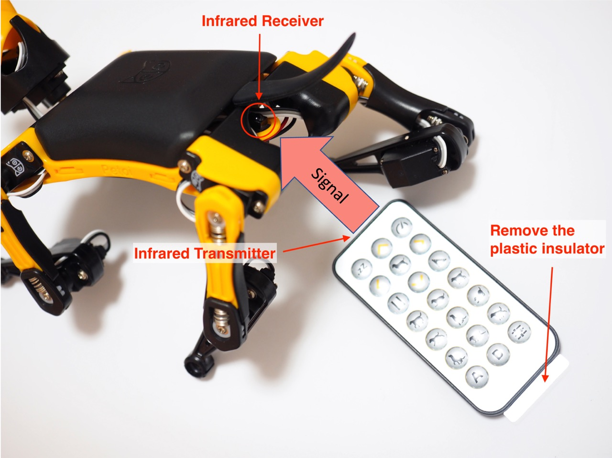
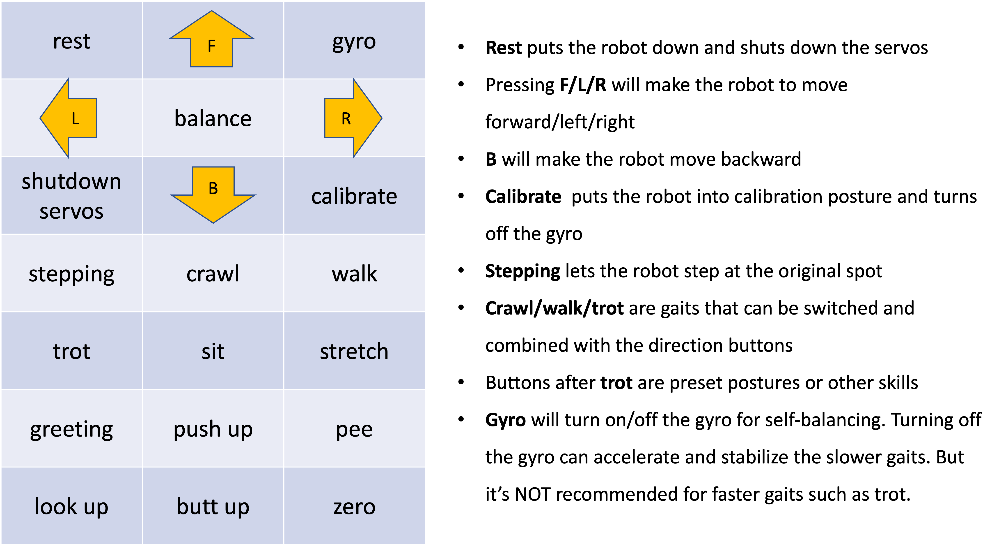

# Remote Controller

### 1. Preparation

#### BiBoard V0

The infrared receiver for **Bittle X** (mainboard type: BiBoard V0) is on the microcontroller near the neck of Bittle X.

<figure><figcaption>
BiBoard V0_x
</figcaption></figure>

#### NyBoard V1

The infrared receiver for Nyboard is near the tail of the Bittle robot dog.

<figure><figcaption>
NyBoard V1_*
</figcaption></figure>

Remote connection

The remote doesn't require pairing. Make sure its plastic insulation sheet is removed, and point the remote‘s transmitter to the receiver on the robot's back when operating. If the robot doesn't respond, you can use your phone‘s camera to check the transmitter. If it doesn't blink when clicking a button, you need to change its battery. If it blinks, it may indicate the program on the robot is not configured correctly.&#x20;

### 2. Keymap

Only the position of the buttons matters, though those symbols can help you remember the functionalities. It's better to define position-related symbols to refer to those keys, such as **K00** for the 1st row and 1st column, and **K32** for the 4th row and 3rd column.&#x20;

Abbreviations for key definitions can reduce SRAM usage. Due to the limited keys of a physical remote, you can change the definitions for convenience.&#x20;


The following map is just an illustration. Check the **`#define KXX command`**&#x69;n OpenCat/src/infrared.h for the actual key definitions in effect. They are also open to your customization.


We also made a customized remote panel for future batches. Previous users can download the design file and print it on A4 paper.&#x20;



.jpg>)

### 3. Check out the following featured motions

* **Rest** puts the robot down and shuts down the servos. It's always safe to click it if Nybble is doing something awkward.
* **Balance** is the neutral standing posture. You can push the robot from the sides and it will try to recover. You can test its balancing ability on a fluctuating board. Balancing is activated in most postures and gaits.
* Pressing **F/L/R** will make the robot move forward/left/right
* **B** will make the robot move backward
* **Calibrate** puts the robot into calibration posture and turns off the gyro
* **Stepping** lets the robot step at the original spot
* **Crawl/walk/trot** are the gaits that can be switched and combined with the direction buttons
* Buttons after **trot** are preset postures or other skills
* **Gyro** will turn on/off the gyro for self-balancing. Turning off the gyro can accelerate and stabilize the slower gaits. But it’s NOT recommended for faster gaits such as trot. Self-righting will be disabled because the robot no longer knows it's flipped.&#x20;
* Different surfaces have different friction and will affect walking performance. The carpet will be too bushy for the robot's short legs. It can only crawl (command **kcr**) over this kind of tough terrain.&#x20;
* You can pull the battery pack down and slide along the longer direction of the belly. That will tune the center of mass, which is very important for walking performance.&#x20;
* When the robot is walking, you can let it climb up/down a small slope (<10 degrees)


- If the robot keeps beeping after you connect the USB uploader, with numbers printed on the serial monitor, it’s the low voltage alarm being triggered. You need to power the mainboard with the battery to pass the threshold.
- The servos are designed to be driven by internal gears. Avoid rotating the servos too fast from the outside.&#x20;
- **Don’t keep the robot running for too long.** It will overheat the electronics and reduce the servos’ life span.&#x20;
- If you feel something is wrong with the robot, press the reset button on the main board to restart the program.&#x20;
- Be kind as if you were playing with a real kitten/puppy. (^=◕ᴥ◕=^)

