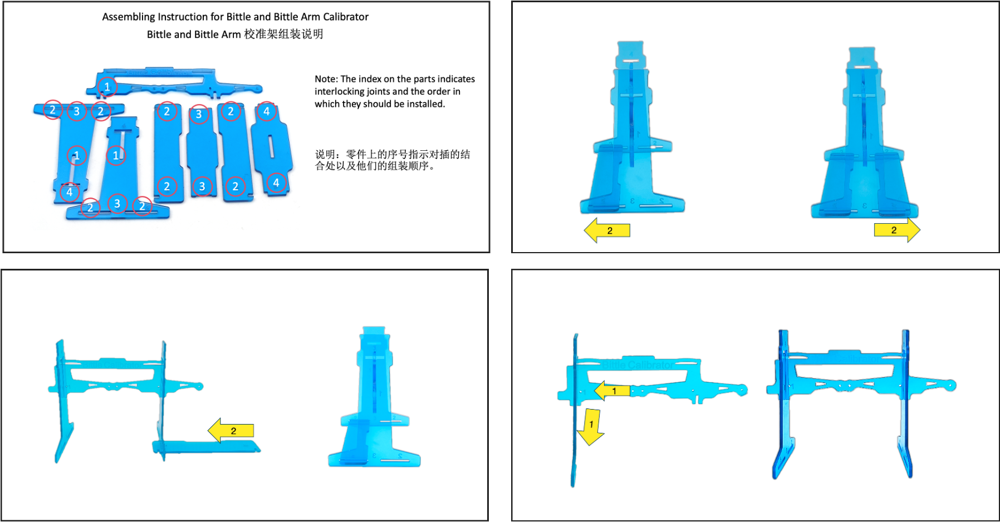
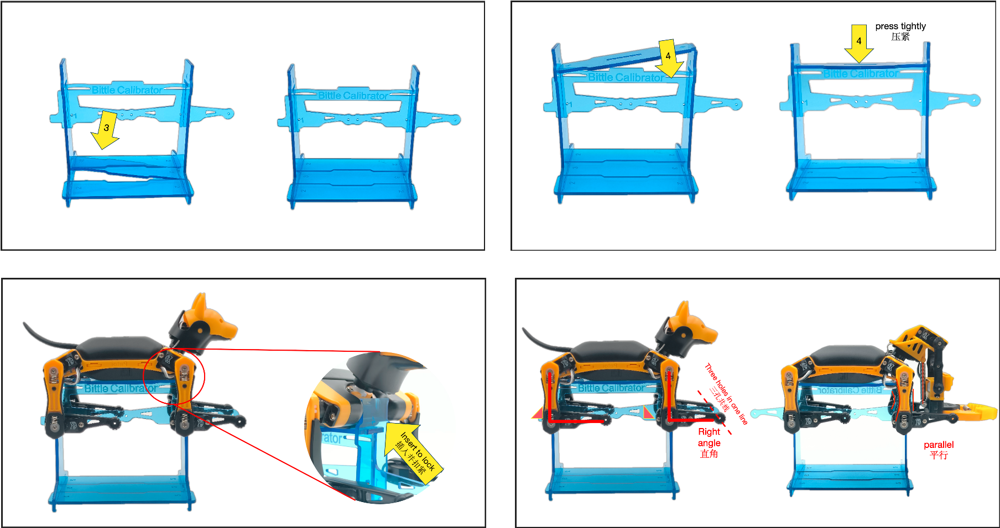
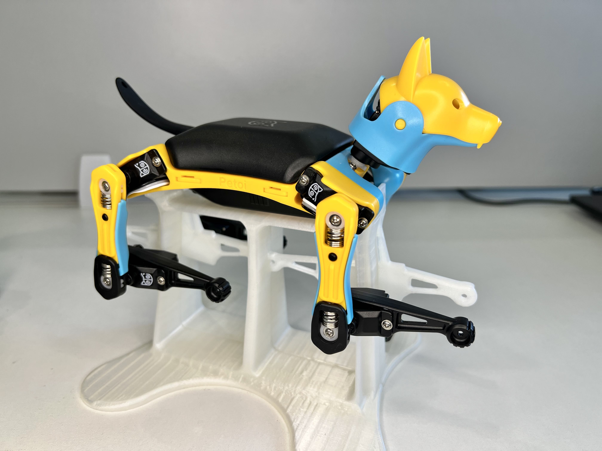
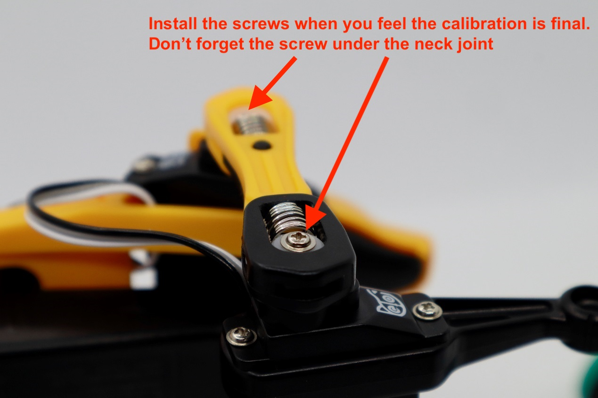
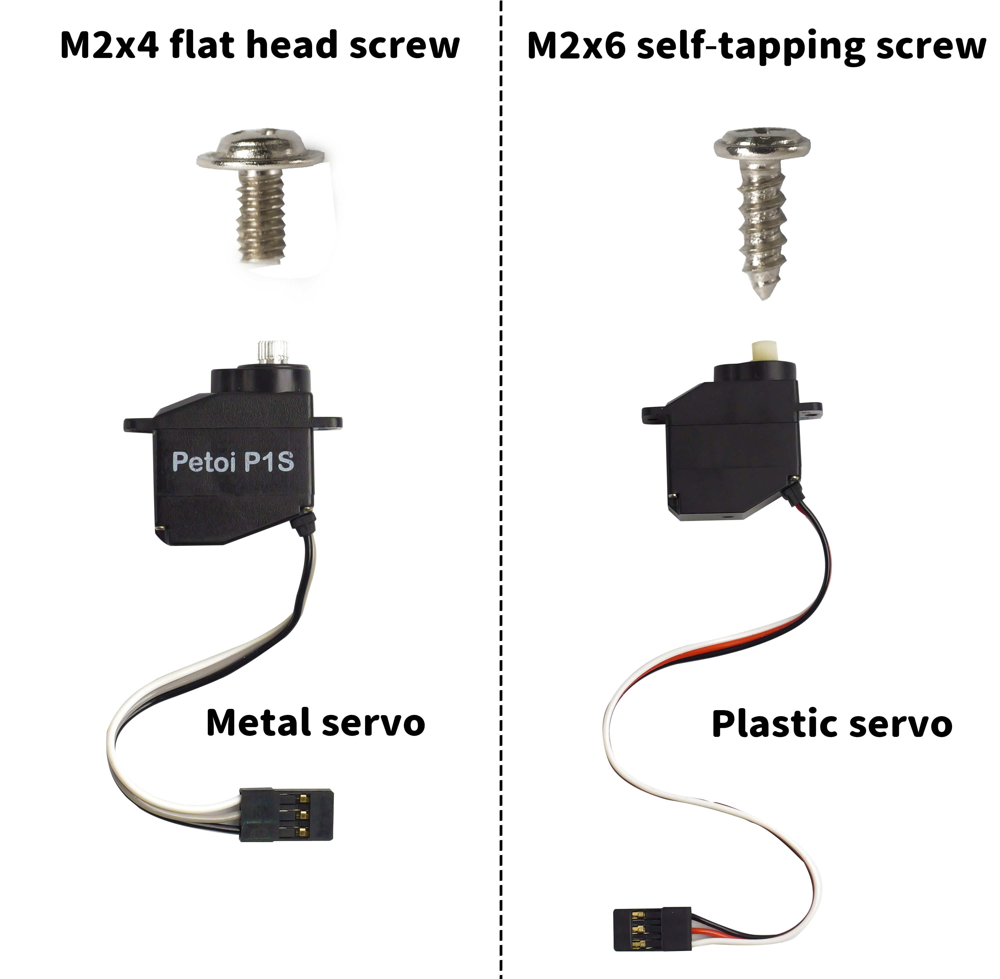

# Joint Calibration


Joint calibration is vital for the robot to work properly.&#x20;


The pre-assembled robot should have the legs installed, but you can further improve its performance by fine-tuning the joints' calibration.&#x20;

Make sure you have uploaded the OpenCat [Main function firmware](https://docs.petoi.com/arduino-ide/upload-sketch-for-nyboard#10.-upload-the-major-functionalities-sketch) before calibrating.&#x20;

This is a cool tutorial video made by one of our users, which briefs the process and explains its logic.&#x20;



### Calibration Stand


We have published the 3D structure of the Bittle / Bittle X (Bittle X+Arm)'s calibration bracket online. If you have a 3D printer, you can print it by yourself. Please check this page:&#x20;

[https://makerworld.com/en/models/1523424-calibration-and-test-stand-for-bittle-x-r-robot#profileId-1596686](https://makerworld.com/en/models/1523424-calibration-and-test-stand-for-bittle-x-r-robot#profileId-1596686)\
\
\
OR:\
[https://makerworld.com/en/models/457162-test-stand-for-petoi-bittle-robotic-dog#profileId-365135](https://makerworld.com/en/models/457162-test-stand-for-petoi-bittle-robotic-dog#profileId-365135)\



## \* The logic behind calibration is:

1. &#x20;You don't know where the servos are pointing before they are powered and calibrated. So if you attach the legs, the legs will rotate to random angles and may collide with the robot's body or other legs and get stuck. If a servo is stuck for a long time, it may break.&#x20;
2.  &#x20;The robot has a "**calib**" posture with all joints set at zero degrees. You can [put the robot to the **calib** posture](joint-calibration.md#enter-the-calibration-state) so that you know all the joints should be rotated to their zero points (though you cannot see because the legs are not attached to the servos yet). Then, you can attach the legs to the servos **one joint by one joint**, perpendicular to their nearby references on the body frame.  

    <figure><figcaption>
Calib Posture
</figcaption></figure>
3.  &#x20;Because the servo's gear teeth are discrete, aligning the legs to the right angles perfectly is impossible. So, you will need to fine-tune the offsets within the software.  

    <figure><figcaption>
Servo gear
</figcaption></figure>

The principles are the same for Nybble and Bittle.&#x20;

## Prepare to Enter the Calibration State

Entering calibration mode requires the following preparations: ‌

1\. All servo circuits are connected to the mainboard&#x20;

2\. The battery is plugged into the controller board and is turned on (long-press the button on the battery to turn on/off the power)

3\. Connect the robot to a computer or mobile phone

* Fon NyBoard, the [USB adapter](https://docs.petoi.com/communication-modules/usb-downloader-ch340c#connect-nyboard) or [Bluetooth dongle](https://docs.petoi.com/communication-modules/dual-mode-bluetooth) is used to connect the robot to a computer / mobile phone
* For BiBoard, The USB data cable connection must be made directly to **the BiBoard** and NOT to the battery's outside charging port. You can also connect to the computer / mobile phone via [Bluetooth](https://docs.petoi.com/bluetooth-connection).


If you build the robot from an unassembled kit, do not install the head and leg components before entering the calibration state.&#x20;



If you have a pre-assembled kit with the feedback servos, you can do [automatic calibration](https://docs.petoi.com/apis/serial-protocol/feedback-servos) to save time.

Note: For robots with robot arms, the automatic calibration function does **not** include the claw joint.


## Enter the Calibration State

The robot's legs may point to unknown angles when booting up. When entering the calibration state, the joints will be moved to their zero positions. You can see the output gears of the servos rotate and then stop. Then, you can attach the legs and fine-tune the joint offsets in the software interface. There are 3 software interfaces to enter the calibration state and fine-tune the joints.&#x20;

* Use the Mobile App [**Petoi**](https://docs.petoi.com/mobile-app/app-guide)
* Use [**Petoi Desktop App**](https://docs.petoi.com/desktop-app/joint-calibrator)
* Use [**Arduino IDE**](https://docs.petoi.com/arduino-ide/calibrate-the-joints-with-arduino-ide)


You can also enter the calibration state by booting up the robot with one side up. This method doesn't require any computer, remote, or smartphone app, so it's convenient when you are focused on assembling the robot from the kit.&#x20;

.png>)


## Install the screws

After completing the joint calibration, install the center screws to fix all the joint parts and servo gears.

<figure><figcaption></figcaption></figure>

<figure><figcaption></figcaption></figure>
