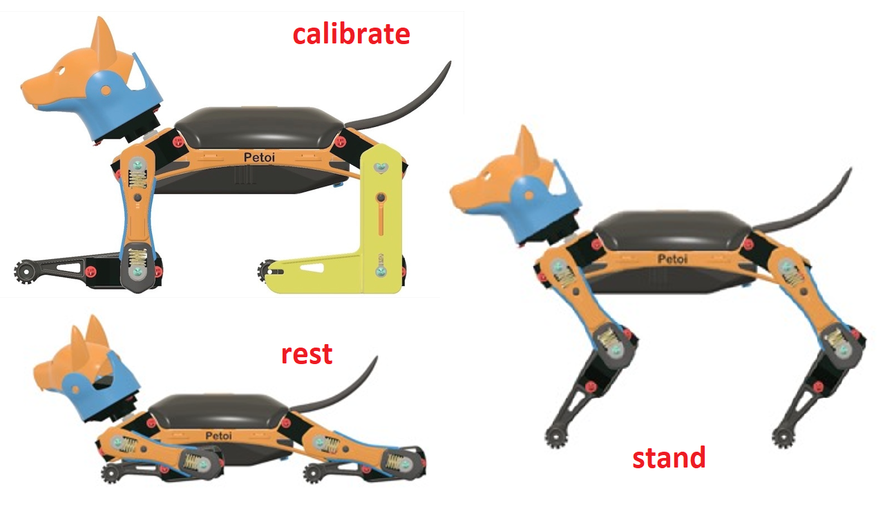

# Calibrator

## Prepare for calibration


For **NyBoard**:

* make sure you have uploaded the OpenCat [**Main function**](https://docs.petoi.com/desktop-app/firmware-uploader#uploading-process) firmware before calibrating.
* Only the software version 2.0 is supported to calibrate the joints via this App.
* You need to connect the [**Bluetooth module**](https://docs.petoi.com/communication-modules/dual-mode-bluetooth#connection-with-nyboard) with computer, install the battery and long-press the button on the battery to power the robot.


We recommend that you quickly browse the page's general content first. Then, based on the product type you are actually using, you can check the corresponding sub-page for more specific instructions.

You can refer to the sub-page of **Calibrator** in the **MOBILE APP**:

.png>)\

## Enter the calibration state

After the robot is powered on by the battery, there are 2 methods to enter the calibration state.&#x20;

Use **Bittle** for example:

*   Click the **Start Calibration** button.\

    <figure><figcaption></figcaption></figure>
*   Click the **Calibration** button in the calibration interface.\

    <figure><figcaption></figcaption></figure>

For the construction kit, you can install the body parts to the robot torso according to the instructions in the following sub-pages based on the products you choose.


For the construction kit, after installing the body parts, you do not need to use screws to fix the body parts to the robot trunk for the time being.



The pre-assembled robot should already have the legs properly installed. You can do the joint calibration for fine-tuning.&#x20;


When calibrating, Depending on the product you are using, select the corresponding calibration ruler in the sub-page as an aid. first select the index number of the joint servo from the diagram(when adjusting the leg servo, adjust the thigh first, and then adjust the calf), and then click the "+" or "-" button to fine-tune the joint to the right angle state.&#x20;


If the offset is more than +/- 9 degrees, you need to remove the corresponding part of the servo and re-install it by rotating one tooth, and then press the "+" or "-" button.

For example, if you have to use -10 as the calibration value, take the limb off, rotate by one tooth then attach it back. The new calibration value should be around 4, i.e.,  they sum up to 14. Avoid rotating the servo shaft during this adjustment.&#x20;


## Test calibration effect

You can click the skill buttons to switch between **Rest**, **Stand**, and **Walk** to test the calibration effect.&#x20;

Use **Bittle** for example:

If you want to continue calibrating, please click the **Calibration** button, and the robot will be in the calibration state again (all servos will move to the calibration position immediately).&#x20;


Note:&#x20;

You may need a second round of calibrations to achieve optimal results.


After calibration, remember to click the "Save" button to save the calibration offset. Otherwise, click "<" in the upper left corner to abandon the calibration.

## Install the screws for construction kit

For the construction kit, after completing the joint calibration, install the center screws to fix the leg parts and servo gears.
