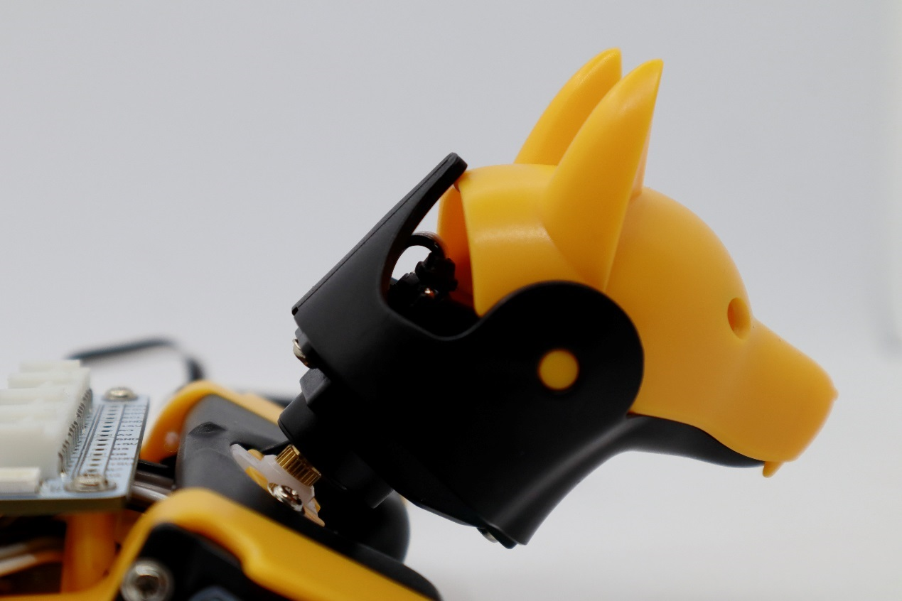

# Bittle


Bittle and Bittle X use the same calibrator interface.


The calibrator interface for Bittle is as following:


This interfaces will be displayed when you calibrate for the first time. You can also click to open the upper-right menu in the control panel and select **Calibrate** to re-access.



**After** the robot enter the calibration state, do the following steps:

### Install the head

In the calibration state, place the head as close to the central axis as possible and insert its servo shaft into the servo arm of the neck.

<figure><figcaption></figcaption></figure>

Press down on the head so it is firmly attached to the neck.

<figure><figcaption></figcaption></figure>

### Install the legs&#x20;

Install upper leg and lower leg components to the output teeth of the servos when the Bittle is powered on and in the calibration state. Please keep the torso, upper leg, and lower leg installed vertically as much as possible, and do not install the lower leg backward, as shown in the picture.&#x20;

<figure><figcaption></figcaption></figure>


The pre-assembled robot should already have t


**Use the included L-shaped tool as a reference**

.jpeg>)

