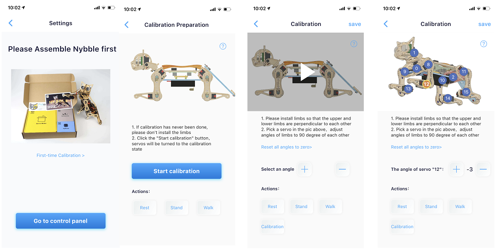
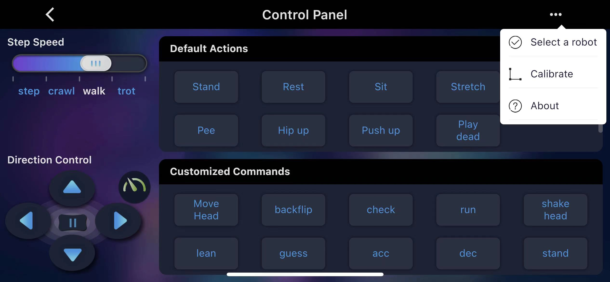

# Nybble

The calibrator interface for Nybble is as following:


This interfaces will be displayed when you calibrate for the first time. You can also click to open the upper-right menu in the control panel and select **Calibrate** to re-access.



**After** the robot enter the calibration state, install the head, legs and tail as the calibration posture.

**Use the included L-shaped tool as a reference**

.jpg>)
