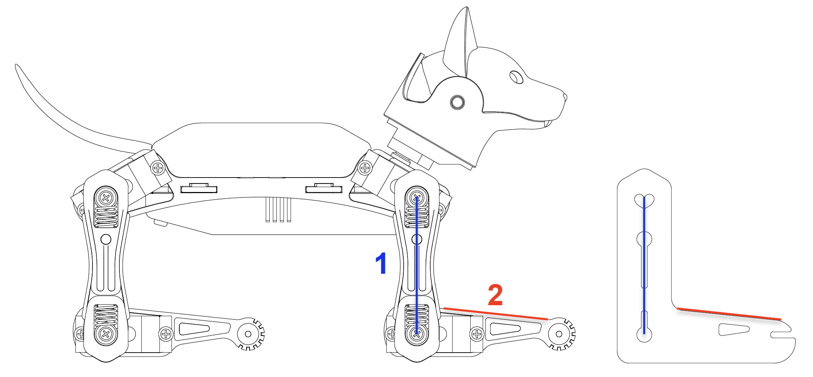

# Calibrator

## Calibrate the joints

### Nybble

### Bittle


The above interfaces will be displayed when you calibrate for the first time. You can also click to open the upper-right menu in the control panel and select **Calibrate** to re-access.



## Prepare for calibration


Make sure you have uploaded the OpenCat [**Main function**](https://docs.petoi.com/desktop-app/firmware-uploader#uploading-process) firmware before calibrating.

Only the software version 2.0 is supported to calibrate the joints via this App.


You need to connect the [**Bluetooth module**](https://docs.petoi.com/communication-modules/dual-mode-bluetooth#connection-with-nyboard) (for NyBoard only) with computer, install the battery and long-press the button on the battery to power the robot.

## Enter the calibration state

After the robot is powered on, there are 2 methods to enter the calibration state:

*   Click the **Start Calibration** button.\

    <figure><figcaption></figcaption></figure>
*   Click the **Calibration** button in the calibration interface.\

    <figure><figcaption></figcaption></figure>

### Install the head

In the calibration state, place the head as close to the central axis as possible and insert its servo shaft into the servo arm of the neck.

<figure><figcaption></figcaption></figure>

Press down on the head so it is firmly attached to the neck.

<figure><figcaption></figcaption></figure>

### Install the legs&#x20;

Install upper leg and lower leg components to the output teeth of the servos when the Bittle is powered on and in the calibration state. Please keep the torso, upper leg, and lower leg installed vertically as much as possible, and do not install the lower leg backward, as shown in the picture.&#x20;

<figure><figcaption></figcaption></figure>


The pre-assembled robot should already have the legs properly installed. You can do the joint calibration for fine-tuning.&#x20;


**Use the included L-shaped tool as a reference!**

#### Nybble

.jpg>)

#### Bittle

.jpeg>)

When calibrating, first select the index number of the joint servo from the diagram(when adjusting the leg servo, adjust the thigh first, and then adjust the calf), and then click the "+" or "-" button to fine-tune the joint to the right angle state.&#x20;


If the offset is more than +/- 9 degrees, you need to remove the corresponding part of the servo and re-install it by rotating one tooth, and then press the "+" or "-" button.

For example, if you have to use -10 as the calibration value, take the limb off, rotate by one tooth then attach it back. The new calibration value should be around 4, i.e.,  they sum up to 14. Avoid rotating the servo shaft during this adjustment.&#x20;


You can click the skill buttons to switch between **Rest**, **Stand**, and **Walk** to test the calibration effect.&#x20;

If you want to continue calibrating, please click the **Calibration** button, and the robot will be in the calibration state again (all servos will move to the calibration position immediately).&#x20;


Note:&#x20;

You may need a second round of calibrations to achieve optimal results.


After calibration, remember to click the "Save" button to save the calibration offset. Otherwise, click "<" in the upper left corner to abandon the calibration.

### Install the screws

After completing the joint calibration, install the center screws to fix the leg parts and servo gears.
