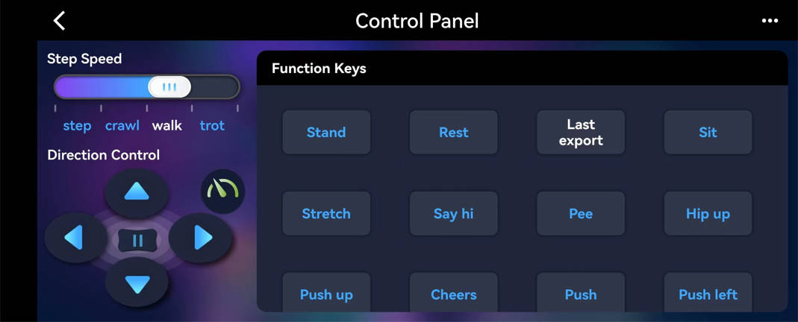
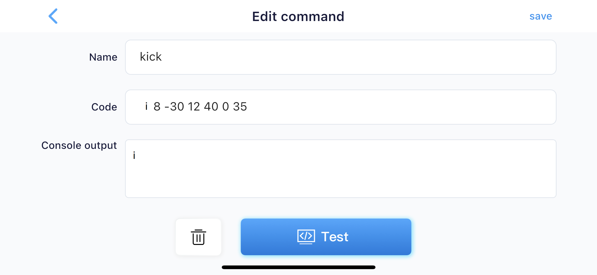
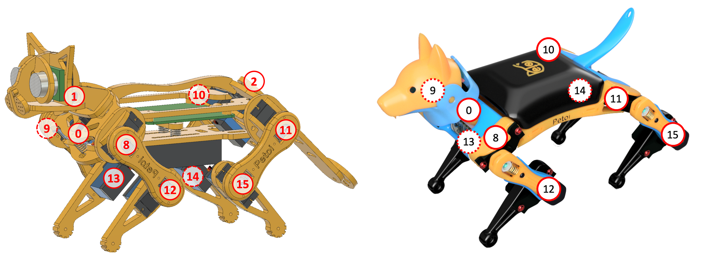
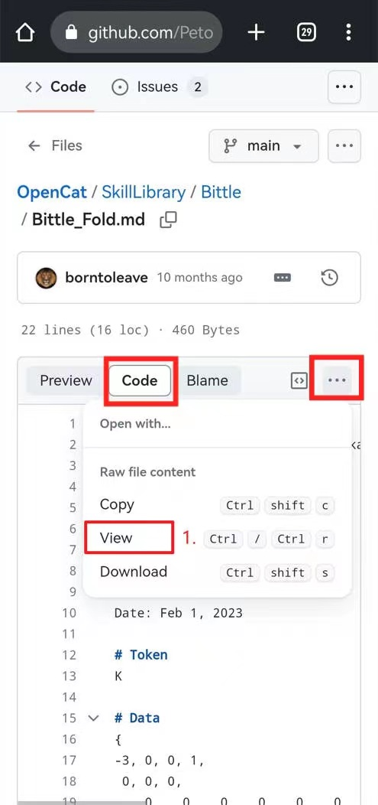
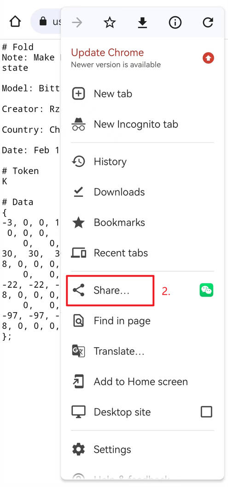
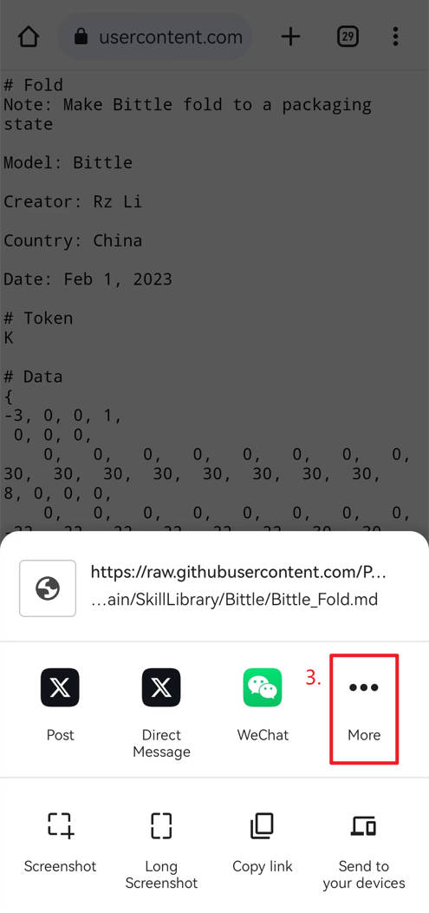
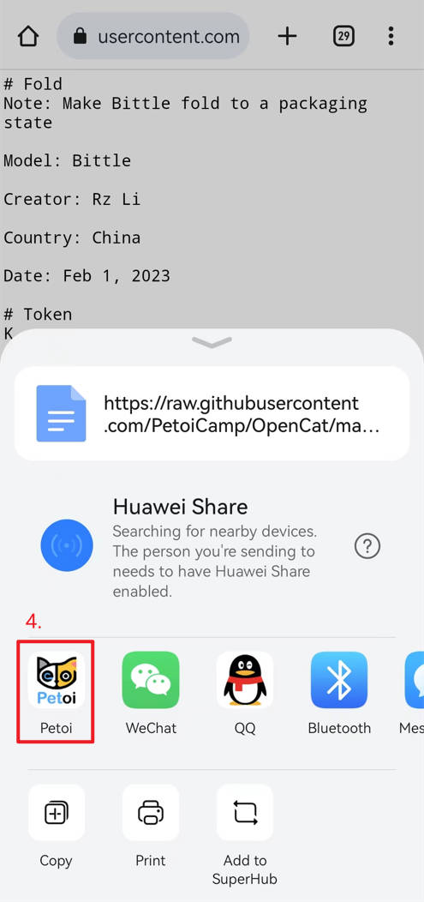
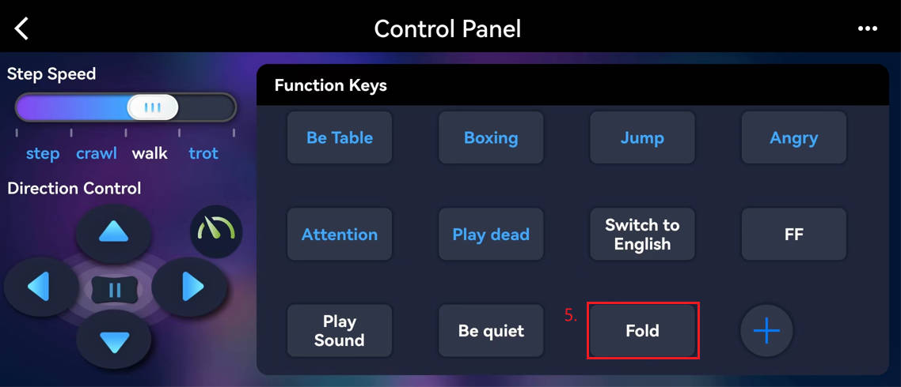

# Controller

<figure><figcaption></figcaption></figure>

## Gaits

The left panel sets both the robot's gaits and directions and send combined command, such as "walk left" and "trot forward". The robot will only move if an initial gait and direction are selected. The "step" has no direction, and "backward" has left and right directions. The pause button "||" will pause the robot's motion and turn off the servos, so that you can rotate the joints to any angle. The "Turbo" button (  ) turns on/off the gyro, a sensor to detect the robot's body orientation. Turning it on will make the robot keep adjusting to body angles, and will know when it's upside down. Turning it off will reduce calculation and make it walk faster and more stable. &#x20;

## Postures and behaviors

The built-in postures and behaviors can be triggered by pressing the buttons. Don't press the button too frequently and repeatedly. Allow some time for the robot to finish its current tasks.&#x20;

## Customized commands

* **Press and hold** the button and drag to change the button position.&#x20;
* **Double-tap** the command button to edit it.&#x20;
* You can also create a customized single command/group command by pressing the "+" button.

<figure><figcaption></figcaption></figure>

### Create a single command

After pressing the **Create Command** button, you can see the following interface:



After entering the editing state, there's a serial console to test the command and configure the robot.&#x20;

You can try the following useful serial commands in the **Code** text box:

#### \* move Bittle's head (move joint angle)&#x20;

```
m0 45
```

#### \* move head left and right (move joint1 angle1 joint2 angle2 .... The angle is -127\~128)&#x20;

```
m0 -70 0 70
```

#### \* sit&#x20;

```
ksit
```

#### \* move joints one by one&#x20;

```
m 0 -70 0 70 8 -30
```

#### \* MOVE joints simultaneously&#x20;

```
i 0 -45 8 -30 12 -60
```

Below are the indexes of the joints for your reference. Observe the patterns of the ordering and try to remember them.&#x20;



#### \* show current joint angles&#x20;

```
j
```

#### \* long meow once (Nybble）

```
u0 1
```

#### \* short meow three times (Nybble）

```
u2 20
```

#### \* mute/unmute the buzzer beep

```
b
```

#### **\* adjust the buzzer volume (b\[0-10])**

```
b1
```

#### \* play a short tone (beep tone duration, duration is 0\~256)&#x20;

```
b12 20
```

#### \* play a melody (beep tone1 duration1, tone2 duration2, tone3 duration3, .... only 64 characters are allowed, the actual duration is calculated as 1/duration)&#x20;

```
b14 4 14 4 21 4 21 4
```

#### More common commands to be added

Please see [this list of common commands](https://docs.google.com/spreadsheets/d/1Lr6Cd1T-H9sSdUi_bI-OeMClkVOKjTQM/edit?usp=sharing\&ouid=106975882561093680387\&rtpof=true\&sd=true) that may be added as customized commands.  You can enter the "Voice command" column values as the "Name" values and the "Customized command code for Petoi mobile app" column values as the "Code" values.

A more detailed command table can be found in the [Serial Protocol](https://docs.petoi.com/serial-protocol).&#x20;

### Import new skills as a customized button

#### Import your local customized skill (created by the [Skill Composer](https://docs.petoi.com/desktop-app/skill-composer))

You can send the skill file to your phone using Messenger or email and open the file on the phone using the Petoi App. A button will be created for the new skill; you can see it when you open the control panel.

<figure><figcaption></figcaption></figure>

#### Import new skills from the skill library on GitHub


[The SkillLibrary folder](https://github.com/PetoiCamp/OpenCat/tree/main/SkillLibrary) in Github contains new skills for the OpenCat robot, which can be used for your reference. You can use your mobile browser to access the GitHub page of the OpenCat project, open the skill file (such as [Bittle\_Fold.md](https://github.com/PetoiCamp/OpenCat/blob/main/SkillLibrary/Bittle/Bittle_Fold.md)), select the "Code" tab, and share it with [**Petoi Mobile App**](https://docs.petoi.com/mobile-app/introduction)(make sure the mobile app is connected to your Petoi robot first), as shown in the figures below.  Then you can execute this skill by pressing the newly created command button.


<div><figure><figcaption></figcaption></figure> <figure><figcaption></figcaption></figure></div>

<div><figure><figcaption></figcaption></figure> <figure><figcaption></figcaption></figure></div>

<figure><figcaption></figcaption></figure>


You are welcome to create your new skills([using the Skill Composer](https://docs.petoi.com/desktop-app/skill-composer) or [Modifying the source code](https://docs.petoi.com/applications/skill-creation)) and share them by sending merge requests to [this folder](https://github.com/PetoiCamp/OpenCat/tree/main/SkillLibrary).


### Create a group command

The group command feature lets you chain multiple commands together and play them in sequence.

After pressing the **Create Group Command** button, you can see the following interface:

<figure><figcaption></figcaption></figure>

You can name the command group in the **Name** text box and add the command to the **Command Group** list by clicking the command button in the **Command Library** selection box. In the **Command Group** list, you can _**press and hold**_ the command button and **drag** to change the command position.&#x20;

Click the **Test** or **Play (**.png>)**)** button to test the function of the command group. click the **Pause (**.png>)**)** button to interrupt the command list execution flow.

Click the **Delete** button to Delete the group command.


### Make your robot act randomly



If your robot doesn't have any random behavior, you may need to upgrade your robot to [the latest firmware](../desktop-app/firmware-uploader/).&#x20;

## Updates and support

We keep improving the app and will inform you of the updates when available. Please write to support@petoi.com if you have any questions about the app.&#x20;

