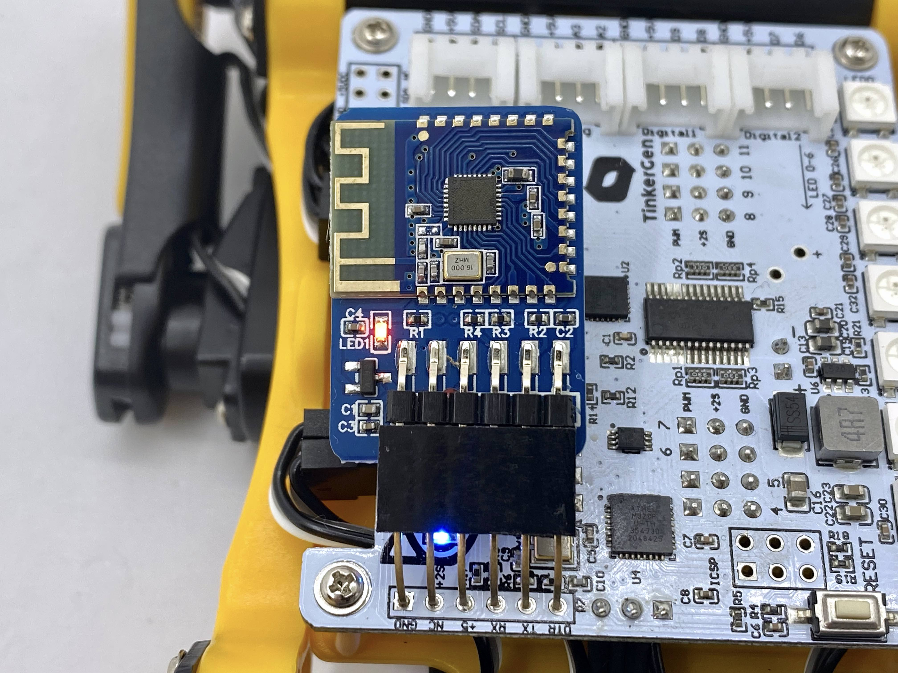
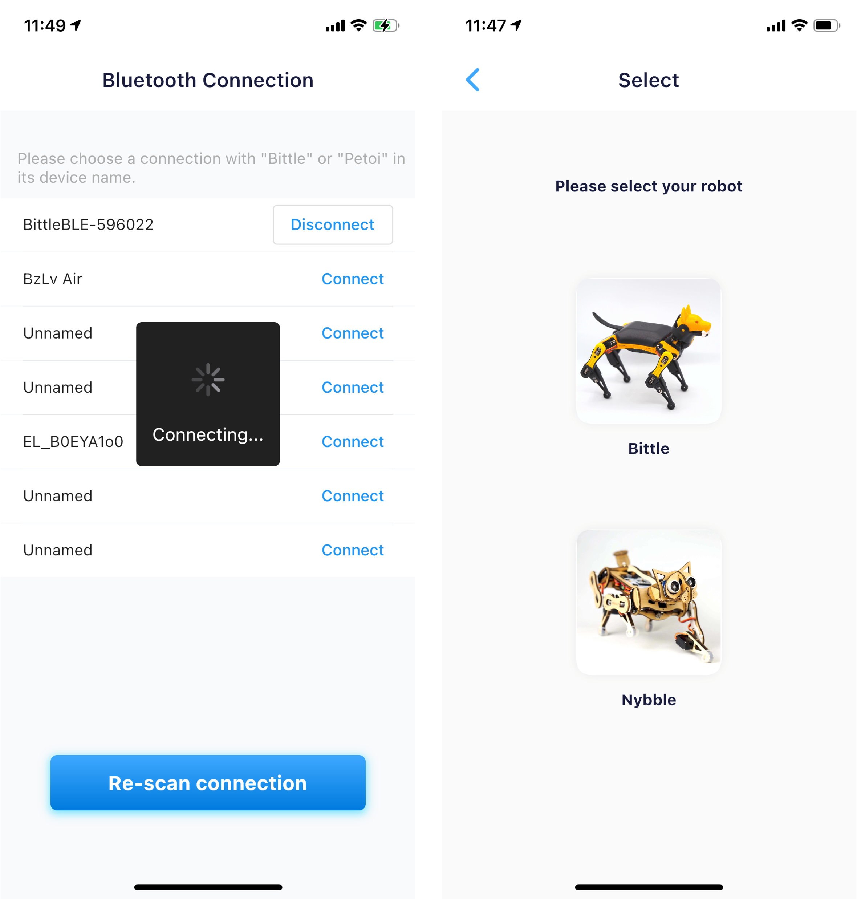

# Introduction

Thanks for choosing Petoi's robot, Bittle or Nybble. This guide will help you set up your robot buddy and provide a simpler UI to calibrate the joints, control the robot, and program it. For advanced users, we recommend you keep the robot updated with the [OpenCat firmware](https://github.com/PetoiCamp/OpenCat) on Github for the best compatibility and the newest features.&#x20;

## Download and installation

The app works on both Android and iOS devices.

* [iOS 11+](https://apps.apple.com/us/app/petoi/id1581548095)
* [Android 4.4+](https://play.google.com/store/apps/details?id=com.petoi.petoiapp)

#### APK

You can also download the Android APK and install it on your phone. You need to unzip it before installation.&#x20;

* The universal version(try this one first)\
  [v1.4.0-37-1-app-release-20251006.apk](https://github.com/ling-shan/petoi/releases/download/v1.4.0/v1.4.0-37-1-app-release-20251006.apk)
* The **v8a** version of the app mainly supports most of the current new mobile phone models\
  [v1.4.0-37-1-20251006-app-arm64-v8a-release.apk](https://github.com/ling-shan/petoi/releases/download/v1.4.0/v1.4.0-37-1-20251006-app-arm64-v8a-release.apk)
* The **v7a** version of the app is compatible with older mobile phone models\
  [v1.4.0-37-1-20251006-app-armeabi-v7a-release.apk](https://github.com/ling-shan/petoi/releases/download/v1.4.0/v1.4.0-37-1-20251006-app-armeabi-v7a-release.apk)
* The **x86\_64** version of the app indicates that the APK is designed for Android devices using Intel or AMD 64-bit processors. This means that the APK contains native code libraries optimized for the x86\_64 architecture, designed to provide better performance and compatibility.\
  [v1.4.0-37-1-20251006-app-x86\_64-release.apk](https://github.com/ling-shan/petoi/releases/download/v1.4.0/v1.4.0-37-1-20251006-app-x86_64-release.apk)


If the Bluetooth dongle (which is plugged in NyBoard) blinks while the connection panel within the App shows a blank Bluetooth connection list, first check if you have given the Bluetooth and location permission to the App. If it still shows a blank list, you may try to install the previous stable version. \
[v1.3.1-33-1-app-universal-release-20250706.apk](https://github.com/ling-shan/petoi/releases/download/v1.3.1/v1.3.1-33-1-app-release-20250706.apk)


.png>)

## Connect to your robot

You need to plug the [Bluetooth dongle](https://docs.petoi.com/modules/bluetooth-dual-mode) into the 6-pin socket on the **NyBoard**. Pay attention to the Bluetooth dongle's pin order. Long-press the button on the battery to turn on the robot's power.&#x20;


If the buzzer beeps repetitively after bootup or during use, the battery is low. Please charge it in time. The charging port is on one end of the battery.&#x20;



If the main board is **BiBoard**, no need to plug the Bluetooth dongle.


The LED on the Bluetooth dongle should blink, waiting for a connection. Open the app and scan available Bluetooth devices. **Don't connect the robot with the phone's system-wide Bluetooth settings!** Connect the device with the name Bittle, Petoi, or OpenCat. Remember to open the Bluetooth service and grant the app access to the service. On some devices, you may also need to allow the location service for the app, though we are not using any of that information.


On some Android OS, you need to activate the location service as following:




The app will send a greeting to the Bluetooth device and expects a response from the OpenCat firmware. You must install the full OpenCat code on your robot before connecting to the app. Otherwise, the app will consider it's "not a Petoi device". A pre-assembled robot should already have the firmware installed. Otherwise, you must configure it with Arduino IDE or the Desktop app.&#x20;


If Bluetooth is connected, its LED will light steadily. The robot will play a three-tone melody. If the robot doesn't respond or malfunctions later, press the reset button on the NyBoard to restart the program on the NyBoard.&#x20;

The App should automatically detect Nybble or Bittle with the latest OpenCat firmware. Otherwise, it will show the selections for Nybble or Bittle. The option "**Select a robot**" also can be re-visited in the control panel.

.jpg>)
