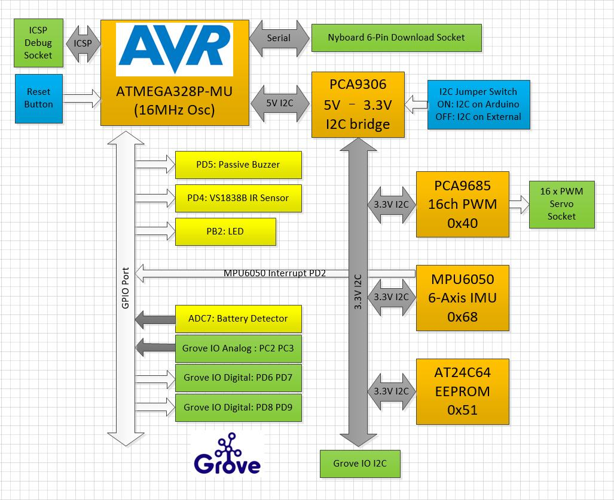
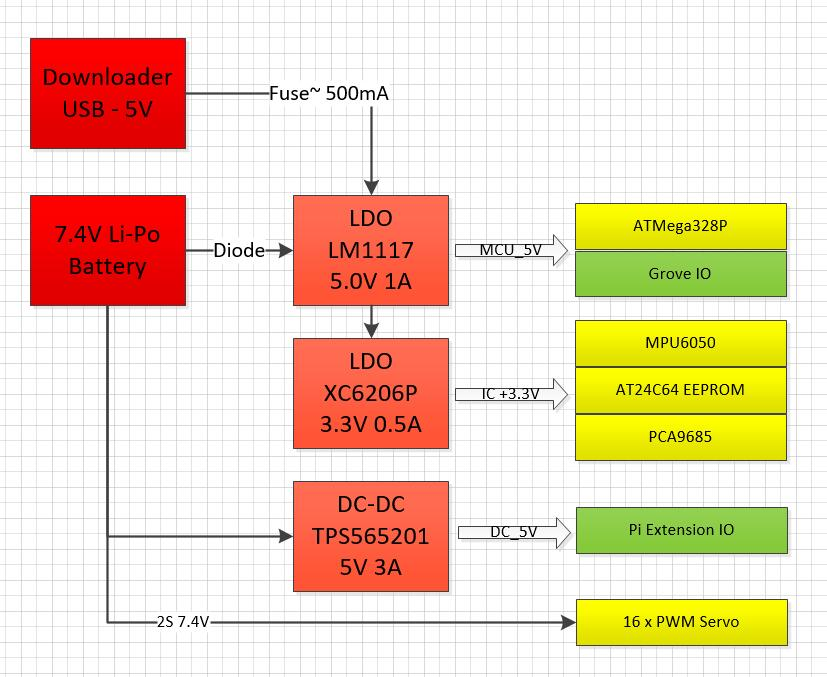

# NyBoard V1\_1 & NyBoard V1\_2

## Update：

NyBoard V1\_1 is a V1 refreshed version mainly focused on the shortage of the ATMEGA328P-MU in our supply chain.

1. Replace the ATMEGA328P-MU（QFN32=）with the ATMEGA328P-AU（TQFP32）
2. Removed 7 WS2812 LEDs to optimize the area.&#x20;
3. A green LED is connected to the D10 port with PWM functions.
4. There's no changes of sockets and pin definitions from V1\_0, the bootloader and the OpenCat sketchs is fully compatible.&#x20;

## Overview

NyBoard V1 is an upgraded version considering the users' feedback on NyBoard V0. It's compatible with previous versions, yet has some new design to make it easier to use.&#x20;

* It still uses Atmel ATMega328P as the main chip but adopts 16MHz without accelerating it to 20MHz. Now the board is fully compatible with Arduino Uno, much easier for new users to Arduino.&#x20;
* It keeps driving 16 PWM channels with PCA9685. The pin order is altered, but you don't even need to read the indexes on the board, because the pin mapping is handled within the software.&#x20;
* Now the 6-axis motion sensor MPU6050 is designed on the PCB, rather than a stand-alone module soldered above the board. It supports a built-in DMP (Digital Motion Processor) to calculate the motion data, as well as providing raw data for your own fusion and filtering algorithms.&#x20;
* It continues to use an 8KB onboard I2C EEPROM to save constants for skills.&#x20;
* The power system is redesigned to provide a more stable supply. The structure for peripherals is also optimized. &#x20;
* From Jan 1st, 2021, We start to include an official Bluetooth dongle for wirelessly uploading and communication. The default baud rate for all the communication ports is set to be 115200.&#x20;
* The reset button is more accessible on the back of the board.
* We added 4 Grove socket to plug-and-play Seeed Studio's extensible modules. We still provide standard 2.54mm through-holes besides the socket.&#x20;
* The socket for the battery is now anti-reverse.

## Logic diagram of the controller

The configuration of NyBoard V1\_0 is shown as below:

## Introduction to the onboard components

### Main controller

NyBoard V1\_0 uses Atmel ATMega328P-AU, the same MCU of the Arduino Nano (UNO Compatible).

The ATMega328P works at 16MHz with a 5V supply. It has 2KB SRAM, 32KB Flash, and 1KB on-chip EEPROM. With the same bootloader of Arduino Uno, you can upload sketches through the serial port.&#x20;

### LED（NEW!)

The WS2812 serial RGB LEDs are replaced by a single green LED. You can easily use it with standard Arduino GPIO control commands.&#x20;

### I2C switch

The main chip runs at 5V, while the other peripherals run at a 3.3V logic level. We use PCA9306 to convert the I2C bus of ATMega328P to 3.3V. We also added an I2C switch on the bus. By dialing it to "Arduino" or "Raspberry Pi", you can change the I2C master of the onboard peripherals.&#x20;

### 6-Axis IMU MPU6050

MPU6050 is widely used in many DIY projects to acquire the motion state of devices. It detects the 3 acceleration and 3 angular motion states. It also includes a DMP to calculate the state directly, without using the main controller's computational resources.&#x20;

On NyBoard V1\_0, its I2C address is 0x68. The interrupt pin is connected to the PD2 port of ATMega328P (or the D2 pin of Arduino Uno).&#x20;

There are a lot of available MPU6050 libraries and we are using I2CDev/6050DMP. You can also use other versions:

| Name             | Author          | Feature                  |
| ---------------- | --------------- | ------------------------ |
| I2Cdev           | jrowberg        | built-in DMP             |
| Adafruit MPU6050 | Adafruit        | standard MPU6050 library |
| Kalman Filter    | TKJ Electronics | with Kalman filter       |

### PCA9685 and the PWM servo ports

PCA9685 fans out 16 PWM 12-bit channels with instructions from the I2C port. Its address is set to 0x40. There are 16 PWM indexes printed on the PCB, but you don't really need to read them because the pin-mapping is done in the software. The physical wiring pattern is the same as the previous boards. You do need to check the direction of the servo pins. Regular servos have 3 pins for PWM, power(2S), and ground (GND). The ground should connect to the black wire of the servo.&#x20;

On NyBoard V1\_0, the servos' power connects to the 2S Li-ion battery. We designed our servos to be compatible with 8.4V input. Regular servos usually run at 6V. You should not connect regular 9g servos like the SG90 to the board directly.&#x20;

We use Adafruit PWM Servo Driver Library for PCA9685.

### EEPROM

We save the motion skills with an 8KB onboard I2C EEPROM AT24C64. Its I2C address is 0x54. The lookup table of skills is saved in the 1KB on-chip EEPROM of ATMega328P. It uses \<EEPROM.h>. You need to pay attention to their differences when developing new codes.&#x20;

### Passive buzzer

The buzzer is driven by PD5 (or the D5 of Arduino UNO). The current is amplified by 2N7002 MOS.

### Infrared receiver

We use VS1838B as the Infrared receiver, connected to PD4 (or D4 on Arduino Uno). It's driven by the IRremote library of Arduino, the corresponding remote is encoded in NEC format. You may disable the other protocols in IRremote.h to save Flash (about 10%!)

### Voltage detector

The two LEDs in the Petoi logo indicates the powering state of the board. The left eye is blue for the logic chips. The right eye is yellow for the servos' power. When NyBoard is connected to the battery, both LEDs should lit up. When NyBoard is powered by the USB downloader, only the blue LED will lit up.

There's an anti-reverse socket for the battery. The battery's output is connected to ADC7 (or A7 of Arduino Uno) and is not threaded to an open pin. ADC7 collects the voltage over a voltage divider. The actual voltage is approximately 2x of the reading. A safe range of battery voltage is below 10V.&#x20;

$$
Voltage_{real}=\frac{ADC_{reading}}{1024}  \times 5.0 \times2
$$

You should charge the battery in time when the battery is lower than 7.4V.&#x20;

### Grove sockets

We adopted the Grove sockets for convenient plug-and-play connections. There are three types of socket:

<table data-header-hidden><thead><tr><th width="204.33333333333331">Grove Socket</th><th width="225">Pin Number</th><th>Function</th></tr></thead><tbody><tr><td>Grove Socket</td><td>Pin Number</td><td>Function</td></tr><tr><td>G1</td><td>I2C: SCL, SDA</td><td>I2C with 3.3V logic signal</td></tr><tr><td>G2</td><td>A2, A3</td><td>Analog input; 0-5V</td></tr><tr><td>G3</td><td>PD8, PD9</td><td>Digital I/O; 0-5V</td></tr><tr><td>G4</td><td>PD6, PD7</td><td>Digital I/O; 0-5V</td></tr></tbody></table>

### Power system

The main chips are powered by a Low-dropout (LDO) linear regulator for noise removal and better stability. We use LM1117-5V and XC6206P-3.3V to power 5V and 3.3V chips. The 3.3V LDO is connected in serial after the 5V LDO for better efficiency.&#x20;

There's a diode between the battery and LM1117-5V to prevent damage by the wrong connection. There's a self-recover fuse (6V 500mA) on the USB uploader to limit the current and protect the USB port.&#x20;

The Raspberry Pi consumes much more power, so we choose TPS565201 DC-DC to provide a 5V 3A output. The peak output can be 5A and with high-temperature/current/voltage protection. It will cut off the power when the chip keeps outputting >4A and over 100 Celcius degrees until the temperature drops to normal.&#x20;

The servos are powered by 2S Li-ion batteries directly. Pay attention not to short connect the power or any pins on the NyBoard.
