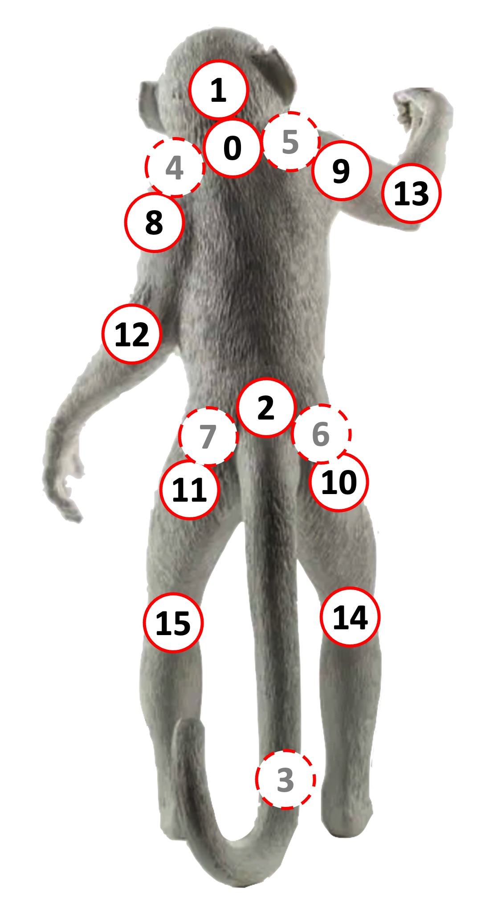
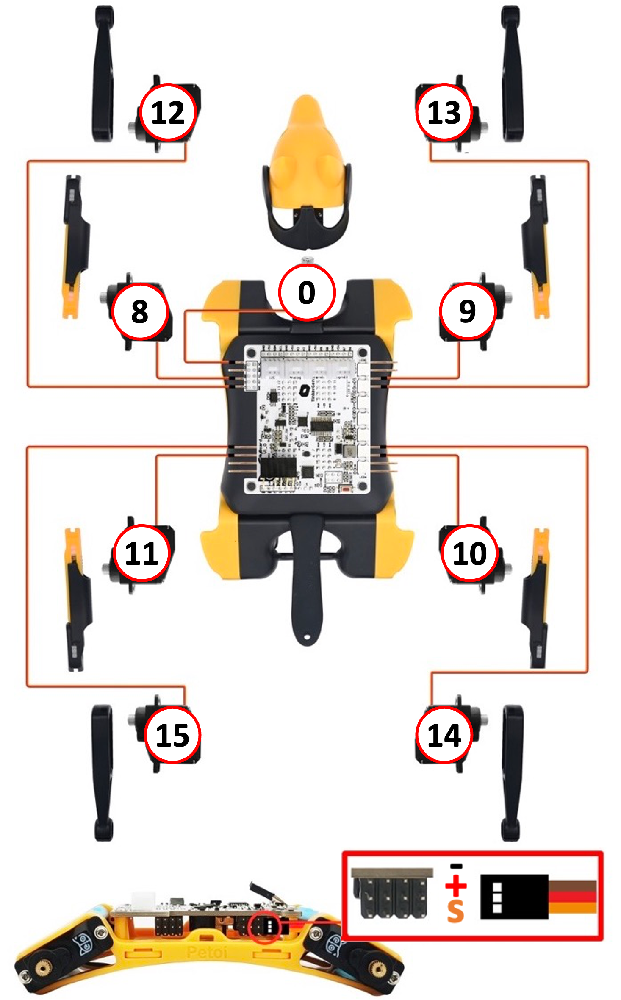
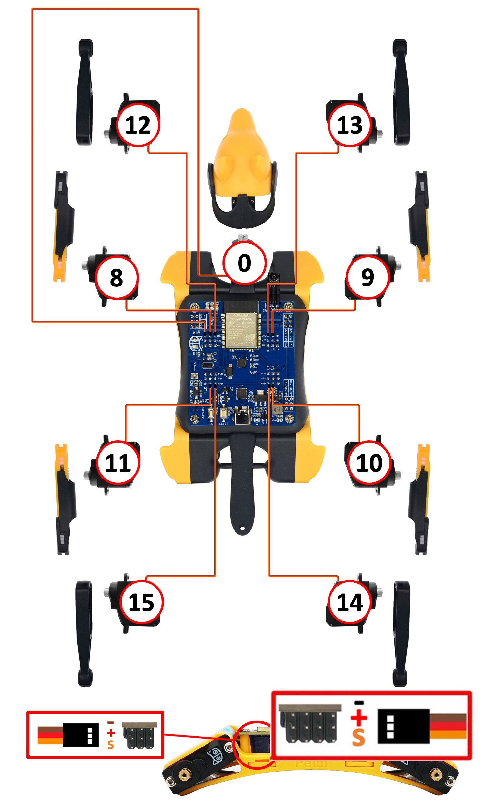
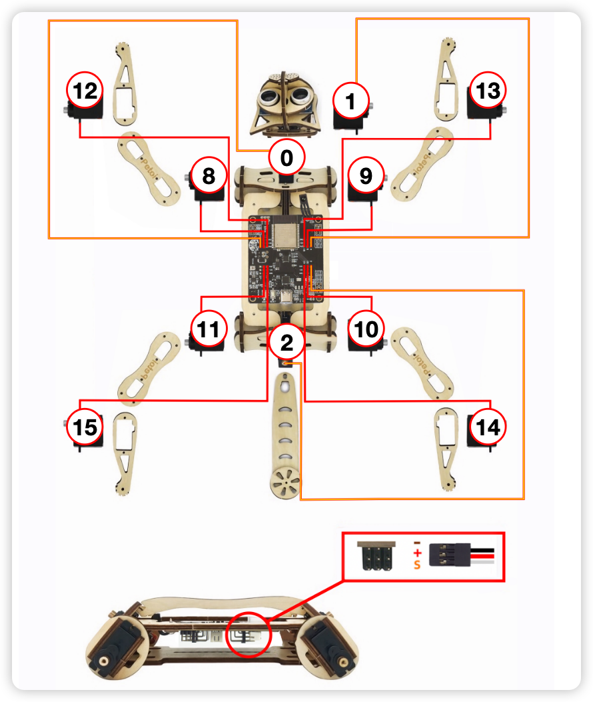

# Petoi robot joint index

We humans and many other legged animals have many joints. They give us the freedom to move in many ways. Though it's difficult to reproduce those complex motions on a robot, we can simplify all those joints to limited numbers of actuators.&#x20;

When controlling so many joints, the first thing is to index them. We can define an order according to their distance from the torso. For example, the shoulder joint is closer to the torso than the elbow joint, and the joint that let us look around is closer to the torso than the joint that let us nod. If we had tails, it would be as close as the head compared to the shoulder joints.&#x20;

So we can order the joints in this way: head panning, head tilting, tail panning, tail tilting, 4x shoulder (or hip) roll, 4x shoulder (or hip)  pitch, 4x elbows (or knees). For the joints in the same distance group, we can index them clockwise from the front-left corner if the body is looked at from behind.&#x20;

<figure><figcaption></figcaption></figure>

And when we map those joints to a specific robot, the indexing becomes more practical. The ordering for the joint servo pins on NyBoard is like below:

<figure><figcaption></figcaption></figure>

## NyBoard

### Bittle

<figure><figcaption>
Bittle
</figcaption></figure>

### Nybble

<figure><figcaption>
Nybble
</figcaption></figure>

## BiBoard

Although the BiBoard has only 12 pins, the joint index numbers are configured in the same order as the NyBoard. The connection between the joint servo and the pin is shown in the figure below：

### Bittle

<figure><figcaption>
Bittle / Bittle X
</figcaption></figure>

### Nybble

<figure><figcaption>
Nybble
</figcaption></figure>


A servo plug has three wires. Plug it in the right direction or you may burn the chip. The color of wires may vary for different models. However, the darkest-colored (Black or Brown) wire (GND for ground) is always the GND wire as a convention. The GND wire should be plugged closest to the board.&#x20;



The index number of the joint servo has **no corresponding relationship** with the PWM pin number on the main board. **You don't even need to read the pin numbers on the PCB board.**&#x20;


## **Coordinate values and directions.**&#x20;

<figure><figcaption></figcaption></figure>

The rotation angle range of the joint servo is between \[-125\~125]. For the leg servo, when viewed from the left side of the robot, when the leg rotates counterclockwise from the 0-degree position around the joint center point (the screw fixing position), the angle is a positive value; clockwise rotation, the angle is a negative value; viewed from the right side of the robot, the leg rotation angle is mirror-symmetrical to the left side (when rotating clockwise from the 0-degree position around the joint center point, the angle is a positive value; Rotate counterclockwise, the angle is negative). For the robot's neck servo, looking down from the top of the robot's head, when the neck rotates counterclockwise from the position of 0 degrees around the joint center point (the position where the screw is fixed), the angle is a positive value; when it rotates clockwise, the angle is a negative value.&#x20;


For the Nybble head servo (No. 1 servo) observed on the right side of the robot, the head rotates counterclockwise from the 0-degree position around the joint center point (screw fixed position), and the angle is positive; when it rotates clockwise, the angle is negative.&#x20;

For the Nybble tail servo (No. 2 servo) facing the tail and looking down, the tail rotates counterclockwise from the 0-degree position around the center point (screw fixing position), and the angle is positive; when it rotates clockwise, the angle is negative.


